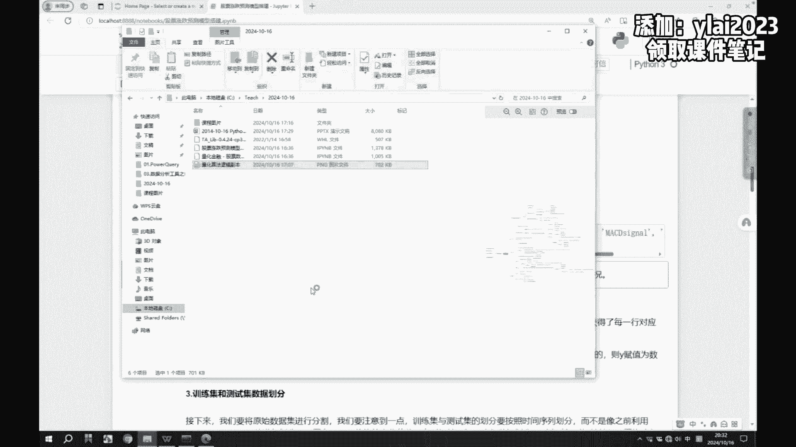
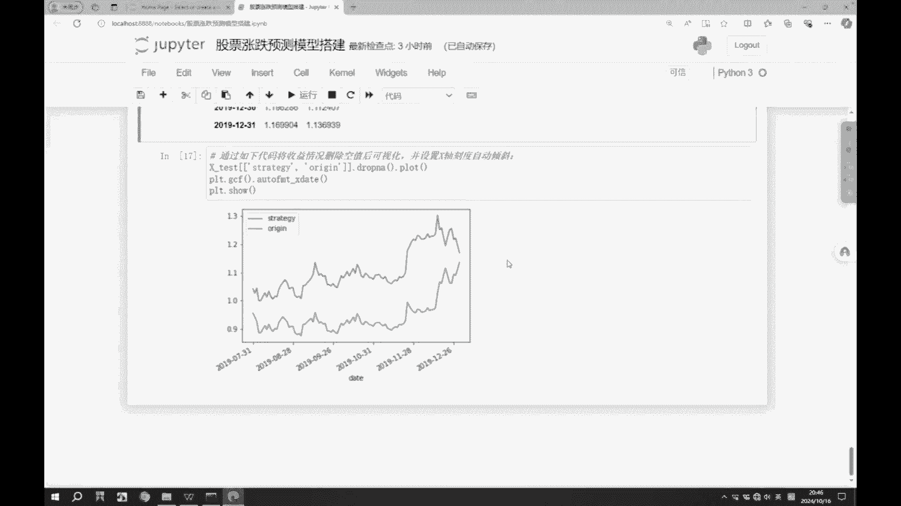

# Python量化分析实战：P1：从数据获取到模型搭建全流程解析 📈

在本节课中，我们将学习如何利用Python进行量化分析，从获取股票数据开始，逐步完成数据清洗、指标计算、模型搭建与策略回测的全过程。我们将使用`tushare`和`TA-Lib`等工具库，以简单直白的方式，构建一个基础的股票涨跌预测模型。

## 数据获取与准备 📊

量化分析的第一步是获取数据。我们需要从可靠的数据源获取股票的历史行情数据。这些原始数据通常不够规范，可能包含错误或不完整的信息，因此需要进行数据准备，也就是数据清洗和标准化。

以下是获取和准备数据的具体步骤：

1.  **安装数据接口库**：使用`tushare`库可以免费获取股票历史行情数据。安装命令为：
    ```bash
    pip install tushare
    ```
2.  **导入库并获取数据**：导入`tushare`库，使用`get_k_data`函数获取指定股票代码在特定时间段内的K线数据。
    ```python
    import tushare as ts
    # 获取股票代码为‘000002’（万科A）从2015-01-01到2019-12-31的数据
    df = ts.get_k_data('000002', start='2015-01-01', end='2019-12-31')
    ```
3.  **查看与整理数据**：获取的数据是一个`DataFrame`（类似Excel表格）。我们可以查看其前几行，并将日期列设置为索引，便于后续时间序列分析。
    ```python
    print(df.head()) # 查看前5行数据
    df.set_index('date', inplace=True) # 将‘date’列设为索引
    ```

## 计算基础衍生变量 ➕➖

上一节我们介绍了如何获取原始数据。原始数据通常只包含开盘价、收盘价、最高价、最低价和成交量等基础字段。本节中，我们将基于这些基础字段，通过简单的数学运算，计算一些基础的衍生变量，以丰富我们的分析维度。

以下是几个基础衍生变量的计算示例：

*   **价格变动差值**：计算收盘价与开盘价的差值比率。
    ```python
    df['close_open'] = (df['close'] - df['open']) / df['open']
    ```
*   **日内波动幅度**：计算最高价与最低价的差值比率。
    ```python
    df['high_low'] = (df['high'] - df['low']) / df['low']
    ```
*   **前一日收盘价**：获取前一交易日的收盘价，用于计算日间变化。
    ```python
    df['pre_close'] = df['close'].shift(1)
    ```
*   **价格变化与变化率**：计算当日收盘价相对于前一日收盘价的变化绝对值及变化百分比。
    ```python
    df['price_change'] = df['close'] - df['pre_close']
    df['p_change'] = (df['price_change'] / df['pre_close']) * 100
    ```

## 计算技术指标（移动平均线）📉

在有了基础衍生变量后，我们可以计算一些在股票分析中常用的技术指标。首先介绍移动平均线（MA），它是分析股价趋势的重要工具。移动平均线可以平滑价格波动，帮助我们识别趋势方向。

以下是计算移动平均线的方法：

*   **5日均线（MA5）**：计算最近5个交易日收盘价的平均值。
    ```python
    df['ma5'] = df['close'].rolling(5).mean()
    ```
*   **10日均线（MA10）**：计算最近10个交易日收盘价的平均值。
    ```python
    df['ma10'] = df['close'].rolling(10).mean()
    ```
    由于计算均值需要足够的历史数据，前几条数据的移动平均线值会是空值（NaN）。我们需要删除这些空值以保证数据质量。
    ```python
    df.dropna(inplace=True) # 删除含有空值的行
    ```

## 使用TA-Lib计算复杂技术指标 🔧

上一节我们手动计算了移动平均线。对于更复杂的技术指标，手动计算公式繁琐且容易出错。本节我们将引入专业的金融技术指标库`TA-Lib`来高效生成这些指标。

首先需要安装`TA-Lib`。由于安装方式可能因系统而异，这里提供一种通用方法（可能需要预先下载whl文件）：
```bash
pip install TA_Lib-0.4.24-cp39-cp39-win_amd64.whl # 示例，文件名需匹配你的Python版本
```

安装后，我们可以方便地计算多种指标：

*   **相对强弱指标（RSI）**：RSI用于衡量股价近期涨跌的强度，值域在0-100之间。通常RSI>70表示超买，<30表示超卖。
    ```python
    import talib
    # 计算12日的RSI值
    df['rsi'] = talib.RSI(df['close'], timeperiod=12)
    ```
*   **动量指标（MOM）**：动量指标反映股价在一定时间内的涨跌速度。
    ```python
    # 计算5日的动量值
    df['mom'] = talib.MOM(df['close'], timeperiod=5)
    ```
*   **指数移动平均线（EMA）**：EMA对近期价格赋予更高权重，比简单移动平均线（MA）对价格变化更敏感。
    ```python
    # 计算12日和26日的EMA
    df['ema12'] = talib.EMA(df['close'], timeperiod=12)
    df['ema26'] = talib.EMA(df['close'], timeperiod=26)
    ```
*   **异同移动平均线（MACD）**：MACD由快线（DIF）、慢线（DEA）和柱状图（MACD）组成，用于判断趋势转折和强度。**注意**：`TA-Lib`返回的`macd`对应国内的DIF值，`macdsignal`对应DEA值，`macdhist`对应MACD柱（即(DIF-DEA)*2）。
    ```python
    # 计算MACD指标，快线周期12，慢线周期26，信号线周期9
    df['macd'], df['macdsignal'], df['macdhist'] = talib.MACD(df['close'], fastperiod=12, slowperiod=26, signalperiod=9)
    ```

## 构建特征数据集与预测目标 🎯

经过前面的步骤，我们已经拥有了包含原始数据和多种技术指标的丰富数据集。本节中，我们将从这些数据中筛选出用于模型训练的特征（自变量X），并定义我们想要预测的目标（因变量Y）。

以下是构建特征集和目标变量的过程：

1.  **选择特征（X）**：并非所有字段都对预测有用。我们选择一部分认为重要的指标作为模型输入的特征。
    ```python
    # 选择用于模型训练的特征列
    feature_names = ['close', 'volume', 'close_open', 'high_low', 'ma5', 'ma10', 'rsi', 'mom', 'ema12', 'macd']
    X = df[feature_names]
    ```
2.  **定义预测目标（Y）**：在A股T+1交易制度下，我们今天买入的股票明天才能卖出。因此，一个合理的预测目标是：**判断下一个交易日股价相对于今日收盘价是上涨还是下跌**。
    ```python
    # 计算下一个交易日的价格变动
    df[‘next_price_change‘] = df[‘price_change‘].shift(-1)
    # 将涨跌转换为标签：上涨为1，下跌为-1
    df[‘target‘] = df[‘next_price_change‘].apply(lambda x: 1 if x > 0 else -1)
    Y = df[‘target‘]
    # 删除最后一行（因为没有下一个交易日的目标值）
    X = X.iloc[:-1]
    Y = Y.iloc[:-1]
    ```

## 划分数据集与搭建随机森林模型 🌲

数据准备就绪后，下一步是将数据分为训练集和测试集，并选择一个机器学习模型进行训练。由于股价数据具有强烈的时间序列特性，我们不能随机打乱数据划分，而应按时间顺序划分。

以下是模型搭建的步骤：

1.  **按时间划分数据集**：将前90%的数据作为训练集，用于训练模型；后10%的数据作为测试集，用于评估模型在未来“未知”数据上的表现。
    ```python
    split_point = int(len(X) * 0.9)
    X_train, X_test = X[:split_point], X[split_point:]
    y_train, y_test = Y[:split_point], Y[split_point:]
    ```
2.  **引入并训练随机森林模型**：随机森林是一种集成学习算法，它通过构建多棵决策树并综合它们的结果来进行预测，通常能取得比单棵决策树更稳定、更准确的效果。
    ```python
    from sklearn.ensemble import RandomForestClassifier
    # 初始化随机森林分类器
    model = RandomForestClassifier(n_estimators=100, random_state=42)
    # 使用训练数据拟合模型
    model.fit(X_train, y_train)
    ```




## 模型评估与策略回测 📊➡️💹

模型训练完成后，我们需要评估其预测效果，并模拟在历史数据上使用该策略的收益情况，这个过程称为回测。

以下是评估与回测的步骤：

1.  **模型预测与准确率评估**：使用测试集数据让模型进行预测，并计算预测的准确率。
    ```python
    from sklearn.metrics import accuracy_score
    # 对测试集进行预测
    y_pred = model.predict(X_test)
    # 计算预测准确率
    accuracy = accuracy_score(y_test, y_pred)
    print(f“模型预测准确率： {accuracy:.2%}“)
    ```
    在股票涨跌预测中，如果准确率持续高于50%（随机猜测水平），模型就可能具备实战参考价值。
2.  **模拟收益回测**：我们根据模型的预测信号（买/卖）来模拟交易，并绘制收益曲线，与“买入并持有”的基准收益进行对比。
    ```python
    # 获取测试集期间实际的每日收益率（使用p_change）
    test_returns = df[‘p_change‘].iloc[split_point:split_point+len(y_test)] / 100
    # 根据模型预测信号（1或-1）计算策略每日收益率：预测涨则获取当日收益，预测跌则获取当日负收益（相当于做空或避开下跌）
    strategy_returns = test_returns.values * y_pred
    # 计算累积收益（假设初始资金为1）
    baseline_cumulative = (1 + test_returns).cumprod()
    strategy_cumulative = (1 + strategy_returns).cumprod()
    # 绘制收益曲线对比图
    import matplotlib.pyplot as plt
    plt.figure(figsize=(10,6))
    plt.plot(baseline_cumulative.index, baseline_cumulative.values, label=‘基准收益（买入持有）‘)
    plt.plot(strategy_cumulative.index, strategy_cumulative.values, label=‘策略收益‘)
    plt.legend()
    plt.title(‘策略回测收益曲线对比‘)
    plt.show()
    ```

## 模型优化与特征重要性分析 ⚙️

一个基础的模型已经完成。为了提升模型性能，我们可以进行优化。同时，了解哪些特征对模型的决策贡献最大，也能加深我们对市场的理解。

以下是优化与分析的方法：

1.  **使用网格搜索优化超参数**：随机森林模型有许多参数可以调整（如树的数量、深度等）。我们可以使用`GridSearchCV`自动寻找最优参数组合。
    ```python
    from sklearn.model_selection import GridSearchCV
    param_grid = {
        ‘n_estimators‘: [50, 100, 200],
        ‘max_depth‘: [3, 5, 10, None]
    }
    grid_search = GridSearchCV(RandomForestClassifier(random_state=42), param_grid, cv=3)
    grid_search.fit(X_train, y_train)
    best_model = grid_search.best_estimator_
    ```
2.  **分析特征重要性**：训练好的随机森林模型可以输出每个特征的重要性得分，这反映了该特征在模型做决策时的平均贡献度。
    ```python
    import pandas as pd
    # 获取特征重要性
    feature_imp = pd.Series(best_model.feature_importances_, index=feature_names).sort_values(ascending=False)
    print(feature_imp)
    # 可视化
    feature_imp.plot(kind=‘barh‘)
    plt.title(‘特征重要性‘)
    plt.show()
    ```
    根据结果，我们可以考虑保留重要性高的特征，移除重要性极低的特征，从而简化模型并可能提升性能。

---



本节课中我们一起学习了Python量化分析的基础全流程：从使用`tushare`获取数据，进行数据清洗和基础计算，到利用`TA-Lib`生成复杂技术指标；接着我们定义了预测目标，使用随机森林模型进行训练和预测；最后对模型进行了准确率评估、收益回测以及简单的优化和特征分析。请注意，本教程仅从技术分析角度进行演示，实际金融市场受多种复杂因素影响，此模型不作为投资建议。你可以在此基础上，尝试调整特征、优化模型参数、引入更多因子或结合其他分析方法，来构建更强大的量化策略。