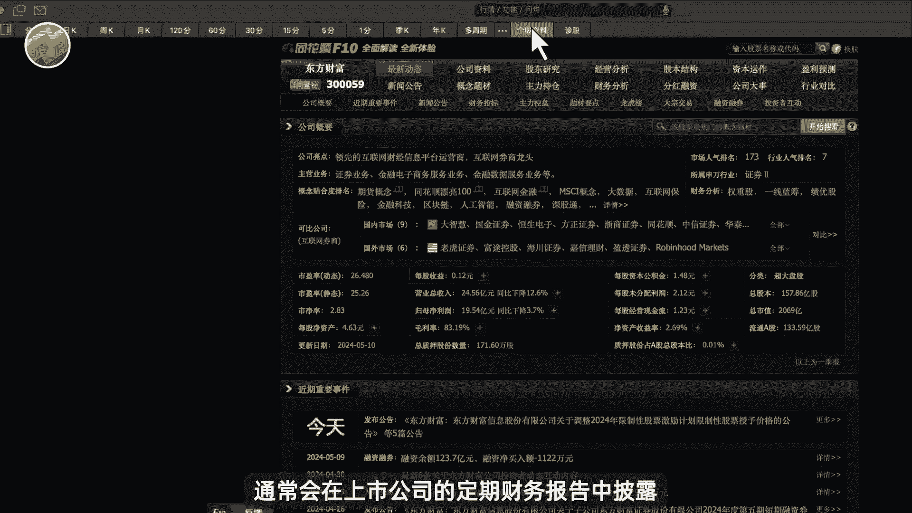
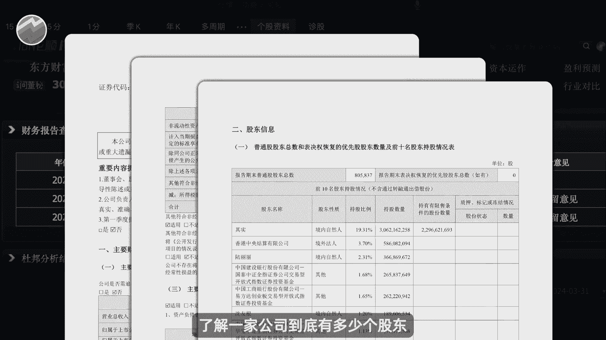
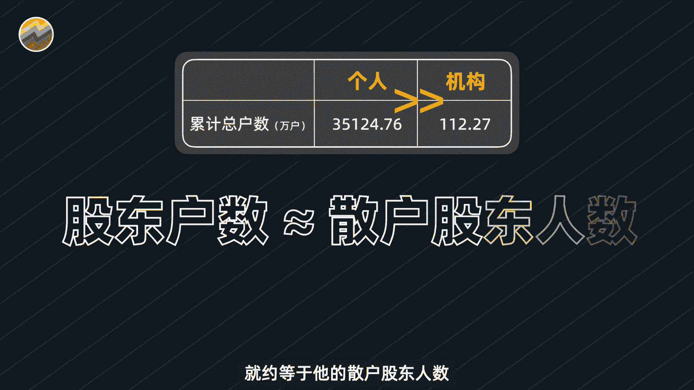
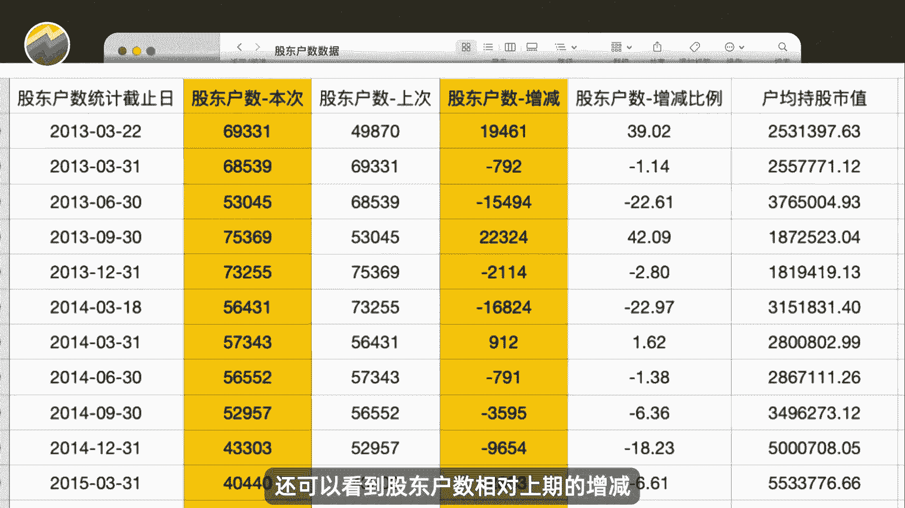
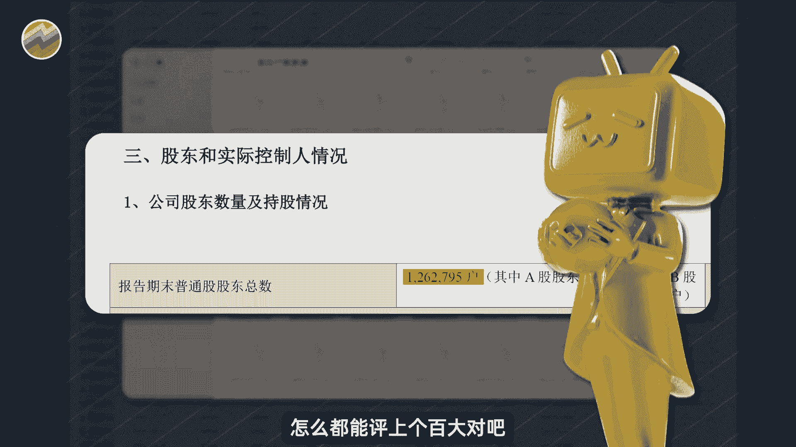
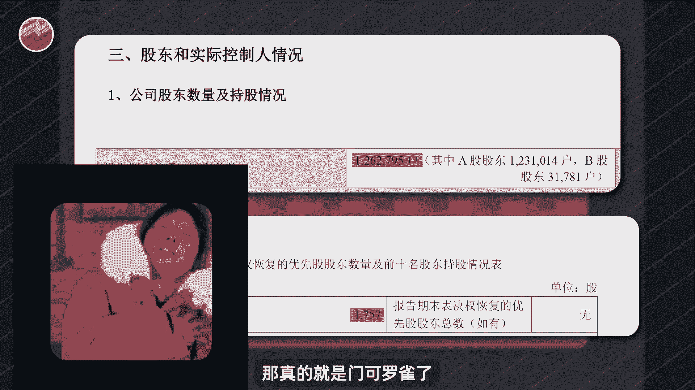
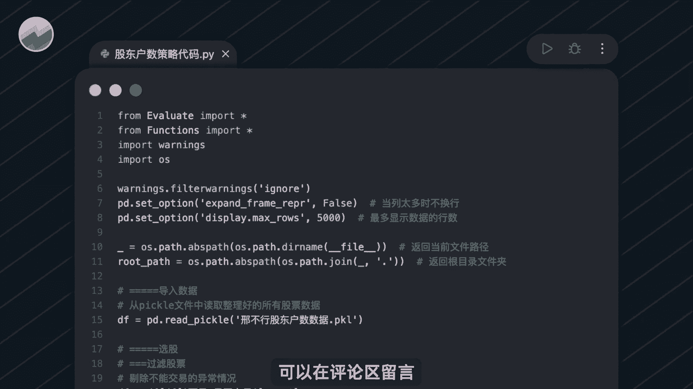
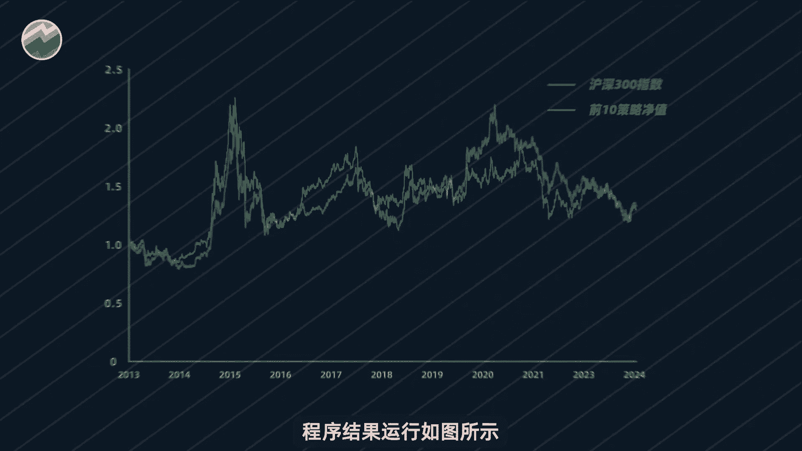

# Python量化交易：第1章：散户抱团策略分析 🧑‍💻

在本节课中，我们将学习如何利用Python和A股上市公司的股东户数数据，构建一个简单的量化选股策略，以验证“散户抱团”是否能为投资带来超额收益。

## 股东户数：散户数量的近似指标

在A股市场，散户投资者的数量远多于机构投资者。因此，一家上市公司的股东总人数可以近似地看作其散户股东的数量。

公司的股东人数数据通常在上市公司的定期财务报告中披露，每个季度发布一次。通过分析这个数据字段，我们可以了解一家公司的股东构成。

## 数据准备与初步观察

为了验证散户数量与股票表现的关系，我们需要A股历史上所有公司的股东户数数据。相应的历史数据已经准备就绪。

以下是数据文件包含的核心信息：
*   每个报告期的股东人数
*   股东户数相对于上一期的增减情况
*   户均持股市值

这份数据非常全面。截至2023年底的统计显示，股东人数最多的公司拥有约126万位股东，而最少的公司仅有约1757位股东。观察发现，股东户数最多的股票通常是基本面优秀的行业龙头。

## 构建量化策略验证假设

许多人认为，散户越多的公司关注度高，可能形成“抱团”效应，从而推高股价。但作为量化交易者，我们需要用数据验证这一感觉。

接下来，我们将构建一个简单的月度轮动策略来检验这个想法。

### 策略逻辑与步骤

策略的核心是每月买入当前股东户数最多的股票，并持有至下月末。以下是具体的操作步骤：

1.  **选股时点**：在每个月的最后一个交易日收盘后。
2.  **筛选股票**：将所有股票的股东户数从大到小排序，并剔除当时ST、退市或停牌的股票。
3.  **构建组合**：选取此时股东户数最大的十只股票。
4.  **交易执行**：在下个月的第一个交易日开盘时，等权重买入这十只股票。
5.  **持有与调仓**：持有该组合整整一个月，直到下个月的最后一个交易日收盘时全部卖出。然后，重复步骤1-4，选择新的股票组合，并在下下个月的第一个交易日买入。

例如，在2024年2月29日，我们筛选出当时股东户数最多的十只股票。随后在3月1日开盘买入，并持有到3月29日收盘卖出。卖出后，立即根据3月29日的数据筛选新的股票组合，并于4月1日买入。

## 策略回测与结果分析

要验证这个策略的盈利情况，我们需要使用完整的股东户数历史数据和Python代码进行回测。相关数据和代码已备好。

运行回测程序后，我们得到了策略的绩效曲线（橙色）与沪深300指数（蓝色）的对比图。

**策略核心绩效指标**：
*   **最终净值**：1.29元（起始为1元）
*   **年化收益率**：2.29%
*   **历史最大回撤**：-50%

代表策略的橙色曲线与代表沪深300指数的蓝色曲线表现非常接近，但年化收益较低，而最大回撤却高达50%。这意味着，长期买入散户数量最多的股票构建的投资组合，其表现并未跑赢大盘指数。

## 本章总结

本节课中，我们一起学习了如何获取并利用A股股东户数数据。通过构建并回测一个简单的“买入散户最多股票”的月度轮动策略，我们发现该策略的历史表现并不理想，未能产生超越市场基准（沪深300指数）的超额收益，且波动回撤较大。这个案例表明，在量化交易中，依靠直观感觉（如“散户抱团力量大”）构建的策略，必须经过严格的数据回测验证。