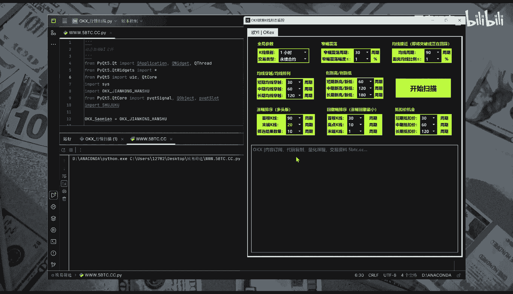
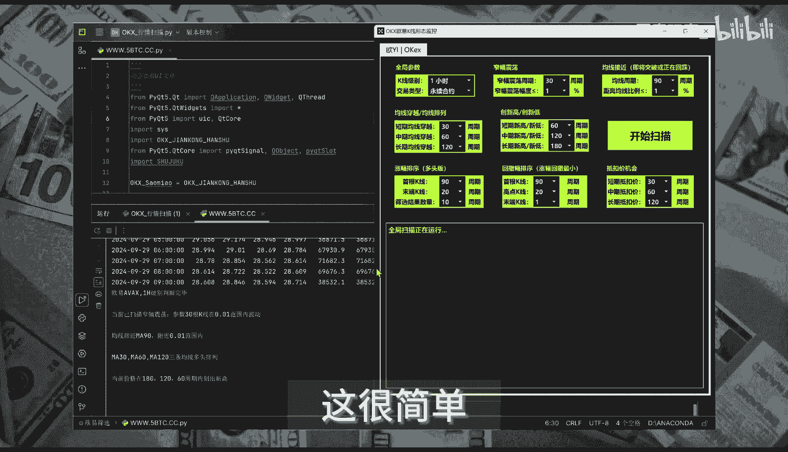
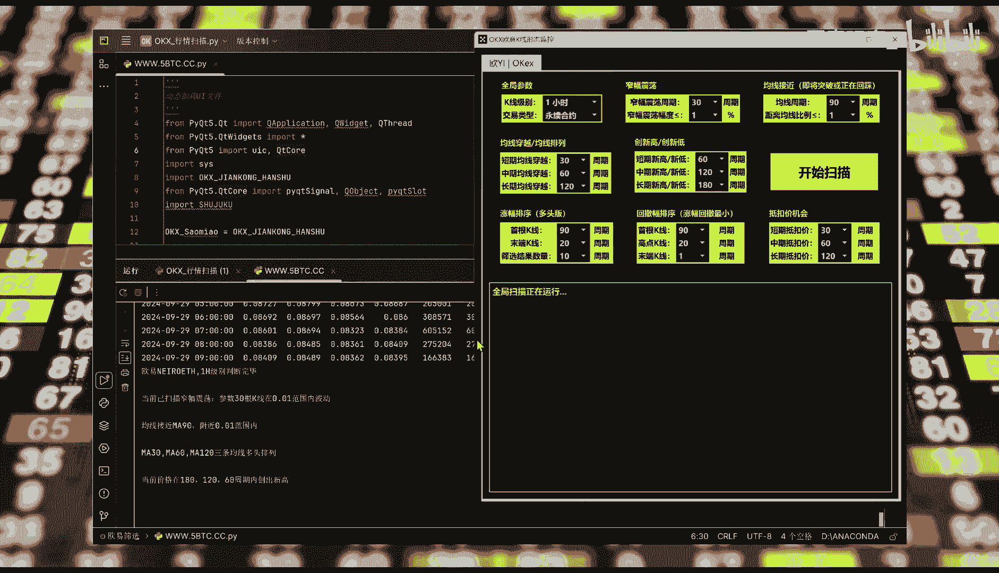

# Python量化筛选入门：P1：利用AI生成代码实现高效选股 📈

在本节课中，我们将学习如何利用AI工具，快速生成Python代码，实现从海量股票数据中精准筛选符合特定投资策略的目标。整个过程可以在短短几分钟内完成，极大提升投资分析的效率。

## 概述



上一节我们介绍了量化筛选的基本概念。本节中，我们来看看如何借助AI的力量，将复杂的筛选逻辑转化为可执行的Python代码。

通过与AI进行持续、清晰的交流，它可以理解我们的投资策略需求，并自动生成一套完整的Python代码。这套代码能够在3分钟内，对成千上万的交易标的进行实时分析，并输出精准的筛选结果。

## 核心步骤与代码实现



以下是利用AI生成量化筛选代码的关键步骤。

**第一步：明确并向AI描述筛选需求**
你需要清晰地向AI说明你的投资策略。例如，你可以提出以下要求：
```python
# 示例：向AI描述的筛选逻辑
“请生成Python代码，从A股市场中筛选出：
1. 市值大于100亿人民币的股票。
2. 过去30个交易日内涨幅超过10%的股票。
3. 市盈率（PE）低于行业平均水平的股票。”
```

**第二步：AI生成初步代码框架**
根据你的描述，AI会生成包含数据获取、指标计算和条件筛选的代码框架。核心筛选逻辑通常体现在条件判断语句中。
```python
# 示例：AI生成的筛选逻辑核心代码片段
selected_stocks = df[
    (df[‘market_cap’] > 100_0000_0000) &  # 筛选条件1：市值大于100亿
    (df[‘price_increase_30d’] > 0.10) &    # 筛选条件2：30日涨幅>10%
    (df[‘pe_ratio’] < df[‘industry_pe_mean’]) # 筛选条件3：PE低于行业平均
]
```

**第三步：运行与验证代码**
将AI生成的代码在Python环境中运行，获取初步的股票列表。然后，你需要对结果进行抽样验证，确保筛选逻辑符合预期。

**第四步：迭代优化**
如果结果不理想，可以将运行结果或修改意见反馈给AI，请求它调整代码逻辑，例如修改指标参数或增加新的筛选维度，直到获得满意的筛选器。



## 总结

本节课中我们一起学习了如何利用AI作为高效的工具，将抽象的投资策略转化为具体的Python量化筛选代码。我们了解了从需求描述、代码生成到验证优化的完整流程。这种方法能帮助投资者，尤其是初学者，快速构建和迭代自己的量化分析模型，从而在浩瀚的市场信息中精准定位投资机会。

AI在此过程中展现出的理解与代码生成能力，确实为金融分析提供了强大的效率支持。