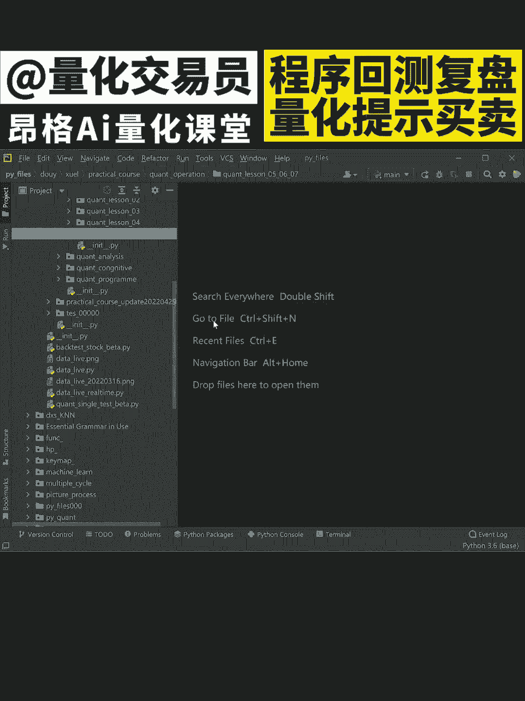
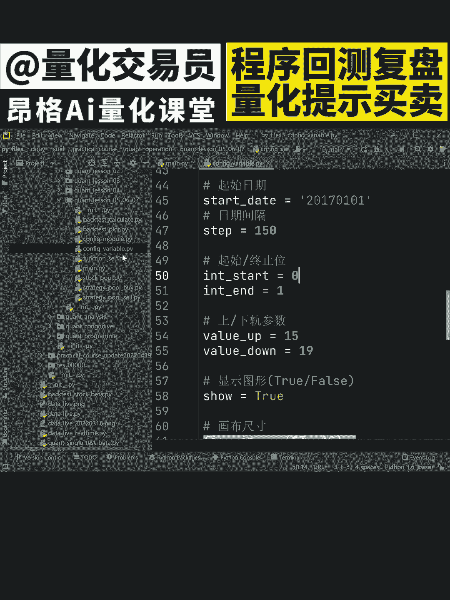
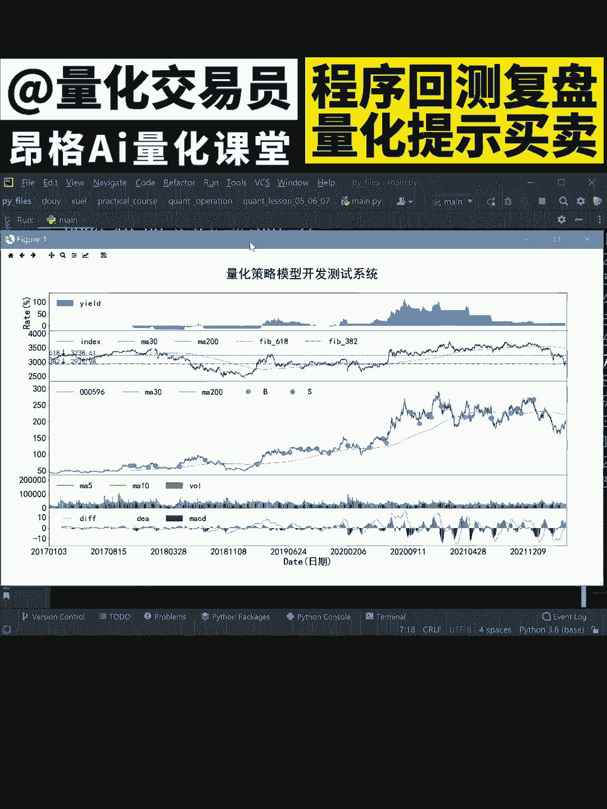

# Python量化系统开发：P1：量化BS点提醒系统概述

在本节课中，我们将学习如何开发一个Python量化交易系统，该系统能够自动复盘历史数据，并识别出关键的买入和卖出信号点进行提醒。我们将结合数据可视化、金融分析和Python编程技术，构建一个基础但功能完整的分析工具。

## 系统核心目标与流程

上一节我们介绍了本课程的目标，本节中我们来看看实现该系统的核心流程。整个系统的工作流程可以分为三个主要步骤。

以下是系统运行的三个核心步骤：

1.  数据获取与处理：从数据源获取股票历史行情数据，并进行必要的清洗和格式化。
2.  信号点计算与识别：应用特定的交易策略或指标公式，在历史数据中计算出买入和卖出信号点。
3.  结果可视化与提醒：将分析结果，包括K线图和信号点标记，通过图表直观展示出来，并可设置提醒机制。

## 关键组件与技术栈

了解了整体流程后，我们需要明确构建这个系统所需的关键技术和工具。

以下是实现系统所需的主要技术组件：

*   **编程语言**：Python。因其丰富的数据分析和机器学习库而成为量化交易的首选。
*   **数据获取**：可使用 `akshare`、`yfinance` 或 `tushare` 等库来获取金融时间序列数据。
*   **数据处理与分析**：`pandas` 用于数据处理，`numpy` 用于数值计算。
*   **策略指标计算**：`ta-lib` 库或自行实现指标计算逻辑，例如移动平均线交叉策略。
*   **数据可视化**：`matplotlib` 或 `plotly` 库用于绘制K线图并标记信号点。



## 核心策略示例：双均线交叉

一个经典且简单的策略是双移动平均线交叉策略。它使用两条周期不同的移动平均线来生成交易信号。

**策略逻辑如下：**

*   **买入信号**：当短期均线从下方上穿长期均线时，形成“黄金交叉”，记为买入点。
*   **卖出信号**：当短期均线从上方下穿长期均线时，形成“死亡交叉”，记为卖出点。

我们可以用代码来描述这个信号判断逻辑：



```python
# 假设 df 是一个包含股价数据的DataFrame，已有‘close’收盘价列
# 计算短期（如5日）和长期（如20日）简单移动平均线
df[‘MA_short’] = df[‘close’].rolling(window=5).mean()
df[‘MA_long’] = df[‘close’].rolling(window=20).mean()

# 生成交易信号：1代表买入，-1代表卖出，0代表无操作
df[‘Signal’] = 0
df.loc[df[‘MA_short’] > df[‘MA_long’], ‘Signal’] = 1
df.loc[df[‘MA_short’] < df[‘MA_long’], ‘Signal’] = -1

# 信号点发生在信号发生变化时
df[‘Position’] = df[‘Signal’].diff()
# 买入点：Position 从 0 或 -1 变为 1
# 卖出点：Position 从 0 或 1 变为 -1
```

## 结果可视化展示

计算出信号点后，我们需要将其清晰地展示在图表上。这通常通过叠加K线图和信号标记来实现。



以下是可视化图表的关键元素：

*   **主图**：使用蜡烛图展示每日的开盘、收盘、最高、最低价。
*   **叠加指标线**：在K线图上绘制短期和长期移动平均线。
*   **信号标记**：在买入信号出现的位置下方用绿色箭头或点标记，在卖出信号出现的位置上方用红色箭头或点标记。

## 总结与展望

本节课中我们一起学习了构建一个Python量化BS点提醒系统的基本框架。我们从系统目标出发，梳理了从数据获取、信号计算到结果可视化的完整流程，并以双均线交叉策略为例，展示了核心逻辑的代码实现。

通过这个入门系统，你可以自动复盘历史表现，直观地看到策略发出的买卖信号。这为后续更复杂的策略研究、回测分析和实盘提醒功能开发打下了坚实的基础。