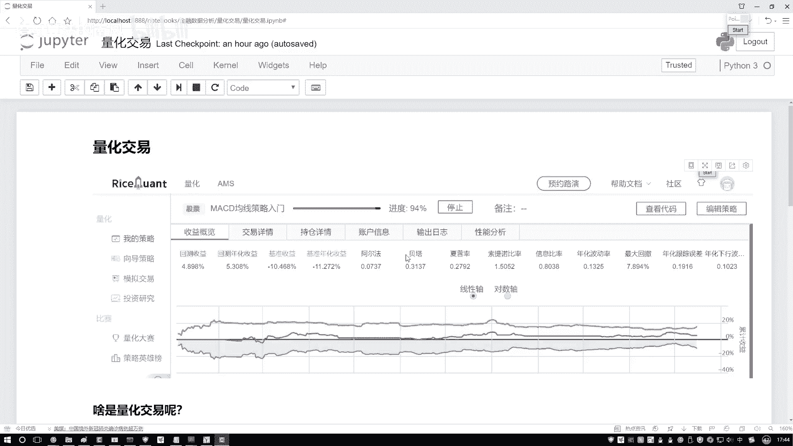
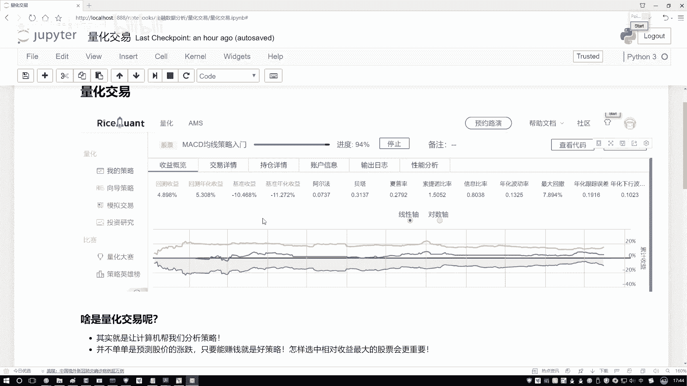
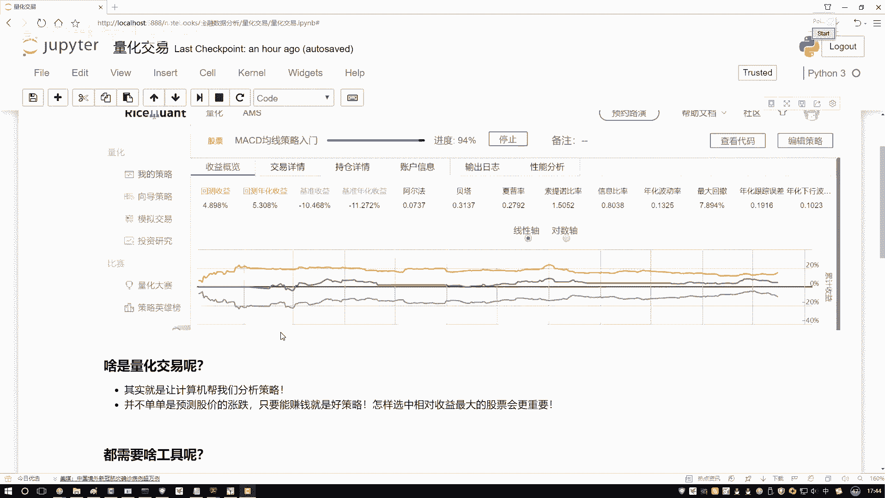
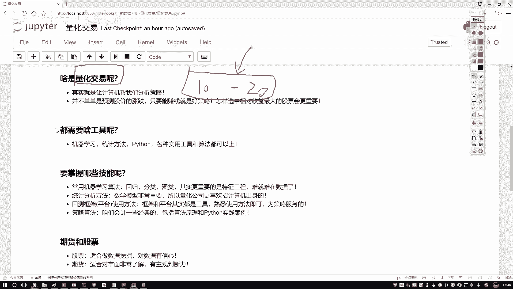
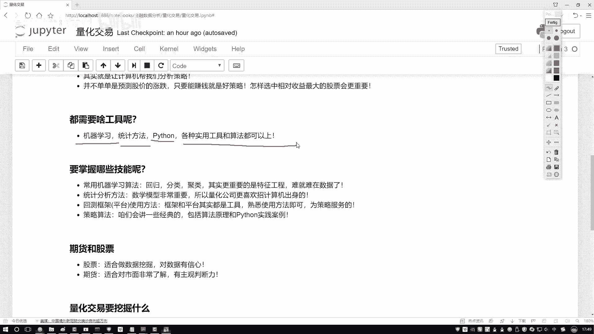

# Python金融分析与量化交易实战教程：P18：量化交易概述

## 概述
在本节课中，我们将要学习量化交易的核心概念。我们将探讨量化交易的本质、它与传统交易的区别，以及入门量化交易所需要掌握的核心技能。

## 什么是量化交易？
上一节我们介绍了本课程的目标，本节中我们来看看量化交易到底做了一件什么事。我们不会讨论冗长的历史、概述或发展前景，而是直接探究其本质。

传统炒股需要交易者长时间守在电脑前，紧盯市场指标变化。然而，这种方式存在两个主要问题：
1.  人的主观性可能导致判断不准确。
2.  人的精力、时间和计算能力有限，无法同时分析大量股票或跨越长时间段的历史数据。

量化交易的核心目标同样是赚钱，但方法不同。它将“如何赚钱”的具体策略交给计算机来设计和执行。例如，我们可以让计算机基于历史数据，找出在特定时间段内（如两年）能实现收益最大化的“买入”和“卖出”时机。

量化交易的本质是：**基于历史数据进行分析和策略设计**。这个过程常被称为“回测”。回测是指在历史数据中挖掘有价值的信息，并测试不同策略在这些数据上的表现，以评估其盈利能力。

简而言之，量化交易就是让计算机对历史数据进行数据挖掘，找出能够盈利的有效交易策略。

## 量化交易需要哪些核心技能？
刚才我们简单介绍了量化交易，大家明白了它是基于历史数据设计盈利策略。那么，实现量化交易需要掌握哪些技能呢？

量化交易是一个交叉学科领域。虽然需要了解一些金融知识，但重点应放在与计算机和数据相关的技能上。

以下是入门量化交易需要关注的核心技能：

*   **机器学习算法**：用于基于数据预测未来走势或结果。例如，使用模型预测股价。
*   **统计方法**：用于计算和分析数据中的各项指标，理解数据背后的信息。
*   **编程（如Python）**：用于实现策略、处理数据和进行分析实践的工具。

在量化交易中，没有绝对的“必备工具”，任何能帮助你实现收益最大化的方法都是好工具。金融知识需要了解，但**数据处理、分析和将数据转化为盈利策略的能力（即数据挖掘能力）才是核心**。你可以将量化交易视为数据挖掘领域中的一个热门应用方向。

## 总结
本节课中我们一起学习了量化交易的基本概念。我们了解到量化交易是利用计算机和数据分析方法（如回测），基于历史数据自动生成和验证交易策略，以克服人工交易的主观性和局限性，并追求收益最大化。其核心技能集中于机器学习、统计学和编程等数据科学领域。