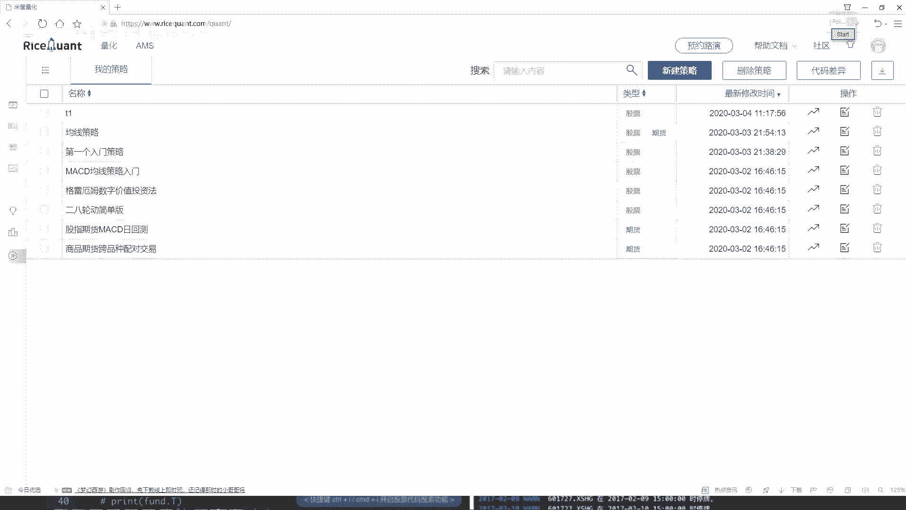
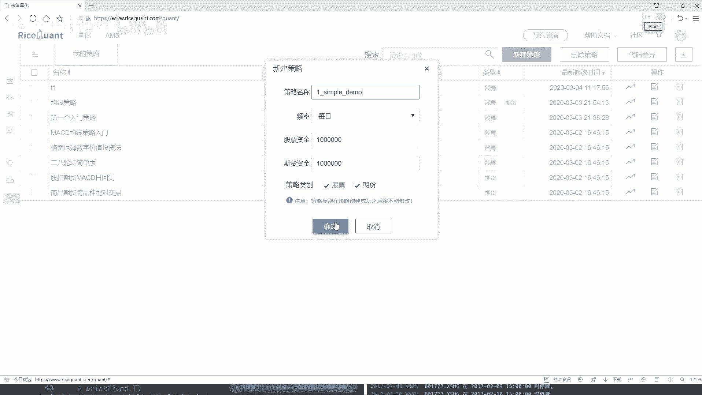
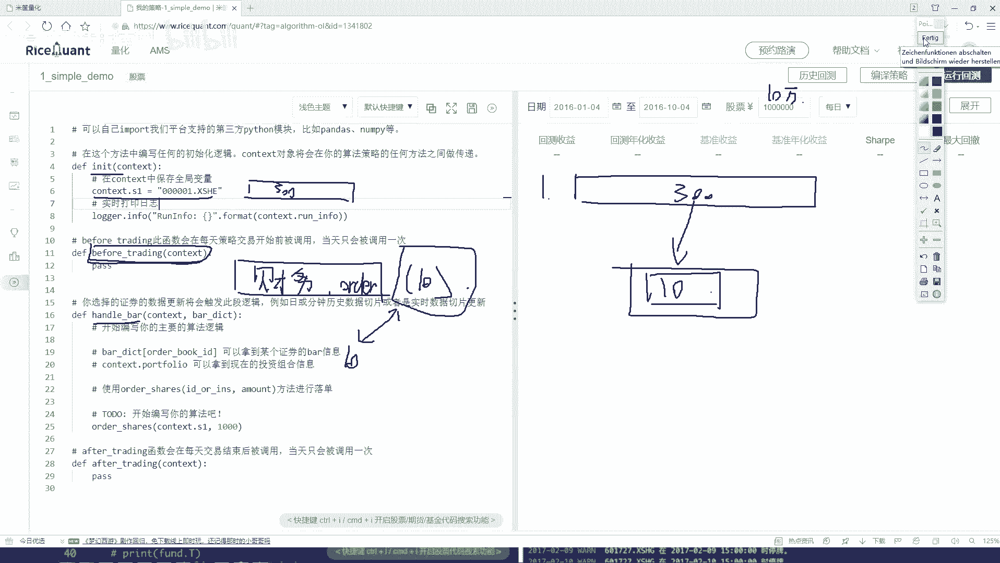
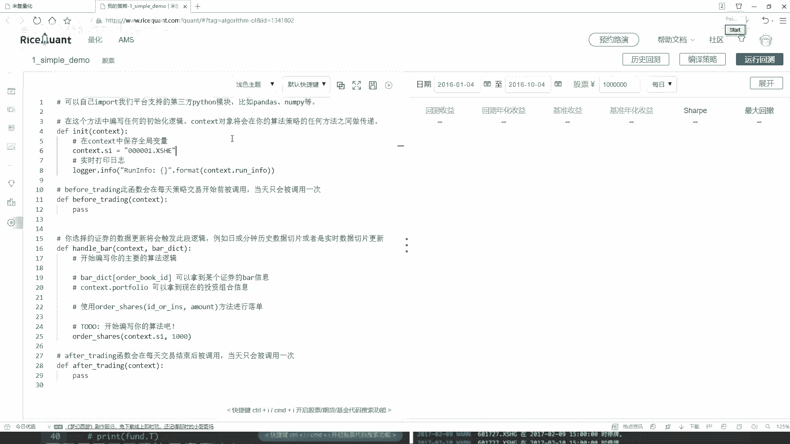

# Python金融量化交易实战：P21：1-策略任务分析 📊

在本节课中，我们将学习如何在一个交易平台上构建一个简单的量化交易策略。我们将通过一个具体的任务来熟悉平台的核心API，并理解策略开发的基本流程。

上一节我们介绍了量化交易的基本概念，本节中我们来看看如何将想法转化为一个可执行的策略。

## 策略目标设定 🎯

我们的目标是构建一个简单的选股策略。具体任务如下：
*   在沪深300指数的成分股中，始终持有表现最好的10只股票。
*   表现“最好”的标准可以基于一个财务指标（例如：净利润）来定义。
*   策略需要定期（例如每天）根据最新的财务数据，重新评估并更新持有的股票组合。

听起来挺简单的，接下来我们将任务分解到策略代码的不同模块中。

## 策略模块与任务分解 ⚙️

在编写代码之前，我们需要理解策略框架的几个核心函数，并将我们的任务分配到合适的函数中。

以下是策略通常包含的三个主要函数及其在本任务中的职责：

1.  **初始化函数 (`initialize`)**
    *   **功能**：在策略启动时执行一次，用于设置策略的初始状态。
    *   **本任务职责**：获取沪深300指数的全部成分股，作为我们的初始股票池。

2.  **盘前处理函数 (`before_trading`)**
    *   **功能**：在每个交易日开始前执行，用于准备数据或进行计算。
    *   **本任务职责**：获取股票池中所有股票的指定财务数据（如净利润），进行排序，并选出排名前10的股票代码。这个结果将作为当天“最优”的股票列表。

3.  **盘中处理函数 (`handle_bar`)**
    *   **功能**：在每个交易时间点（如每分钟或每天）执行，是执行交易逻辑的核心。
    *   **本任务职责**：对比当前账户持有的股票与`before_trading`计算出的“最优”股票列表。
        *   如果持有的股票不在新列表中，则卖出。
        *   如果新列表中的股票尚未持有，则用可用资金买入。
        *   目标是使持仓始终与最新的“最优10股”列表保持一致。

通过以上分解，我们将一个复杂的策略目标，清晰地分配到了代码的具体执行环节中。

## 策略逻辑流程 🔄

现在，让我们将上述模块串联起来，梳理出完整的策略执行流程。

以下是策略从启动到每日运行的逻辑步骤：

1.  **策略启动**：在`initialize`中，获取沪深300成分股列表，存入变量`stock_pool`。
2.  **每日盘前**：在`before_trading`中，查询`stock_pool`中每只股票的财务指标`financial_metric`，进行排序，得到当日的“最优股票列表”`top_10_stocks`。
3.  **每日盘中**：在`handle_bar`中，执行以下核心交易逻辑：
    *   **获取当前持仓**：`current_holdings = get_current_positions()`
    *   **卖出逻辑**：遍历`current_holdings`，如果某只股票不在`top_10_stocks`中，则执行卖出操作。
    *   **买入逻辑**：遍历`top_10_stocks`，如果某只股票不在`current_holdings`中，则用剩余资金执行买入操作。
4.  **循环执行**：重复步骤2和步骤3，直到策略运行结束。

这个流程确保了我们的投资组合能够动态地跟踪市场上（基于所选指标）表现最佳的股票。

## 总结 📝

本节课中我们一起学习了如何为一个量化交易策略进行任务分析。我们首先设定了一个明确的目标：**动态持有沪深300中财务指标最优的10只股票**。接着，我们将这个目标分解到策略框架的初始化(`initialize`)、盘前(`before_trading`)和盘中(`handle_bar`)三个核心函数中，明确了每个阶段的具体职责。最后，我们梳理了策略从数据准备到交易执行的完整逻辑流程。通过这次分析，我们为下一节课实际编写代码打下了坚实的基础。