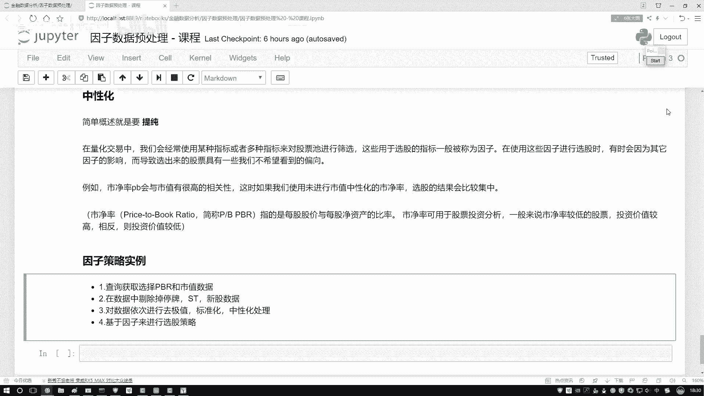
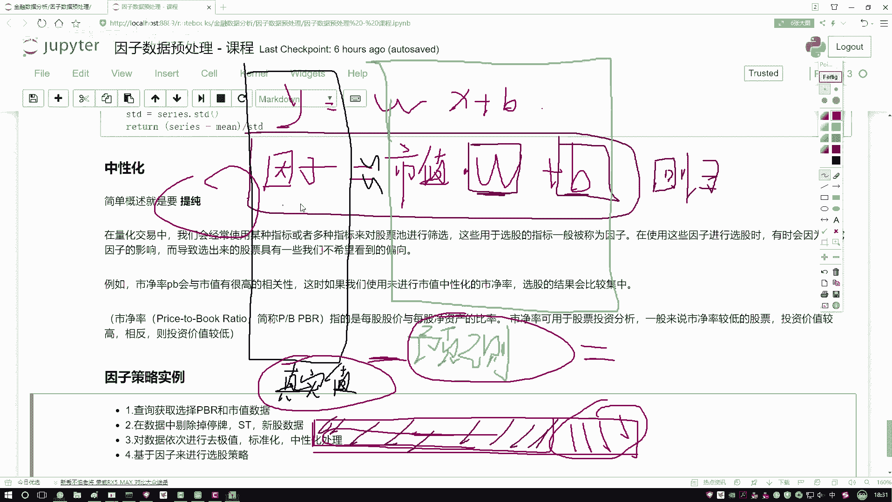
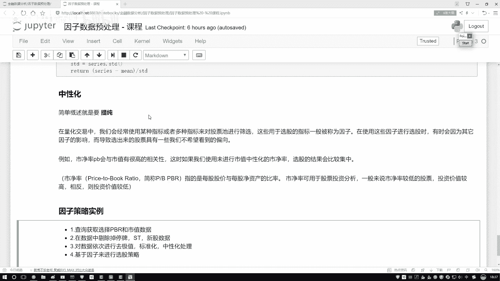
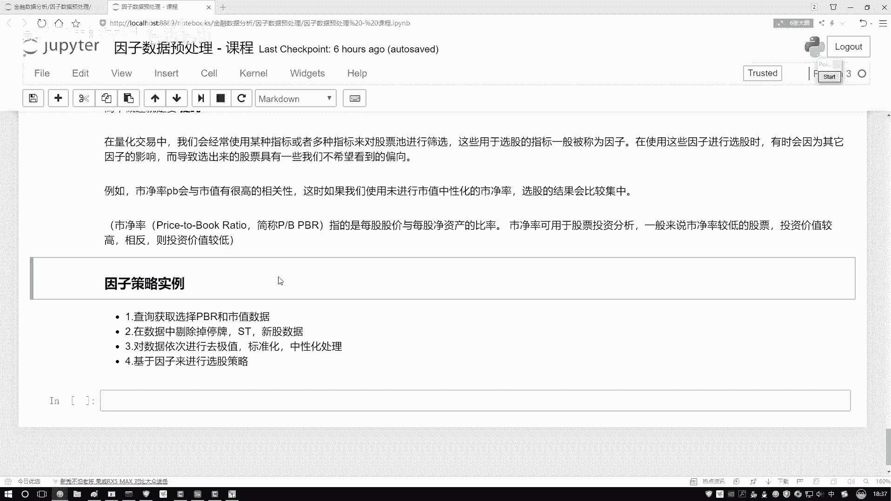
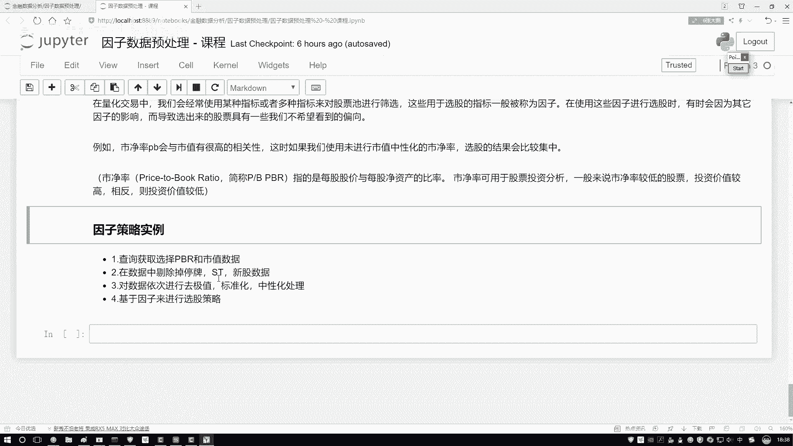
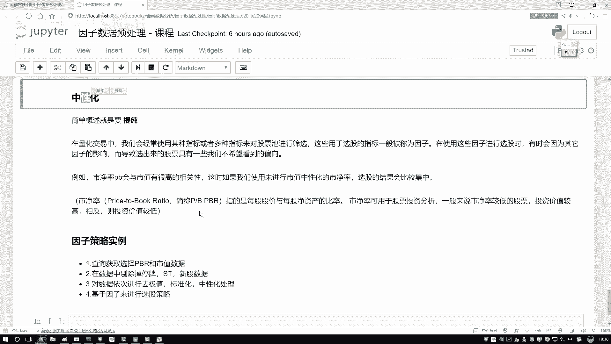
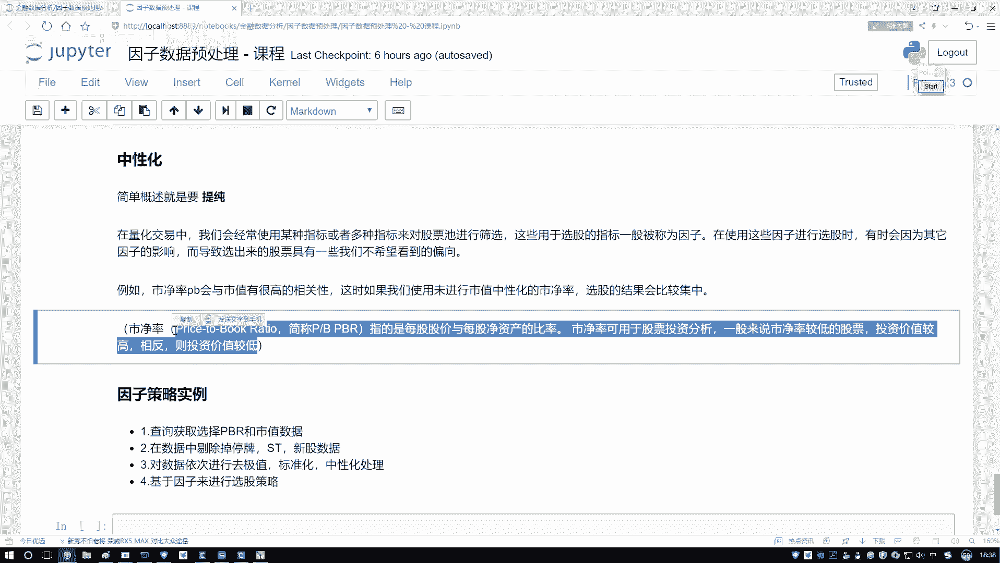
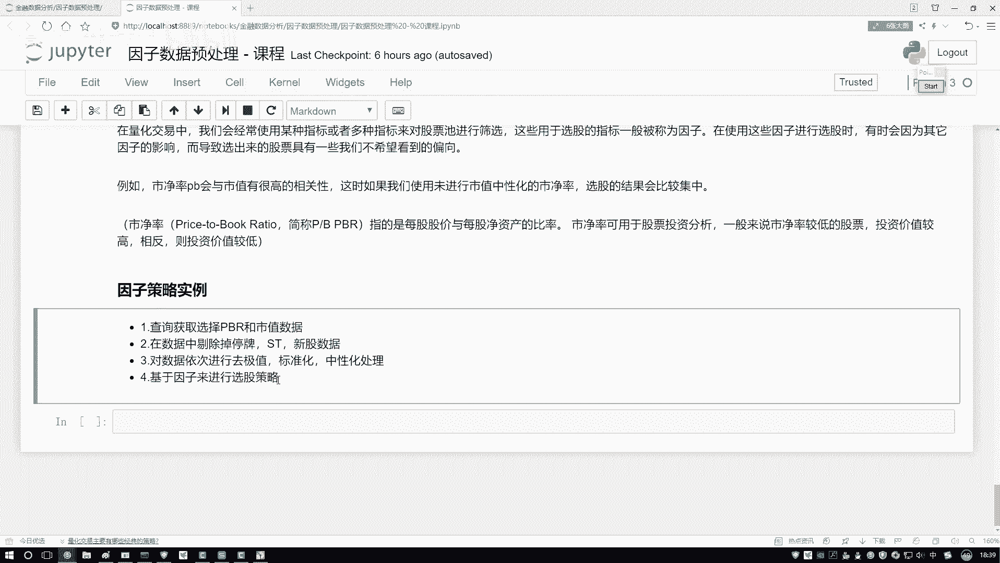
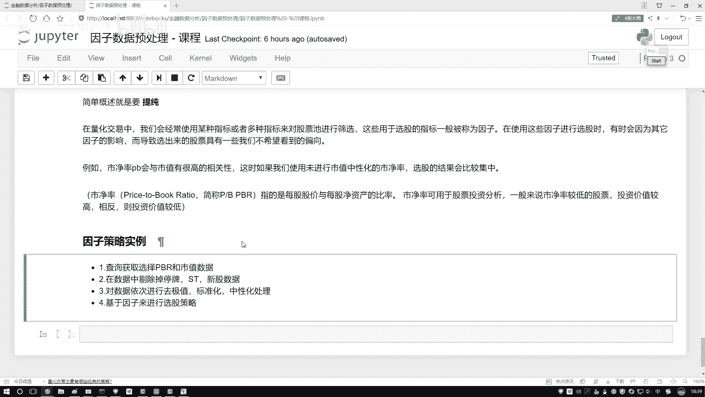
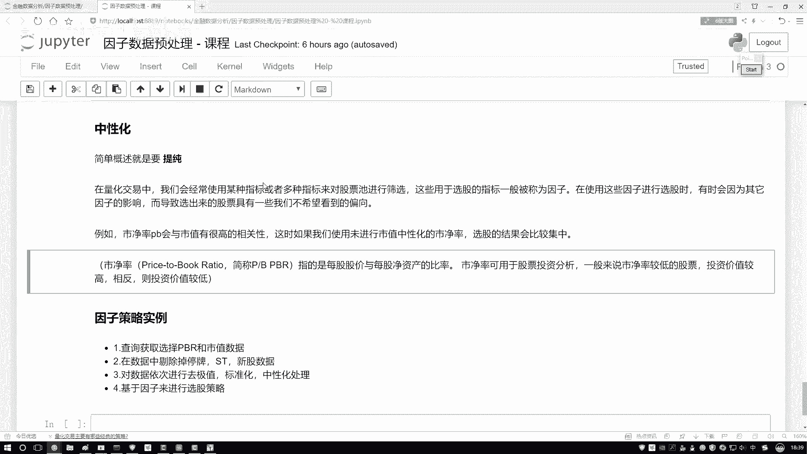

# Python金融分析与量化交易实战教程：P31：7-策略任务概述

## 概述
在本节课程中，我们将学习量化策略中的一个核心数据处理步骤：**因子中性化**。我们将通过一个具体的例子——从市净率因子中剔除市值的影响——来详细解释其原理和实现方法。理解这个过程对于构建稳健的量化策略至关重要。

## 因子中性化的原理

上一节我们介绍了因子标准化，本节中我们来看看如何从因子中剔除我们不希望包含的“杂质”信息，这个过程称为因子中性化。

假设我们有一个市净率因子，但我们发现它与市值因子存在较强的相关性。这意味着市净率因子中“混入”了一部分市值信息。为了得到更“纯净”的、仅反映公司账面价值与市场价值关系的因子，我们需要从市净率中剔除市值的影响。

这个过程可以形象地理解为：将市净率因子视为一个整体，市值因子解释了其中的一部分。我们的目标是将市值所解释的这部分“蓝色”信息分离并剔除出去。

## 如何实现中性化：回归分析

以下是实现因子中性化的核心思路，我们通过建立回归方程来完成。

我们想知道市值能解释市净率中的多大一部分。这可以通过建立一个以市净率为因变量、以市值为自变量的线性回归模型来实现。

**公式描述如下：**
`市净率 = W * 市值 + B + ε`

在这个公式中：
*   `市净率` 是真实值。
*   `W * 市值 + B` 是模型根据市值预测出的市净率值。
*   `ε` 是误差项，代表市值无法解释的部分。

当我们求解出回归系数 `W` 和截距 `B` 后，就可以计算预测值。**真实值与预测值之间的差异（即误差项 `ε`），正是市值所无法解释的、我们想要保留的“纯净”因子部分。**

因此，中性化的操作就是：
`中性化后的因子 = 原始因子值 - 预测值`

## 中性化操作步骤总结

基于以上原理，我们可以将因子中性化的过程总结为两个清晰的步骤：

第一步，建立回归方程。以需要提纯的因子作为Y（因变量），以希望剔除其影响的因子作为X（自变量），求解回归系数 `W` 和 `B`。

第二步，执行提纯操作。用因子的真实值减去回归模型得到的预测值，结果即为中性化后的因子值。这个值已经剔除了指定因素的影响。

## 本节策略任务流程预览

在理解了中性化原理后，我们来看一个完整的策略任务流程。我们将以市净率和市值数据为例，演示如何构建一个简单的选股策略。

以下是构建策略的主要步骤：

1.  **数据准备**：获取市净率和市值等基础因子数据。
2.  **数据预处理**：对股票池进行清洗，剔除不符合条件的股票（如ST股、停牌股、上市时间过短的股票等）。
3.  **因子处理**：按照顺序对因子数据进行处理，包括**去极值**、**标准化**以及本节重点学习的**中性化**。
4.  **策略逻辑与选股**：基于处理后的因子制定选股规则。例如，我们可以设定规则：选择“中性化后的市净率小于0.2”的股票。这相当于在剔除市值影响后，寻找市场估值相对于其账面价值显著偏低的股票。
5.  **执行交易**：根据选股结果，决定买入和卖出的标的。

## 总结
本节课中我们一起学习了因子中性化的核心概念。我们了解到，中性化是通过线性回归方法，从一个因子中剔除另一个相关因子影响的过程。其关键步骤是建立回归模型并计算残差。掌握这一技术，能帮助我们得到更独立、更有效的因子，为后续构建稳健的量化选股策略打下坚实基础。在接下来的实践中，我们将把这一理论应用到具体的代码中。