# Python金融分析与量化交易实战教程：P32：1-股票数据获取

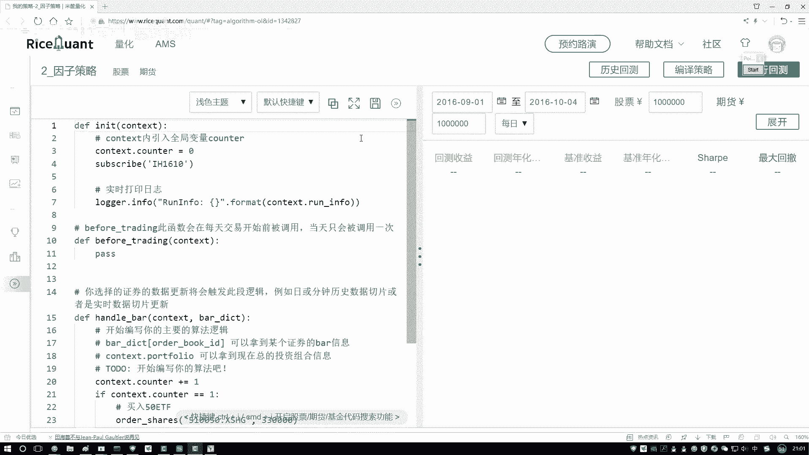

## 概述
在本节课中，我们将学习如何获取股票数据，这是构建量化交易策略的第一步。我们将从初始化环境开始，逐步讲解如何获取全市场股票列表，并对其进行初步筛选，为后续的因子计算和策略构建打下基础。

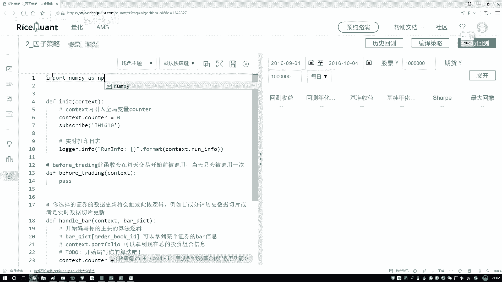

## 环境初始化与工具包导入
上一节我们介绍了量化策略的基本概念，本节中我们来看看如何搭建代码环境。首先，我们需要导入必要的Python工具包。

以下是需要导入的核心工具包：
*   `numpy`：用于高效的数值计算。
*   `pandas`：用于数据处理和分析。
*   `statsmodels`：用于统计分析，特别是回归分析，后续将用于因子中性化处理。

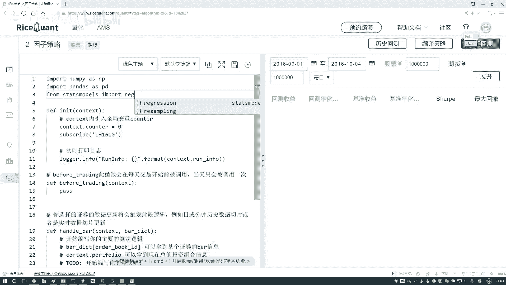

```python
import numpy as np
import pandas as pd
from statsmodels import regression
```

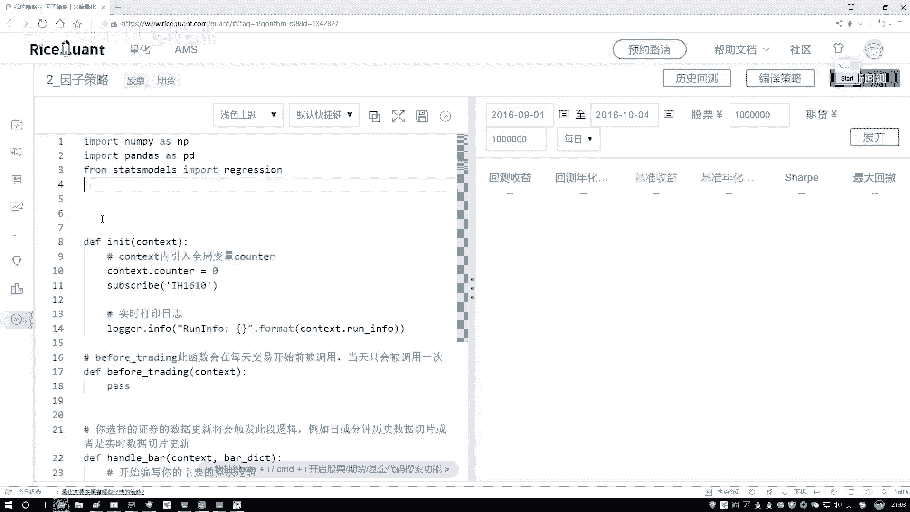

## 策略初始化与定时器设置
导入工具包后，我们需要初始化策略类。在这个初始化模块中，一个关键任务是设置策略的调仓频率。

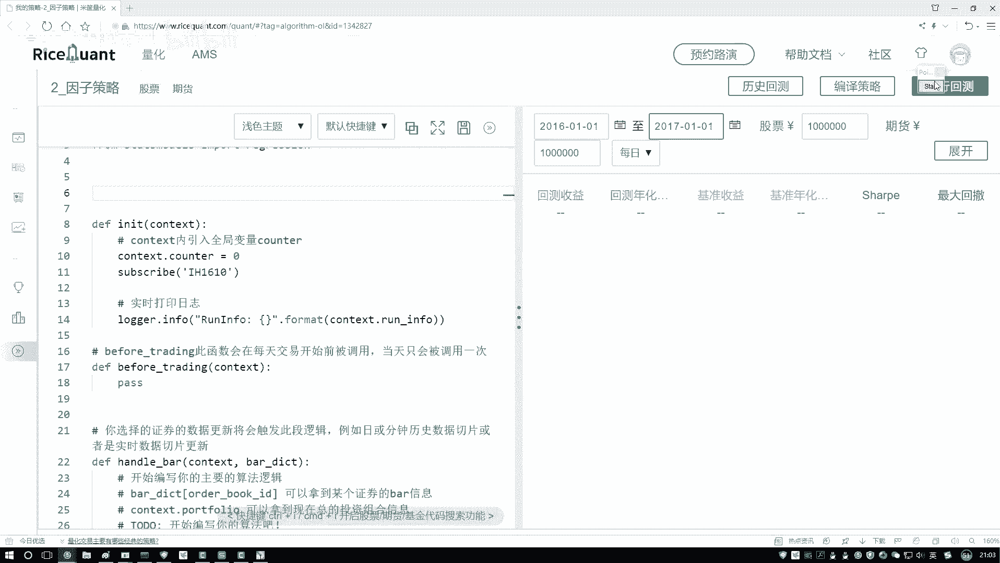

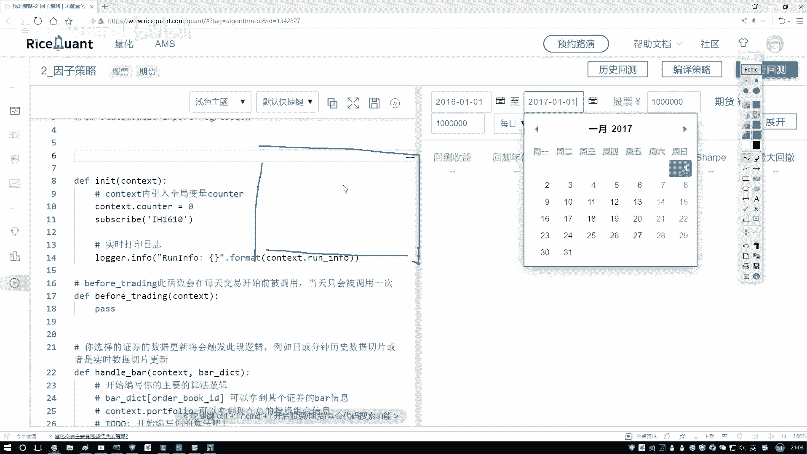

我们设计一个按月调仓的策略。这意味着策略会每月运行一次，根据最新的因子数据重新筛选股票组合。为了实现定时执行，我们需要在策略的构造函数中设置一个定时器。

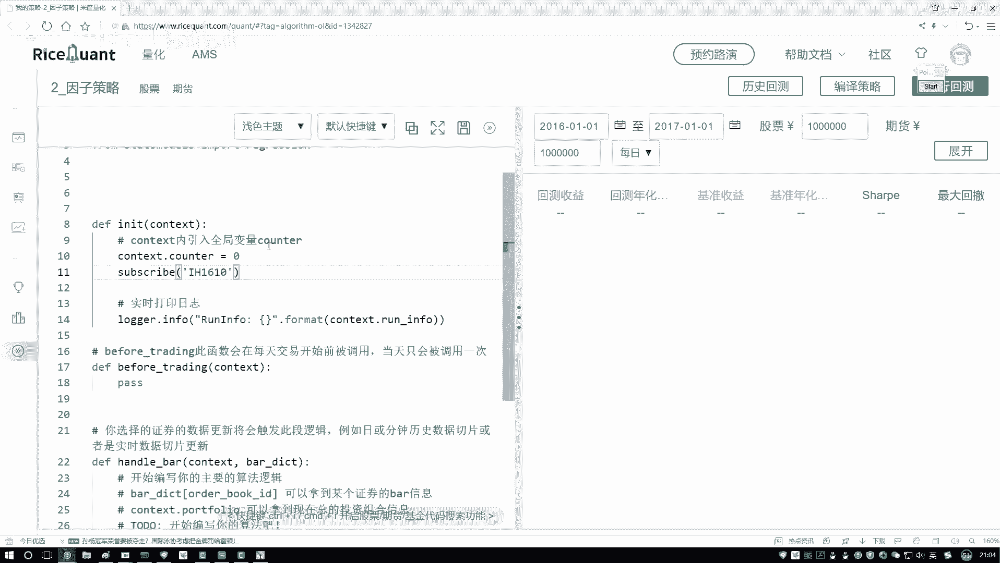

```python
def initialize(context):
    # 设置按月调仓的定时器
    run_monthly(rebalance, monthday=1)
```

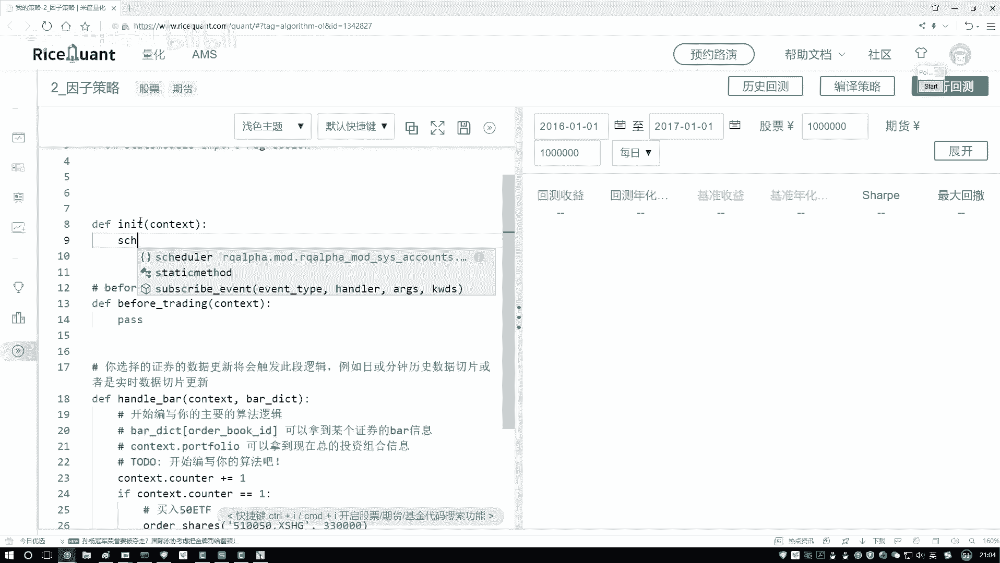


## 获取全市场股票数据
设置好调仓频率后，下一步是获取可供选择的股票池。我们需要获取市场上所有的股票数据。

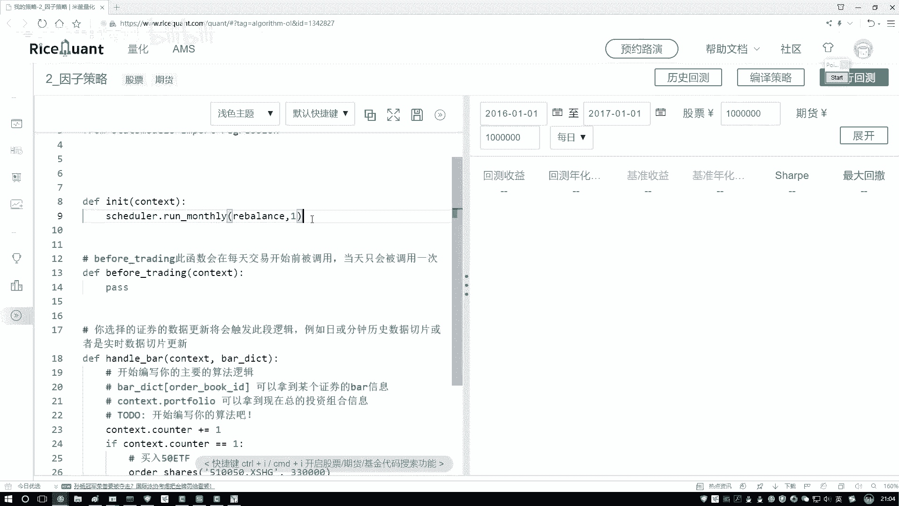

这里使用一个API函数来获取指定市场（例如A股）的所有股票信息。该函数会返回一个包含所有股票代码和基本信息的列表。

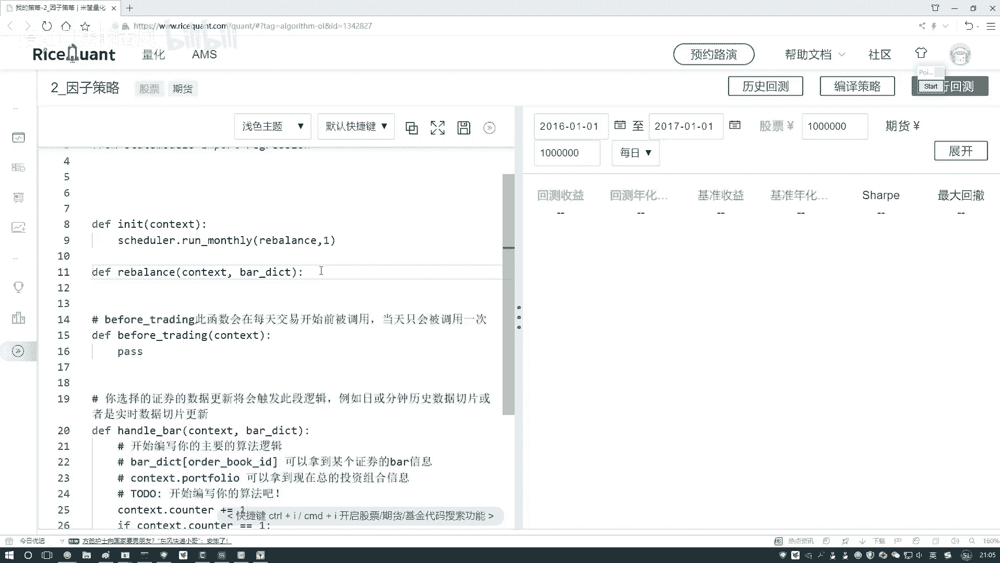

```python
# 获取全市场股票列表
all_stocks = get_all_securities(types=[‘stock’])
```

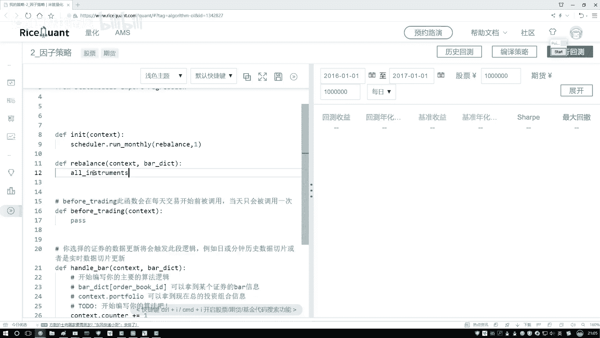

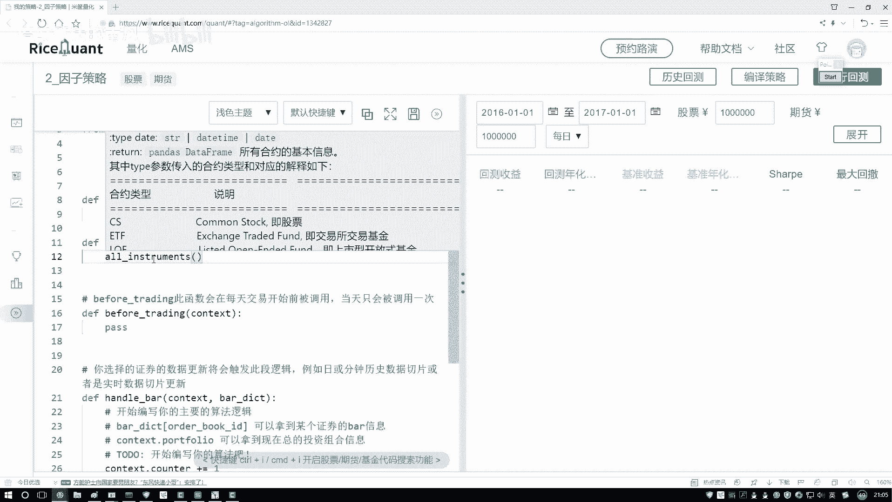

## 股票数据初步筛选
获取到全市场股票列表后，我们通常不会直接使用所有股票。因为其中可能包含ST股、次新股、停牌股等不符合我们策略要求的股票。

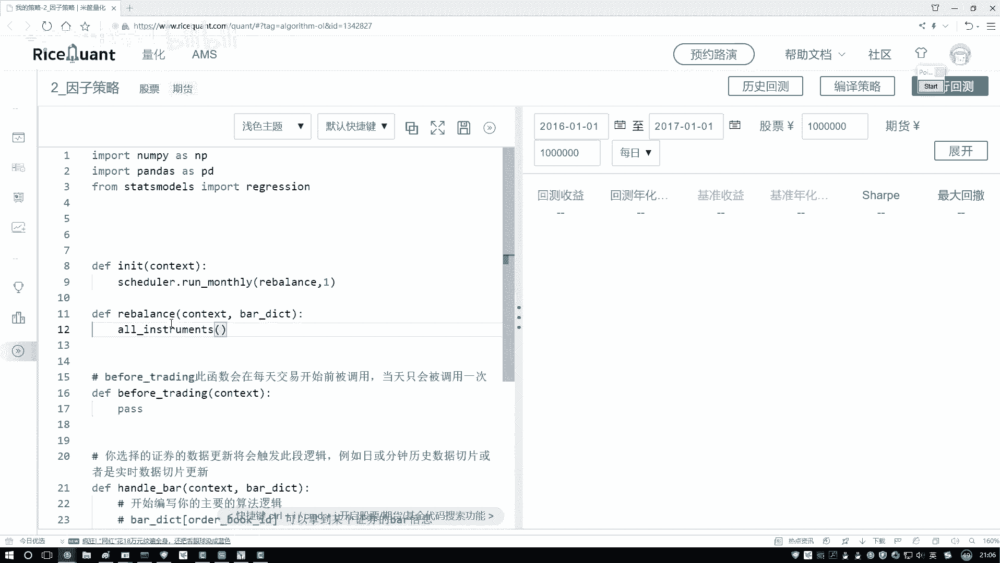

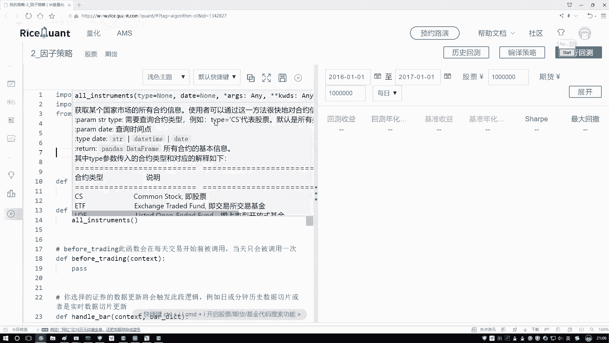

因此，在将股票纳入备选池之前，需要进行初步筛选。例如，我们可以根据上市时间、是否ST、流动性等条件进行过滤，得到一个更干净、更适合回测的股票池。

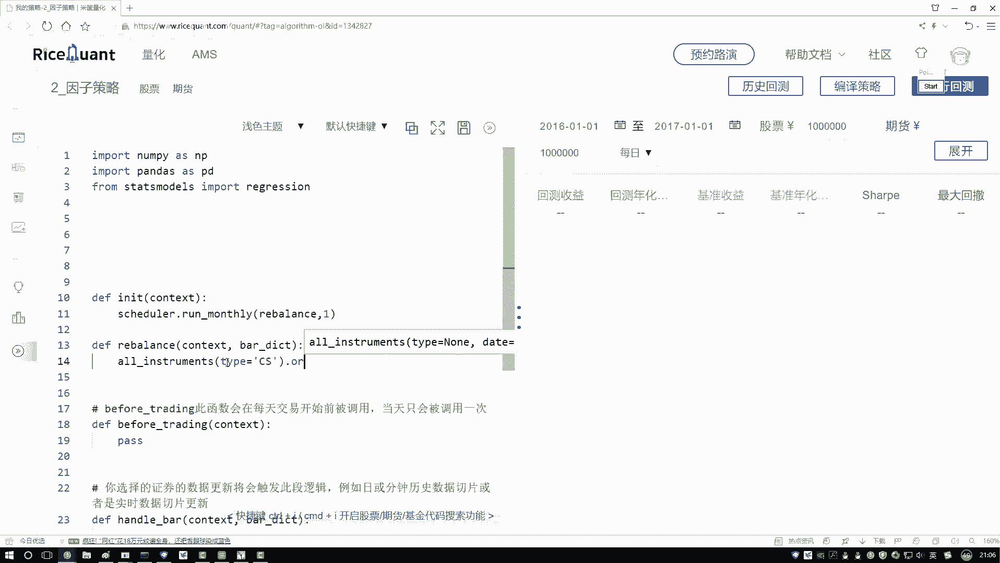

```python
# 对全市场股票进行初步筛选，例如过滤ST股、次新股等
filtered_stocks = filter_stocks(all_stocks)
```

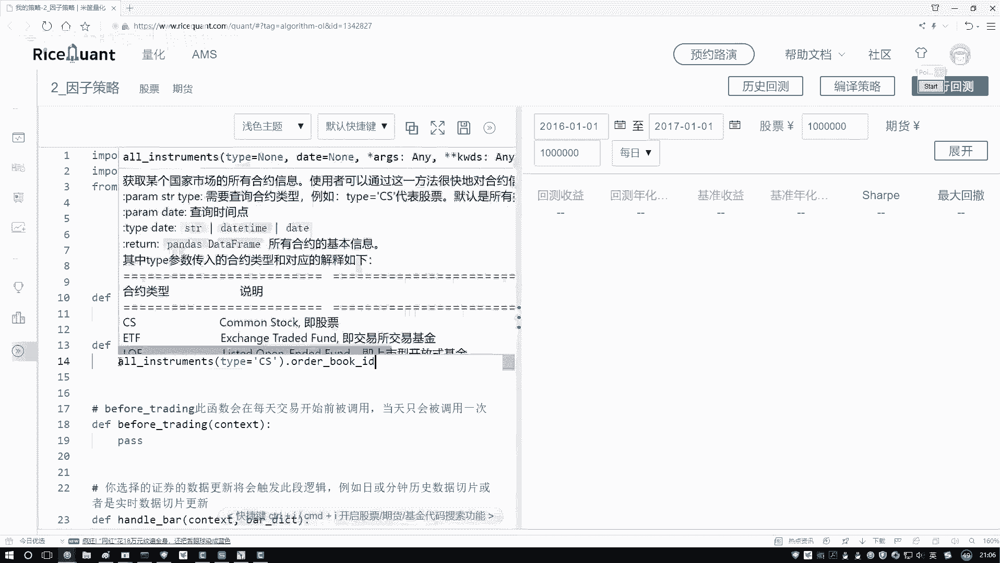

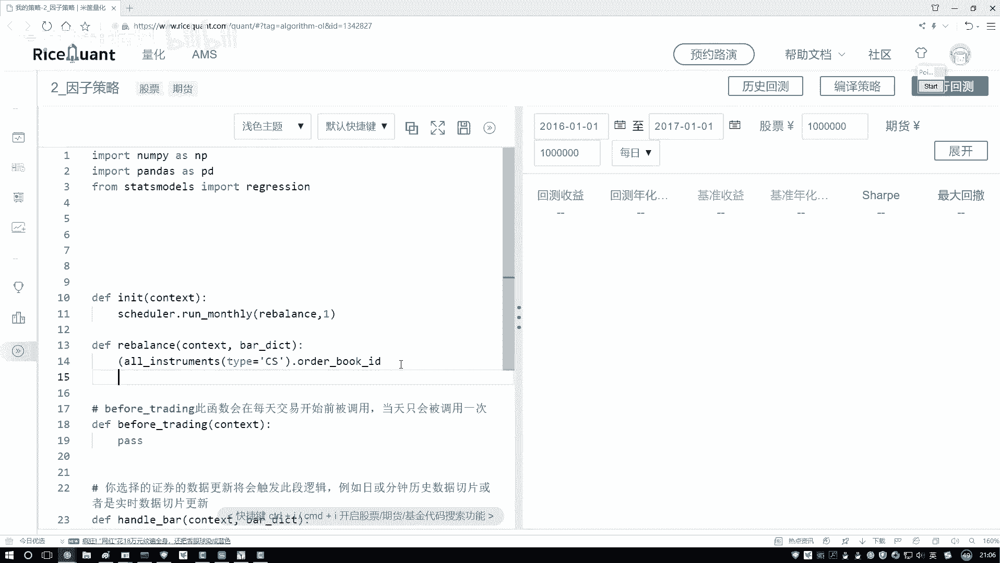

## 总结
本节课中我们一起学习了量化策略数据准备阶段的核心步骤。我们首先搭建了Python环境并导入了必要的工具包。然后，在策略初始化阶段设置了按月调仓的定时器。接着，我们通过API获取了全市场的股票列表。最后，我们了解到需要对原始股票列表进行初步筛选，以得到符合策略要求的备选股票池。这些步骤为后续计算因子、构建投资组合奠定了坚实的基础。