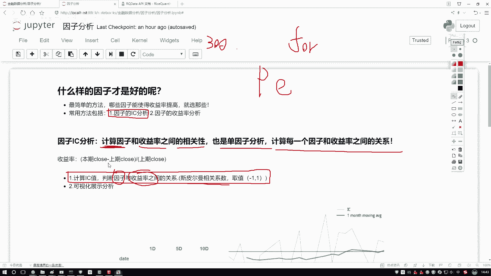
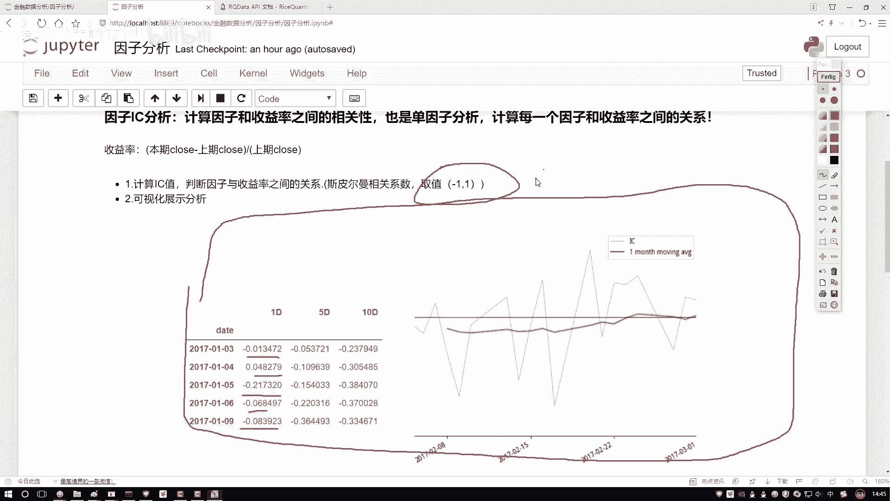

# Python金融分析与量化交易实战教程：P37：1-因子分析概述

## 概述
在本节课中，我们将要学习量化交易中的一个核心环节——因子分析。我们将了解什么是因子，以及如何评估一个因子对股票收益率的影响，从而筛选出对构建交易策略有价值的指标。

## 什么是因子分析
上一节我们介绍了量化交易的基本概念，本节中我们来看看如何从众多市场指标中筛选出有效的因子。

在股票市场中，我们可以获取到各种各样的指标数据。例如，常见的基本面信息（如市盈率、市净率）和技术指标（如移动平均线、RSI）。这些指标可以细分为多个大类，每个大类下又包含许多具体的因子。

假设我们手中有300个不同的因子。当我们需要进行策略回测或设计交易策略时，一个关键问题是：我们是使用全部300个因子，还是只选择其中一部分？因此，我们需要对因子进行评估和排序，判断哪些因子对最终的投资收益有正面影响，哪些没有影响甚至有害。

## 如何评估因子好坏
评估因子好坏最直接的方法之一是观察它与收益率的关系。收益率是衡量投资回报的核心指标。

收益率的计算公式如下：
`日收益率 = (当日收盘价 - 前一日收盘价) / 前一日收盘价`

我们的目标是积少成多，争取每日都能获得正收益。因此，我们需要分析因子值的变化与收益率变化之间的关系。例如，我们有一年的数据（约250个交易日），每天都有一个因子值（记为 **F**）和一个对应的日收益率（记为 **R**）。我们需要分析这两个序列之间是线性相关、非线性相关还是不相关，以及相关的方向和强度。

## 因子分析的核心：IC值
在因子分析中，我们主要进行两件事。第一件事是计算因子的**IC值**。

IC（Information Coefficient）是一个衡量相关性的指标。具体来说，它计算的是**因子**与**未来一期收益率**之间的**斯皮尔曼秩相关系数**。

IC值的计算公式可以简化为计算两个序列的相关系数。其取值范围在 **-1 到 1** 之间：
*   **越接近 1**：表示因子与收益率**正相关**越强。
*   **越接近 -1**：表示因子与收益率**负相关**越强。
*   **越接近 0**：表示因子与收益率**几乎没有线性关系**。

这种针对单一因子与收益率关系的分析，也称为**单因子分析**。当我们有300个因子时，就需要进行300次这样的分析，通常通过一个循环遍历每个因子，计算其与收益率的斯皮尔曼相关系数，得到的结果就是该因子的IC值。

## 分析结果的可视化
计算出每个因子的IC值后，我们需要对其进行分析和可视化。

以下是常见的IC分析结果图表展示：

*   **左图（IC值序列图）**：展示了某个因子在历史每一天的IC值变化情况。蓝色折线是每日的IC值。
*   **右图（IC值序列与均线图）**：在每日IC值（蓝线）的基础上，增加了其移动平均线（绿线）。例如，可以计算10日的IC均值，形成一条平滑的曲线，有助于观察IC值的长期趋势。

通过观察IC值的正负、大小和稳定性，我们可以判断：
1.  哪些因子与收益率有较强的正相关或负相关关系，值得进一步研究。
2.  哪些因子与收益率关系微弱或不稳定，可以考虑在策略中剔除。

## 总结
本节课中我们一起学习了因子分析的基础知识。我们了解到，因子分析的核心目的是从海量市场指标中筛选出对预测收益率有效的因子。我们介绍了通过计算**IC值**（斯皮尔曼相关系数）来量化因子与收益率的相关性，并展示了如何通过图表直观地分析IC值的表现。在接下来的课程中，我们将通过代码实战，一步步实现单因子IC值的计算与分析。