# Python金融分析与量化交易实战教程：P41：5-数据格式转换 📊

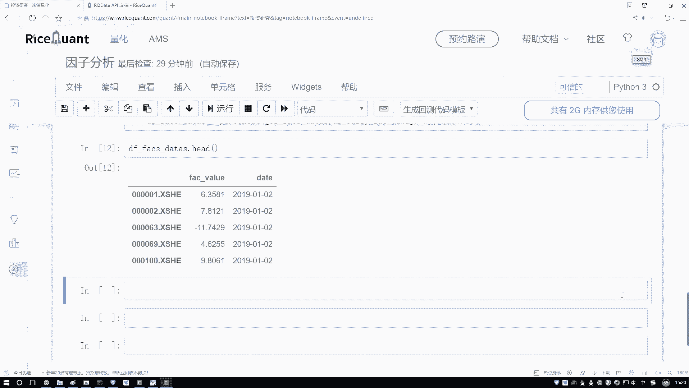

在本节课中，我们将学习如何将数据处理成特定工具包（如Alphalens）所要求的格式。这是进行后续量化分析的关键一步。

## 概述
上一节我们完成了数据的初步处理。本节中，我们来看看如何将数据转换为Alphalens工具包所需的特定格式。Alphalens要求数据以多层索引（MultiIndex）的形式组织，这与我们当前的数据结构不同。

## 目标数据格式
Alphalens要求的数据格式如下：索引的第一层是日期（date），第二层是股票代码（ticker），而数据列则是我们计算出的因子值。

例如，一个符合要求的数据片段看起来是这样的：
| date       | ticker | value |
|------------|--------|-------|
| 2019-01-01 | stock_A | 1.3   |
| 2019-01-01 | stock_B | 2.1   |
| 2019-01-02 | stock_A | 1.5   |
| 2019-01-02 | stock_B | 2.3   |

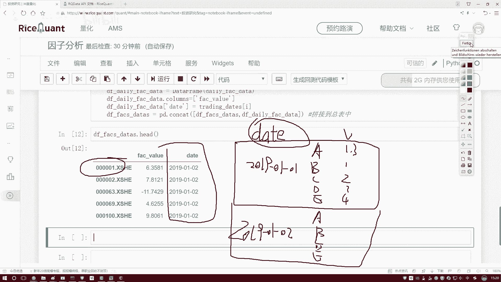

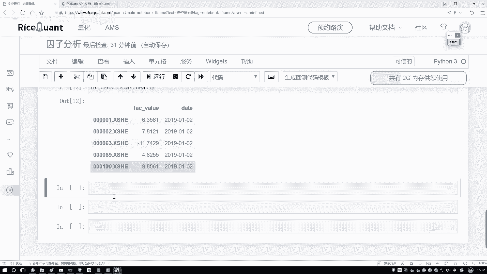

我们的目标就是将现有的`DataFrame`转换成这种结构。

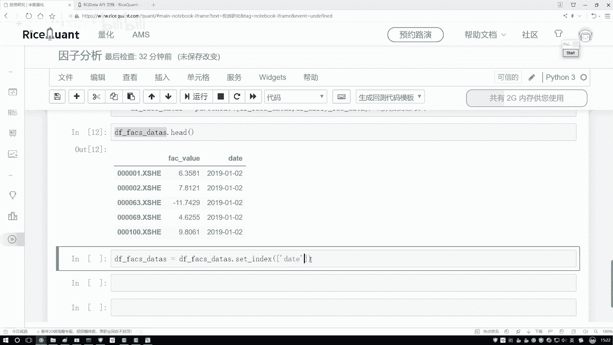

## 转换数据格式
为了满足工具包的要求，我们必须进行格式转换。以下是转换的核心步骤。

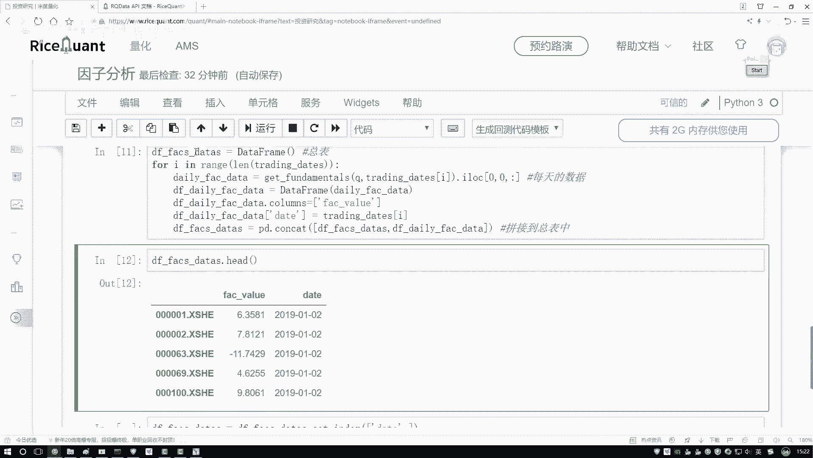

首先，我们需要重新设置数据的索引。我们将使用`date`列和股票代码（即原数据框的索引）来构建一个双层索引。

```python
# 假设 df 是我们的原始DataFrame，其中包含‘date’列和因子值
# 设置多层索引：第一层是日期，第二层是股票代码
df_transformed = df.set_index([‘date‘, df.index])
```

执行这段代码后，数据框的索引将变为由日期和股票代码组成的元组，数据列则只剩下我们关注的因子值。

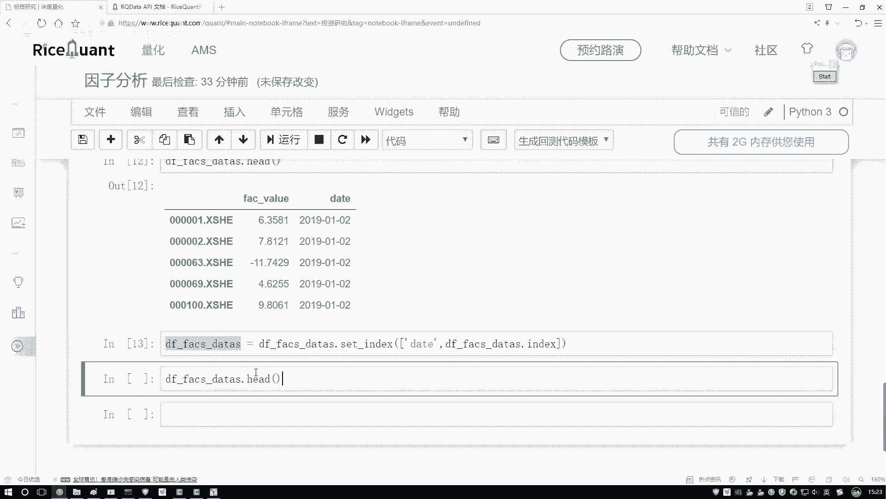

## 验证转换结果
转换完成后，我们可以查看数据的前几行，以确认格式是否正确。

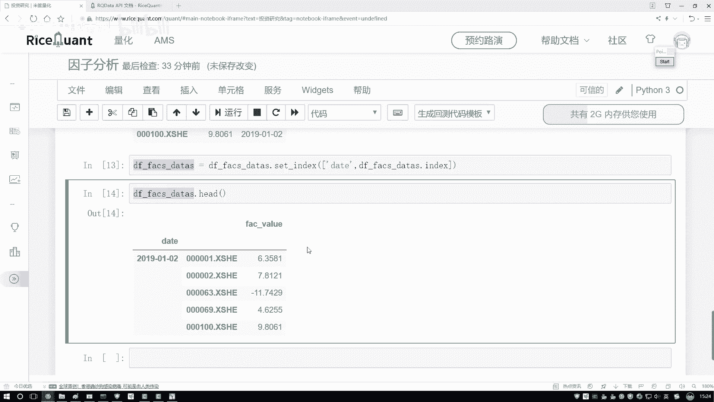

```python
# 查看转换后的数据前几行
print(df_transformed.head())
```

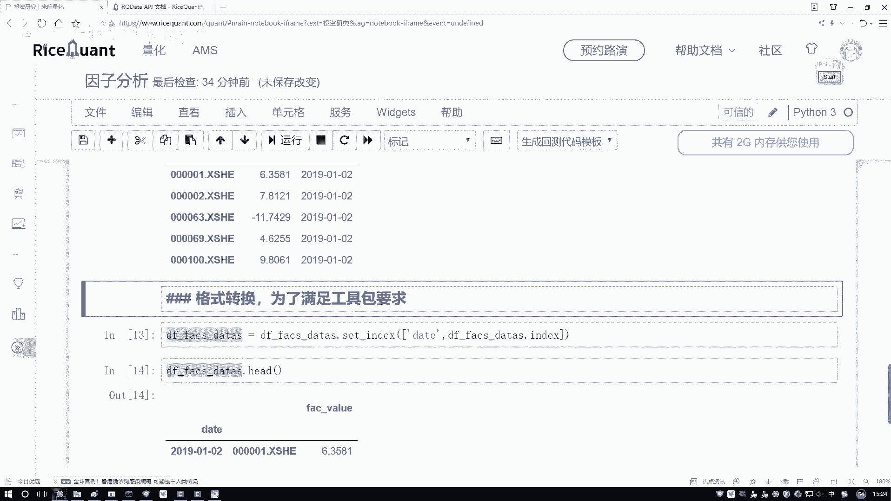

输出结果应显示日期和股票代码作为索引，以及对应的因子值。这表示我们已经成功将数据转换成了Alphalens所需的格式。

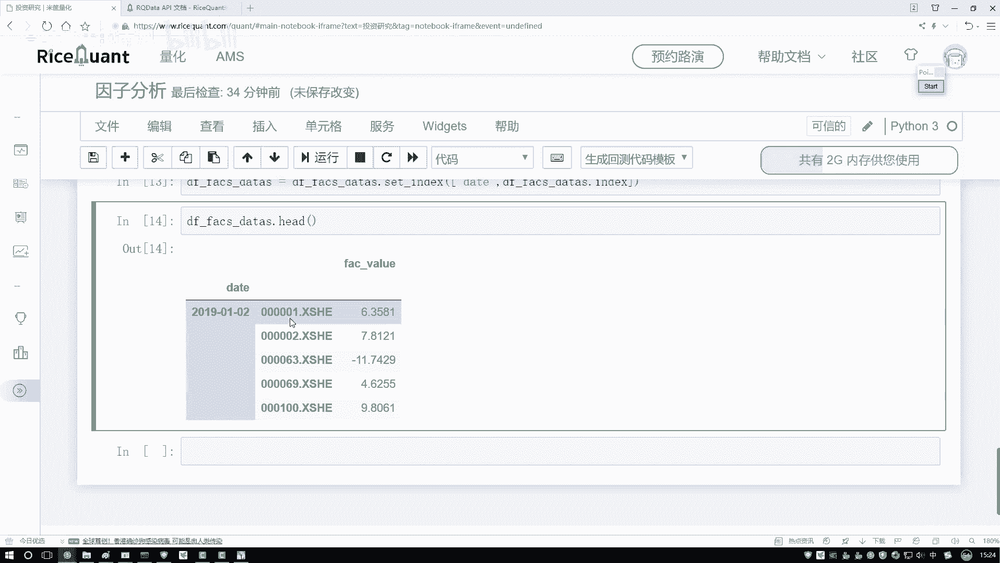

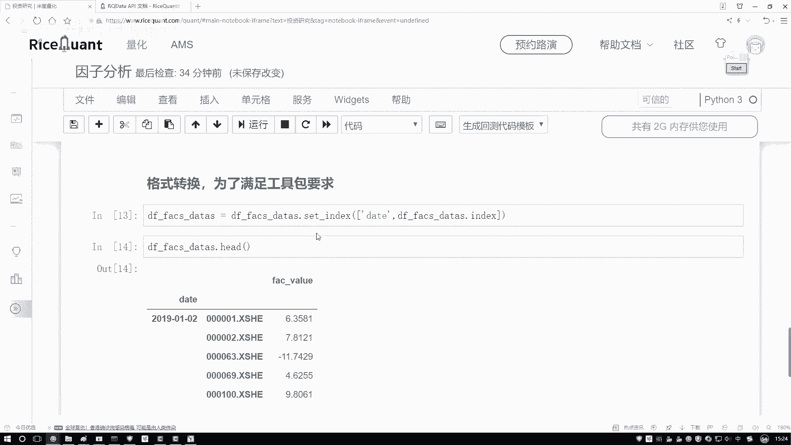

## 数据预处理
在将数据输入模型之前，通常还需要进行一些预处理操作，例如去除异常值和标准化。

以下是预处理的两个常见步骤：
1.  **去除异常值**：将因子值限制在指定的上下限范围内（例如，使用分位数截断）。
2.  **标准化**：将数据转换为均值为0、标准差为1的分布。

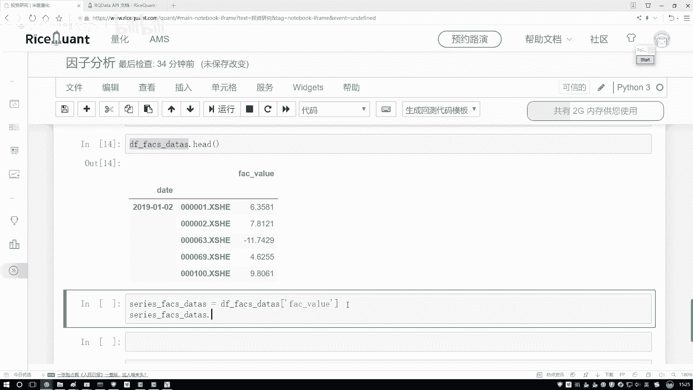

我们可以对每一天的数据分别应用这些预处理步骤。

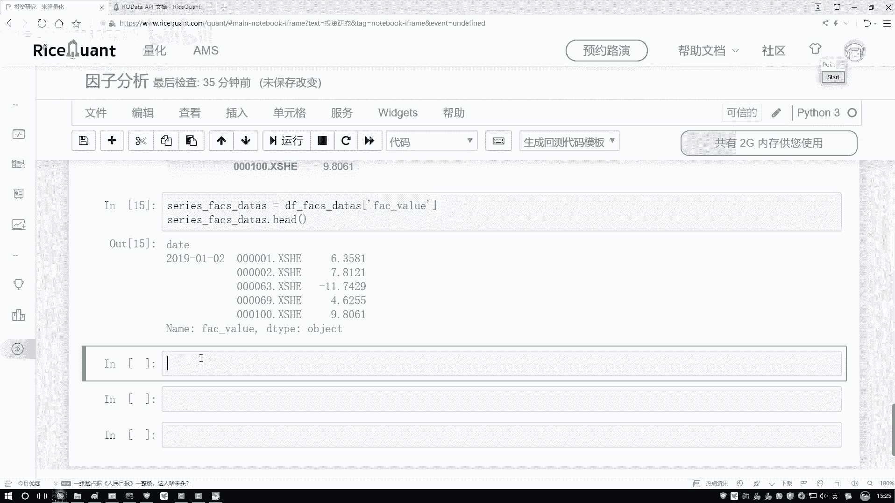

```python
# 示例：对每一天的数据进行去极值和标准化
def preprocess_data(series):
    # 去极值（例如，使用3倍标准差）
    cap_series = series.clip(lower=series.mean() - 3*series.std(),
                             upper=series.mean() + 3*series.std())
    # 标准化
    normalized_series = (cap_series - cap_series.mean()) / cap_series.std()
    return normalized_series

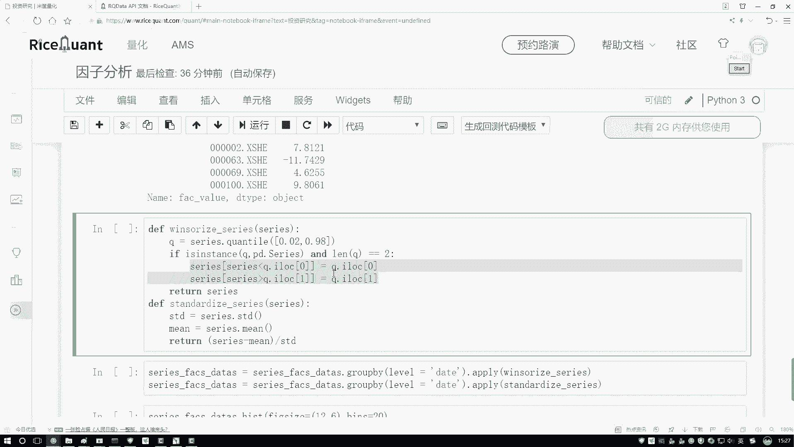

# 按日期分组并应用预处理函数
df_processed = df_transformed.groupby(level=‘date‘).apply(preprocess_data)
```

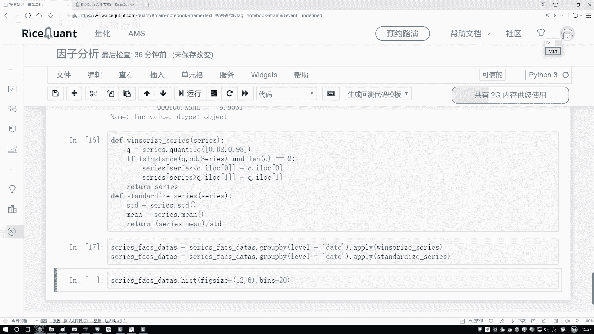

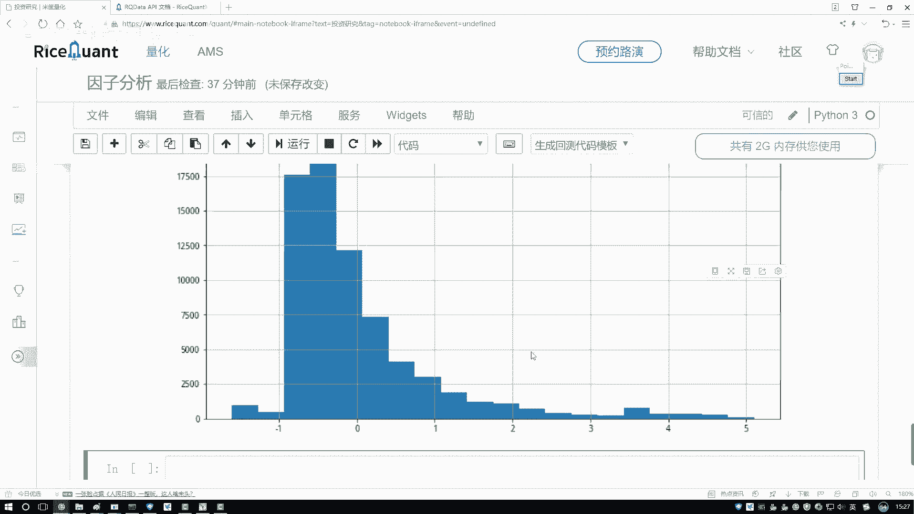

如果需要，我们还可以绘制处理前后数据的分布直方图，以直观观察预处理的效果。

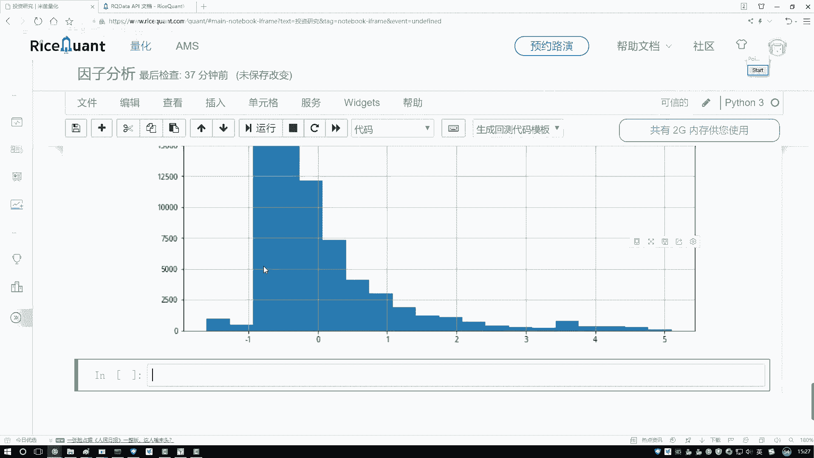

## 总结
本节课中我们一起学习了数据格式转换与预处理。我们首先了解了Alphalens工具包对输入数据的格式要求，然后通过设置多层索引将数据转换为目标格式。最后，我们介绍了去除异常值和标准化这两个关键的数据预处理步骤，为后续的因子分析做好了准备。