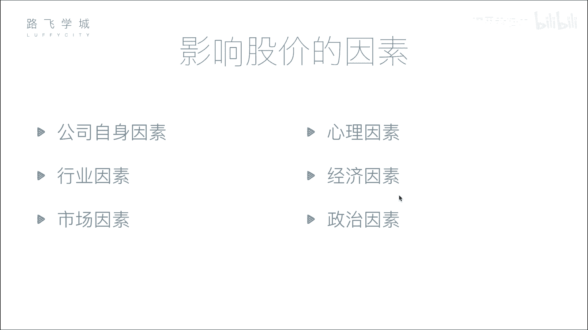
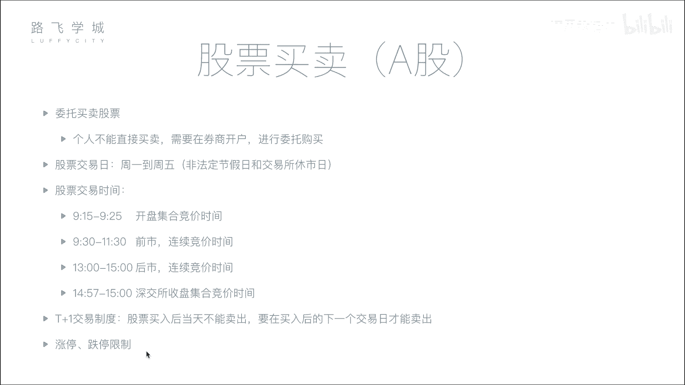

# Python金融量化分析实战：04：影响股价因素与股票买卖知识 📈

在本节课中，我们将学习影响股票价格的核心因素，并了解股票买卖的基本流程与规则。理解这些基础知识是进行量化分析的第一步。

## 影响股价的六大因素

上一节我们介绍了股票的基本概念，本节中我们来看看哪些因素会影响股票价格的波动。影响股价的因素可以归纳为以下六点。

以下是影响股价的六大因素：

1.  **公司自身因素**：这是影响股价最根本的因素。公司的经营状况、盈利能力、发展前景以及重大事件（如丑闻）都会直接影响其股票价值。公式上，股价长期反映公司内在价值。
2.  **市场因素**：这是影响股价最直接的因素。短期内，股价由买卖双方的供需关系决定。买盘多于卖盘（供不应求）则价格上涨；反之则价格下跌。
3.  **行业因素**：整个行业的发展趋势会影响行业内所有公司。例如，一个蓬勃发展的行业（如人工智能）会带动相关公司股价上涨；而一个衰退的行业则可能导致股价普遍下跌。
4.  **心理因素**：投资者的情绪和非理性行为会影响股价，例如从众心理。历史上曾因程序错误或恐慌性抛售导致市场大幅波动。
5.  **经济因素**：国家层面的宏观经济政策会影响股价，例如利率调整。存款利率上升可能促使资金从股市流向银行，导致股市资金减少，股价承压。
6.  **政治因素**：国际关系、地区局势等政治事件会引发市场波动。例如，地缘政治紧张可能引发投资者避险情绪，导致股市下跌，但可能刺激军工等特定板块上涨。

## 股票买卖流程与规则

了解了影响价格的因素后，我们来看看在实际市场中买卖股票需要遵循哪些流程和规则。

以下是股票买卖的关键步骤与概念：

1.  **开户与委托**：个人投资者不能直接进入交易所交易，必须通过证券公司（券商）开户。买卖股票的操作称为“委托”。
2.  **股票交易日**：交易所并非全天候开放。交易日通常为周一到周五（非法定节假日）。
3.  **交易时间**：在每个交易日内，交易也分阶段进行。以上海/深圳证券交易所为例：
    *   **开盘集合竞价 (9:15 - 9:25)**：此期间提交的买卖委托不会立即成交，而是在9:25一次性集中撮合，以产生当日的**开盘价**。核心原则是最大化成交量。
    *   **连续竞价 (9:30 - 11:30, 13:00 - 14:57)**：此期间交易系统对买卖委托进行连续、高频的撮合，投资者可实时成交。
    *   **收盘集合竞价 (仅深圳，14:57 - 15:00)**：深圳交易所在最后3分钟再次采用集合竞价方式，以产生**收盘价**。上海交易所的收盘价为最后一笔连续竞价的成交价。
4.  **T+1制度**：当天买入的股票，需要到下一个交易日才能卖出。
5.  **涨跌停板限制**：为防止股价过度波动，A股市场设有涨跌幅限制（通常为±10%），股价在单个交易日内波动不得超过此范围。

本节课中我们一起学习了影响股票价格的六大核心因素（公司、市场、行业、心理、经济、政治），并掌握了股票买卖的基本流程、交易时间规则以及T+1、涨跌停板等重要制度。这些是构建量化交易策略所必需的基础知识。