# 量化交易完全可自学教程：P5：突变点调参

## 概述
在本节课中，我们将学习如何调整 Prophet 模型中的关键参数——突变点权重（`changepoint_prior_scale`），并观察其对模型预测结果的影响。我们将通过实验对比不同参数值下的模型表现，学习如何评估和选择最优参数。

---

## 突变点权重参数详解

上一节我们介绍了 Prophet 模型的基本使用，本节中我们来看看一个核心参数——突变点权重。

突变点权重（`changepoint_prior_scale`）参数指定了模型对趋势突变点的重视程度。其含义是：**该参数值越大，模型在拟合数据时，会赋予突变点更高的权重，从而更倾向于捕捉数据中的剧烈变化**。

### 参数影响分析
以下是该参数对模型行为的影响：

*   **参数值较大**：模型会更努力地拟合训练数据中的每一个波动和突变点。这可能导致模型在训练集上表现非常好（拟合度高），但也带来了较高的**过拟合**风险。过拟合意味着模型过于“记忆”训练数据的细节，而在未见过的测试数据上表现可能变差。
*   **参数值较小**：模型对突变点不敏感，趋势线会更加平滑和保守。这可能导致模型无法充分捕捉数据中的重要变化模式，从而产生**欠拟合**问题，即模型未能学习到数据中的关键规律。

Prophet 框架中，该参数的默认值为 `0.05`，这是一个相对较小的值，表明模型默认对突变点持保守态度。

---

## 实验：对比不同权重值的效果

为了直观理解参数的影响，我们进行一个实验。我们将使用四组不同的 `changepoint_prior_scale` 值来训练模型，并对比它们的预测结果。

以下是实验使用的四组参数值：`0.001`， `0.05` (默认值)， `0.1`， `0.2`。

### 实验代码流程
以下是实验的核心代码逻辑：

```python
# 1. 准备历史数据（例如2015-2017年的股票数据）
history = df[df[‘ds‘] < ‘2018-01-01‘]

# 2. 定义要测试的参数列表
cp_scale_list = [0.001, 0.05, 0.1, 0.2]
predictions = [] # 用于存储每个模型的预测结果

# 3. 循环使用不同参数建立并训练模型
for scale in cp_scale_list:
    # 创建模型实例，并设置当前要测试的参数
    model = Prophet(changepoint_prior_scale=scale)
    model.fit(history)
    
    # 创建未来时间帧（例如预测未来180天）
    future = model.make_future_dataframe(periods=180)
    
    # 进行预测
    forecast = model.predict(future)
    predictions.append(forecast) # 保存预测结果

# 4. 可视化对比
# 首先绘制真实观测值（黑色）
plt.plot(history[‘ds‘], history[‘y‘], ‘k.‘, label=‘Observed‘)

# 然后循环绘制每个模型的预测趋势线
colors = [‘blue‘, ‘red‘, ‘grey‘, ‘yellow‘]
for i, fcst in enumerate(predictions):
    plt.plot(fcst[‘ds‘], fcst[‘yhat‘], color=colors[i], linewidth=1.5, 
             label=f‘CP Scale={cp_scale_list[i]}‘)

plt.legend()
plt.show()
```

### 实验结果分析
运行上述代码后，我们会得到一张包含多条预测曲线的图。

*   **蓝色线 (CP=0.001)**：权重极小。其预测趋势非常平滑，几乎是一条直线，完全忽略了训练数据中的多个明显突变点（如大幅下跌）。这是一个典型的**欠拟合**例子，模型过于保守。
*   **红色线 (CP=0.05)**：默认权重。相比蓝色线，它更好地捕捉到了一些主要趋势变化，但依然比较保守，对某些突变的反应不够充分。
*   **灰色和黄色线 (CP=0.1, 0.2)**：权重较大。这两条线，尤其是黄色线，几乎完美地穿过了训练数据的所有波动点，对突变点的拟合非常紧密。这表明模型**高度关注训练数据的细节**。

通过对比蓝色线和黄色线，可以清晰地看到 `changepoint_prior_scale` 参数对模型拟合能力的巨大影响：从小权重下的欠拟合，到大权重下的紧密拟合（可能过拟合）。

---

## 模型评估与参数选择

仅仅观察拟合曲线不够，我们需要量化评估不同参数下模型的预测性能，特别是对**未来未知数据**的预测能力。

### 评估指标
我们通常关注两个误差：
1.  **训练误差 (Train Error)**：模型在训练数据上的预测误差。
2.  **测试误差 (Test Error)**：模型在预留的、未参与训练的未来数据上的预测误差。对于时间序列预测，**测试误差更为关键**。

### 评估结果
我们对四组参数进行计算，得到如下趋势（数值为示意）：

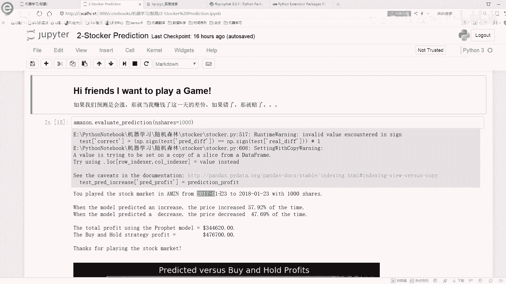

| CP 值 | Train Error | Test Error |
| :---- | :---------- | :--------- |
| 0.001 | 较高        | 最高       |
| 0.05  | 中等        | 较高       |
| 0.1   | 较低        | 较低       |
| 0.2   | **最低**    | **最低**   |

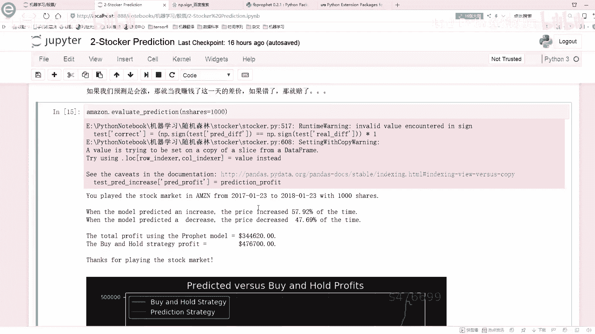

*   **规律**：随着 `changepoint_prior_scale` 值增大，训练误差持续下降，因为模型越来越贴合训练数据。
*   **关键发现**：在本例中，测试误差也随着参数增大而下降，并在 `CP=0.2` 时达到最低值 `127.60`。因此，基于测试误差最小化的原则，我们应选择 `0.2` 作为当前数据集下的较优参数。

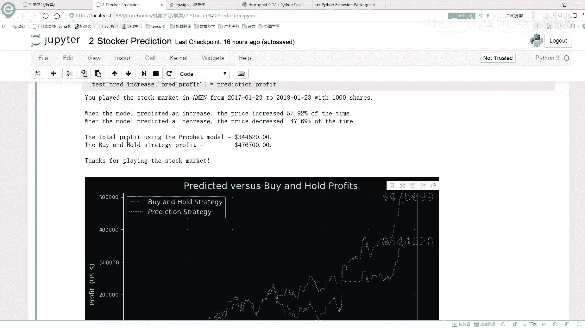

### 深入调参实验
为了找到可能更优的参数，我们可以尝试更大的值进行搜索，例如：`[0.25, 0.4, 0.6, 0.7, 0.8]`。

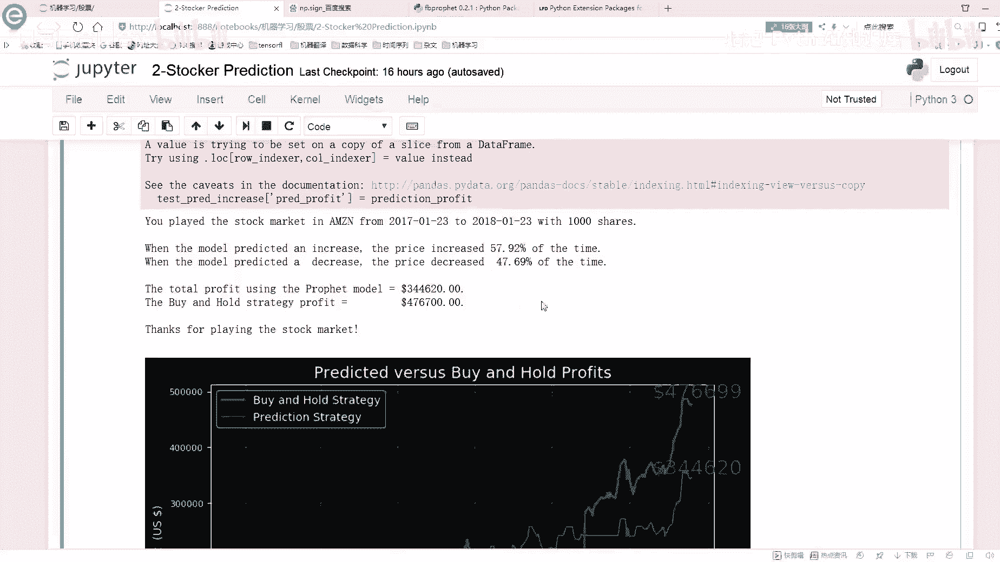

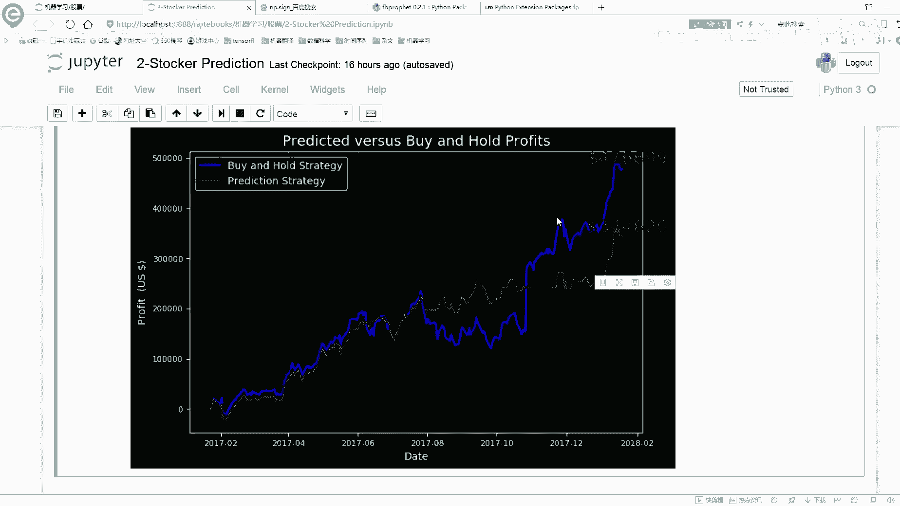

重复上述评估流程后，我们可能发现：
*   训练误差继续下降。
*   测试误差会进一步降低，在 `CP=0.7` 附近达到一个新的最低点（例如 `66`），之后趋于稳定或略有上升。

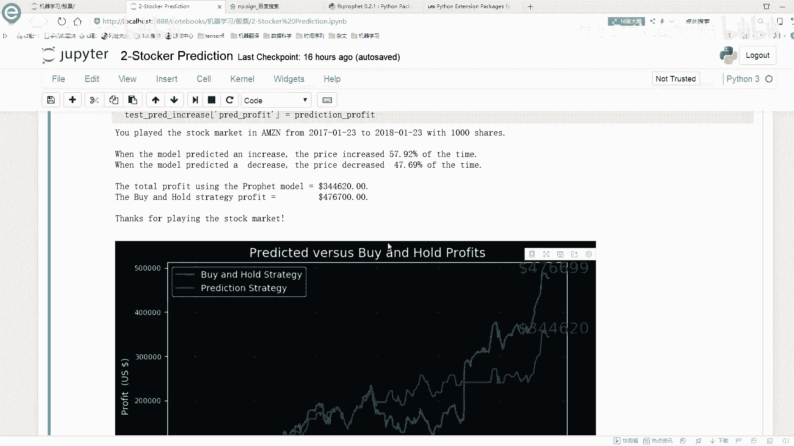

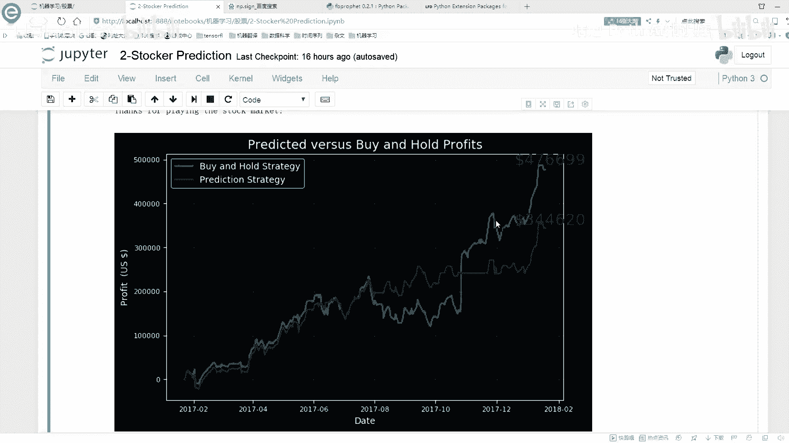

因此，经过调参，我们最终可能选择 `changepoint_prior_scale = 0.7` 作为本项目的最优参数。使用该参数重新训练模型后，在测试集上的预测误差显著减小，预测值 `1263` 与真实值 `1294` 更为接近。

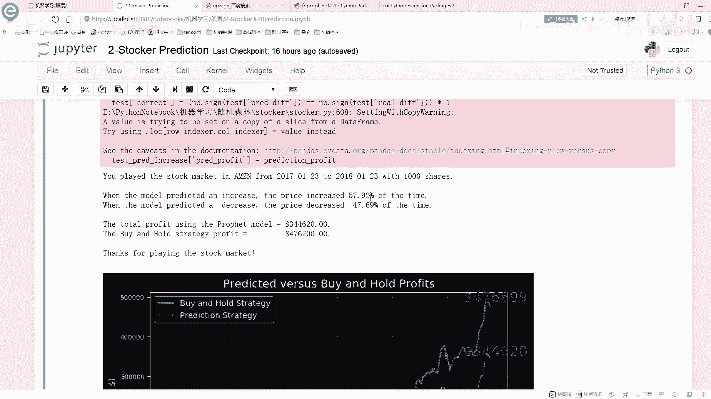

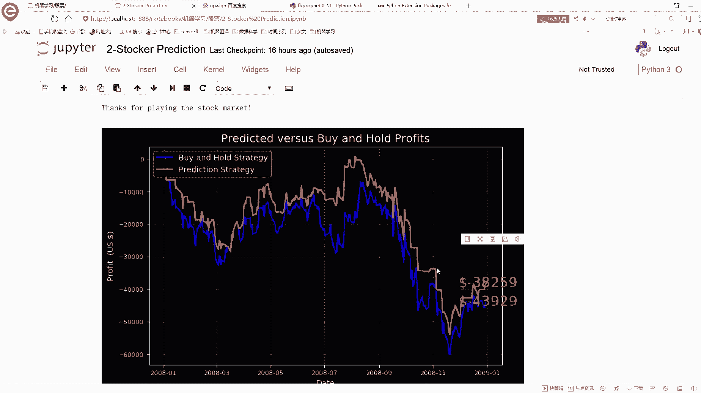

---

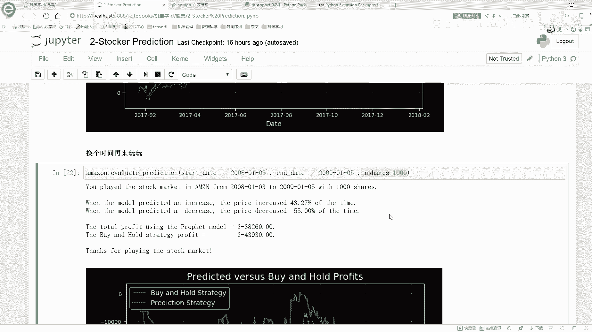

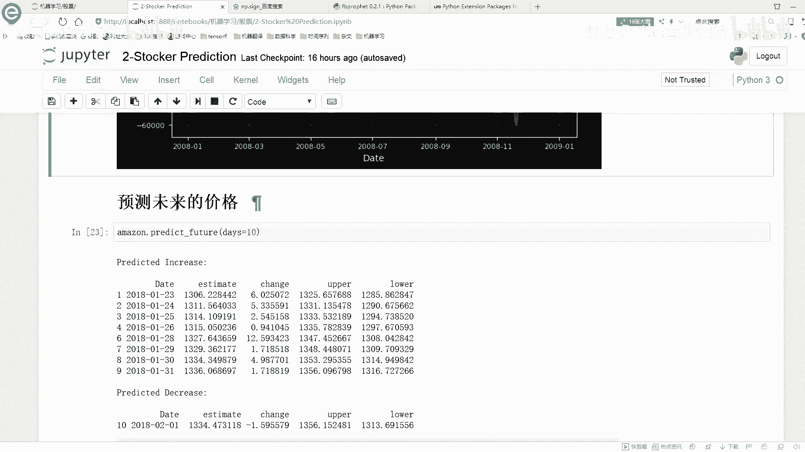

## 总结

本节课中我们一起学习了 Prophet 模型的核心调参过程。

1.  **核心参数**：我们重点探讨了 `changepoint_prior_scale`（突变点先验尺度）参数。它控制模型对趋势变化的灵活度，值越大模型越贴合数据细节，值越小模型趋势越平滑。
2.  **调参方法**：通过设置不同的参数值，分别训练模型，并对比其预测曲线和量化误差（尤其是**测试误差**），来评估参数效果。
3.  **选择标准**：以**最小化测试集上的预测误差**为主要目标来选择最优参数，以避免过拟合，确保模型具有良好的泛化能力。
4.  **持续学习**：Prophet 模型功能丰富，本节课仅概述了基本用法和核心调参。要深入了解每个组件和参数，最好的方法是结合其[官方文档](https://facebook.github.io/prophet/)进行实践，通过动手构建小案例来加深理解。

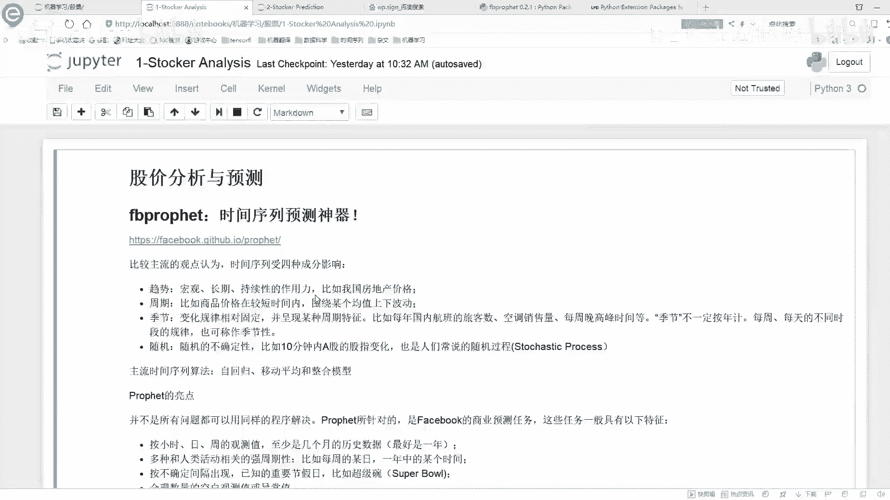

通过本节的调参实践，你掌握了优化 Prophet 模型预测性能的一个关键技能。记住，没有放之四海而皆准的参数，最优值取决于你的具体数据。