# 量化交易完全可自学教程：P86：34. 33.35.5-策略效果评估分析P35 📊

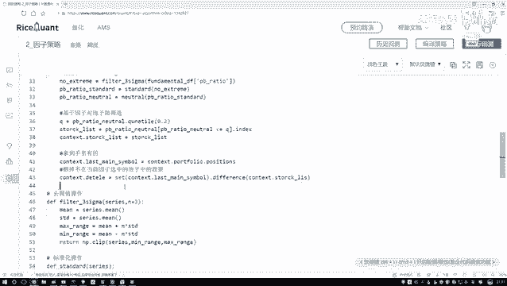

## 概述
在本节课中，我们将学习如何为一个基于因子的选股策略编写完整的调仓逻辑，并运行回测以评估其效果。我们将重点关注策略的构建步骤、代码实现细节以及如何解读回测结果。

---

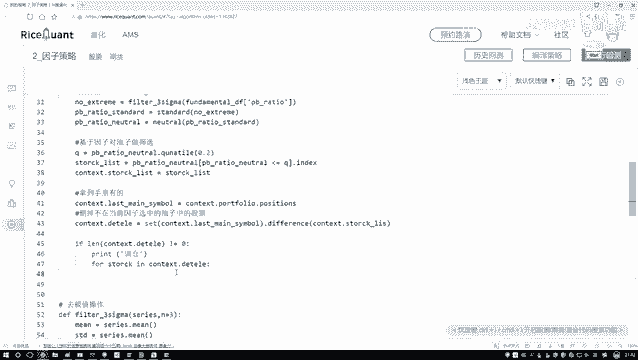

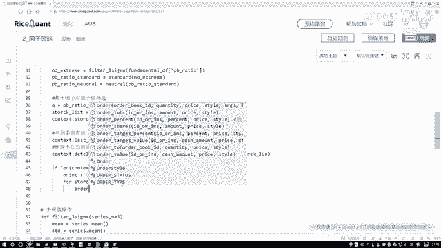

## 策略逻辑与代码实现

上一节我们介绍了因子选股的基本概念，本节中我们来看看如何将筛选逻辑转化为可执行的交易策略。

首先，我们需要在策略的初始化函数中设置一个定时器，用于定期执行调仓操作。例如，我们可以设置为每月执行一次。

```python
def initialize(context):
    # 设置每月第一个交易日执行调仓
    run_monthly(rebalance, date_rule=1)
```

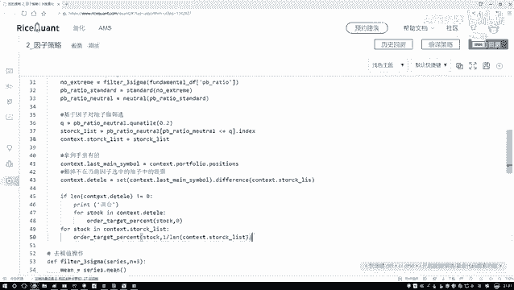

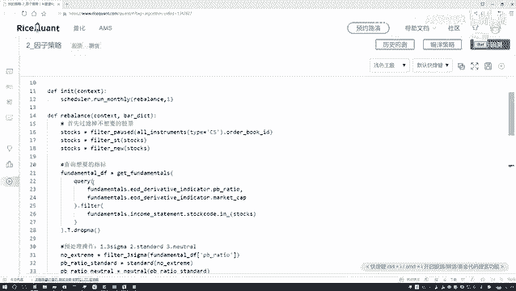

设置好定时器后，核心工作将在 `rebalance` 函数中完成。该函数的主要任务是检查当前持仓，并根据最新的因子筛选结果进行调整。

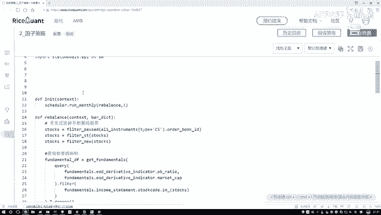

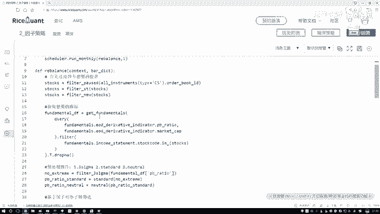

### 执行调仓判断

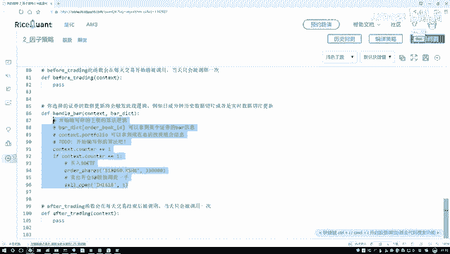

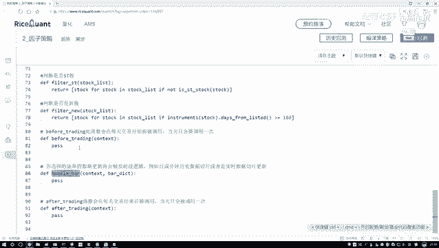

在 `rebalance` 函数中，第一步是获取根据因子（如市值、市盈率）筛选出的最新股票池。

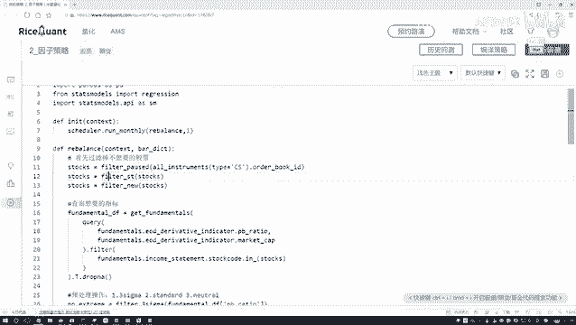

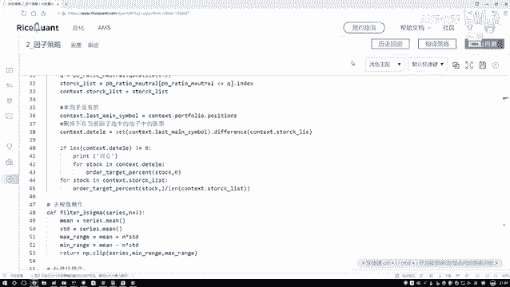

```python
# 获取经过因子筛选和预处理后的股票列表
current_pool = get_current_pool(context)
```

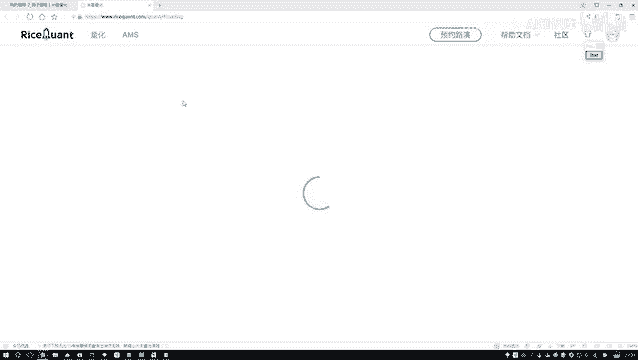

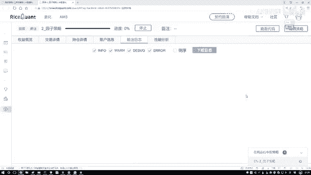

接着，我们需要判断当前持仓中是否有股票不再符合筛选条件（即不在最新的股票池中）。以下是判断和执行的步骤：

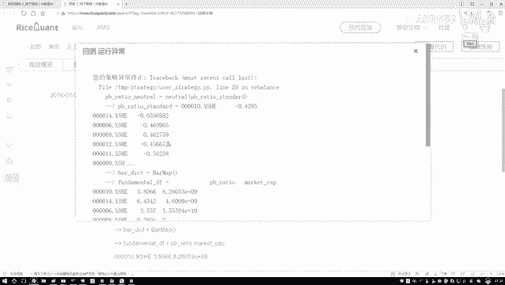

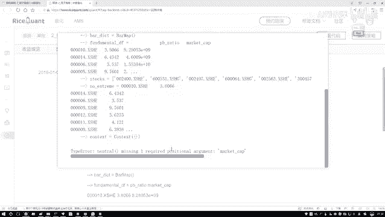

1.  **识别需要卖出的股票**：对比当前持仓与最新股票池，找出需要卖出的股票列表。
2.  **执行卖出操作**：如果存在需要卖出的股票，则进行调仓。我们可以打印一条日志以便观察。
3.  **执行买入操作**：将资金平均分配给最新股票池中的所有股票。

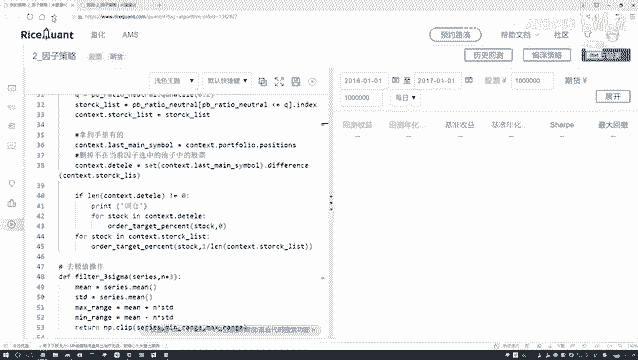

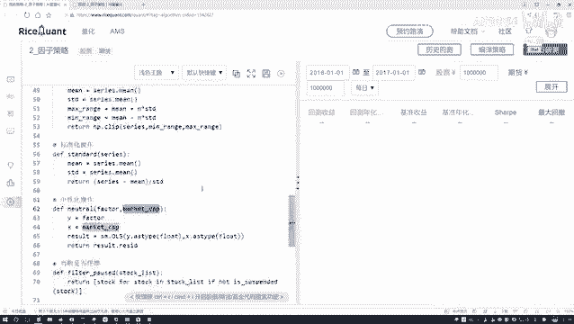

以下是调仓操作的核心代码逻辑：

```python
def rebalance(context):
    # 1. 获取最新股票池
    current_pool = get_current_pool(context)
    # 2. 找出当前持仓中不在最新池子的股票
    stocks_to_sell = [s for s in context.portfolio.positions if s not in current_pool]

    if len(stocks_to_sell) > 0:
        # 打印调仓日志
        log.info(f"执行调仓，卖出股票: {stocks_to_sell}")
        # 3. 卖出不在池子中的股票
        for stock in stocks_to_sell:
            order_target_percent(stock, 0)  # 将持仓比例调整为0，即清仓

        # 4. 买入最新股票池中的所有股票（等权重配置）
        for stock in current_pool:
            order_target_percent(stock, 1.0 / len(current_pool))
```

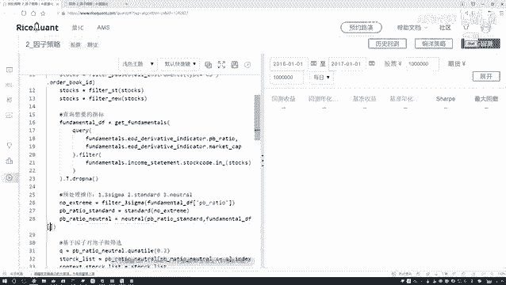

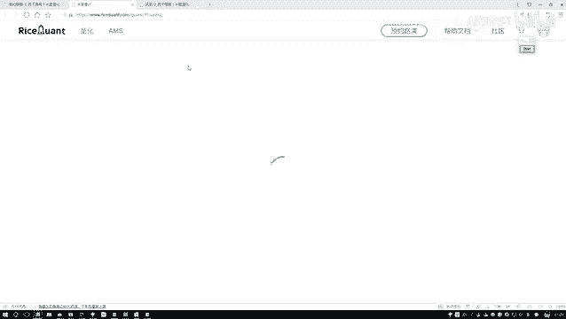

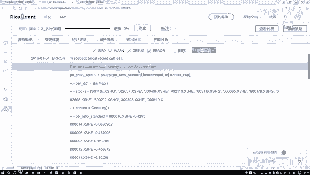

这样，我们就完成了每月一次的调仓逻辑：卖出不符合条件的旧股票，并等权重买入符合条件的新股票。

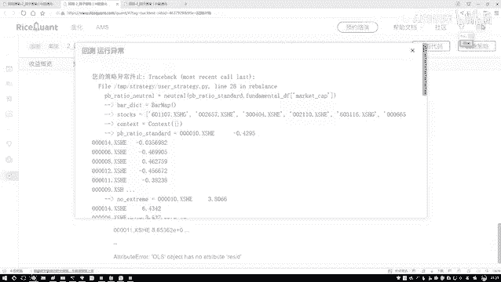

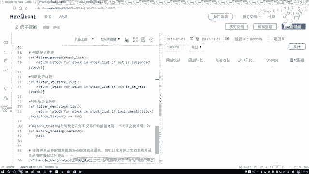

---

## 代码调试与运行

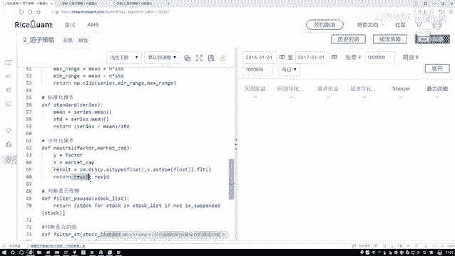

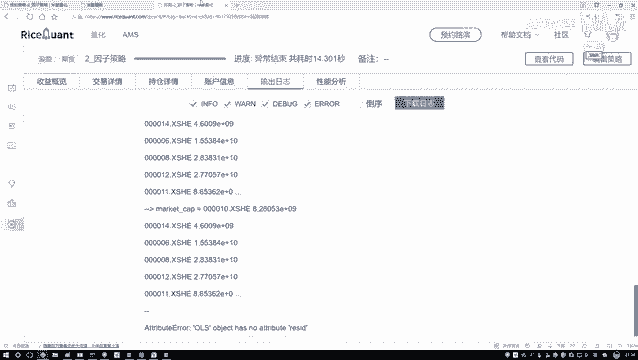

在编写完整策略时，难免会遇到各种错误。我们需要逐步调试，确保代码能够正确运行。

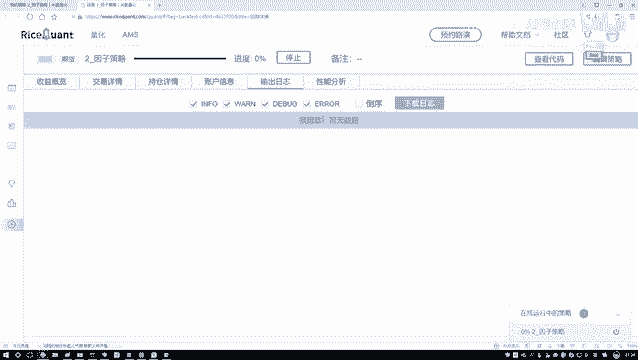

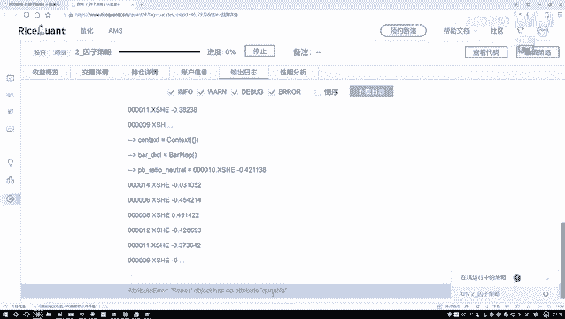

### 常见错误与修正

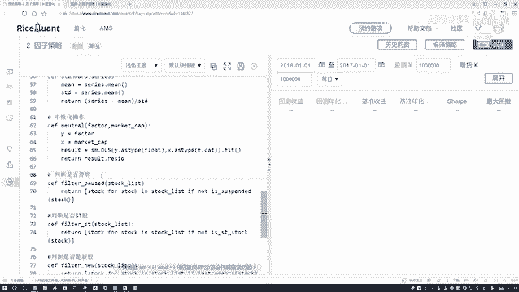

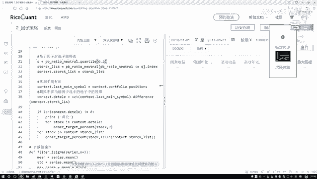

首次运行策略时，可能会遇到以下问题：

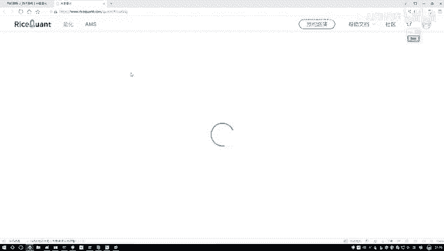

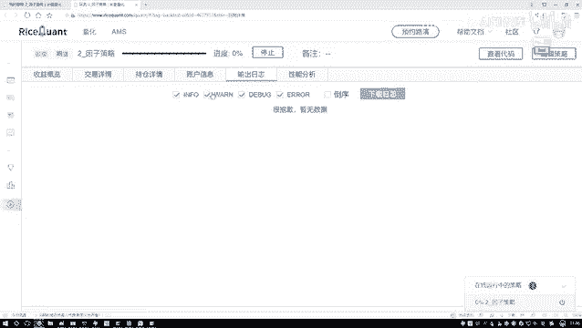

1.  **函数参数缺失**：例如，在中性化处理函数中，可能漏传了必要的参数（如因子列名）。需要检查函数调用并补全参数。
    ```python
    # 错误示例：缺少列名参数
    # neutralized_data = neutralize(factor_data)
    # 正确示例
    neutralized_data = neutralize(factor_data, column_name='target_factor')
    ```

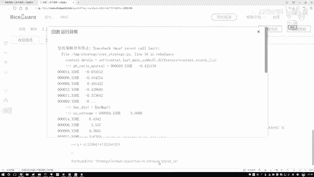

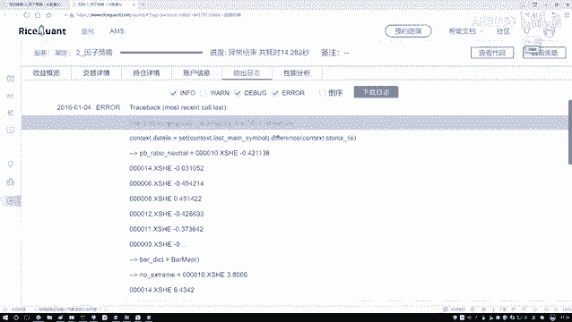

2.  **拼写错误**：变量名或函数名拼写错误是常见问题。例如，将 `quantile` 误写为 `qantile`。
    ```python
    # 错误示例
    # threshold = df['factor'].qantile(0.3)
    # 正确示例
    threshold = df['factor'].quantile(0.3)
    ```

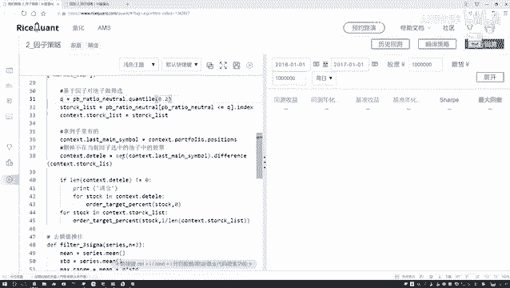

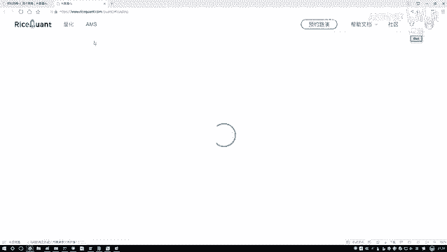

3.  **未定义的变量**：在循环或判断中使用未提前定义的列表。需要确保所有变量在使用前都已正确初始化。
    ```python
    # 错误示例：`delete_list` 未定义
    # for stock in delete_list:
    # 正确示例：先定义列表
    delete_list = get_delete_list(context)
    for stock in delete_list:
    ```

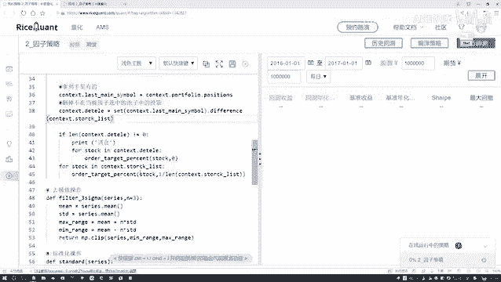

通过逐一修正这些错误，代码最终可以通过编译并开始执行回测。

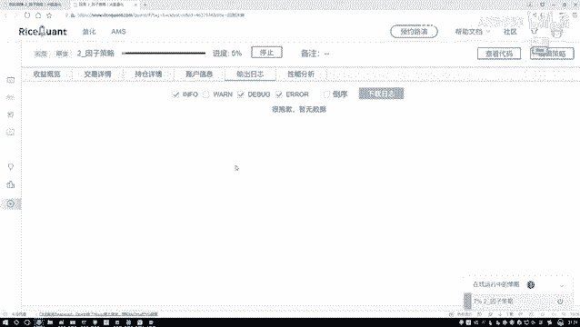

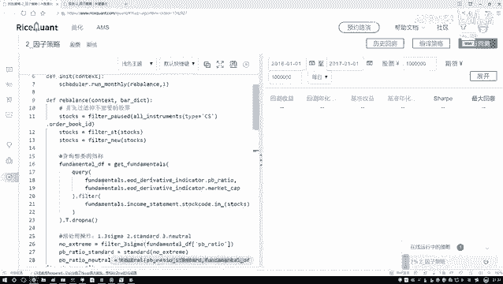

---

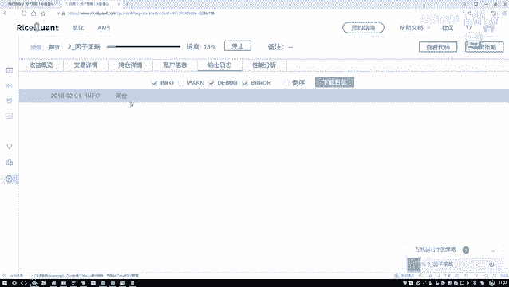

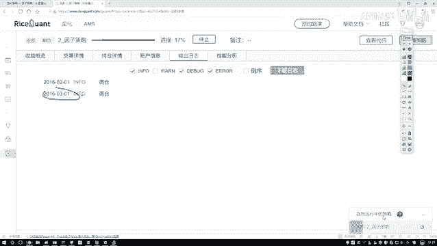

## 回测结果分析

当策略代码成功运行后，我们将进入回测阶段。回测会模拟策略在历史数据上的表现。

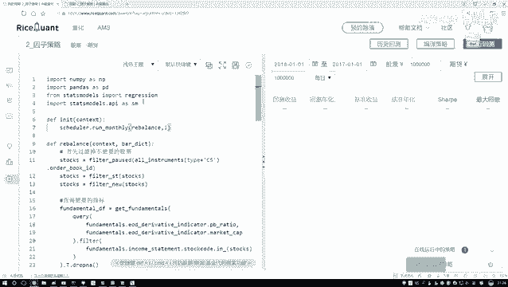

### 观察运行过程

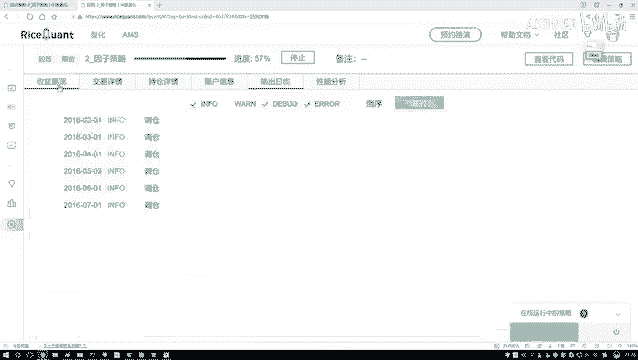

在回测运行时，我们可以通过日志观察调仓是否按计划执行（例如每月初）。同时，关注进度条可以了解回测完成的大致时间。

```python
# 日志输出示例
# 信息：2024-02-01 执行调仓，卖出股票: ['000001.XSHE']
# 信息：2024-03-01 执行调仓，卖出股票: []
```

### 解读绩效指标

回测结束后，会生成一系列绩效指标用于评估策略效果。我们需要关注以下几个核心指标：

以下是关键绩效指标的解读：

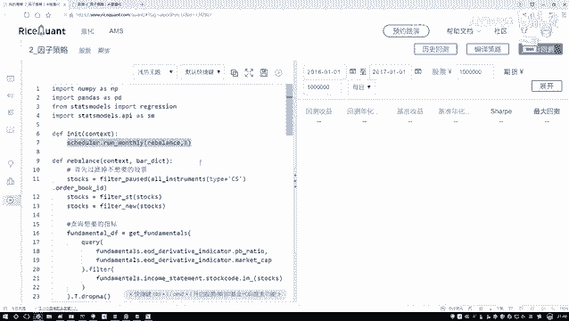

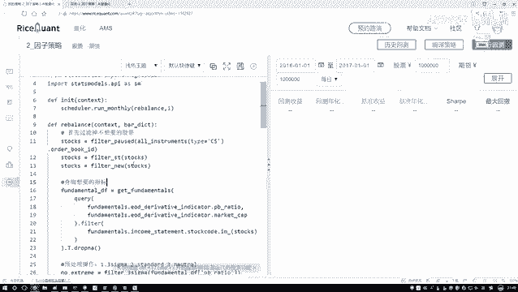

*   **年化收益率**：策略在一年内获得的平均收益率。正收益优于负收益。
*   **基准年化收益率**：比较基准（如沪深300指数）在同一时期的收益率。策略收益应优于或与基准持平。
*   **夏普比率**：衡量每承受一单位风险所获得的超额回报。比率越高，风险调整后收益越好。
*   **最大回撤**：策略净值从高点下降到低点的最大幅度。回撤越小，策略控制风险的能力越强。

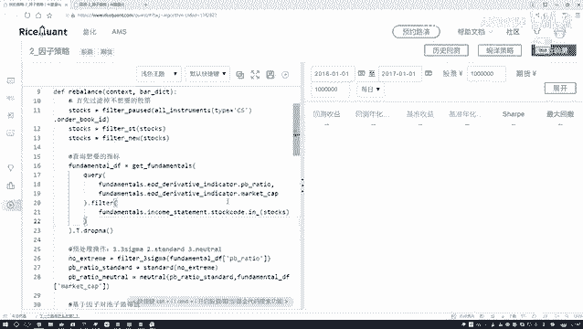

一个理想的策略通常表现为：**年化收益率高于基准，夏普比率较高，同时最大回撤控制在可接受范围内**。在本例的回测中，策略收益虽然不高，但在某些阶段表现优于基准，这证明了因子筛选逻辑具有一定的有效性。

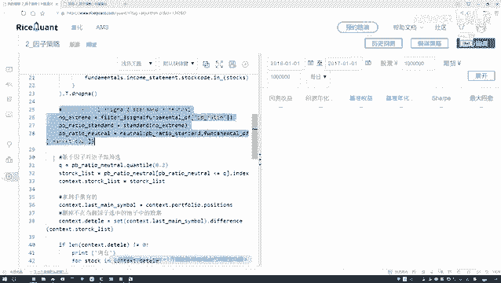

---

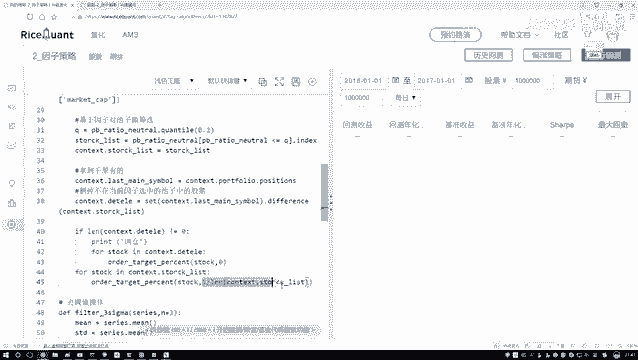

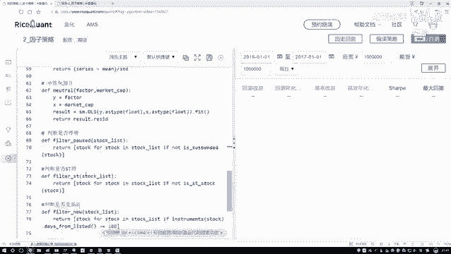

## 策略流程总结

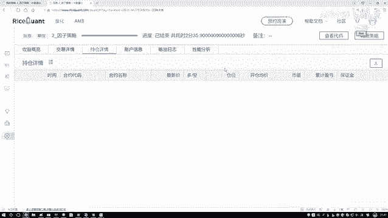

本节课中我们一起学习了构建并运行一个完整因子选股策略的全过程。我们来回顾一下核心步骤：

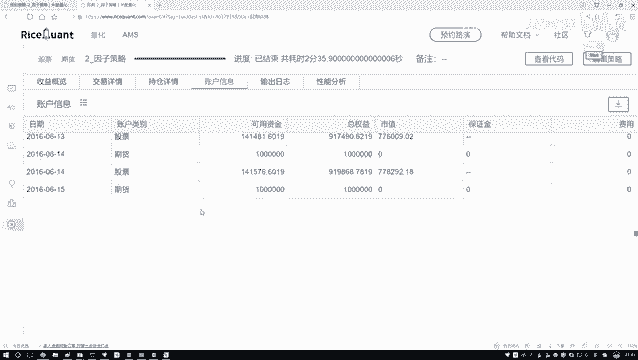

1.  **初始化与定时**：在 `initialize` 中设置定期调仓的频率。
2.  **因子获取与预处理**：在 `rebalance` 中，获取股票因子数据，并进行必要的处理（如中性化、去极值）。
3.  **股票筛选**：根据因子值（如选择低市值、低市盈率的股票）筛选出目标股票池。
4.  **持仓调整**：
    *   卖出当前持仓中不在新股票池的股票。
    *   将资金等权重分配给新股票池中的所有股票。
5.  **回测与评估**：运行回测，通过年化收益、夏普比率、最大回撤等指标评估策略历史表现。

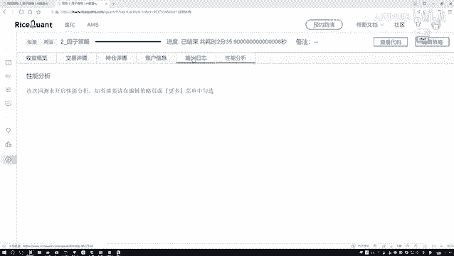

这个流程提供了一个清晰的框架。大家可以根据自己的研究，替换不同的因子、调整筛选条件或调仓频率，来开发和测试更多样化的量化策略。记住，回测是验证想法的工具，实际市场表现可能更加复杂。