# 量化交易完全可自学教程：P89：37. 获取因子指标数据

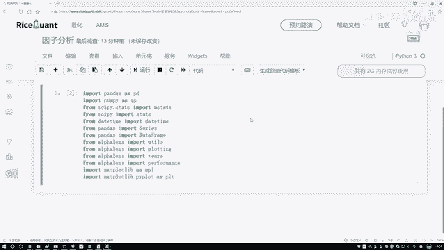

## 概述
在本节课中，我们将学习如何使用Python工具包获取指定时间段内的股票因子指标数据。我们将从获取交易日列表开始，然后构建查询语句，最终获取并查看特定因子（如市盈率PE）在选定股票池中的数值。

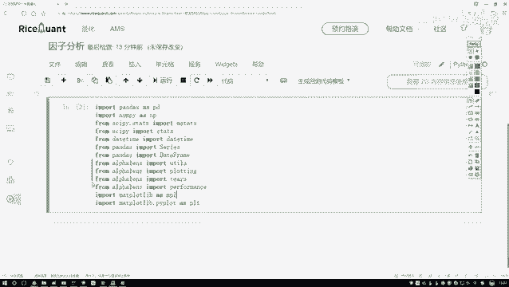

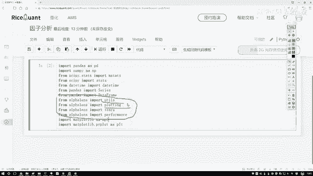

---

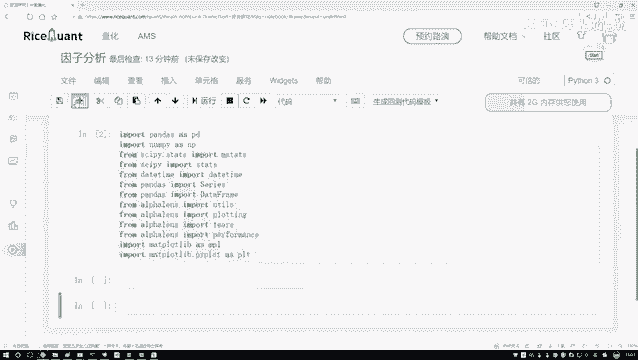

## 工具包导入与准备
上一节我们完成了所有必要工具包的导入。本节中，我们将使用这些工具来完成因子分析任务。

在代码中，我们导入了几个核心模块：
*   `utils` 模块用于后续的数据处理。
*   `plotting` 模块用于绘图。
*   下方两个模块则用于后续的分析工作。

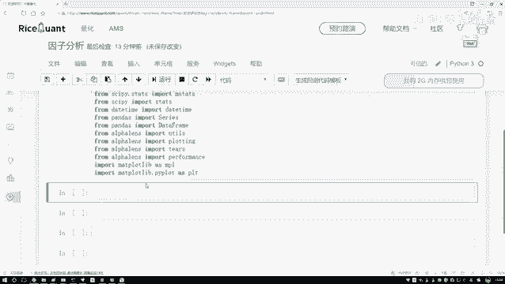

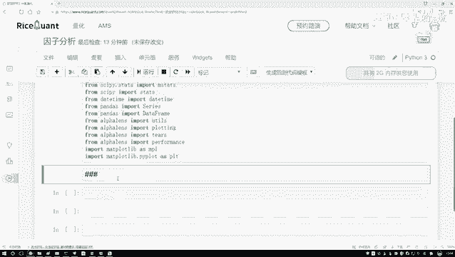

现在，我们开始编写代码。首先需要明确，当前的因子分析模块与之前的回测框架不同。回测框架中有 `handle_bar` 函数可以每日自动执行操作，但当前模块没有类似功能。

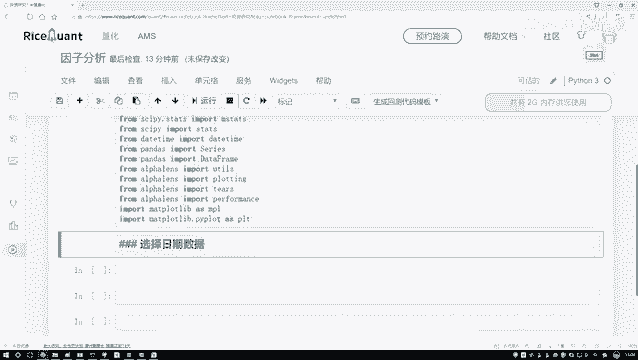

因此，我们需要手动编写代码来获取数据，而不是依赖框架每日自动获取。

---

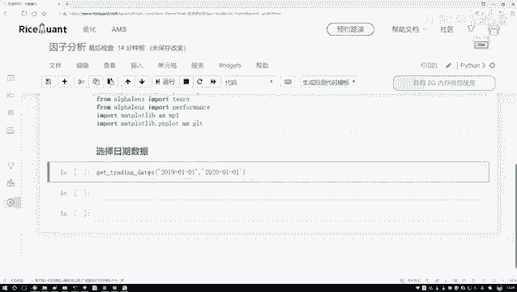

## 第一步：获取交易日列表
首先，我们需要选择一个日期范围。因为后续查询数据时，必须传入具体的日期参数才能得到相应的结果。

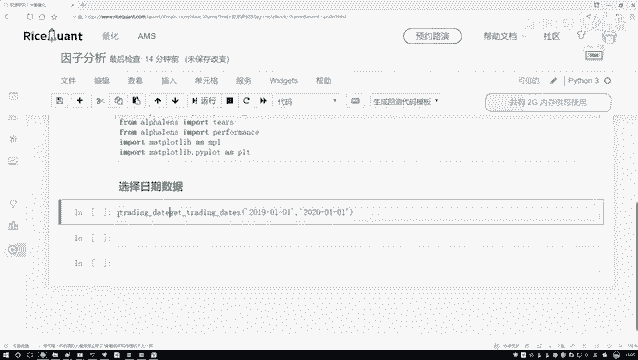

以下是获取交易日列表的函数。该函数接收两个参数：起始日期和结束日期。

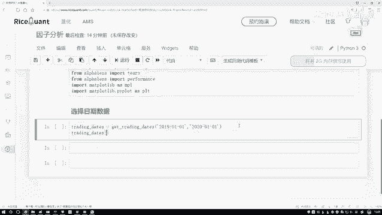

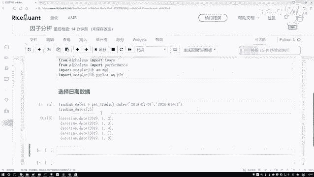

```python
# 获取指定时间段内的所有交易日日期
trading_dates = get_trading_dates('2019-01-01', '2020-01-01')
```

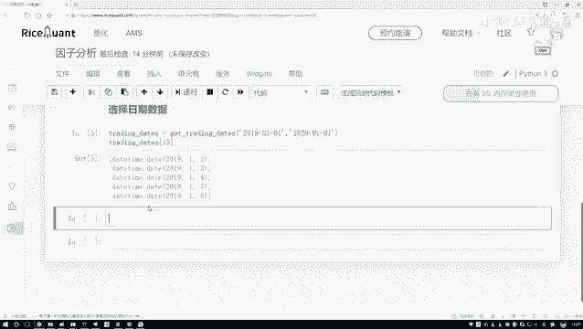

执行这段代码后，变量 `trading_dates` 将包含从2019年1月1日到2020年1月1日之间的所有交易日。建议每完成一步都检查一下结果，确保操作正确。

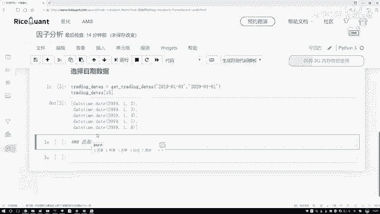

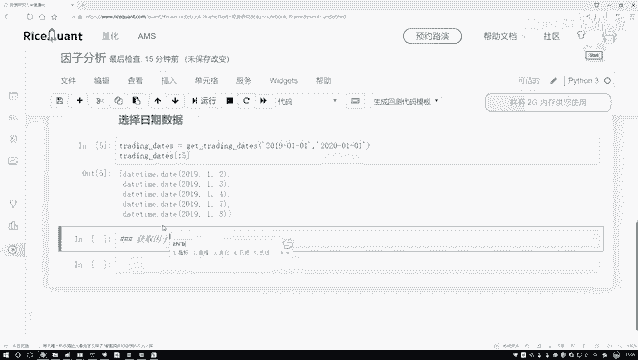

至此，我们已成功获取了所需时间段内的所有交易日列表。

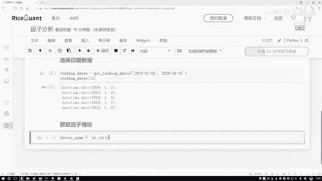

---

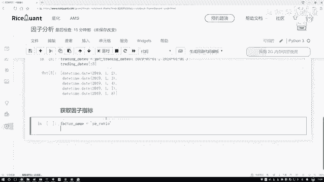

## 第二步：构建股票池并查询因子数据
接下来，我们需要获取具体的因子指标数据。这需要通过查询操作来完成。

首先，需要确定要查询的因子名称。本例中，我们选择市盈率（`PE`）作为示例因子。你可以根据需要替换为其他因子。


然后，我们需要确定查询的股票范围。这里不做过多限制，我们直接获取沪深300指数（`000300`）的所有成分股作为我们的股票池。

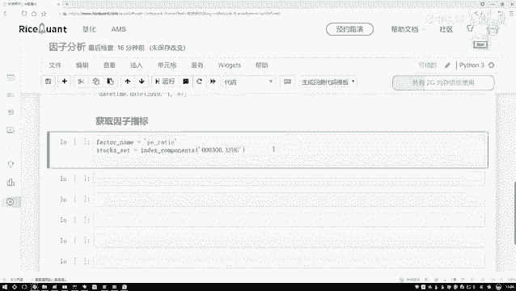

```python
# 获取股票池，这里以沪深300指数成分股为例
stock_pool = get_index_stocks('000300')
```

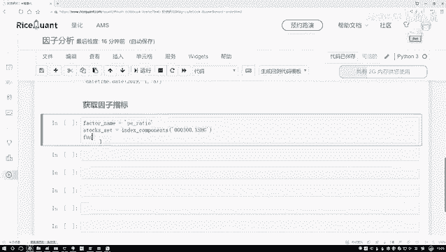

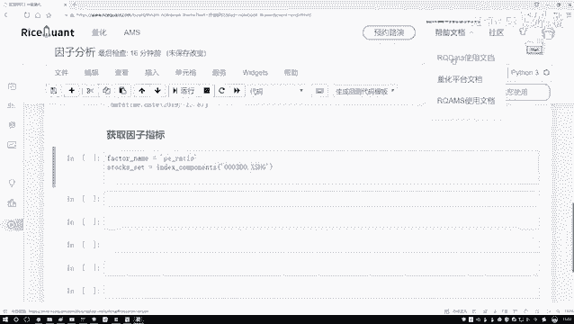

有了股票池之后，就可以构建查询语句了。我们需要基于 `fundamentals` 模块来查询指定因子的数据。

由于查询语句较长，我们可以参考平台的API帮助文档。以下是一个查询市盈率（`PE`）指标的示例语句：

```python
# 构建查询语句，查询PE指标，并筛选出属于我们股票池的股票
q = query(fundamentals.eod_derivative_indicator.pe_ratio
         ).filter(fundamentals.eod_derivative_indicator.code.in_(stock_pool))
```

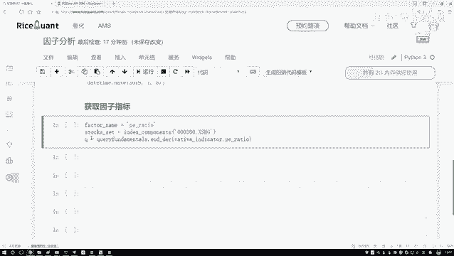

这段代码的含义是：查询 `fundamentals.eod_derivative_indicator.pe_ratio`（市盈率）这个字段，并且筛选出股票代码在我们定义的 `stock_pool` 中的记录。

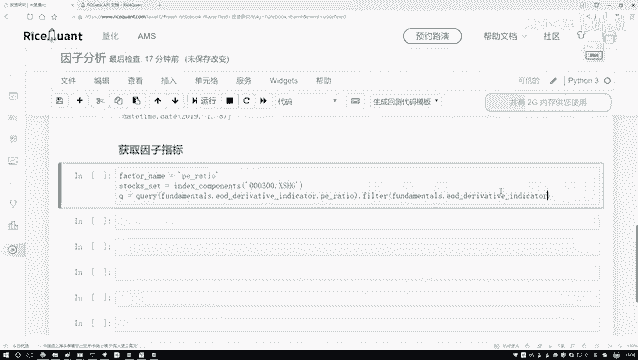

构建好查询语句 `q` 之后，需要执行查询才能获取数据。

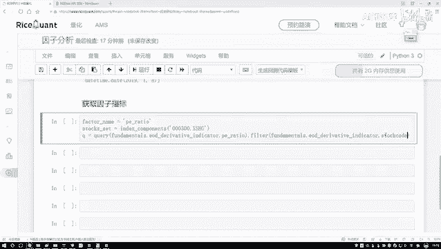

---

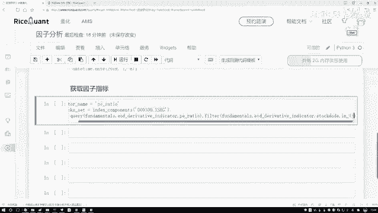

## 第三步：执行查询并获取数据
我们另起一行来执行查询操作。执行查询时，除了传入查询语句 `q`，还需要指定具体的查询日期。

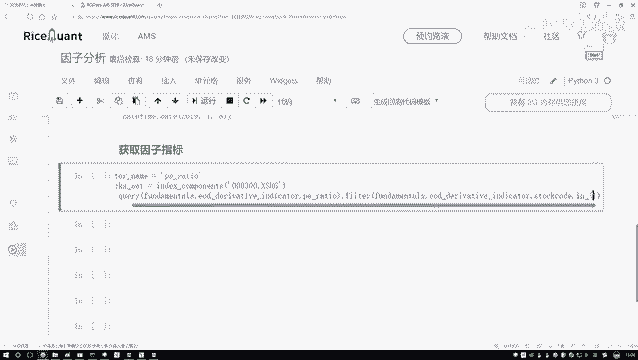

```python
# 执行查询，获取指定日期的因子数据
# 这里我们先尝试查询交易日列表中的第一天（索引为0）的数据
factor_data = get_fundamentals(q, trading_dates[0])
```

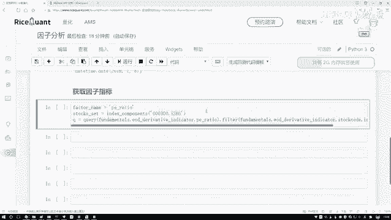

这里，我们查询了 `trading_dates` 列表中的第一个日期（即2019年1月2日）的数据。执行后，结果将存储在 `factor_data` 变量中。

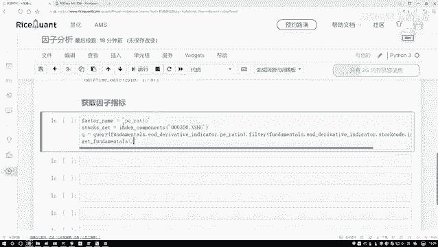

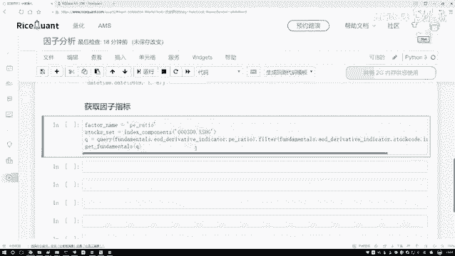

平台可能返回一些警告信息，这些通常与平台自身有关，可以暂时忽略。我们重点查看获取到的数据。

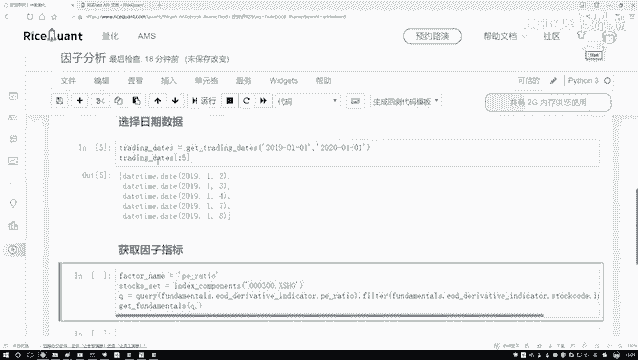

---

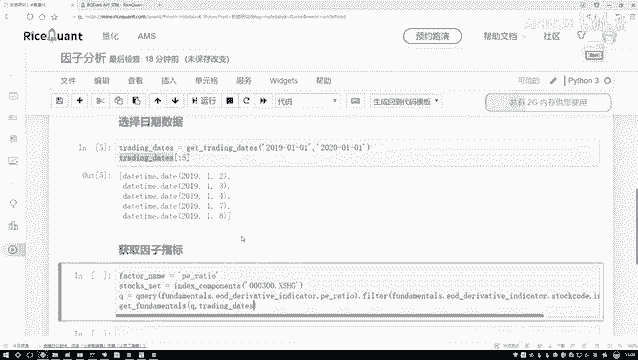

## 第四步：查看与分析数据
现在，我们来查看一下获取到的数据。首先，可以查看数据的形状（`shape`）。

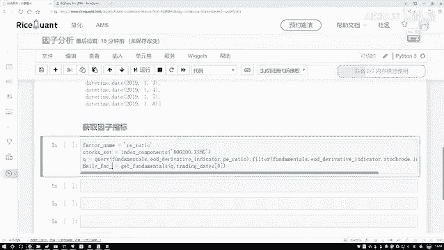

```python
# 查看数据的维度
print(factor_data.shape)
```

你可能会发现数据的形状是三维的，例如 `(1, 1, n)`。通常只有最后一个维度（`n`）包含了实际的股票数据，前两个维度可以暂时忽略。

接着，我们可以查看具体的前几条数据内容：

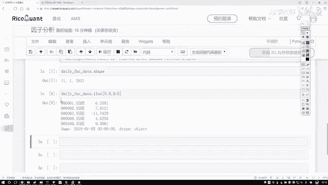

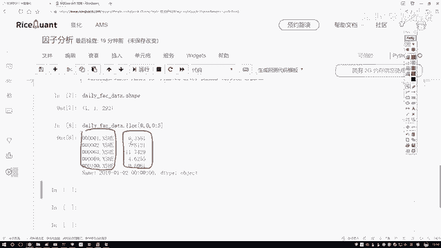

```python
# 查看前5条具体数据
print(factor_data.iloc[0, 0, :5])
```

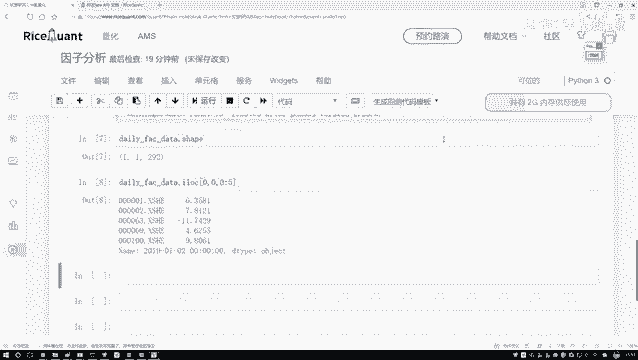

输出将显示股票代码及其对应的市盈率数值。注意，因为我们在查询时只指定了某一天（2019年1月2日），所以结果中不包含日期列，所有数据都是针对这一天的。

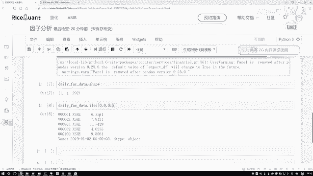

---

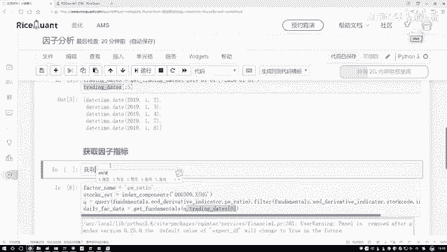

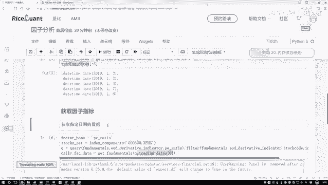

## 总结
本节课中，我们一起学习了如何手动获取因子指标数据，主要步骤如下：
1.  **获取交易日列表**：使用 `get_trading_dates` 函数确定分析的时间范围。
2.  **构建股票池**：使用 `get_index_stocks` 等函数确定要分析的股票集合。
3.  **构建查询语句**：使用 `query` 和 `filter` 方法指定要查询的因子和股票范围。
4.  **执行查询**：使用 `get_fundamentals` 函数，传入查询语句和具体日期，获取数据。
5.  **查看数据**：通过 `.shape` 和 `.iloc` 等方法查看数据的结构和具体内容。

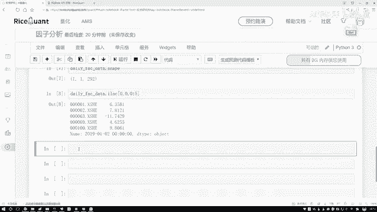

目前，我们完成了获取**指定单日**因子数据的操作。接下来的任务是，如何将这一过程扩展到整个时间段，获取每一天的因子数据并进行后续分析。