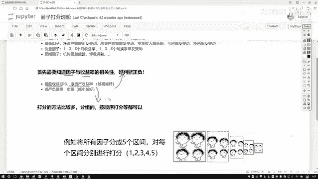
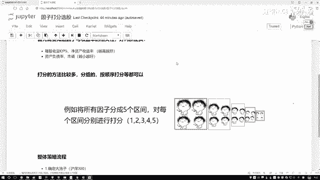
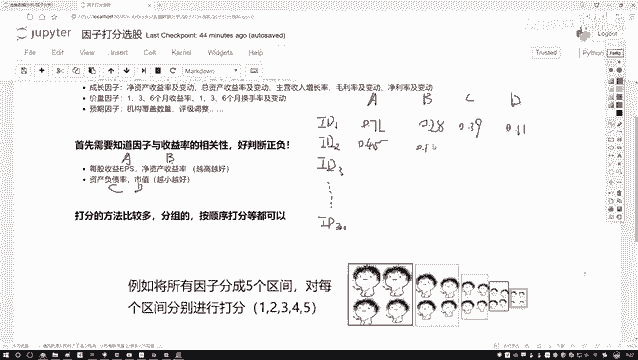
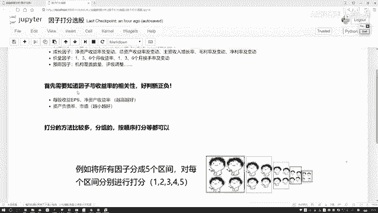
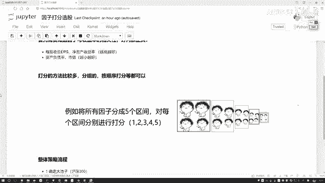
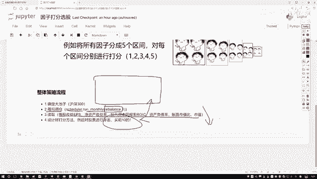
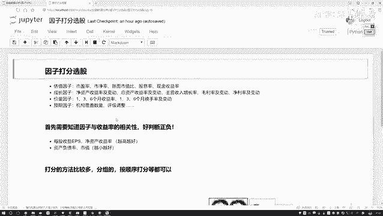

# 量化交易完全可自学教程：P96：44. 整体任务流程梳理

## 概述
在本节课中，我们将学习量化交易策略中的一个核心环节：**因子打分法**。我们将了解如何根据多个财务或技术指标，对一篮子股票（如沪深300成分股）进行综合评分和排序，从而筛选出最具潜力的投资标的。整个过程将从数据准备开始，逐步讲解打分、汇总和选股的完整流程。

---

## 因子打分法详解

上一节我们介绍了如何获取和预处理股票数据。本节中，我们来看看如何利用这些数据对股票进行综合评价，即“打分”。

打分的方法有很多种。我们将通过一个具体的例子来演示一种常见且直观的区间打分法。

以下是构建示例数据表的步骤：
*   **股票ID**：代表不同的股票，例如从ID1到ID300，对应沪深300的成分股。
*   **评价指标**：我们设定四个指标，分别记为A、B、C、D。
*   **指标方向**：
    *   指标A和B是 **越大越好** 的（例如收益率、增长率）。
    *   指标C和D是 **越小越好** 的（例如负债率、市值——在某些策略中，小市值股票可能更具潜力）。
*   **指标数值**：每个股票在每个指标上都有一个经过预处理（如归一化）后的数值，范围通常在0到1之间。

假设我们有两个股票的部分数据如下：

| 股票ID | 指标A | 指标B | 指标C | 指标D |
| :--- | :--- | :--- | :--- | :--- |
| ID1 | 0.71 | 0.28 | 0.39 | 0.11 |
| ID2 | 0.45 | 0.17 | 0.81 | 0.02 |

### 设计打分区间与规则
接下来，我们需要为每个指标的数值区间设定分数。无论指标是“越大越好”还是“越小越好”，我们都先将数值范围（0~1）划分为若干个区间。

以下是划分区间和对应分值的示例表：

| 数值区间 | 区间分值（越大越好） | 区间分值（越小越好） |
| :--- | :--- | :--- |
| [0.8, 1.0] | 5分 | 1分 |
| [0.6, 0.8) | 4分 | 2分 |
| [0.4, 0.6) | 3分 | 3分 |
| [0.2, 0.4) | 2分 | 4分 |
| [0.0, 0.2) | 1分 | 5分 |

**规则说明**：
*   对于 **越大越好** 的指标（A、B），数值落入高区间（如0.8~1.0）则获得高分（5分）。
*   对于 **越小越好** 的指标（C、D），数值落入低区间（如0.0~0.2）则获得高分（5分）。

### 计算单只股票得分
现在，我们根据上表为示例中的两只股票打分。

**股票ID1打分过程**：
1.  **指标A** (0.71)：属于“越大越好”，落入[0.6, 0.8)区间，得 **4分**。
2.  **指标B** (0.28)：属于“越大越好”，落入[0.2, 0.4)区间，得 **2分**。
3.  **指标C** (0.39)：属于“越小越好”，落入[0.2, 0.4)区间，得 **4分**。
4.  **指标D** (0.11)：属于“越小越好”，落入[0.0, 0.2)区间，得 **5分**。
5.  **总分** = 4 + 2 + 4 + 5 = **15分**。

**股票ID2打分过程**：
1.  **指标A** (0.45)：落入[0.4, 0.6)区间，得 **3分**。
2.  **指标B** (0.17)：落入[0.0, 0.2)区间，得 **1分**。
3.  **指标C** (0.81)：属于“越小越好”，落入[0.8, 1.0)区间，得 **1分**。
4.  **指标D** (0.02)：属于“越小越好”，落入[0.0, 0.2)区间，得 **5分**。
5.  **总分** = 3 + 1 + 1 + 5 = **10分**。

通过以上计算，我们得到了每只股票的综合得分。对于沪深300的所有成分股，我们都可以重复这个过程，计算出它们各自的总分。

### 排序与选股
计算出所有股票的总分后，最后一步就是进行排序。

以下是完成选股的步骤：
1.  **汇总排序**：将所有股票按照总分从高到低进行排序。
2.  **筛选标的**：选择排名最高的前N只股票（例如前10名），作为下一次投资组合调整（调仓）的目标买入标的。

这种方法的核心思想是**多因子综合排序**，它避免了单一指标的局限性，是量化选股中非常基础和有效的一种策略。

---

## 整体策略流程梳理

理解了打分法的核心后，我们来看一个完整的量化策略是如何将这些环节串联起来的。这个流程也就是我们接下来将要实现的策略蓝图。

以下是策略执行的核心步骤：
1.  **确定股票池**：首先，需要明确我们的选股范围。在本例中，我们将在`Context`中指定初始股票池为 **沪深300指数成分股**。
2.  **设置调仓周期**：确定策略的运行频率。通常，因子选股策略会按月或按季度进行调仓。我们需要设置一个定时器（例如每月触发一次），来执行核心的调仓函数。
3.  **实现调仓函数**：这是策略的核心部分，函数名通常为`rebalance`。在该函数中，我们将执行以下操作：
    *   **数据获取与预处理**：读取当前时刻所有股票池内股票的指定指标数据（如A、B、C、D），并进行必要的清洗和标准化。
    *   **因子打分**：应用本节课学习的打分法，为每只股票的每个指标评分。
    *   **汇总与排序**：计算每只股票的总分，并按总分降序排列。
    *   **生成交易信号**：选取总分排名前10的股票，作为本次调仓的买入标的，并卖出持仓中不在这个列表里的股票。
4.  **回测与评估**：将上述逻辑在历史数据中运行，观察策略的收益、风险等表现，以评估其有效性。

这个流程结构清晰，将复杂的选股问题分解为可执行的步骤。接下来，我们就可以尝试用代码实现这个基于打分法的选股策略，并在历史数据中回测，看看它能否带来超越基准的收益。

---

## 总结
本节课中，我们一起学习了量化交易中的**因子打分法**。我们从构建数据模型开始，详细讲解了如何根据指标对股票好坏的方向（越大越好或越小越好）来设计打分区间和规则，并逐步计算单只股票的得分和总分。最后，我们梳理了如何将这个方法嵌入到一个完整的、可执行的量化策略流程中，包括确定股票池、设置调仓周期、实现核心逻辑等关键步骤。这套方法是多因子选股策略的基石，理解它对于后续学习更复杂的模型至关重要。