# Python金融分析与量化交易实战教程：P19：量化交易所需技能分析 📊

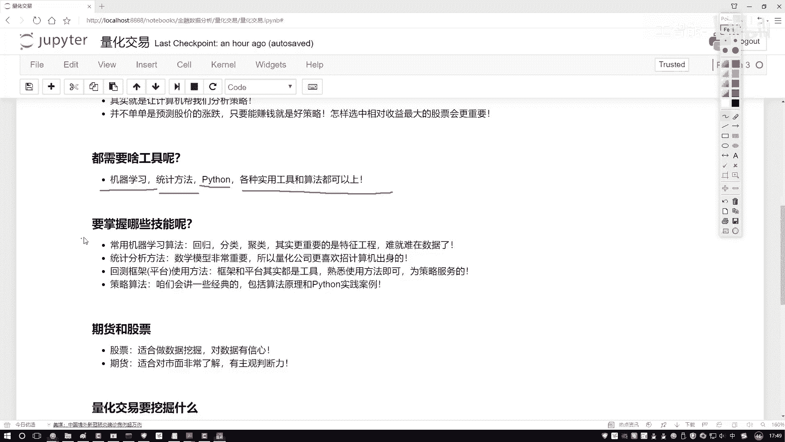

在本节课中，我们将要学习进行量化交易所需要掌握的核心技能。量化交易是一个融合了计算机科学、数学、金融学和数据科学的交叉领域。理解这些必备技能，将帮助我们更好地规划学习路径，并高效地构建交易策略。

## 核心技能概览

上一节我们介绍了量化交易的基本概念，本节中我们来看看具体需要哪些技能。以下是量化交易从业者需要掌握的几个关键方面：

1.  **机器学习算法与特征工程**
    机器学习是量化交易的核心工具之一。常规的回归、分类、聚类算法是基础。但更重要的是**特征工程**。特征工程指的是如何处理数据，以及如何从海量数据中提取最有价值的信息。在量化交易中，我们面对的数据非常庞大和复杂，例如股票数据不仅包括开盘价、收盘价，还包括公司财务数据、市场宏观数据等。将这些多层面的数据有效融合，并设计算法从中提取关键特征，是特征工程的主要任务。可以说，**数据决定了模型性能的上限，而算法只是逼近这个上限的工具**。

2.  **统计学与数学方法**
    量化交易岗位通常要求具备数学、统计学、计算机或金融背景。这是因为无论是算法还是交易策略，本质上都是**将数学公式应用到数据中**。数学是量化交易的基石，需要掌握的概率论、统计学、线性代数、微积分等知识点非常多。

3.  **平台与框架的使用**
    量化交易需要借助专门的平台或框架进行策略回测和实盘模拟。这些平台提供了便捷的API，允许用户编写Python代码来定义策略，并在历史数据上测试其表现。例如，可以观察一个策略在2010年至2020年期间的每日执行情况、收益曲线和最终结果。平台和框架是**工具**，关键在于熟练使用，而非死记硬背。课程后续将选择一个API简单、可视化清晰的平台进行演示。

4.  **策略算法**
    量化交易策略算法种类繁多。本课程将重点讲解最常用和最经典的一些算法，例如如何应用机器学习算法，以及一些常用的交易策略。我们会讲解这些算法的原理，并重点演示**如何在Python中实现和应用**。请注意，本课程的核心是**通过Python进行实践**，重点在于技术实现和案例落地，而非教授具体的炒股技巧。

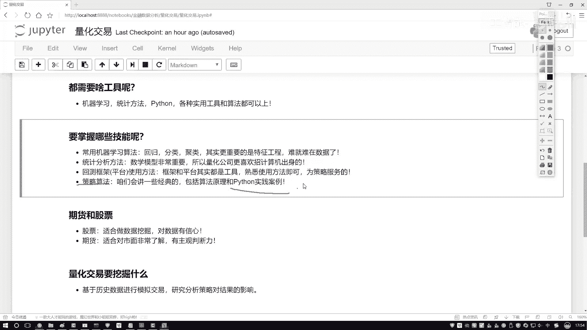

## 聚焦领域：股票 vs. 期货

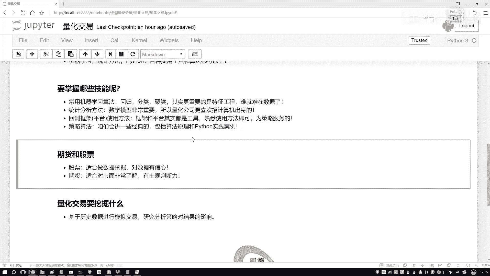

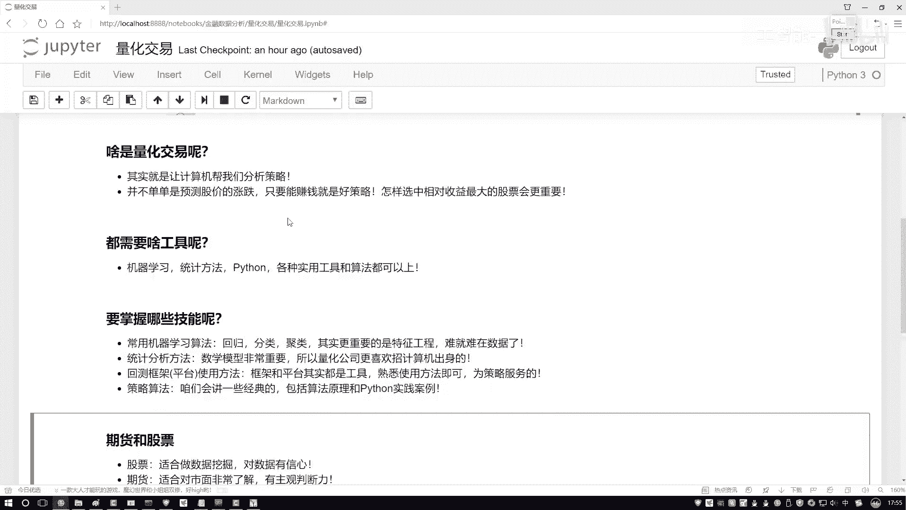

有同学问，量化交易可以应用于期货和股票，课程重点会是哪一个？本课程将更侧重于**股票**相关分析。

*   **股票**：股票数据丰富，包含公司财报、市场情绪、技术指标等多种维度，非常适合进行数据挖掘。我们的案例和实践将主要围绕股票展开。
*   **期货**：期货价格受现货市场、供需关系等基本面因素影响更大，对从业者的行业经验和主观判断能力要求更高。虽然课程中可能会举几个期货的小例子，但不会作为重点。

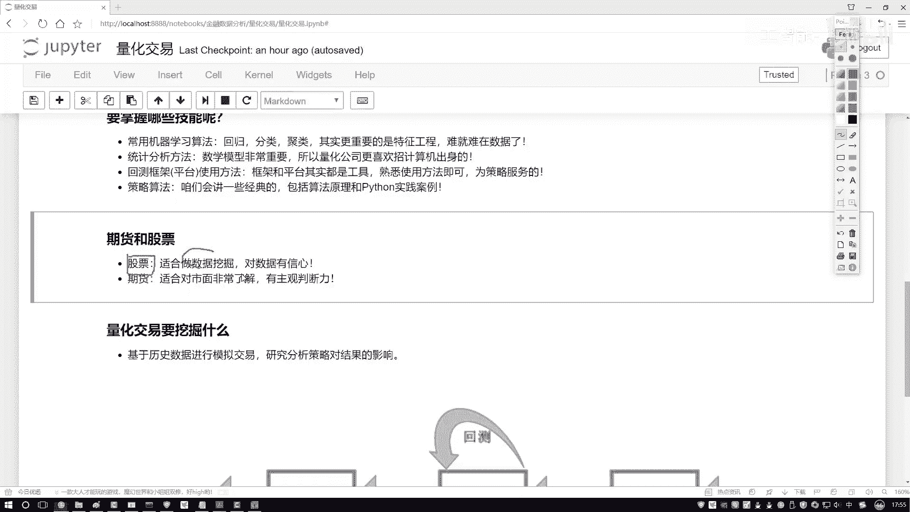

## 量化交易的本质：数据挖掘

既然提到了数据挖掘，我们需要明确其流程。简单来说，数据挖掘在量化交易中体现为以下步骤：

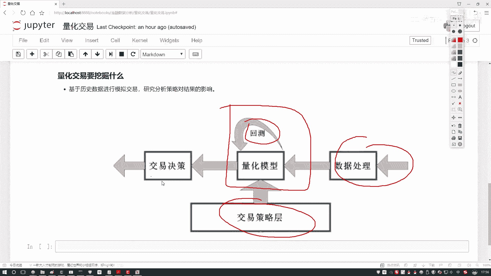

1.  **数据处理**：获取原始金融数据并进行清洗、整理。
2.  **策略设计**：基于处理后的数据，设计交易逻辑和算法。
3.  **回测验证**：将策略应用到历史数据中，模拟交易，评估其表现（如收益率、风险指标）。
4.  **实战指导**：根据回测结果优化策略，并为实盘交易提供决策依据。

因此，量化交易可以看作是**将数据挖掘算法应用于金融数据**的实践。它的目的不仅仅是预测股价涨跌，更是为了在一定的风险约束下，实现**收益最大化**。例如，如何从300只股票中选出最佳组合，以实现单位风险下的最高收益，这正是数据挖掘要解决的问题。

## 总结与学习建议

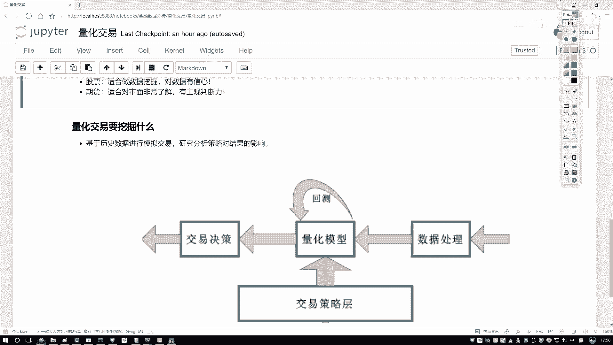

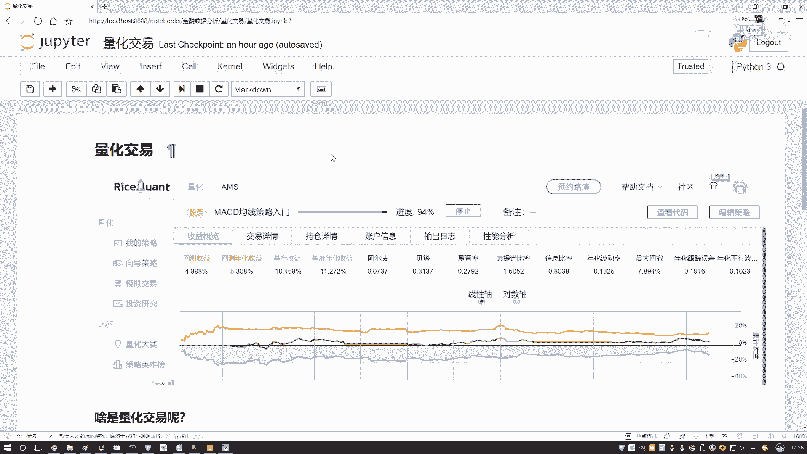

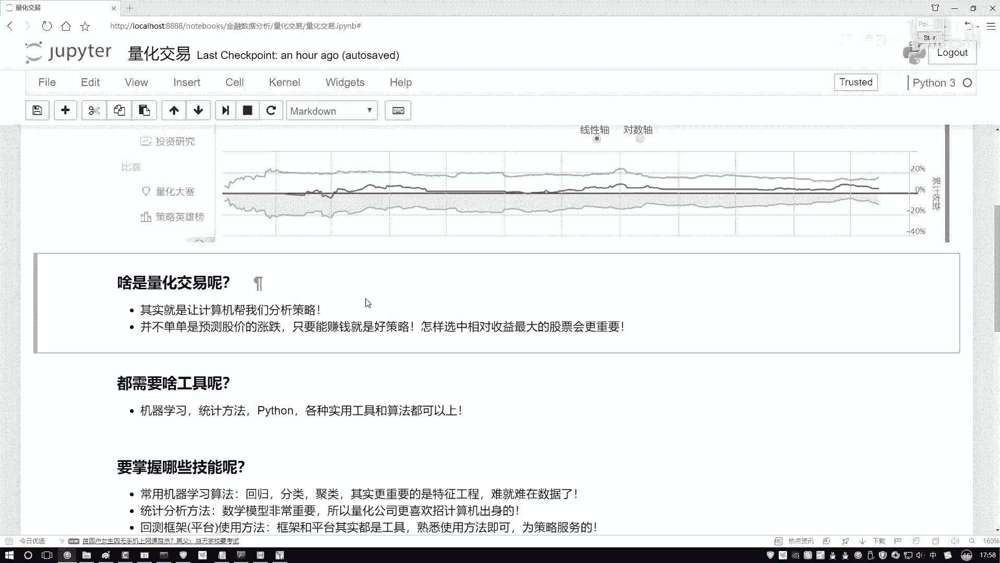

本节课中我们一起学习了量化交易所需的核心技能。总结如下：

*   **技能基础**：需要掌握机器学习（特别是特征工程）、统计学/数学、特定平台/框架的使用以及经典策略算法。
*   **实践重点**：本课程将以**股票市场**为主要应用场景，通过**Python编程**实现策略，强调动手实践。
*   **核心理解**：量化交易的本质是数据挖掘，目标是构建能产生稳定收益的系统化策略。

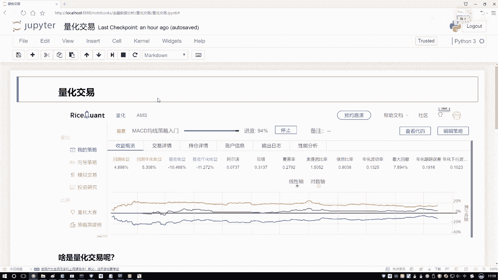

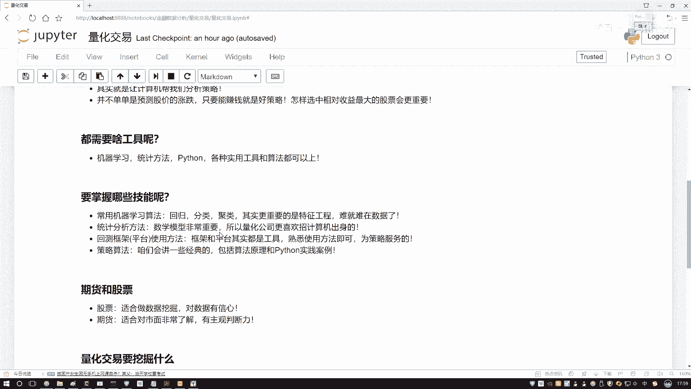

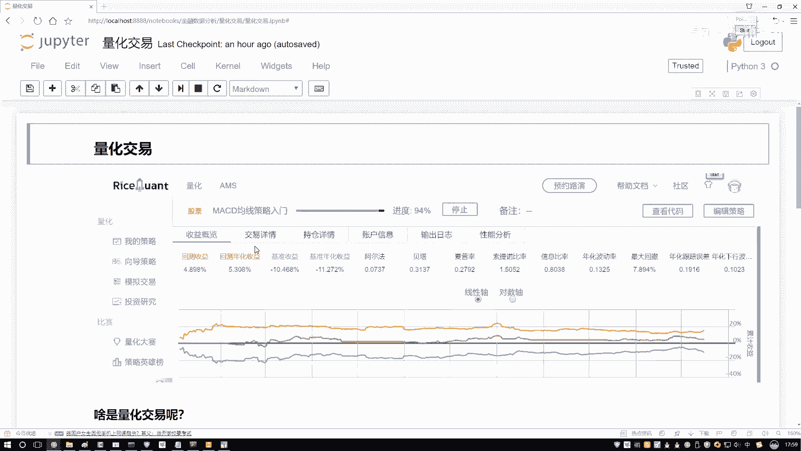

对于初学者，无需过度钻研量化交易的发展历史或复杂理论。关键在于理解其要做什么（数据挖掘），用什么工具（如Python和相关平台），以及我们后续课程的大致方向。掌握这些，就为接下来的实战学习打下了坚实的基础。