# Python金融分析与量化交易实战：P38：Alphalens工具包介绍

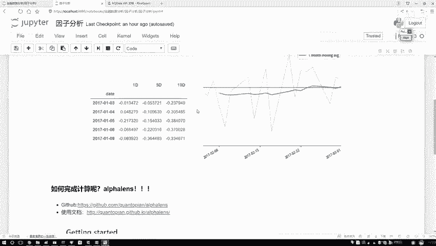

## 概述
在本节课中，我们将学习一个名为Alphalens的强大工具包。该工具包专门用于因子分析，能够帮助我们高效地计算各类量化指标并生成可视化图表，从而省去大量手动编码的工作。

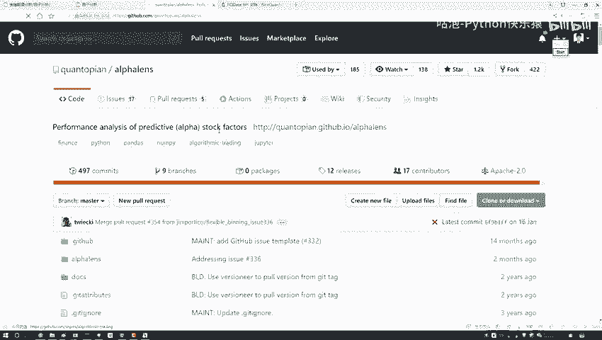

## Alphalens工具包简介
上一节我们介绍了量化分析的基本流程，本节中我们来看看如何利用现成工具提升效率。Alphalens是一个专门用于金融因子分析和绩效评估的Python库。

它的核心功能是简化因子分析流程，用户无需自己编写复杂的计算和绘图代码。Alphalens可以自动计算因子的**信息系数（IC）**、**分组收益**等关键指标，并生成如**收益分析图**、**IC时间序列图**等标准图表。

## 安装与官方资源
如果你想在本地环境使用Alphalens，安装过程非常简单。

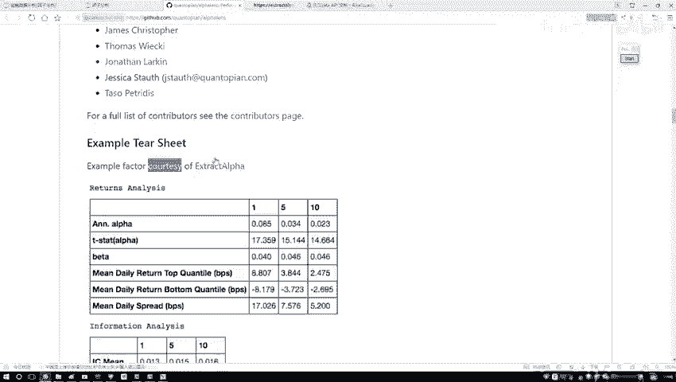

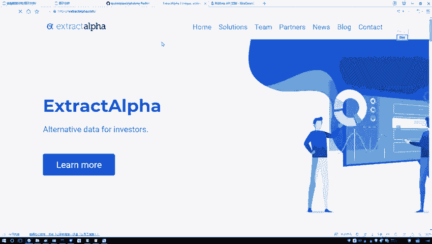

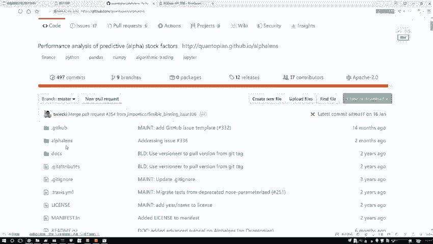

以下是安装步骤：
*   **安装命令**：在Anaconda Prompt或终端中执行 `pip install alphalens`。
*   **GitHub仓库**：你可以访问其GitHub页面（https://github.com/quantopian/alphalens ）查看源代码和基础说明。
*   **官方文档**：详细的使用文档和API说明可以在（https://alphalens.readthedocs.io/en/latest/ ）找到。

不过，在本课程后续的实战环节中，我们将在量化交易平台中直接编写代码，该平台已预装好Alphalens，因此你无需在本地进行安装。

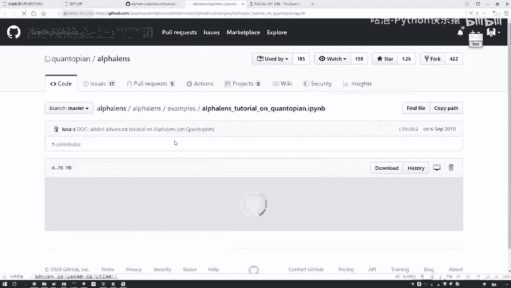

## 学习方法与官方示例
学习使用Alphalens的最佳途径是查阅其官方文档和示例。

以下是推荐的学习资源：
*   **官方示例（Examples）**：在GitHub仓库或文档中，官方提供了一系列完整的示例代码（Jupyter Notebook格式）。这些示例展示了从数据准备到结果分析的全过程，是入门的最佳材料。
*   **API文档**：当需要了解某个具体函数（如 `get_clean_factor_and_forward_returns`）的详细参数和用法时，应查阅API文档。

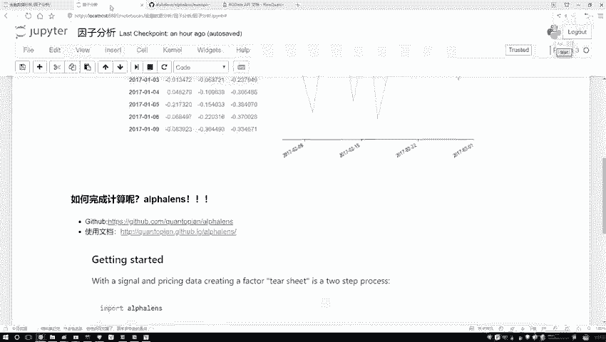

本课程的内容也主要参考了官方的示例和文档，并将其核心步骤整合成一个连贯的、适合初学者的实战案例。

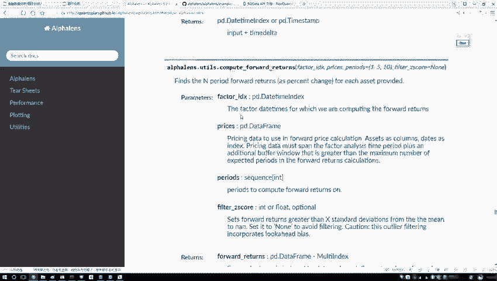

## 平台实战环境准备
由于直接获取和处理金融数据较为复杂，我们将在一个在线的量化研究平台中完成后续的代码实践。

平台提供了数据接口和计算资源，操作方式类似于Jupyter Notebook。接下来，我们进入该平台的研究环境。

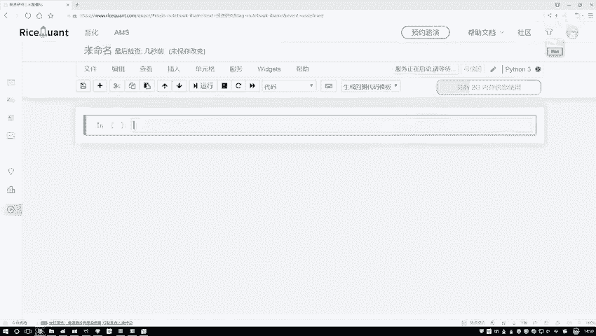

操作步骤如下：
1.  登录量化交易平台。
2.  在左侧功能栏中找到并点击“投资研究”模块。
3.  系统会打开一个类似Jupyter Notebook的交互式编程环境。
4.  点击“新建”，创建一个新的Python 3 Notebook，并将其重命名为“因子分析”。

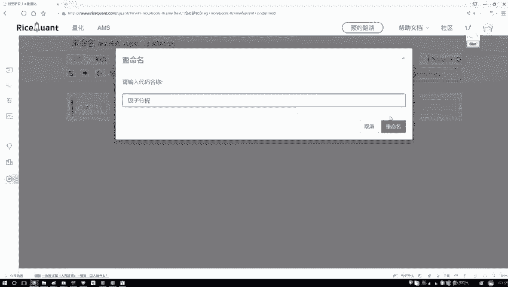

我们后续的所有代码都将在该Notebook中编写和运行。课程会提供完整的代码，你可以直接复制到平台中运行，也可以跟随视频一步步操作。

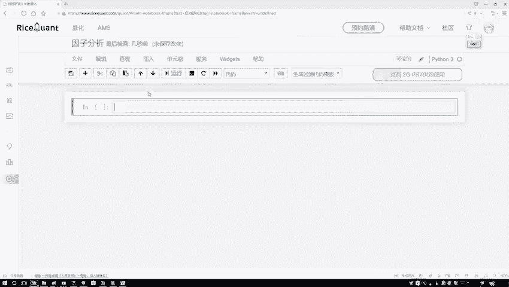

## 总结
本节课我们一起学习了Alphalens工具包。我们了解了它的核心用途是自动化因子分析与可视化，掌握了通过 `pip` 命令进行安装的方法，并知道了如何通过官方示例和文档进行深入学习。最后，我们准备好了在线量化研究平台的环境，为接下来的实战编码做好了准备。下一节，我们将开始编写具体的代码，利用Alphalens对我们的因子进行深入分析。