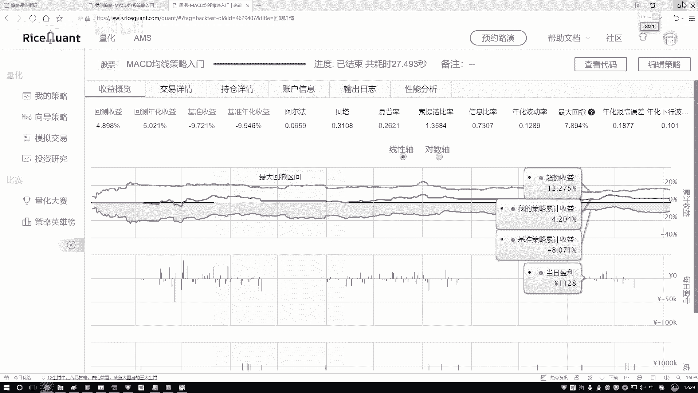
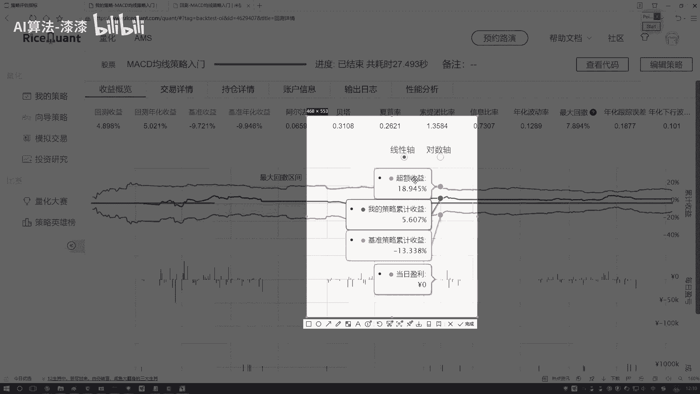
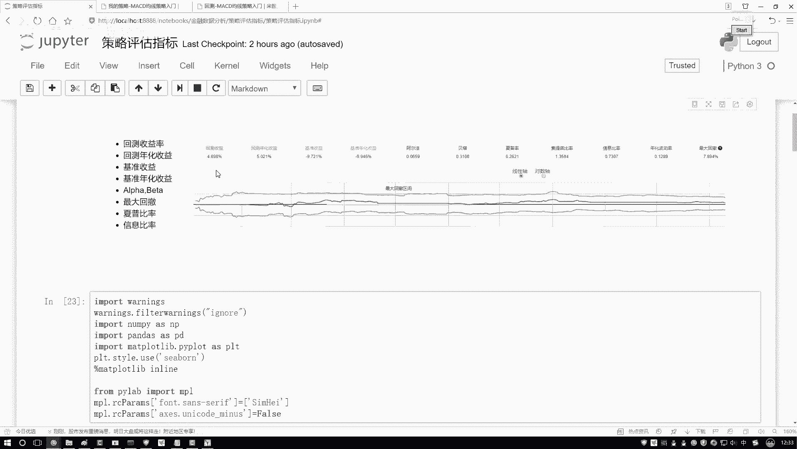

# 金融量化分析：P32：05-5：阿尔法与贝塔概述 📊

在本节课中，我们将要学习量化投资策略评估中的两个核心概念：阿尔法（α）和贝塔（β）。理解这两个指标对于区分投资收益的来源至关重要。

## 收益的两种来源 💰

上一节我们介绍了多种策略评估指标，本节中我们来看看如何区分收益是来自市场整体表现还是策略自身的优势。

投资收益通常可以分解为两个部分。一部分与整体市场环境相关。当市场大环境向好时，大部分投资都能获得收益。另一部分则与市场波动无关，它源于投资者或策略自身的努力，例如通过深入分析公司财务、运营状况，或凭借独特的交易策略所获得的收益。

## 阿尔法（α）与贝塔（β）的定义 📈

以下是这两个核心概念的具体定义：

*   **贝塔（β）**：衡量投资策略对市场波动的敏感性，反映了策略与大盘走势的相关性。它代表的是**系统性风险**或**市场收益**。公式上，它类似于线性回归方程 `Y = α + βX + ε` 中的斜率系数，其中 `Y` 是策略收益，`X` 是市场基准收益。
*   **阿尔法（α）**：衡量与市场波动无关的超额收益。它代表了投资者或策略通过自身能力（如选股、择时）所创造的、超越市场基准的价值。在回归方程 `Y = α + βX + ε` 中，阿尔法（α）是截距项。

## 通过实例理解概念 📉

我们可以通过策略收益图来直观理解这两个概念。

在收益分析图中，通常包含几条关键曲线：
*   **策略收益线**：代表你所采用的策略实际获得的收益曲线。
*   **基准收益线**（例如沪深300指数）：代表市场整体的平均收益表现，即“随大流”所能获得的收益。
*   **超额收益线**：由策略收益减去基准收益得到，它直观地展示了策略本身创造的价值。

因此，总收益可以理解为：**总收益 = 市场收益（β部分） + 超额收益（α部分）**。

## 量化分析中的关注重点 🎯

理解阿尔法和贝塔后，我们需要明确分析的重点。市场整体走势（贝塔部分）是投资者难以控制的外部因素。因此，量化策略研究的核心目标在于追求稳定的、可持续的**阿尔法收益**，即无论市场涨跌，都能通过策略本身获得超越基准的超额回报。

## 总结与回顾 📝

本节课中我们一起学习了阿尔法（α）和贝塔（β）的核心概念：
1.  **贝塔（β）** 衡量策略与市场相关的收益部分，代表系统性风险。
2.  **阿尔法（α）** 衡量策略独立于市场的超额收益部分，代表策略自身的盈利能力。
3.  在量化投资中，核心目标是寻找并验证能产生持续正阿尔法的策略。

对于初学者，无需死记硬背复杂的计算公式。重要的是理解其经济含义，并知道在后续使用Python工具包（如`empyrical`、`alphalens`）进行回测时，这些指标会被自动计算并用于评估策略优劣。

