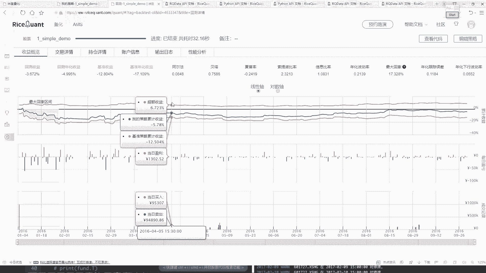
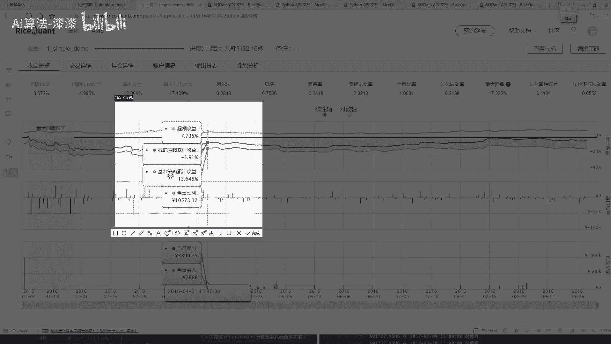
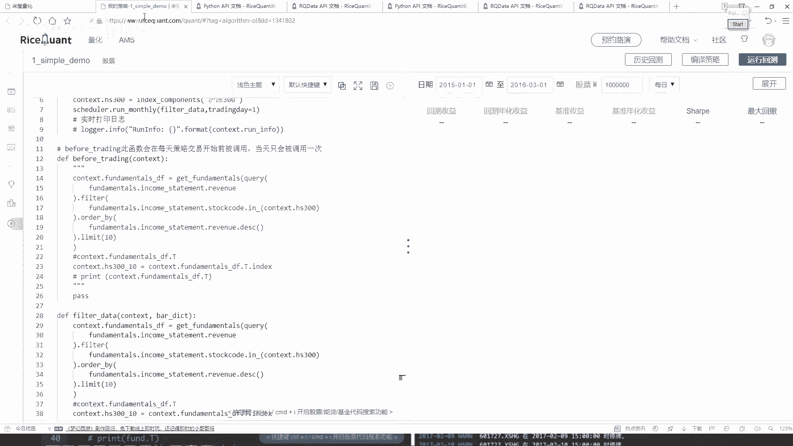

# 量化交易入门：04-4：定时器功能与作用 ⏰

在本节课中，我们将要学习如何在量化交易策略中使用定时器功能。定时器允许我们按照自定义的时间间隔（如每月、每周）来执行特定的操作，而不是在每一个交易日都执行，这为我们优化策略逻辑提供了更大的灵活性。

上一节我们介绍了如何通过 `before_trading` 函数在每日开盘前执行选股逻辑。本节中我们来看看如何利用定时器来调整这个执行频率。

## 回顾每日执行的策略

在之前的示例中，我们在 `before_trading` 函数中编写了选股逻辑。这意味着在回测期间的**每一个交易日**，系统都会执行一次选股和调仓操作。

```python
def before_trading(context):
    # 每日执行的选股逻辑
    query_result = query(fundamentals.income_statement.revenue).filter(...).order_by(...).limit(10)
    # ... 后续的调仓逻辑
```

这种每日调仓的方式可能过于频繁，导致交易成本过高或策略信号不稳定。因此，我们需要一种方法来控制策略核心逻辑的执行时机。

## 引入定时器功能

定时器（Scheduler）是平台提供的一个API，它允许我们按照设定的时间规则（如每月第一个交易日、每周最后交易日）来触发指定的函数。



以下是定时器的核心概念：
*   **作用**：按固定周期执行特定函数，而非每日执行。
*   **常用方法**：`run_monthly`， `run_weekly`， `run_daily`。
*   **使用位置**：**只能在策略的 `initialize` 初始化函数中设置。**



## 如何将每日逻辑改为每月执行

要将之前每日执行的选股逻辑改为每月执行，我们需要进行以下三步操作：

1.  **注释或移除 `before_trading` 中的逻辑**：既然不再需要每日运行，我们可以将这部分代码从 `before_trading` 函数中移出。
2.  **将逻辑封装成独立函数**：把选股和调仓的代码提取到一个单独的函数中，例如 `filter_data`。
3.  **在 `initialize` 中使用定时器**：使用 `run_monthly` 函数，指定在每月的某个交易日执行我们刚刚封装的 `filter_data` 函数。

以下是代码修改示例：

```python
def initialize(context):
    # 设置定时器：每月第一个交易日运行 filter_data 函数
    run_monthly(filter_data, monthday=1)

def filter_data(context):
    # 从原 before_trading 中移出的选股逻辑
    query_result = query(fundamentals.income_statement.revenue).filter(...).order_by(...).limit(10)
    # ... 后续的调仓逻辑（买入/卖出）
    # 注意：这里需要处理持仓和资金，与之前逻辑一致

def before_trading(context):
    # 这里可以保留或添加其他每日需要执行的检查或日志记录
    pass
```

通过以上修改，策略的核心选股调仓逻辑将只在**每月的第一个交易日**执行一次，其余交易日则不会触发，这模拟了更接近实际的月度调仓策略。

## 定时器对策略结果的影响

改变策略的执行频率会显著影响回测结果。例如，将每日调仓改为每月调仓后：
*   **交易次数**：大幅减少，降低了手续费和滑点成本的影响。
*   **信号稳定性**：可能避免对短期市场噪音的过度反应。
*   **最终收益**：可能变好，也可能变差。这取决于策略逻辑与市场周期的匹配程度。

**请注意**：没有一个固定的规则说哪种频率更好。策略的效果需要结合具体的选股逻辑、市场环境进行综合评估。开发者需要通过反复回测和参数调优来寻找最适合当前策略的执行频率。

## 核心API参考

以下是在策略中使用定时器的关键点：

*   **`run_monthly(function, monthday, time)`**
    *   `function`：要执行的函数名。
    *   `monthday`：每月的第几个交易日（如1表示第一个交易日）。
    *   `time`：运行时间（如 ‘open’ 表示开盘时）。
*   **`run_weekly(function, weekday, time)`**：按周运行。
*   **`run_daily(function, time)`**：按日运行，是 `before_trading` 的更灵活替代。

## 学习建议：善用API文档

在量化交易开发中，平台提供的API文档是最重要的学习资料。所有函数（如 `query`, `filter`, `order_by`, `run_monthly`）的用法、参数和示例都可以在文档中找到。对于初学者，最好的学习路径是：
1.  阅读文档了解核心概念。
2.  复制并运行官方示例代码。
3.  基于示例修改参数，观察结果变化。
4.  逐步构建自己的策略逻辑。



本节课中我们一起学习了量化交易中定时器的作用和使用方法。我们了解到，通过 `run_monthly` 等定时器函数，可以灵活控制策略核心逻辑的执行周期，从而优化交易频率并影响最终回测结果。记住，策略开发是一个迭代过程，需要结合API文档的指导和多次回测实验来不断完善。