# 金融因子数据处理：P40：01-1-百分位去极值方法 📊

在本节课中，我们将要学习如何对金融因子数据进行预处理。这是构建量化交易模型前至关重要的一步，良好的数据预处理能有效提升模型的稳定性和预测能力。我们将重点介绍三种核心的预处理方法：去极值、标准化和中性化。

上一节我们介绍了因子数据的基本概念，本节中我们来看看如何处理这些数据中的极端值。

## 什么是因子数据？

因子是影响最终结果（如股票收益）的指标或标准。例如，在选股时，市净率低或营收增长率高都可以作为筛选股票的因子。我们可以将最终收益视为因变量 **Y**，而多个因子（如 **X1, X2, X3, X4**）则作为自变量。我们的目标是通过数据挖掘，分析每个因子对结果的影响，并从中选择有效的因子来构建策略。

## 数据预处理三步走

拿到因子数据后，不能直接用于建模，需要进行预处理。以下是三个核心步骤：

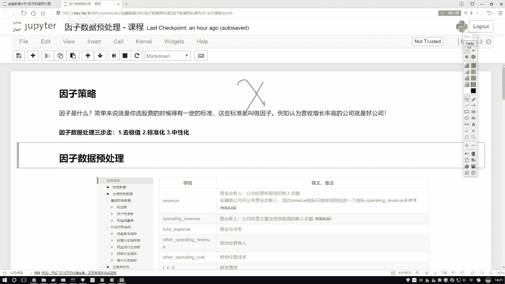

1.  **去极值**：处理数据中的离群点或异常值。
2.  **标准化**：将不同量纲和取值范围的因子数据转换到统一的尺度。
3.  **中性化**：消除因子数据中与某些特定风险因素（如行业、市值）的相关性，这在金融因子分析中尤为重要。

前两个步骤在机器学习中很常见，而中性化则是金融量化领域的特殊需求。接下来，我们将按照这个顺序，首先详细讲解如何去极值。

## 第一步：去极值方法

数据中可能存在少数远离主体分布的极端值（极值），直接使用它们会影响模型的稳定性。常见的思路不是直接删除这些点，而是将它们“拉回”到合理的边界内。

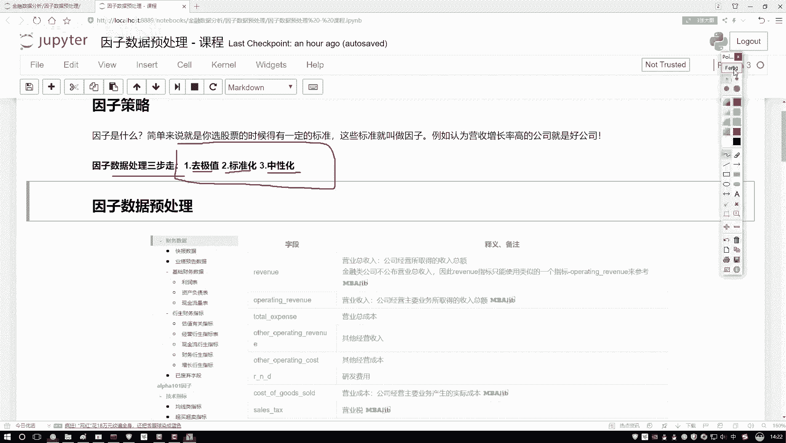

以下是几种常用的去极值方法，我们将首先介绍**分位数法**。

### 分位数去极值法

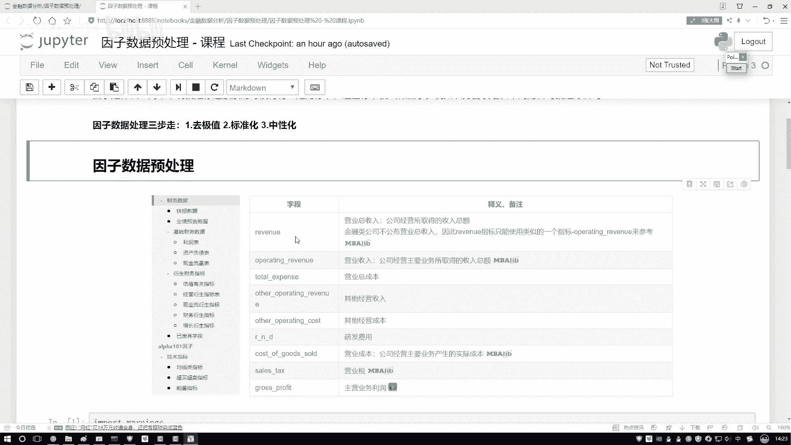

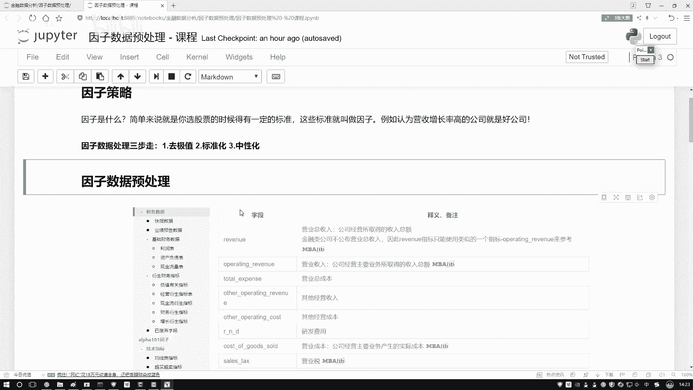

在介绍方法前，需要理解分位数的概念。与容易受极值影响的均值不同，中位数等分位数对极值不敏感，能更好地反映数据的中心趋势。

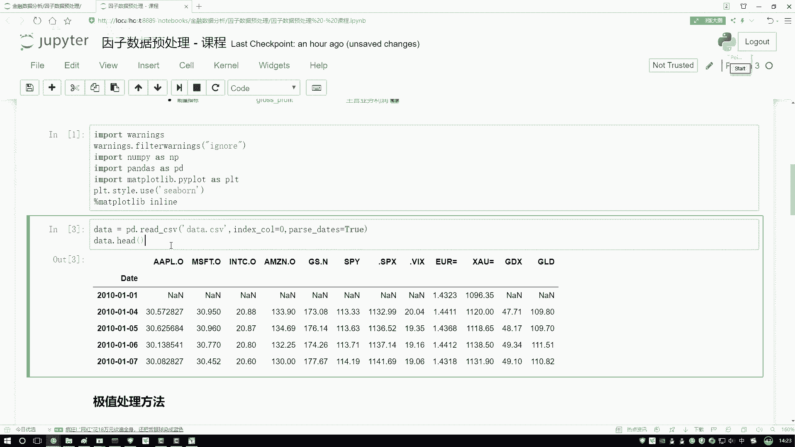

*   **中位数 (Q2 / Median)**：将数据从小到大排列后，处于正中间位置的值。
*   **下四分位数 (Q1)**：位于数据 25% 位置的值。
*   **上四分位数 (Q3)**：位于数据 75% 位置的值。

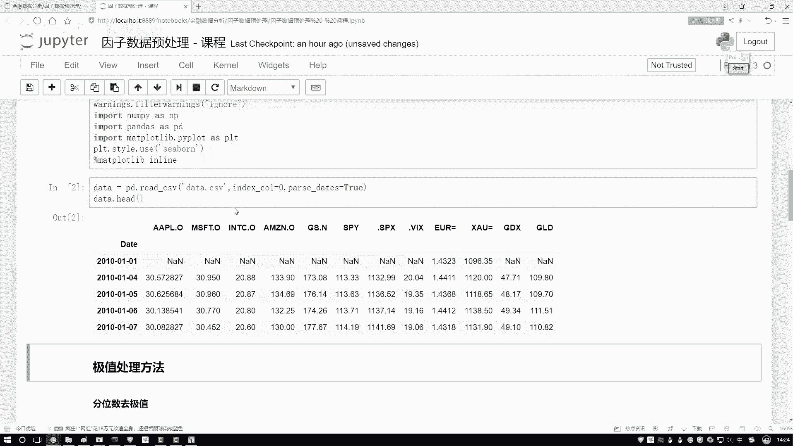

分位数去极值法利用这些概念来识别极值。其核心思想是计算一个称为“四分位距”的波动范围，并认为超出此范围一定倍数的数据点为极值。

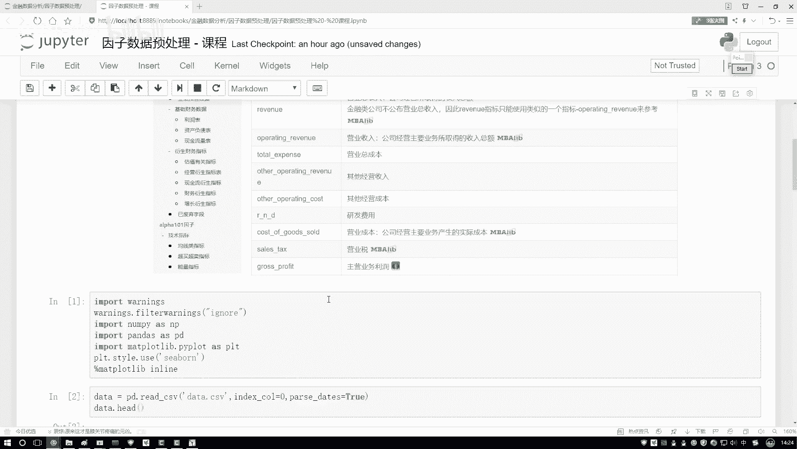

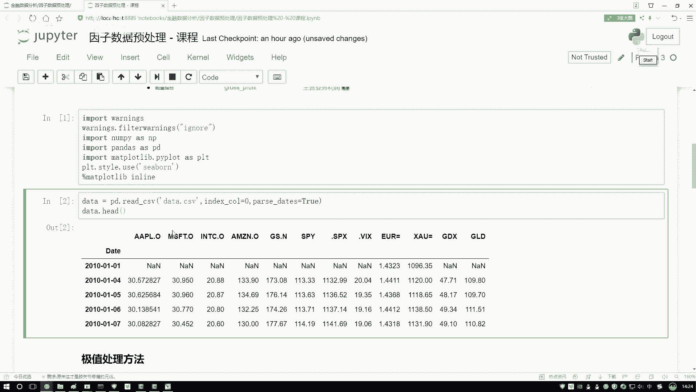

**计算步骤与公式**：

1.  计算四分位距 **IQR**：
    `IQR = Q3 - Q1`
2.  设定合理的上下限。通常，下限 **lower_bound** 和上限 **upper_bound** 定义为：
    `lower_bound = Q1 - k * IQR`
    `upper_bound = Q3 + k * IQR`
    其中，**k** 是一个常数，通常取 1.5（温和）或 3（严格）。
3.  处理极值：将所有小于 **lower_bound** 的值设置为 **lower_bound**，将所有大于 **upper_bound** 的值设置为 **upper_bound**。

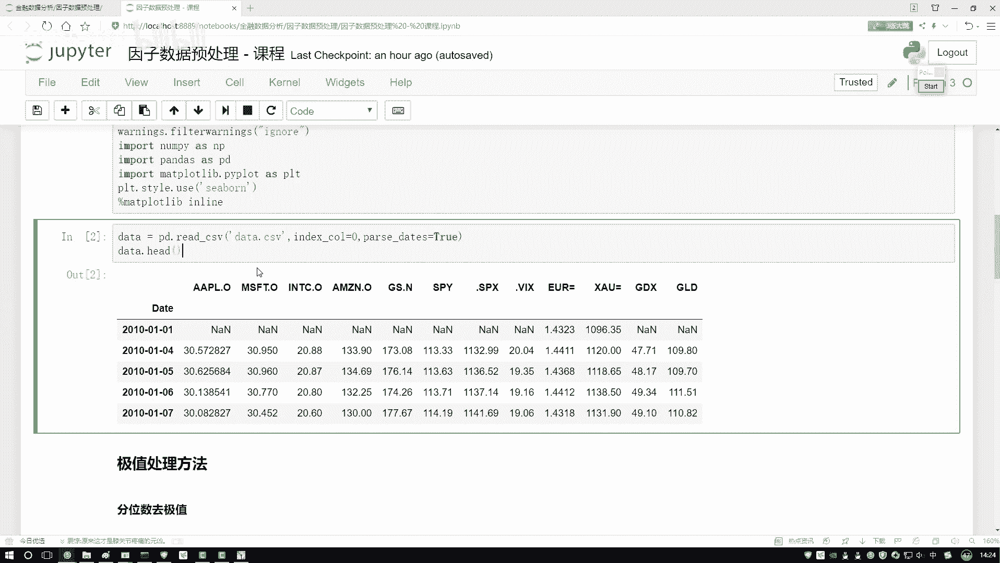

**代码示例**：
假设我们有一个因子数据序列 `factor_data`，使用 pandas 进行分位数去极值处理。

```python
import pandas as pd
import numpy as np

# 假设 factor_data 是一个 pandas Series，包含因子值
# 例如：factor_data = pd.Series([...])

def winsorize_by_quantile(series, k=1.5):
    """
    使用分位数法对序列进行去极值处理（缩尾处理）。
    :param series: pandas Series，待处理的数据
    :param k: 范围乘数，默认1.5
    :return: 处理后的 pandas Series
    """
    q1 = series.quantile(0.25)
    q3 = series.quantile(0.75)
    iqr = q3 - q1
    lower_bound = q1 - k * iqr
    upper_bound = q3 + k * iqr
    
    # 将超出边界的值拉回到边界
    series_winsorized = series.clip(lower=lower_bound, upper=upper_bound)
    return series_winsorized

# 应用函数
# processed_data = winsorize_by_quantile(factor_data)
```

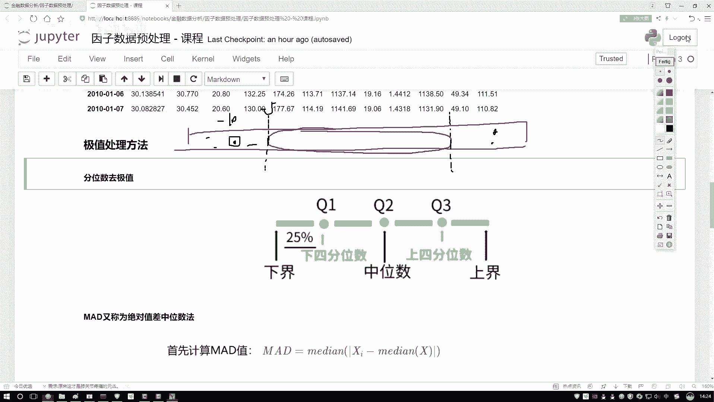

这种方法简单有效，是金融数据处理中常用的去极值手段。

## 环境准备与数据示例

在深入实践之前，我们需要准备好Python环境。以下是导入常用库的代码。

```python
import pandas as pd
import numpy as np
import matplotlib.pyplot as plt
# 后续可能会用到其他库，如scipy.stats
```

为了演示方法，我们暂时使用苹果公司（AAPL）的历史股价数据作为示例。虽然股价本身不是典型的因子，但其数值特性适合演示数据处理流程。在后续的实际策略中，我们将从量化平台获取真实的因子数据（如市净率、市值等）进行操作。

```python
# 示例：读取苹果股价数据（假设已有CSV文件）
# aapl_data = pd.read_csv(‘AAPL.csv‘, index_col=‘Date‘, parse_dates=True)
# price_series = aapl_data[‘Close‘] # 选取收盘价序列
# 这里仅作示意，实际数据加载方式可能不同
```

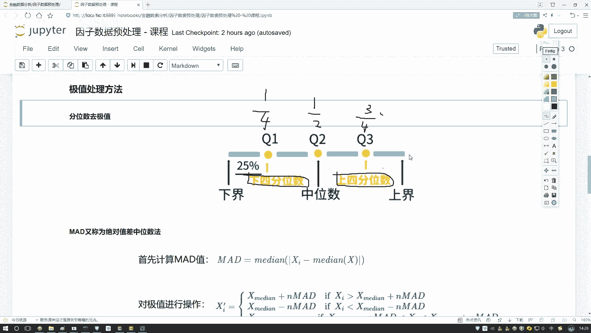

本节课中我们一起学习了金融因子数据预处理的第一步——去极值处理，并重点讲解了基于分位数的去极值方法。我们理解了因子数据的概念，明确了预处理“三步走”的框架，并掌握了如何使用四分位距来识别和修正数据中的极端值，为后续的标准化和中性化处理打下了基础。在接下来的课程中，我们将继续学习第二步：标准化。