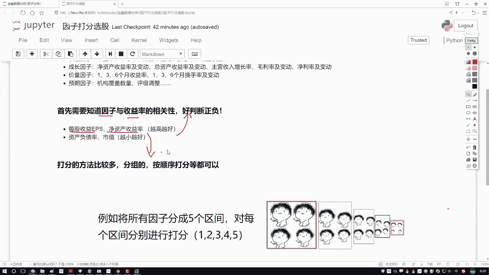
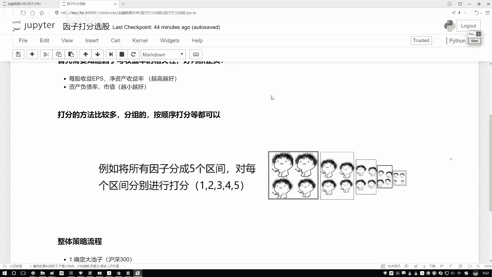
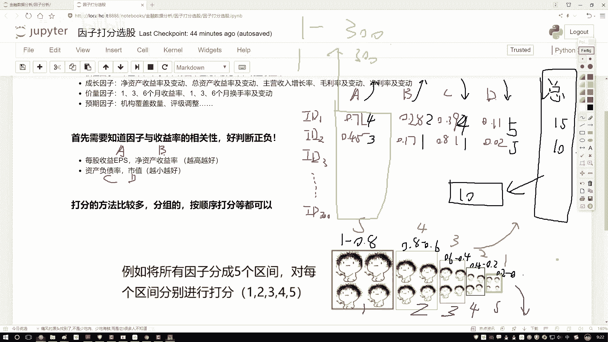
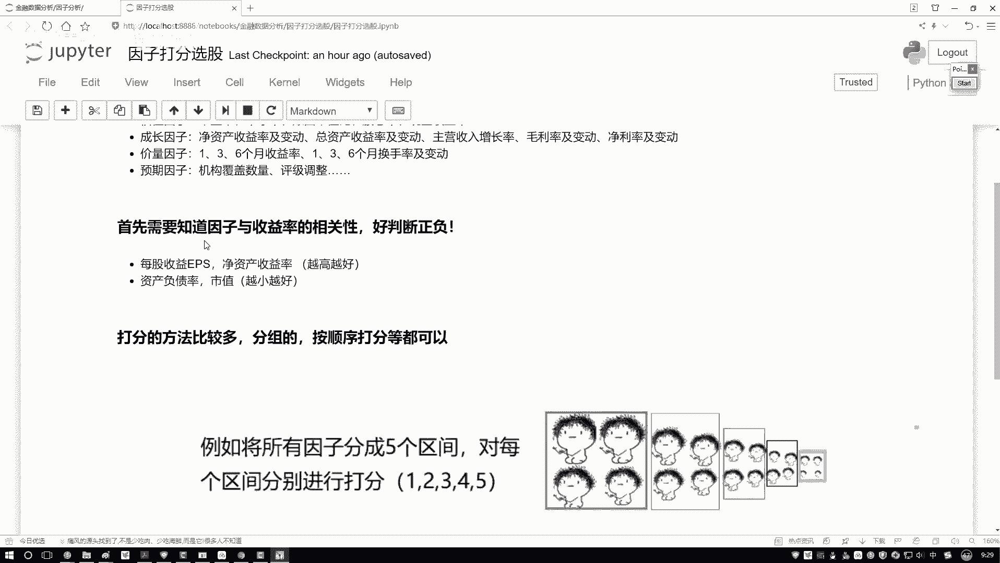
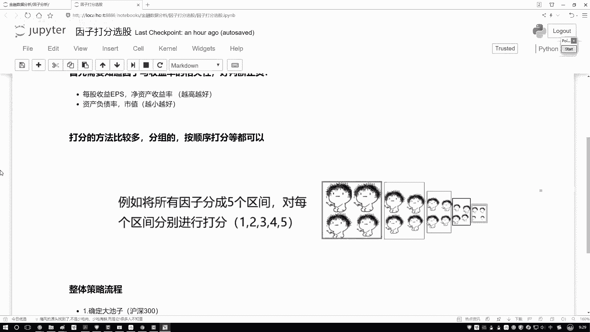
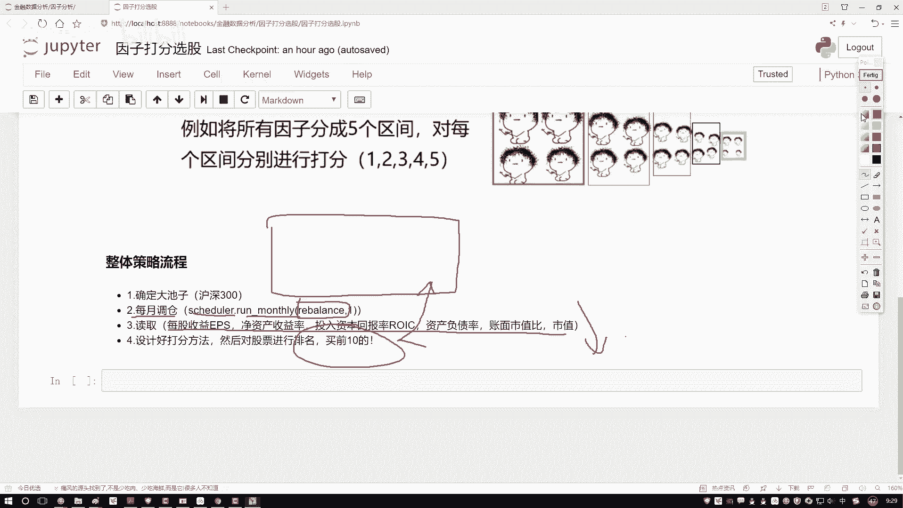
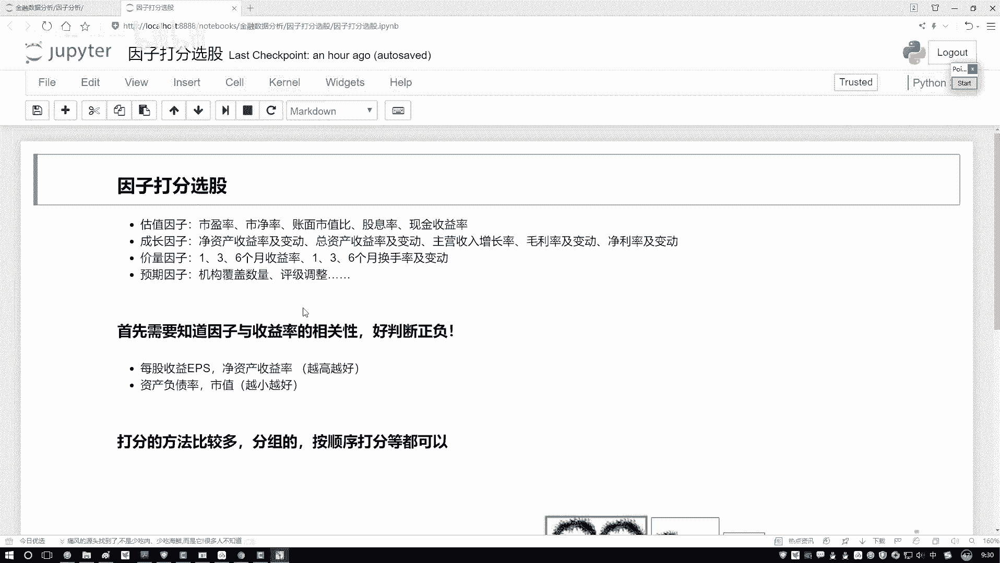

# 人工智能金融量化交易：P61：02-2-整体任务流程梳理 📊





在本节课中，我们将学习如何为股票因子进行打分，并梳理出一个完整的量化交易策略流程。我们将从已知的因子数据出发，通过打分和汇总，最终选出排名靠前的股票作为投资组合。

---

上一节我们介绍了如何获取和准备因子数据，本节中我们来看看如何为这些因子进行打分。

有了因子数据后，下一步就是为每个股票的各项指标进行打分。打分的方法有很多种，我们将通过一个具体的例子来讲解一种常用的区间打分法。

以下是打分法的具体步骤：

1.  **准备样本数据**：假设我们有300只股票（例如沪深300成分股），每只股票有A、B、C、D四个因子。其中，因子A和B是“越大越好”的指标，因子C和D是“越小越好”的指标。
2.  **确定打分方向**：根据因子的性质（越大越好或越小越好），我们为数值落入不同区间设定不同的分数。
    *   **对于“越大越好”的因子（如A、B）**：数值越大，得分越高。
    *   **对于“越小越好”的因子（如C、D）**：数值越小，得分越高。
3.  **划分区间并赋值**：将每个因子的数值范围（例如归一化后的0-1）划分为若干个区间，并为每个区间赋予一个分数。
    *   例如，将0-1分为5个区间：`[1.0, 0.8)`， `[0.8, 0.6)`， `[0.6, 0.4)`， `[0.4, 0.2)`， `[0.2, 0.0]`。
    *   对于“越大越好”的因子，分数分配可以是：5分， 4分， 3分， 2分， 1分。
    *   对于“越小越好”的因子，分数分配则反过来：1分， 2分， 3分， 4分， 5分。
4.  **计算单因子得分**：根据每只股票每个因子的具体数值，确定其落入的区间，从而得到该因子的得分。
    *   例如，股票ID1的因子A值为0.71（越大越好），落入`[0.8, 0.6)`区间，得4分。
    *   股票ID1的因子C值为0.39（越小越好），落入`[0.4, 0.2)`区间，得4分。
5.  **计算总分并排序**：将每只股票所有因子的得分相加，得到该股票的总分。最后，对所有股票按总分从高到低进行排序。

```python
# 伪代码示例：计算股票总分
def calculate_total_score(stock_factors):
    # stock_factors 是一个字典，包含因子A, B, C, D的值
    score = 0
    score += score_factor_A(stock_factors[‘A‘])  # 越大越好
    score += score_factor_B(stock_factors[‘B‘])  # 越大越好
    score += score_factor_C(stock_factors[‘C‘])  # 越小越好
    score += score_factor_D(stock_factors[‘D‘])  # 越小越好
    return score
```

排序完成后，选择总分排名最高的前N只股票（例如前10只），作为下一次调仓时买入或重点关注的对象。这种方法在因子投资策略中非常常见且效果不错。

---

了解了打分法的核心思想后，我们来看一下整个策略的完整执行流程。

以下是基于月度调仓的量化策略整体流程：







1.  **确定股票池**：首先，需要明确策略操作的股票范围。在本例中，我们使用**沪深300指数**的成分股作为初始股票池。
2.  **设置调仓周期**：确定策略再平衡（调仓）的频率。通常使用月度或季度调仓。这里我们设置一个**月度定时器**，每月触发一次调仓函数。
3.  **实现调仓函数**：这是策略的核心部分，函数名为 `rebalance`。在该函数中，我们需要依次完成以下步骤：
    *   **数据获取**：读取当前时刻所有股票池内股票的因子数据（A, B, C, D）。
    *   **因子打分**：应用上述打分法，为每只股票的每个因子计算得分。
    *   **汇总排名**：计算每只股票的总分，并按总分从高到低进行排序。
    *   **生成交易清单**：选取总分排名前10的股票，作为本次调仓的目标持仓。
4.  **执行交易**：根据生成的交易清单，卖出不在清单中的原有持仓，买入清单中的新标的，使投资组合与目标持仓一致。

这个流程看起来相对清晰且直接。接下来，我们就可以尝试用这种打分法，结合几个选定的因子，来构建一个简单的策略，并回测其历史表现，看看收益效果如何。

---





本节课中我们一起学习了因子投资的**打分法**，掌握了如何根据因子性质（越大越好/越小越好）为股票评分，并汇总得到综合排名。同时，我们也梳理了一个完整的**月度调仓量化策略流程**，从确定股票池、设置调仓频率到实现核心调仓逻辑。接下来，就可以将此流程转化为代码进行实战了。