# Python金融时间序列分析与量化交易实战教程：P17：16.阿尔法与贝塔概述 📈

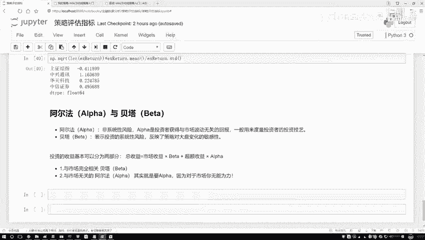

在本节课中，我们将要学习量化交易中两个核心概念：阿尔法（Alpha）和贝塔（Beta）。我们将了解它们如何将投资收益分解为不同的来源，以及为什么这对策略评估至关重要。

## 阿尔法与贝塔的定义

上一节我们介绍了策略评估的多种指标，本节中我们来看看阿尔法和贝塔这两个核心概念。

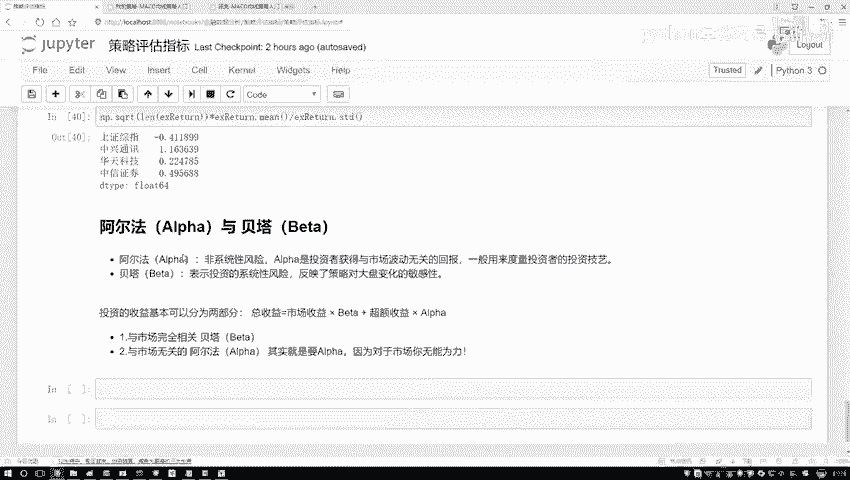

投资收益可以分解为两个部分。一部分与整体市场环境相关，另一部分则与投资者自身的策略和努力相关。阿尔法和贝塔就是分别衡量这两部分的指标。

*   **贝塔（Beta）**：衡量投资组合收益与市场整体波动的相关性。它反映了策略对大盘走势的敏感性。市场收益与贝塔挂钩。
*   **阿尔法（Alpha）**：衡量与市场波动无关的超额收益。它主要反映策略本身的有效性或投资者的独特能力。超额收益与阿尔法挂钩。

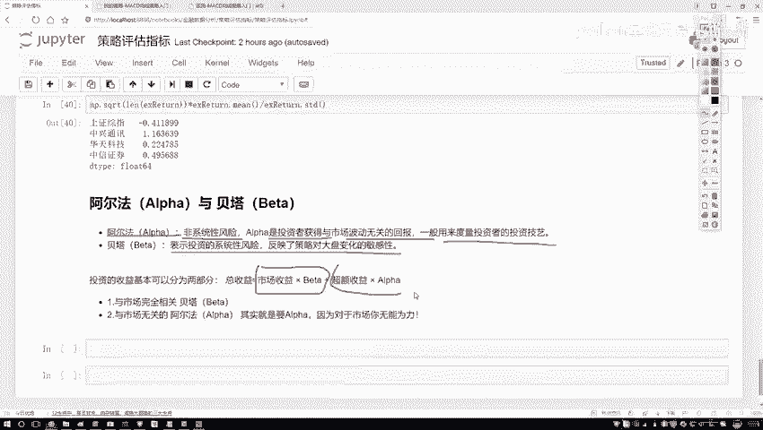

## 收益分解与公式

总收益可以看作由市场收益和超额收益两部分组成。这种关系可以通过一个线性回归模型来理解：

**总收益 = 阿尔法 + 贝塔 × 市场收益 + 误差项**

用公式表示为：
`Y = α + β * X + ε`
其中，`Y`代表策略总收益，`X`代表市场基准收益，`α`代表阿尔法值，`β`代表贝塔值。

在量化分析中，我们通过历史数据拟合这个方程来求解阿尔法和贝塔的值。这有助于我们理解收益的来源。

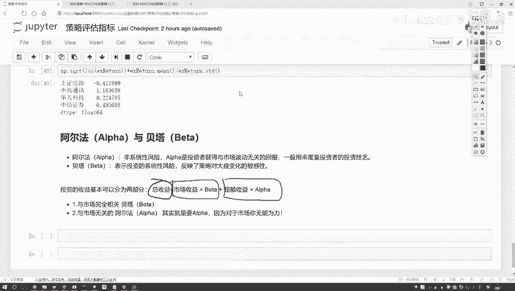

## 策略目标与关注点

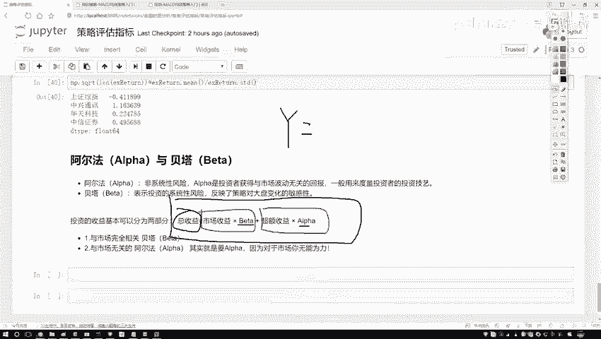

我们的最终目标是获取收益。由于市场整体走势（贝塔部分）是个人无法控制的，因此量化策略的核心关注点在于如何获取稳定的、超越市场的**超额收益**，即追求正的**阿尔法**。

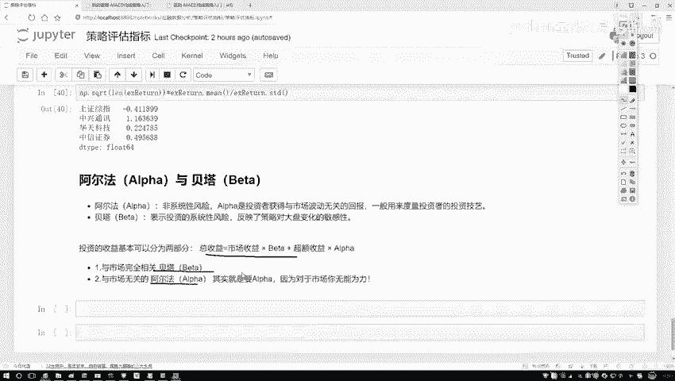

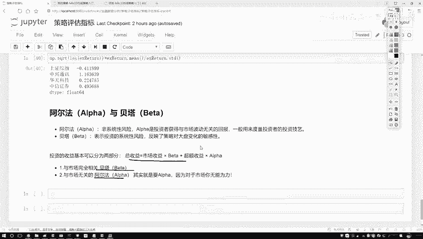

以下是策略评估中应关注的核心：

*   市场收益（贝塔）反映系统风险，难以主动控制。
*   超额收益（阿尔法）反映策略的主动管理能力，是策略优劣的关键。
*   因此，在策略开发和评估中，我们更侧重于分析和优化阿尔法。

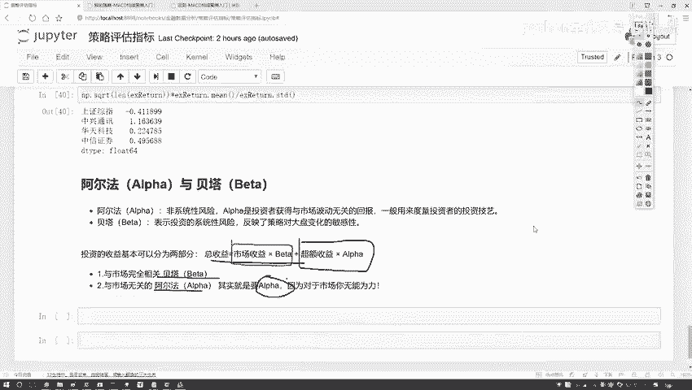

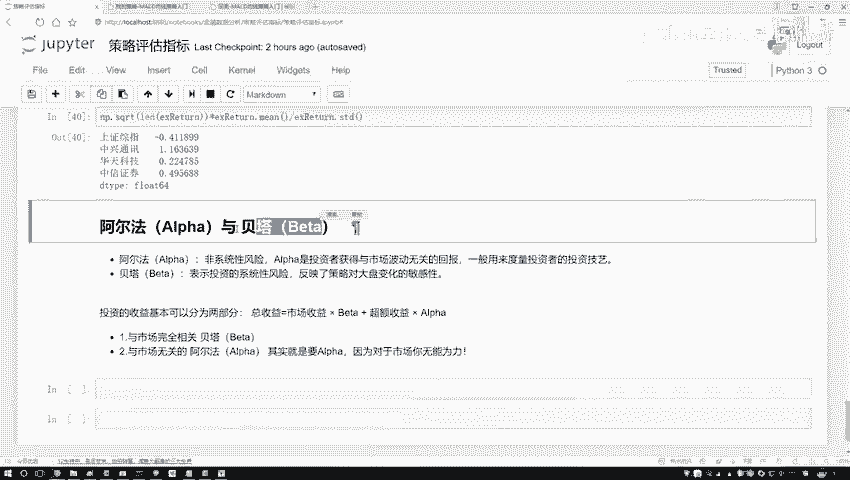

## 其他常见评估指标

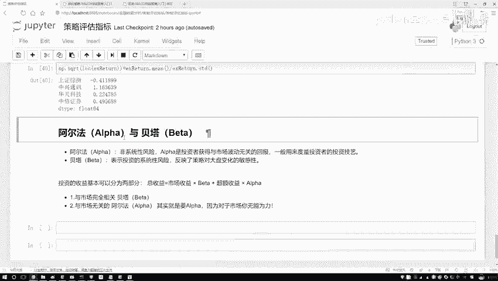

除了阿尔法和贝塔，策略评估还涉及其他多种指标。了解它们的基本含义对理解策略全貌很有帮助。

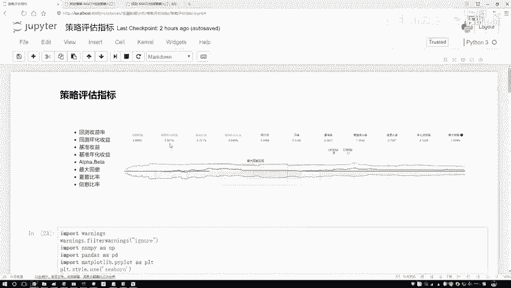

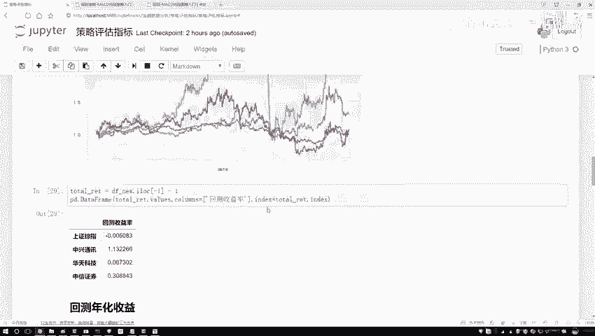

以下是部分常见评估指标的简要说明：

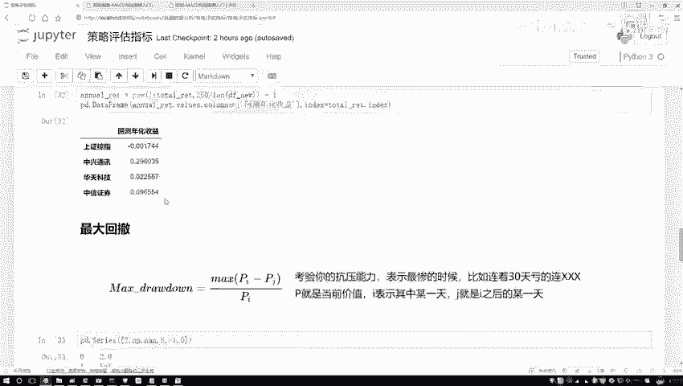

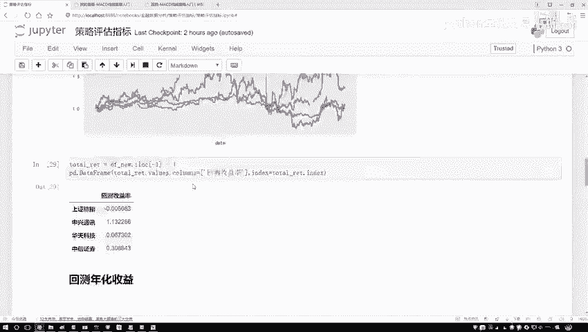

*   **最大回撤**：衡量策略在历史上从峰值到谷底的最大亏损幅度，反映下行风险。
*   **夏普比率**：衡量每承受一单位总风险，能产生多少超额回报。
*   **基准收益**：指完全复制市场指数（如沪深300）所能获得的收益，是衡量策略表现的参照系。

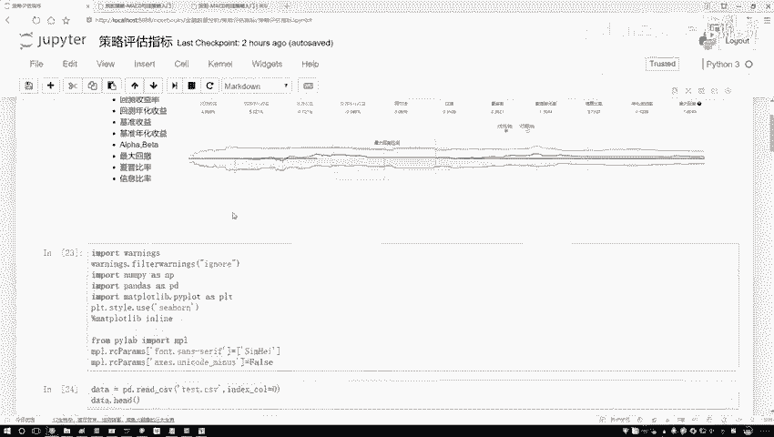

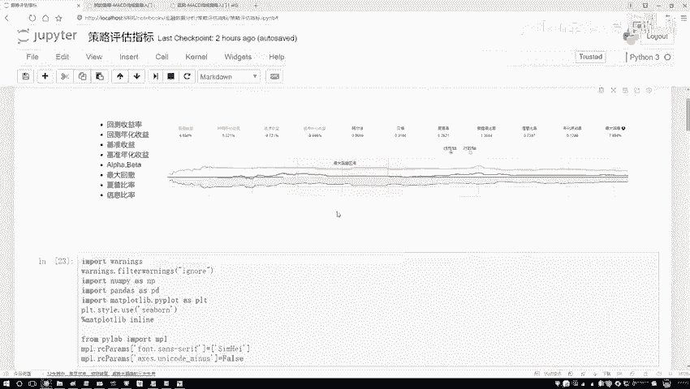

在实际应用中，通常借助专业的量化平台或工具包（如`empyrical`, `backtrader`等）来计算这些指标，无需手动实现所有公式。

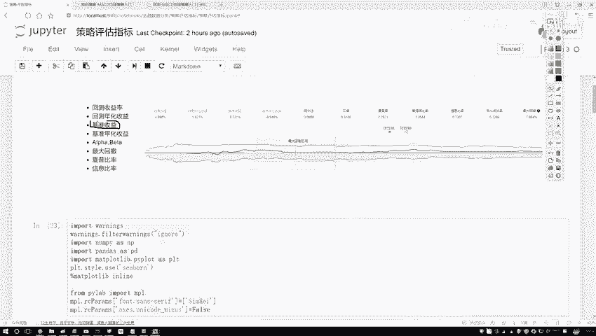

## 总结

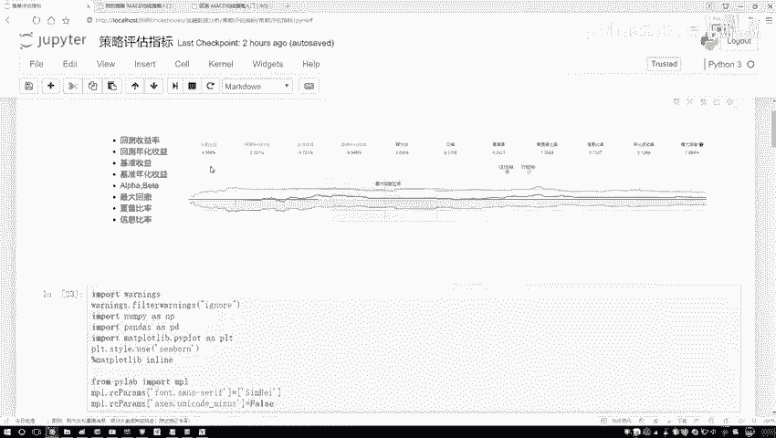

本节课中我们一起学习了阿尔法（Alpha）和贝塔（Beta）的核心概念。我们了解到总收益可以分解为与市场相关的贝塔收益和与策略相关的阿尔法收益。量化交易的主要目标是寻找和创造稳定的阿尔法。同时，我们也简要回顾了最大回撤、夏普比率等其他重要评估指标，为后续深入的策略分析与实战打下基础。