# Python金融时间序列分析与量化交易实战教程：P25：24.百分位去极值方法 📊

在本节课中，我们将学习如何对因子数据进行预处理。因子是影响投资决策的指标，例如市净率或营收增长率。处理这些数据是构建有效量化策略的关键步骤。我们将按照“三步走”策略进行讲解：去极值、标准化和中性化。

上一节我们介绍了因子数据的基本概念，本节中我们来看看如何处理数据中的极端值。

## 第一步：去极值处理

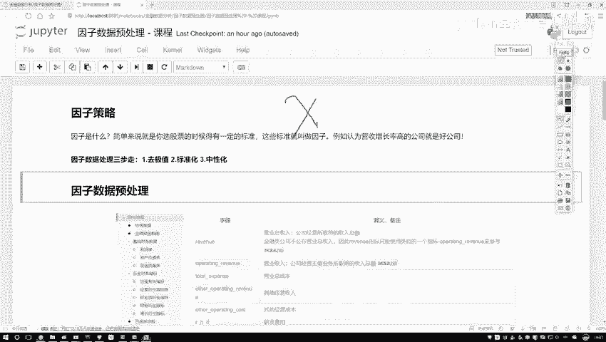

在数据挖掘中，数据集中可能存在少数远离主体分布的极端值（离群点）。直接使用这些数据建模可能会影响结果的准确性。因此，我们需要对极值进行处理。

常见的处理方法不是直接删除数据点，而是将其“拉回”到合理的边界内。例如，如果设定上界为5，而某个数据点的值为10，我们将其值修正为5。

以下是几种去极值的方法：

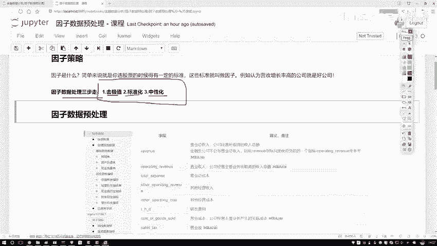

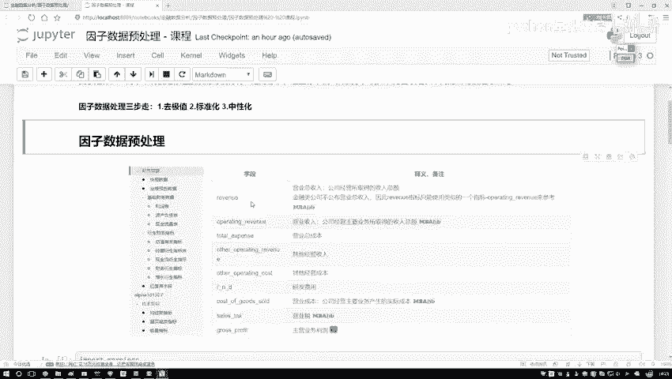

### 1. 分位数法

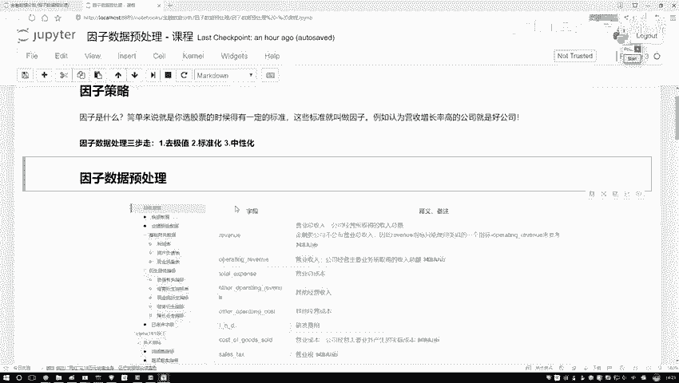

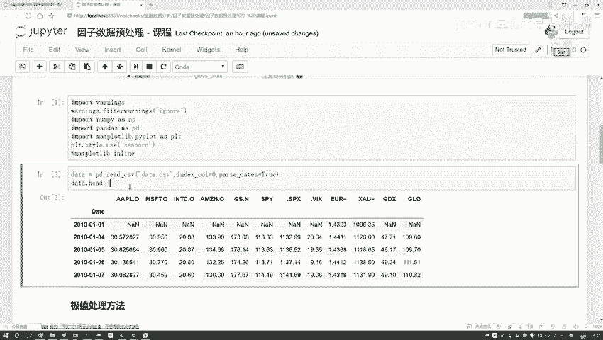

分位数是描述数据分布位置的重要统计量。中位数（50%分位数）比均值更能抵抗极端值的影响。例如，计算平均工资时，少数高管的巨额薪资会大幅拉高均值，而中位数则能更好地反映普通员工的薪资水平。

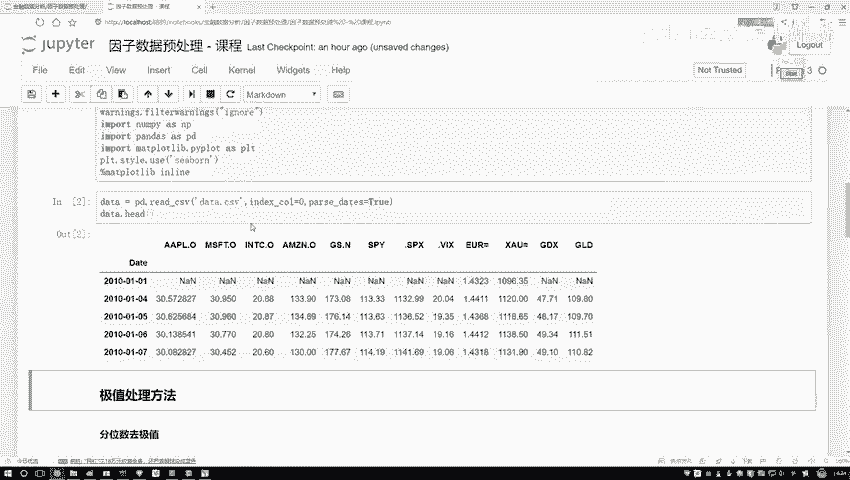

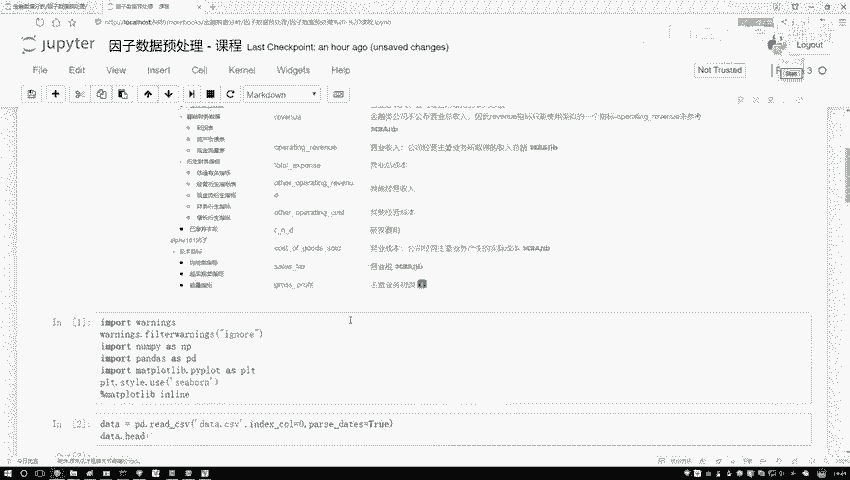

在分位数法中，我们主要关注三个位置：
*   **Q1**：第一四分位数，即25%分位数。
*   **Q2**：中位数，即50%分位数。
*   **Q3**：第三四分位数，即75%分位数。

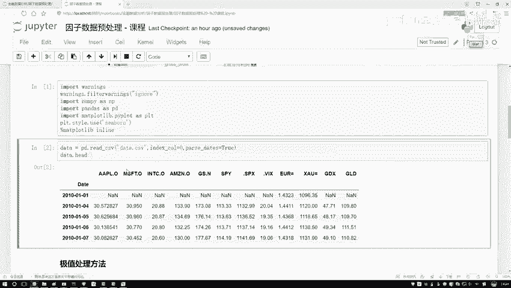

通过计算Q1和Q3，我们可以定义一个合理的数值范围，并将超出此范围的值修正到边界上。

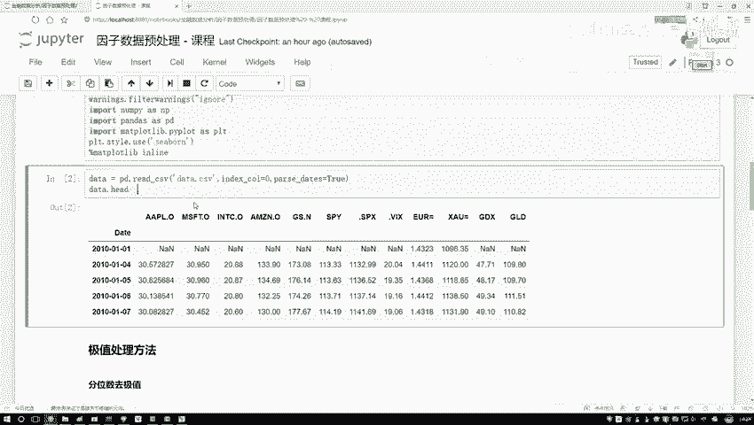

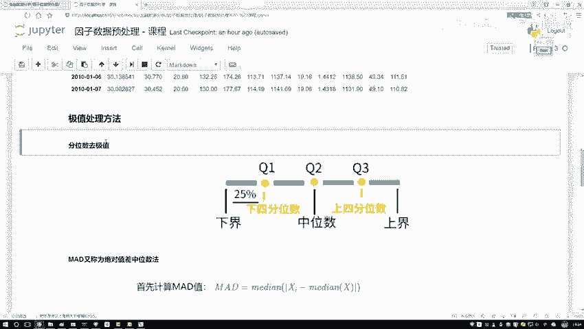

接下来，我们通过代码演示如何实现百分位去极值。

```python
# 导入必要的工具包
import pandas as pd
import numpy as np

# 读取示例数据（此处以苹果股价为例，实际应用中应为因子数据）
data = pd.read_csv('apple_stock.csv')
price_data = data['Close']

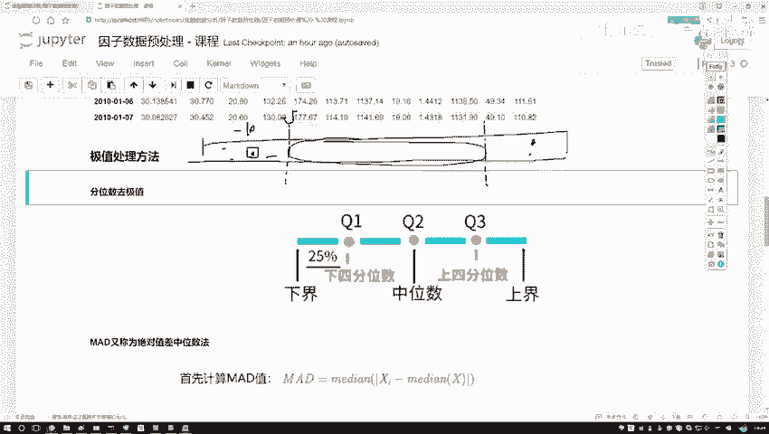

# 定义百分位去极值函数
def percentile_winsorize(series, lower_percentile=5, upper_percentile=95):
    """
    使用百分位法对序列进行去极值处理。
    :param series: 输入的数据序列
    :param lower_percentile: 下界百分位，默认5%
    :param upper_percentile: 上界百分位，默认95%
    :return: 处理后的数据序列
    """
    # 计算上下边界
    lower_bound = np.percentile(series, lower_percentile)
    upper_bound = np.percentile(series, upper_percentile)
    
    # 将小于下界的值替换为下界，大于上界的值替换为上界
    winsorized_series = series.copy()
    winsorized_series[winsorized_series < lower_bound] = lower_bound
    winsorized_series[winsorized_series > upper_bound] = upper_bound
    
    return winsorized_series

# 应用去极值函数
processed_data = percentile_winsorize(price_data)
print("原始数据极值情况：", price_data.min(), price_data.max())
print("处理后数据极值情况：", processed_data.min(), processed_data.max())
```

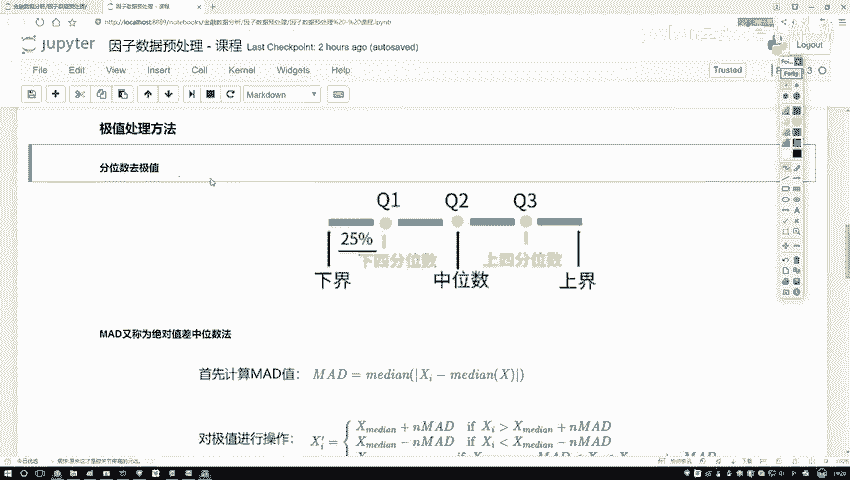

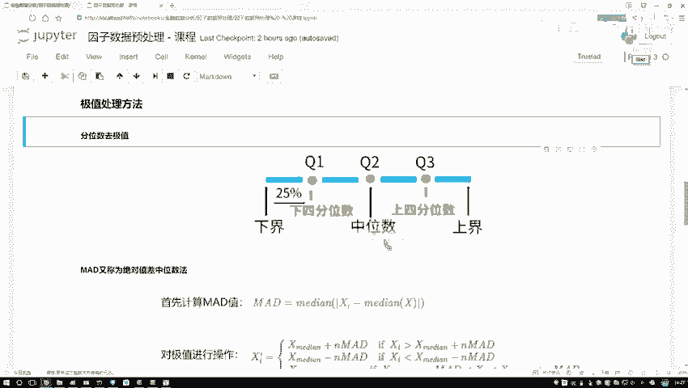

以上代码展示了如何使用百分位法（例如，取5%和95%分位数作为边界）来限制数据的范围，从而实现去极值。

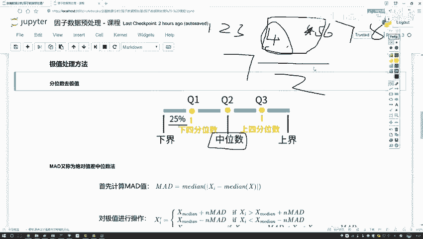

除了百分位法，还有其他方法，如**3σ原则（均值±3倍标准差）**和**绝对中位差（MAD）法**。它们核心思想类似：识别异常值并将其调整至合理边界。

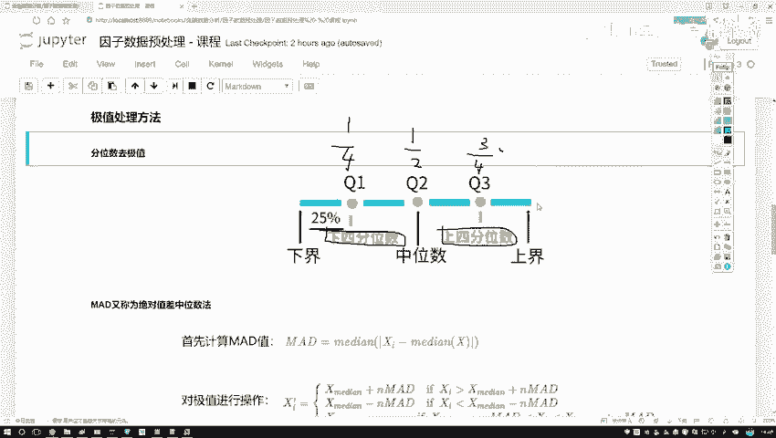

本节课中我们一起学习了因子数据预处理的第一步——去极值。我们了解了为何要处理极值，并重点掌握了基于分位数的去极值方法及其代码实现。在接下来的章节中，我们将继续学习数据标准化和中性化的处理方法。