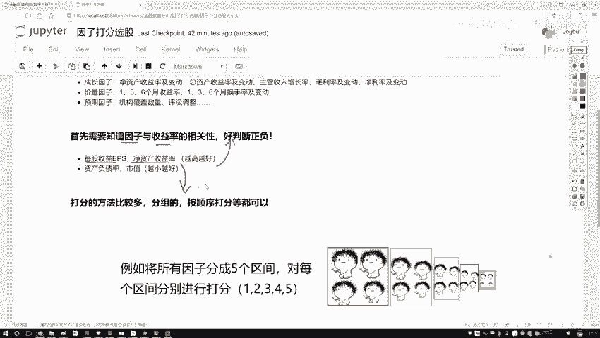
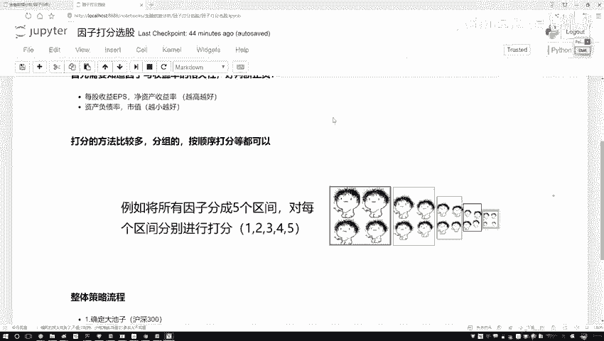
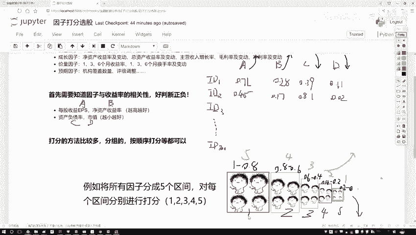
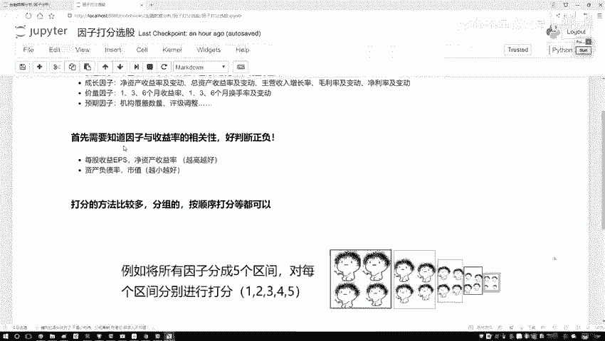
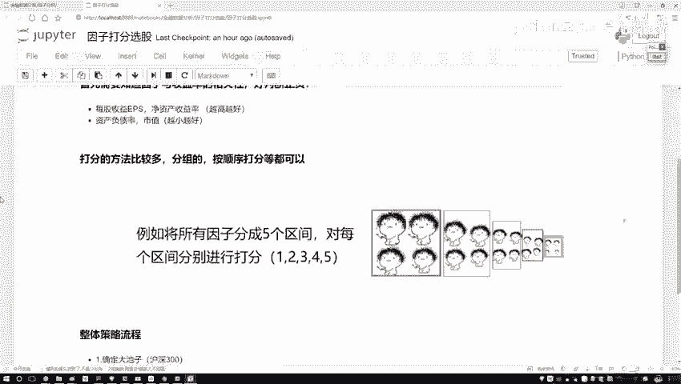
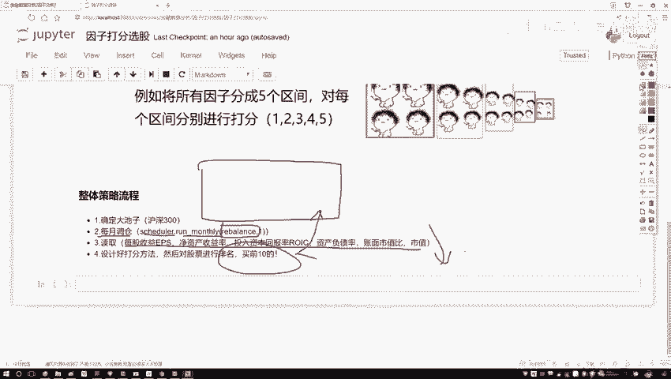
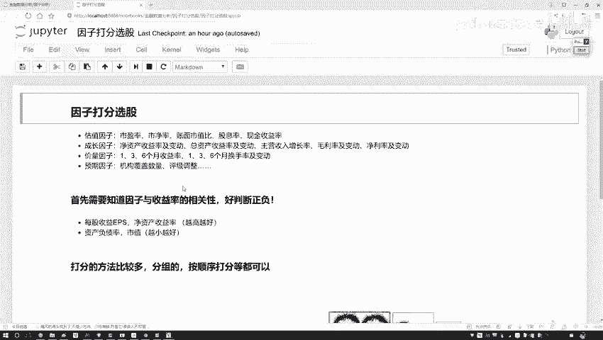

# Python金融时间序列分析与量化交易实战教程：P46：45.整体任务流程梳理

在本节课中，我们将学习如何为股票因子进行打分，并梳理一个完整的量化策略构建流程。我们将通过一个具体的例子，演示如何根据多个指标对股票进行评分和排序，从而选出最具潜力的投资标的。

上一节我们介绍了如何获取和预处理因子数据，本节中我们来看看如何对这些因子进行综合打分。

## 打分方法详解

有了预处理后的因子数据，接下来我们需要为每只股票进行综合打分。打分的方法有很多种，这里我们介绍一种基于区间划分的常用方法。

以下是打分的基本步骤：

1.  **准备样本数据**：假设我们有沪深300的成分股作为股票池，每只股票有A、B、C、D四个因子指标。其中，因子A和B是“越大越好”的指标（例如收益率、增长率），因子C和D是“越小越好”的指标（例如负债率、市值）。
2.  **获取指标数值**：对于每只股票（如`id1`, `id2`, ..., `id300`），我们都能查询到其四个因子的具体数值。这些数值通常是经过归一化处理，落在0到1之间。
3.  **划分数值区间**：将每个因子的取值范围（例如0到1）划分为若干个区间。例如，可以划分为以下五个区间：`[1.0, 0.8)`、`[0.8, 0.6)`、`[0.6, 0.4)`、`[0.4, 0.2)`、`[0.2, 0.0]`。
4.  **设计打分规则**：根据因子的性质（越大越好或越小越好）为每个区间赋予分值。
    *   **对于“越大越好”的因子（A, B）**：数值落入高区间则得高分。例如：`[1.0, 0.8)`得5分，`[0.8, 0.6)`得4分，依此类推，`[0.2, 0.0]`得1分。
    *   **对于“越小越好”的因子（C, D）**：数值落入低区间则得高分。例如：`[0.2, 0.0]`得5分，`[0.4, 0.2)`得4分，依此类推，`[1.0, 0.8)`得1分。
5.  **计算单因子得分**：根据每只股票每个因子的具体数值，确定其落入的区间，并得到该因子的得分。
6.  **计算综合总分**：将一只股票所有因子的得分相加，得到该股票的综合总分。
7.  **排序与选股**：对所有股票的综合总分进行排序，选择排名最高的前N只（例如前10只）作为下一次调仓的目标。

### 打分计算示例

假设有两只股票`id1`和`id2`，其因子值如下（已归一化）：

*   `id1`: A=0.71, B=0.28, C=0.39, D=0.01
*   `id2`: A=0.45, B=0.17, C=0.81, D=0.02

根据上述规则进行计算：

1.  **`id1`打分**：
    *   因子A (越大越好): 0.71 ∈ `[0.8, 0.6)` -> **4分**
    *   因子B (越大越好): 0.28 ∈ `[0.4, 0.2)` -> **2分**
    *   因子C (越小越好): 0.39 ∈ `[0.4, 0.2)` -> **4分**
    *   因子D (越小越好): 0.01 ∈ `[0.2, 0.0]` -> **5分**
    *   **总分** = 4 + 2 + 4 + 5 = **15分**

2.  **`id2`打分**：
    *   因子A: 0.45 ∈ `[0.6, 0.4)` -> **3分**
    *   因子B: 0.17 ∈ `[0.2, 0.0]` -> **1分**
    *   因子C: 0.81 ∈ `[1.0, 0.8)` -> **1分**
    *   因子D: 0.02 ∈ `[0.2, 0.0]` -> **5分**
    *   **总分** = 3 + 1 + 1 + 5 = **10分**

比较总分，`id1`（15分）排名高于`id2`（10分）。将此方法应用于所有300只股票，即可得到全市场的排名。

> **其他方法**：除了区间划分法，也可以直接根据数值大小排序赋分。例如，对于“越大越好”的因子，将300只股票按该因子值从大到小排序，排名第1的赋300分，排名第300的赋1分。核心目标是得到一个可汇总、可比较的综合评分。

## 整体策略流程梳理

接下来，我们将上述打分法嵌入到一个完整的月度调仓策略中。以下是策略执行的完整流程：

1.  **确定股票池**：首先，定义我们的选股范围。本例中，我们使用**沪深300指数**的成分股作为初始股票池。在代码中，这通常在`contest`或初始化部分设置。
2.  **设置调仓周期**：确定策略的调仓频率。量化策略中，每月或每季度调仓较为常见。我们将设置一个**定时器**（例如每月第一个交易日），触发调仓函数。
3.  **实现调仓函数**：核心在于实现一个名为`rebalance`的函数。该函数在每次调仓日被调用，执行以下操作：
    *   **数据获取与预处理**：获取当前股票池中所有股票的所需因子数据（A, B, C, D）。明确各因子的方向（前两个越大越好，后两个越小越好）。
    *   **因子打分**：使用上述打分方法，为每只股票的每个因子计算得分。
    *   **计算综合得分**：汇总每只股票的所有因子得分，得到综合总分。
    *   **生成交易清单**：根据综合总分进行排序，选出排名最高的前10只股票。
    *   **执行调仓**：将投资组合的资产调整至这10只股票上（例如，等权重配置）。
4.  **回测与评估**：将整个策略流程在历史数据中运行，评估其收益、风险等表现，观察简单的打分法能否带来超越基准的收益。

本节课中我们一起学习了基于多因子的股票打分方法，并梳理了一个完整的量化策略构建流程。我们从划分区间、设计打分规则开始，逐步计算单因子得分和综合总分，最终通过排序选出目标股票。这套方法是因子投资中的基础工具，逻辑清晰且易于实现，为构建更复杂的量化模型打下了坚实的基础。