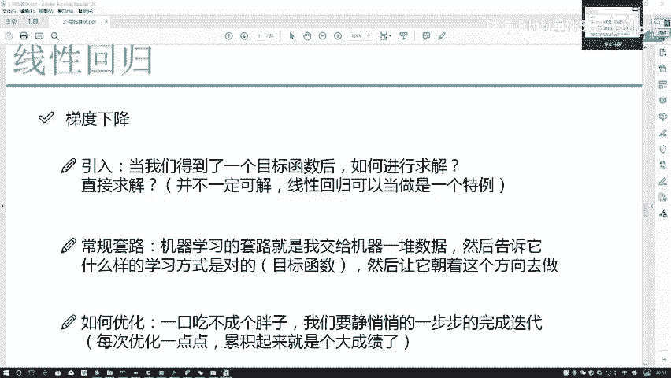
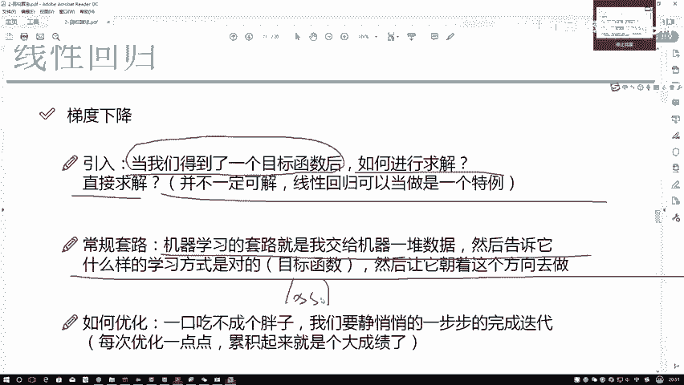
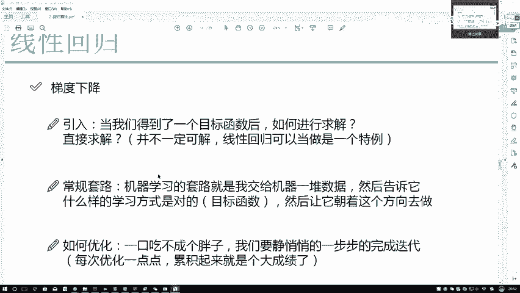
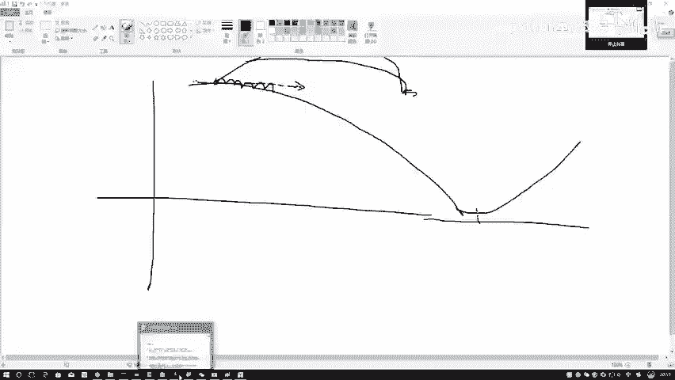
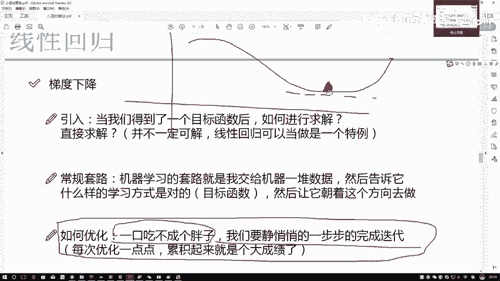

# Python金融时间序列分析与量化交易实战教程：P57：56.梯度下降通俗解释

在本节课中，我们将要学习机器学习中一个核心的优化算法——梯度下降。我们将通过一个通俗易懂的“下山”比喻，来解释梯度下降是如何工作的，以及为什么它在求解复杂问题时如此重要。

## 概述：什么是梯度下降？

梯度下降是一种优化算法，也是机器学习中求解模型参数的核心思路。当我们得到一个目标函数（或称损失函数）后，就需要对其进行优化求解。虽然在线性回归等少数情况下可以直接求出解析解，但这只是一个巧合。在绝大多数机器学习问题中，我们无法直接得到真实答案，因此必须依赖像梯度下降这样的迭代优化方法。

上一节我们介绍了目标函数的概念，本节中我们来看看如何通过梯度下降来优化它。

## 梯度下降的通俗解释

机器学习的常规套路是：首先给模型提供数据，并告诉它损失函数（Loss Function）长什么样子。接下来，模型的任务就是沿着能使损失函数值减少的方向去调整参数。

为了更直观地理解，我们可以将这个过程想象成“下山”。

### 将优化问题比作“下山”

假设我们的损失函数是一座山，而我们的目标就是找到这座山的最低点（即损失最小的点）。一开始，我们并不知道最低点在哪里。

以下是初始化的步骤：
*   我们会为模型的参数（例如 `θ1` 和 `θ2`）随机赋予一组初始值，比如 `θ1 = 3.6`，`θ2 = 1.1`。
*   这相当于我们随机站在了山上的某个位置。

现在，我们有了一个当前位置。接下来要思考的是：为了找到最低点，我们应该往哪个方向走？显然，我们应该向下山的方向走。

### 寻找最快的下山方向

从当前点出发，下山的路可能有很多条。我们不仅希望下山，还希望**下得越快越好**。那么，什么样的方向是当前点下山最快的方向呢？

答案是：沿着山坡**最陡峭**的方向。在数学上，这个方向就是该点损失函数的**梯度**方向。

> 梯度方向是函数值上升最快的方向。由于我们的目标是让损失函数值下降（即下山），因此我们应该沿着梯度的**反方向**前进。这正是“梯度下降”这个名字的由来。

### 迭代优化：一步步走向最低点

找到方向后，我们需要沿着这个方向**走一步**。这一步的大小被称为**学习率**。

走完一步后，我们就到达了一个新的位置。此时，山势（即损失函数的形状）可能已经发生了变化，原来最陡峭的方向可能不再适用。因此，我们需要在这个新位置上**重新计算梯度**，找到当前最陡的下山方向，然后再走一步。

这个过程会不断重复：
1.  在当前点计算梯度（找到方向）。
2.  沿着梯度反方向移动一小步（执行更新）。
3.  到达新位置，重复步骤1和2。

以下是关于步长（学习率）的注意事项：
*   步长不宜过大：如果步长太大，一步跨得太远，可能会“跨过”最低点，甚至走向相反的山坡，导致优化过程不稳定。
*   步长不宜过小：如果步长太小，下山速度会非常缓慢，需要很多步才能到达最低点，训练时间会很长。
因此，选择一个合适的学习率至关重要。

### 何时停止？

通过这样“计算梯度 -> 走一步 -> 再计算梯度”的不断迭代，模型参数会逐渐逼近损失函数的最低点。

最终，优化过程会达到一个饱和状态：参数会在最低点附近来回轻微震荡，损失值不再发生大幅度的下降，基本趋于稳定。这时，我们就可以认为模型已经（近似）找到了最优解，优化过程可以结束。

## 总结

本节课中我们一起学习了梯度下降算法。我们通过“下山”的比喻，解释了梯度下降的核心思想：通过迭代的方式，在每一步计算损失函数的梯度，并沿着梯度反方向更新参数，以逐步逼近函数的最小值。我们强调了方向（梯度）和步长（学习率）的重要性，并描述了迭代直至收敛的整个过程。梯度下降是机器学习的基石，理解它对于后续学习各种复杂模型至关重要。