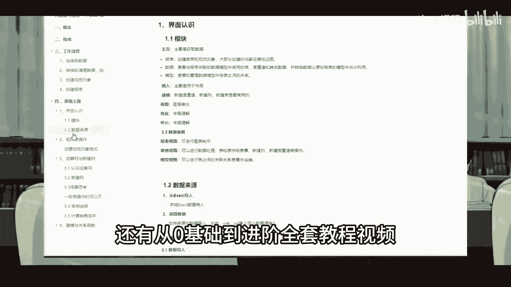

Python金融量化与股票交易：P1：00 课前先导

在本节课中，我们将了解本系列课程的整体框架、学习目标以及所需的预备知识，为后续的金融量化实战打下基础。

作为课程讲师，我为大家准备了多份详细的学习路线图。同时，从零基础到进阶的全套教程视频、项目源码、简历模板、学习路径以及参考书籍也已整理完毕。有需要的同学可以通过置顶评论获取这些资料。

本节课中我们一起学习了本系列课程的定位与可获取的学习资源。接下来，我们将正式开启Python编程与金融数据分析的旅程。