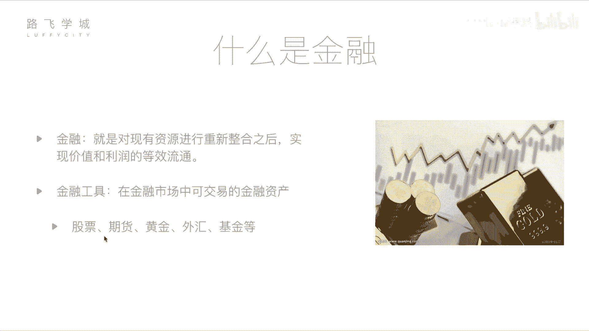

# Python金融量化与数据分析：P2-01：金融量化分析-基本金融知识介绍 🎯

## 概述
在本节课中，我们将学习金融领域的基础知识，特别是量化分析的核心概念。我们将介绍什么是金融、常见的金融工具，并重点讲解股票的基本原理。课程旨在帮助有编程基础但不懂金融的同学，或将金融知识与编程技能结合，实现自动化投资的股民，理解量化投资的基础。

---

## 什么是金融？💰
上一节我们概述了课程目标，本节中我们来看看金融的基本定义。

从定义上讲，金融是对现有资源进行重新整合后，实现价值和利润的等效流通。这个概念可能听起来抽象，但通俗理解，金融涉及通过特定手段让资金增值或发生转移。金融行为并不完全是投机或不劳而获，它对于国家经济和个人财富管理都有积极作用。

例如，一位拥有闲置资金的投资者（A）看好一位创业者（B）的公司前景。A将资金投入B的公司，B用这笔钱发展业务。几年后公司成功上市，价值增长，A获得了投资回报，B的公司得以壮大。这个过程实现了双赢，促进了经济发展，让资金流向了需要它的地方。这就是金融的一个典型场景。

---

## 常见的金融工具 🛠️
理解了金融的基本概念后，我们来看看实现这些资金流动的具体手段，即金融工具。以下是金融市场中几种常见的可交易金融资产：

1.  **股票**：代表对一家公司的所有权份额。购买股票即成为该公司的股东，可分享公司利润（分红）并期待股价上涨带来收益。它是本课程后续讨论的核心。
2.  **期货**：一种标准化合约，约定在未来某一特定时间，以特定价格买卖某种资产（如大宗商品、金融资产）。其特点是**高风险、高收益**。期货交易基于买卖双方对未来价格走势的不同判断。
    *   **示例**：发电厂主预计煤炭半年后涨价，而煤老板预计会跌价。双方签订合约，约定半年后以当前价格交易。若到期时市价高于合约价，电厂主受益；若低于合约价，则煤老板受益。
3.  **黄金**：作为一种历史悠久的“硬通货”，其价格相对稳定，常被视为保值和对冲通胀的工具。价格受全球储量、开采量、宏观经济等因素影响。公式上可简化为：`金价 ∝ 全球货币总量 / 黄金存量`。
4.  **外汇**：指不同国家货币之间的兑换交易。投资者通过预测汇率波动来赚取差价。例如，交易美元/人民币（USD/CNY）汇率。汇率波动受两国经济状况、利率政策等因素影响。通常个人投资者因波动较小、门槛高而较少直接参与。
5.  **基金**：由基金公司汇集众多投资者的资金，交由专业的基金经理进行统一管理和投资（可能投资于股票、债券、期货等多种资产）。个人购买基金份额，相当于委托专家理财。其特点是**风险与收益通常低于直接购买股票**。

---

## 重点：股票 📈
在众多金融工具中，股票是最常见、也是本课程后续进行量化分析的主要对象。

股票代表持有者对一家上市公司的部分所有权。购买股票意味着成为公司的股东，有权获得公司分红（如果公司盈利并决定分红），并可通过股价上涨获利。股票价格受公司业绩、行业前景、宏观经济、市场情绪等多种因素影响，处于持续波动中。

量化分析在股票投资中的应用，就是利用计算机程序（如Python），通过数学模型和统计方法，分析历史数据，寻找价格波动的规律或模式，从而制定客观、可重复的交易策略，以期获得超越市场平均水平的收益或控制风险。

---

## 总结
本节课我们一起学习了金融的基本概念，它关乎资源的整合与价值的流通。我们介绍了股票、期货、黄金、外汇和基金这五种常见的金融工具，了解了它们的基本特性和风险收益特征。其中，**股票**作为公司所有权的凭证，是我们后续进行量化分析实践的核心载体。理解这些基础知识，是将编程技能与金融市场连接起来的第一步。在接下来的课程中，我们将深入探讨如何利用Python对股票数据进行量化分析。