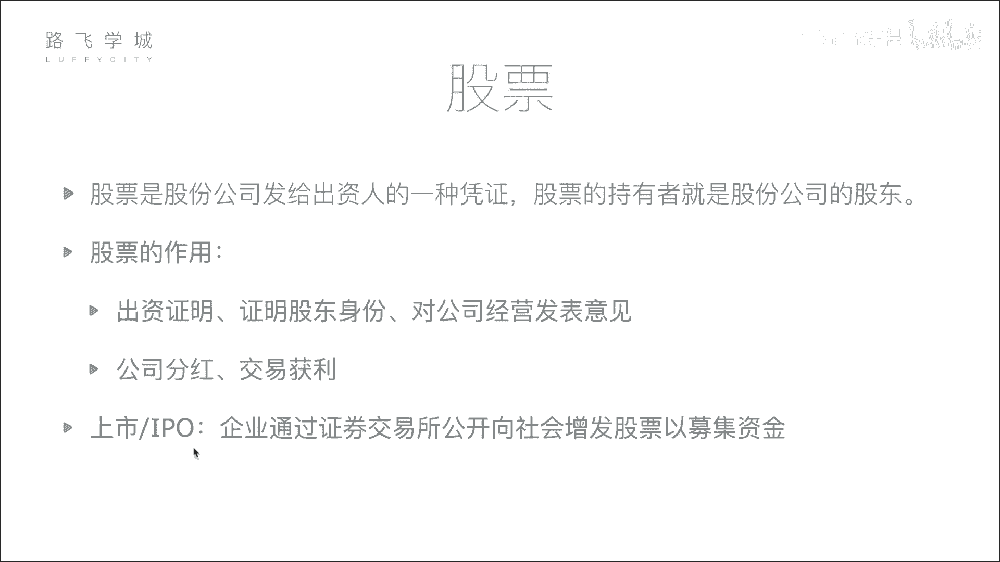
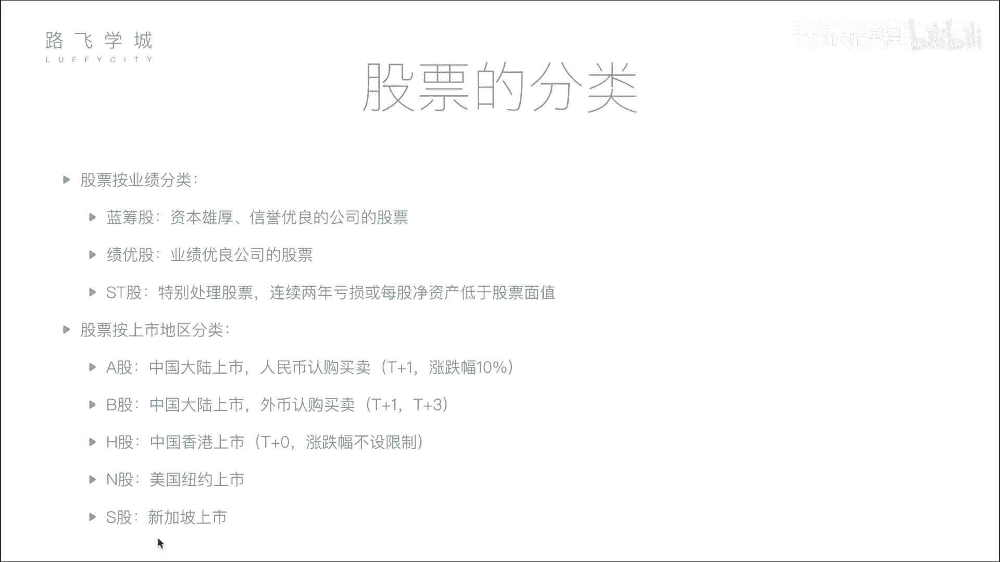

# Python金融量化+股票交易：P3：02 金融量化分析-股票基本知识和股票分类 📈

在本节课中，我们将要学习股票的基本概念、作用以及分类方式。理解这些基础知识是进行后续金融量化分析的前提。

## 股票的定义与作用

股票是股份公司发给出资人的一种凭证。股票的持有者就是股份公司的股东。

为了更形象地理解，我们可以看一个例子。假设一位创业者需要资金，而一位投资者看好他的项目。投资者将资金投入公司，公司则向投资者发行股票作为凭证。这证明投资者为公司出了资，成为了公司的股东之一。例如，一个公司初始有5亿市值，由5位出资人各出1亿建立，那么每位出资人将获得公司20%的股票。

股票的作用主要有两点：
1.  **出资证明与股东身份**：持有股票意味着你是公司的出资人，拥有股东的权利，例如参与股东大会和投票。
2.  **获利途径**：作为股东，可以通过两种主要方式获利：
    *   **公司分红**：当公司盈利时，会按持股比例向股东分配利润。
    *   **交易获利**：在二级市场（如证券交易所）将股票转让给其他投资者，通过买卖价差获利。

上一节我们介绍了股票的基本定义和作用，本节中我们来看看公司如何向公众发行股票。

## 公司上市与IPO

所谓上市，就是企业通过证券交易所能够公开向社会增发股票以及募集资金。

一个公司不能随意向公众募集资金。它需要达到一定体量，并向证监会提交申请，经过严格的审核（如审查财务报表）后，才能获准在证券交易所挂牌交易。上市后，公司的股票可以被所有股民看到并进行买卖。

公司希望上市的主要原因是能够向更广泛的社会大众募集资金。虽然单个普通投资者的资金量小，但庞大的投资者群体能汇聚巨大的资金量。IPO（首次公开募股）指的就是公司第一次上市并向社会公众发行股票的行为。

理解了公司如何进入公开市场，接下来我们了解一下市场上不同类型的股票。

## 股票的分类

股票主要有两种分类方式。

### 按业绩分类

以下是按公司业绩表现的常见分类：

*   **蓝筹股**：指资本雄厚、信誉优良的公司的股票。通常像“大胖子”，体量巨大，例如中石油、中石化。
*   **绩优股**：指业绩优良公司的股票。它们可能规模不是最大，但持续盈利表现优秀，例如贵州茅台。
*   **ST股**：中文叫做“特别处理股票”。当公司连续两年亏损或每股净资产低于股票面值时，会被冠以“ST”标识，以提醒投资者注意风险。

### 按上市地区分类

股票根据其上市交易的地点和货币进行区分：

*   **A股**：在中国大陆（上海、深圳证券交易所）上市，以人民币认购和买卖的股票。
*   **B股**：同样在中国大陆上市，但以外币（如美元、港币）认购和买卖的股票。
*   **H股**：在中国香港上市的股票。
*   **N股**：在美国纽约上市的股票。
*   **S股**：在新加坡上市的股票。

不同市场的交易规则有所不同，以下是几个关键区别：

*   **A股限制**：
    *   **涨跌幅限制**：每日股价波动幅度不得超过前一日收盘价的±10%。公式表示为：`今日价格 ∈ [昨日收盘价 × 0.9， 昨日收盘价 × 1.1]`。
    *   **T+1交割制度**：当日（T日）买入的股票，需到下一个交易日（T+1日）才能卖出。
*   **港股/美股等市场**：通常无涨跌幅限制，且实行T+0交易（当日买入可当日卖出），交易更为灵活。

本节课中我们一起学习了股票的核心概念，包括其作为股东凭证的本质、通过分红和交易获利的途径，以及公司上市（IPO）的过程。我们还了解了股票按业绩（蓝筹股、绩优股、ST股）和按上市地区（A股、B股、H股等）的分类方法，并对比了A股与海外市场在涨跌幅和交易制度上的主要区别。这些基础知识是后续利用Python进行金融量化分析的基石。