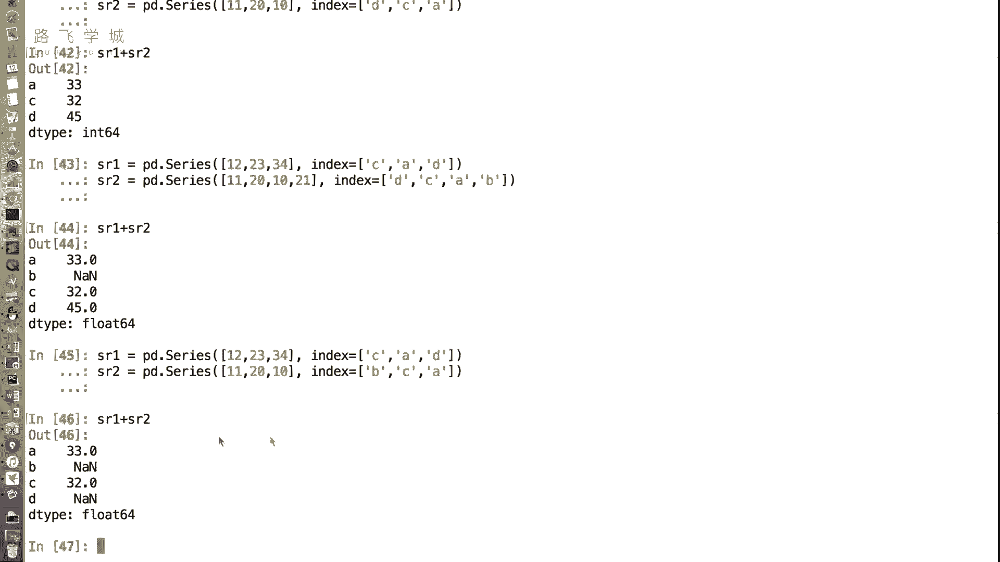
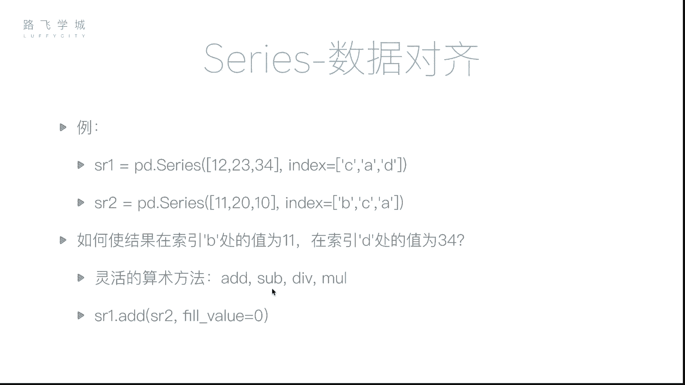
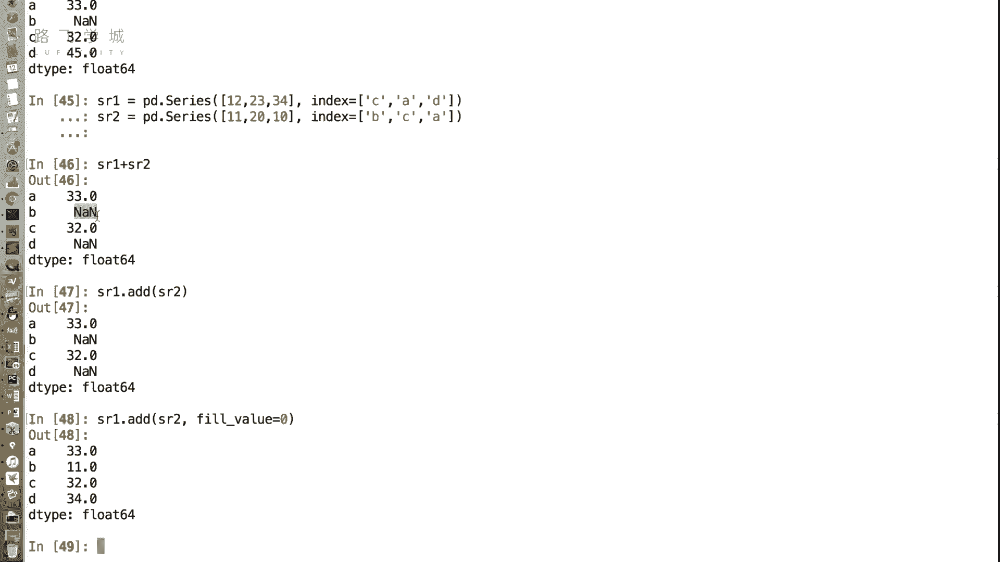

# Python金融量化+股票交易分析：P19：Series数据对齐 📊


在本节课中，我们将要学习Pandas Series的一个核心特性：数据对齐。我们将了解当两个Series对象进行运算时，Pandas如何根据索引标签自动对齐数据，以及如何处理由此可能产生的数据缺失问题。

## 数据对齐的概念

上一节我们介绍了Series的基本操作，本节中我们来看看Series在进行算术运算时一个非常重要的行为：数据对齐。

在NumPy数组中，运算通常是按位置（即下标）进行的。然而，在Pandas Series中，运算更倾向于按照索引标签进行对齐。这意味着，即使两个Series的顺序不同，只要它们的索引标签匹配，相应的值就会被组合在一起进行运算。

**核心公式**：
`Series1 [操作符] Series2` 的结果是基于索引标签对齐后的运算，而非基于位置。


## 数据对齐示例

让我们通过一个具体的例子来理解这个概念。

假设我们有两个Series对象：
*   `sr1`：值为 `[12, 23, 34]`，索引为 `[‘C‘, ’A‘, ’D‘]`。
*   `sr2`：值为 `[11, 20, 10]`，索引为 `[‘D‘, ’C‘, ’A‘]`。

如果执行 `sr1 + sr2`，Pandas不会简单地将第一个值相加（12+11）、第二个值相加（23+20）。相反，它会查找匹配的索引标签：
*   索引 `‘A‘`：`sr1` 中为 `23`，`sr2` 中为 `10`，相加得 `33`。
*   索引 `‘C‘`：`sr1` 中为 `12`，`sr2` 中为 `20`，相加得 `32`。
*   索引 `‘D‘`：`sr1` 中为 `34`，`sr2` 中为 `11`，相加得 `45`。

因此，最终结果是一个新的Series，其索引为 `[‘A‘, ’C‘, ’D‘]`，值为 `[33, 32, 45]`。这个功能非常强大，在处理如不同年份或月份的同类数据时，无需手动排序，只要索引（如日期）一致即可直接运算。

## 索引长度不一致与缺失值

当两个Series的索引不完全相同时，数据对齐仍然可以进行。Pandas会将双方都存在的索引标签进行运算，而对于只存在于一方的索引标签，其结果会被标记为缺失值（NaN，即Not a Number）。

例如：
*   `sr1` 索引为 `[‘A‘, ’C‘, ’D‘]`
*   `sr2` 索引为 `[‘A‘, ’B‘, ’C‘]`

执行 `sr1 + sr2` 后：
*   索引 `‘A‘` 和 `‘C‘` 在双方都存在，正常相加。
*   索引 `‘B‘` 只存在于 `sr2`，索引 `‘D‘` 只存在于 `sr1`，这两个位置的结果都是 `NaN`。

NaN在Pandas中被用来表示缺失的数据。在实际场景中，比如计算员工两个月的出勤总和，如果某员工只在一个月有记录，直接相加会导致其总出勤天数为NaN，这可能不符合我们的计算需求。

## 灵活的算术方法

为了解决上述问题，Pandas提供了一组灵活的算术方法，允许我们在运算时指定如何处理缺失的索引。

以下是这些方法：
*   `.add()`：加法
*   `.sub()`：减法
*   `.mul()`：乘法
*   `.div()`：除法



这些方法可以接受一个 `fill_value` 参数。当某个索引只存在于一个Series中时，可以用 `fill_value` 指定的值（如0）来填充这个“缺失”的值，然后再进行运算。




**核心代码示例**：
```python
# 使用add方法，并指定缺失值填充为0
result = sr1.add(sr2, fill_value=0)
```
执行上述代码后：
*   对于双方都存在的索引，正常相加。
*   对于只存在于 `sr1` 的索引 `‘D‘`，`sr2` 对应值被视为 `0`，因此 `‘D‘` 的结果是 `34 + 0 = 34`。
*   对于只存在于 `sr2` 的索引 `‘B‘`，`sr1` 对应值被视为 `0`，因此 `‘B‘` 的结果是 `0 + 11 = 11`。


## 总结

本节课中我们一起学习了Series的数据对齐特性。我们了解到：
1.  Series的运算是基于索引标签对齐的，而非位置，这为处理顺序不一致的数据带来了极大便利。
2.  当参与运算的Series索引不一致时，会产生缺失值（NaN）。
3.  通过使用 `.add()`, `.sub()` 等灵活的算术方法并设置 `fill_value` 参数，我们可以控制如何处理这些缺失情况，使计算结果更符合业务逻辑。



数据对齐是Pandas强大功能的基础，而由此产生的缺失值则需要我们妥善处理。在接下来的课程中，我们将专门讲解如何处理这些缺失值。