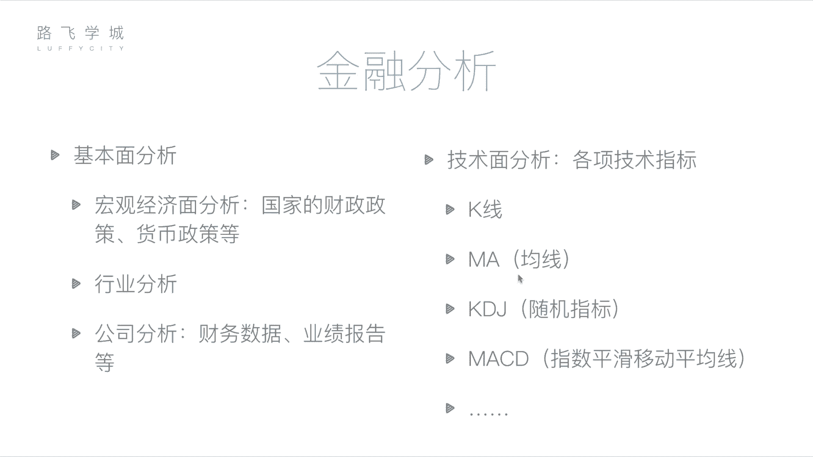
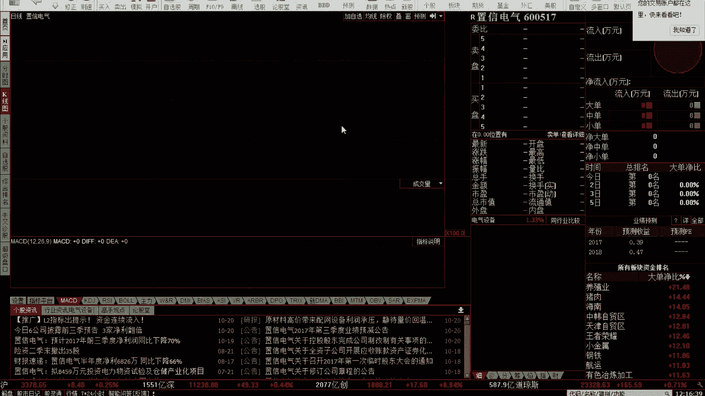

# Python金融量化+股票交易分析：P6：05 金融量化分析-金融分析 📈

在本节课中，我们将要学习金融分析的两大核心方法：基本面分析和技术面分析。了解这些方法将帮助我们理解如何理性地评估和选择股票，而不是盲目地进行交易。

上一节我们介绍了金融和股票的基础知识，本节中我们来看看如何进行具体的金融分析。

## 概述
金融分析旨在为股票买卖决策提供依据。它主要分为两大流派：基本面分析和技术面分析。基本面分析关注公司的内在价值和宏观经济环境，而技术面分析则专注于研究市场价格和交易量等历史数据所蕴含的规律。

## 基本面分析
基本面分析的核心是评估公司的运营状况和整体经济环境。这相当于我们之前讨论的影响股价因素中“公司自身因素”的延伸。通过分析公司是否健康、行业是否有前景以及宏观经济是否有利，来决定是否购买其股票。

基本面分析主要包括以下三个方面：

以下是基本面分析的三个层面：
1.  **宏观经济面分析**：分析国家的财政政策、货币政策等。这有助于判断资金是倾向于流入股市还是被储存起来。但需注意，宏观经济规律并非总是与股市表现一致。
2.  **行业分析**：判断整个行业的发展前景。例如，可以选取该行业中几只具有代表性的股票，观察其整体走势来评估行业状况。
3.  **公司分析**：这是最具体的一环。例如，若要购买贵州茅台的股票，就需要深入研究该公司的公开财务数据。上市公司会定期发布经过审计的财报（如年度报告和季度报告），这些数据是公开且相对客观的。通过分析财报（如利润、每股收益等）并结合新闻、实地考察等信息，可以判断公司运营的好坏。如果公司运营良好、盈利能力强，则其股票可能值得考虑。

## 技术面分析
技术面分析认为，所有影响市场的因素都已反映在价格和交易量等历史数据中。其核心是通过研究过去一段时间内的市场走势和特定技术指标来预测未来价格动向。

需要注意的是，仅仅看到股票过去上涨，并不意味着未来一定会继续上涨。因此，我们需要借助一些定义好的技术指标来辅助判断。

以下是两个基础且重要的技术指标：

### K线图
K线图是展示股票每日价格变动的图表。一根K线包含了四个关键价格：开盘价、收盘价、最高价和最低价。

K线主要分为两种：
*   **阳线**：通常显示为红色或空心，表示当日收盘价高于开盘价，即股价上涨。
*   **阴线**：通常显示为绿色或实心，表示当日收盘价低于开盘价，即股价下跌。

一根标准K线的结构如下：
*   **实体**：中间的矩形部分。在阳线中，实体的**下边缘**表示开盘价，**上边缘**表示收盘价；在阴线中则相反，实体的**上边缘**表示开盘价，**下边缘**表示收盘价。
*   **影线**：实体上下方的细线。**上影线**的顶端表示当日最高价，**下影线**的底端表示当日最低价。

K线还有一些特殊形态，例如“十字星”（开盘价等于收盘价）或“光头光脚线”（没有影线），这些形态可能具有特定的市场含义。

### 移动平均线（MA）
移动平均线是通过计算过去一段时间内股价的平均值，并将这些平均值连接起来形成的曲线。它用于平滑价格波动，显示趋势方向。

常见的移动平均线包括：
*   **MA5**：5日均线，计算过去5个交易日收盘价的平均值。
*   **MA60**：60日均线，计算过去60个交易日收盘价的平均值。

其计算公式可以简化为：
`MA(N) = (P1 + P2 + ... + PN) / N`
其中，`P1` 到 `PN` 代表过去N个交易日的收盘价。

在图表中，不同周期的均线（如白色的MA5和黄色的MA60）可以相互比较，用于生成交易信号，例如后续课程中会讲到的“双均线策略”。

## 总结
本节课中我们一起学习了金融分析的两大支柱。基本面分析帮助我们从公司价值和经济环境的角度挑选股票，而技术面分析则为我们提供了通过历史价格图表和指标（如**K线**和**移动平均线MA**）来寻找买卖时机的方法。理解这两种分析方法，是进行理性股票投资和后续量化策略开发的重要基础。