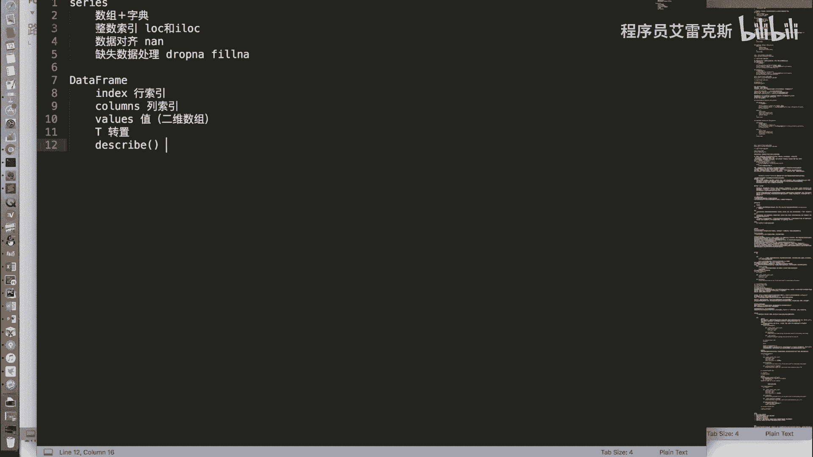
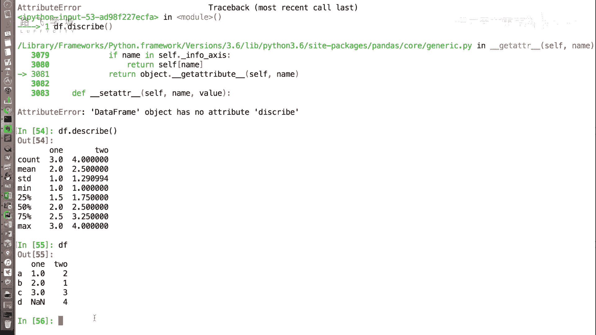

# Python金融量化投资分析与股票交易：P22：DataFrame常用属性 📊

在本节课中，我们将要学习Pandas库中`DataFrame`对象的常用属性。`DataFrame`是二维表格型数据结构，是金融数据分析的核心工具。掌握其属性有助于我们快速了解数据的基本结构和统计信息。

上一节我们介绍了`DataFrame`对象的创建方式，本节中我们来看看它有哪些常用的属性。

## 常用属性详解

`DataFrame`的许多属性与`Series`对象类似，但由于它是二维结构，因此也拥有一些独特的属性。

### 1. 索引与值

`index`属性用于获取`DataFrame`的行索引，即表格最左侧的索引标签。

`columns`属性用于获取`DataFrame`的列索引，即表格最上方的列名。

`values`属性用于获取`DataFrame`中的数据值。与`Series`返回一维数组不同，`DataFrame`的`values`属性返回的是一个二维数组（`numpy.ndarray`），其中每一行是一个子数组。

以下是相关属性的代码示例：

```python
import pandas as pd
import numpy as np

# 创建一个示例DataFrame
data = {
    ‘one‘: [1, 2, np.nan, 4],
    ‘two‘: [5, 6, 7, 8]
}
df = pd.DataFrame(data, index=[‘A‘, ‘B‘, ‘C‘, ‘D‘])

# 获取行索引
print(df.index)   # 输出: Index([‘A‘, ‘B‘, ‘C‘, ‘D‘], dtype=‘object‘)

# 获取列索引
print(df.columns) # 输出: Index([‘one‘, ‘two‘], dtype=‘object‘)

# 获取值（二维数组）
print(df.values)
# 输出:
# [[ 1.  5.]
#  [ 2.  6.]
#  [nan  7.]
#  [ 4.  8.]]
```

### 2. 转置

`T`属性用于获取`DataFrame`的转置。转置操作会将数据的行和列进行交换，即原来的行索引变为列索引，原来的列索引变为行索引。

```python
# 获取DataFrame的转置
df_transposed = df.T
print(df_transposed)
# 输出:
#        A    B    C    D
# one  1.0  2.0  NaN  4.0
# two  5.0  6.0  7.0  8.0
```

**注意**：在转置过程中，如果某一列包含`NaN`（缺失值，属于浮点类型），Pandas可能会将整列的数据类型统一为浮点数（`float`），以确保数据类型的一致性。这是因为浮点数可以兼容整数，但整数无法表示浮点数。如果需要转换数据类型，可以使用`astype()`方法。

### 3. 描述性统计

`describe()`是一个方法，而非属性。它用于快速生成`DataFrame`中数值列的描述性统计摘要，对于初步了解数据分布非常有用。

以下是`describe()`方法返回的主要统计指标：

*   **count**：非缺失值的数量。
*   **mean**：平均值。
*   **std**：标准差，衡量数据的离散程度。
*   **min**：最小值。
*   **25%**：第一四分位数（下四分位数）。
*   **50%**：中位数。
*   **75%**：第三四分位数（上四分位数）。
*   **max**：最大值。

```python
# 获取描述性统计信息
print(df.describe())
# 输出:
#             one       two
# count  3.000000  4.000000
# mean   2.333333  6.500000
# std    1.527525  1.290994
# min    1.000000  5.000000
# 25%    1.500000  5.750000
# 50%    2.000000  6.500000
# 75%    3.000000  7.250000
# max    4.000000  8.000000
```


**说明**：在示例中，“one”列的`count`为3，因为该列有一个`NaN`（缺失值），所以只统计了3个有效数值。

## 总结

本节课中我们一起学习了`DataFrame`对象的几个核心常用属性与方法：



1.  **`index`**：获取行索引。
2.  **`columns`**：获取列索引。
3.  **`values`**：以二维数组形式获取数据值。
4.  **`T`**：获取数据的转置（行变列，列变行）。
5.  **`describe()`**：生成数值列的描述性统计摘要，包括计数、均值、标准差、分位数等。



理解并熟练运用这些属性，是进行高效数据查看和初步分析的基础。在后续课程中，我们将基于这些知识，学习如何对`DataFrame`进行更复杂的数据操作与分析。