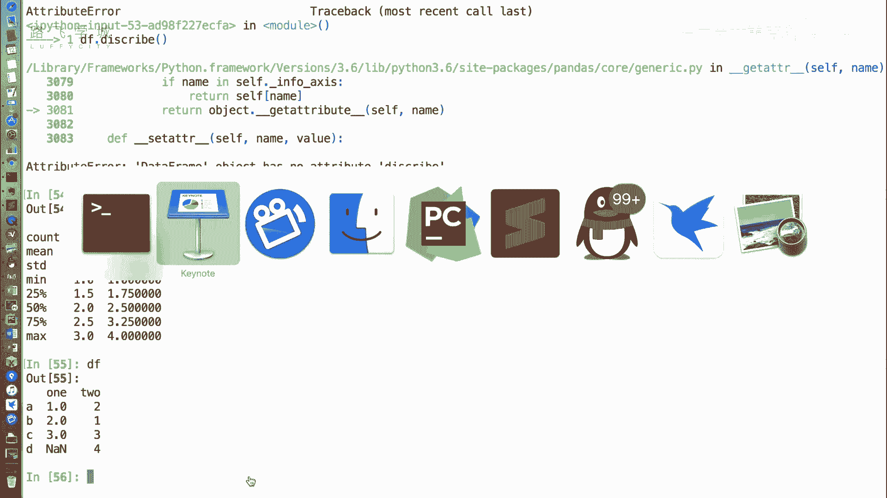
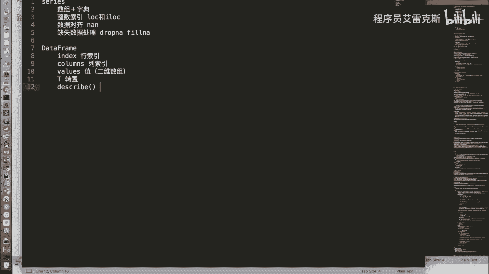
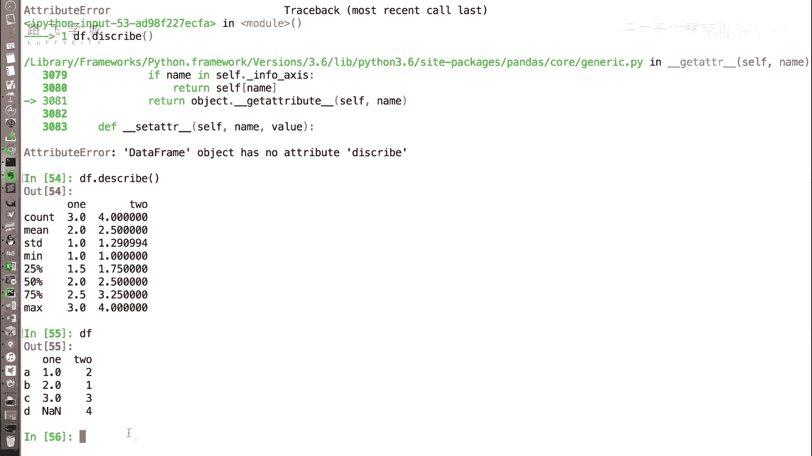

# Python金融量化投资分析与股票交易：P24：DataFrame常用属性 📊

在本节课中，我们将学习Pandas库中`DataFrame`对象的几个常用属性。`DataFrame`是二维表格型数据结构，理解其属性是进行数据操作和分析的基础。我们将逐一介绍这些属性的含义和用法。

上一节我们介绍了`DataFrame`对象的创建方式，本节中我们来看看它有哪些核心属性。

## 常用属性详解

### 1. 行索引与列索引
`DataFrame`有两个主要的索引：行索引和列索引。

*   **`index`属性**：用于获取`DataFrame`的行索引。行索引是表格最左侧的标签，用于标识每一行数据。
    ```python
    df.index
    ```
*   **`columns`属性**：用于获取`DataFrame`的列索引。列索引是表格最上方的标签，用于标识每一列数据。
    ```python
    df.columns
    ```

### 2. 数据值与转置
除了索引，我们还需要获取表格中的实际数据，并可能需要对表格进行转置操作。

*   **`values`属性**：用于获取`DataFrame`中所有数据的数组。与`Series`不同，`DataFrame`的`values`属性返回的是一个**二维数组**，其中每一行对应一个一维数组。
    ```python
    df.values
    ```
*   **`T`属性**：表示转置。它将`DataFrame`的行和列进行交换，即原来的行索引变为列索引，原来的列索引变为行索引。
    ```python
    df.T
    ```
    > **注意**：在转置过程中，如果某一列同时包含整数和浮点数（例如存在`NaN`缺失值），Pandas可能会将整列统一转换为浮点数类型，因为浮点数可以表示整数，反之则不行。可以使用`.astype()`方法进行类型转换。

### 3. 描述性统计
`DataFrame`提供了一个快速查看数据统计信息的方法。

*   **`describe()`方法**：返回一个包含各列基本统计信息的`DataFrame`。以下是它计算的主要指标：
    *   `count`: 非空值的数量。
    *   `mean`: 平均值。
    *   `std`: 标准差。
    *   `min`: 最小值。
    *   `25%`: 第一四分位数。
    *   `50%`: 中位数。
    *   `75%`: 第三四分位数。
    *   `max`: 最大值。
    ```python
    df.describe()
    ```



## 总结

本节课中我们一起学习了`DataFrame`的几个核心属性与方法：
1.  **`df.index`**：获取行索引。
2.  **`df.columns`**：获取列索引。
3.  **`df.values`**：获取数据的二维数组。
4.  **`df.T`**：获取转置后的`DataFrame`。
5.  **`df.describe()`**：快速获取各列的描述性统计信息。





掌握这些属性是后续进行数据筛选、清洗和分析的重要前提。下一节，我们将开始学习如何对`DataFrame`进行数据选取和切片操作。