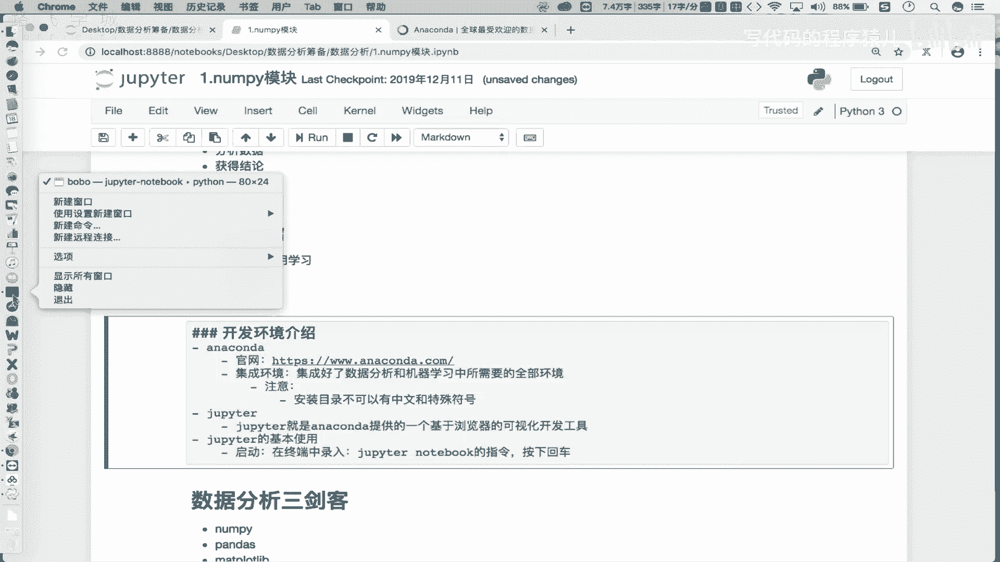
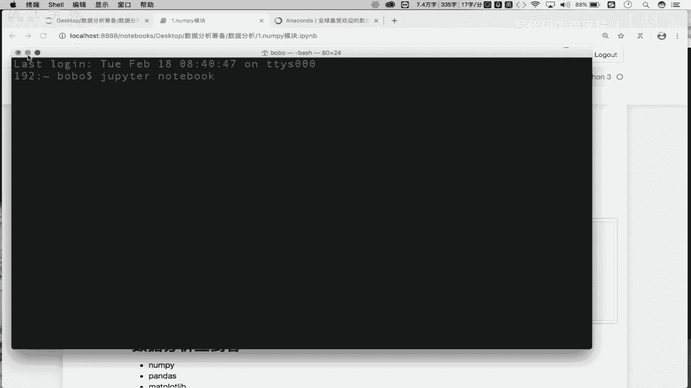
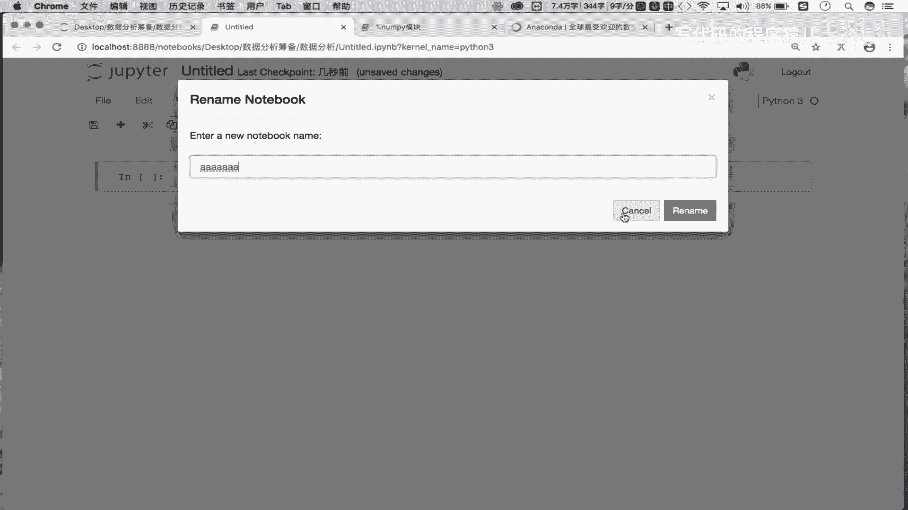
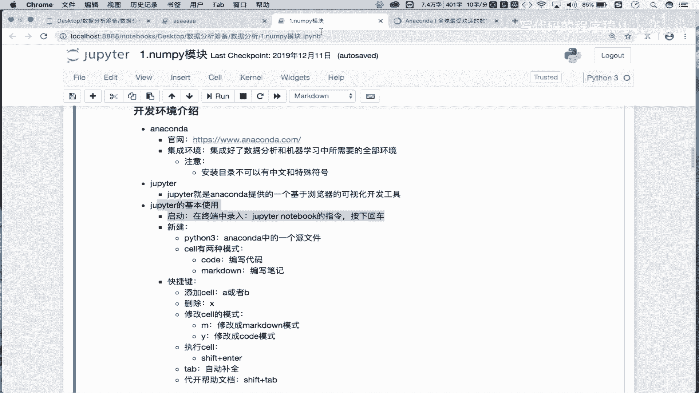

# Python金融量化实战：P3：02：修炼前的准备-环境搭建 🛠️

## 概述
在本节课中，我们将学习如何搭建数据分析的开发环境。我们将介绍核心工具Anaconda和Jupyter Notebook，并详细讲解它们的安装与基本使用方法，为后续的代码实战做好准备。

上一节我们对数据分析进行了初步介绍。本节中，我们来看看数据分析所对应的开发环境搭建流程。

## Anaconda：数据分析的集成环境

首先，大家看到屏幕中显示的工具，就是我们数据分析的开发环境。这里我们没有使用PyCharm，而是使用了一个叫做Jupyter的开发环境。

这些开发环境各表示怎样的含义呢？我们逐步进行讲解。

### 什么是Anaconda？
Anaconda是一个**集成环境**。这意味着它已经帮助我们集成好了数据分析和机器学习开发所需的全部环境。

**核心概念**：`Anaconda = 数据科学集成环境（Python + 常用库 + 包管理器）`

如果你想进行数据分析或机器学习开发，首先需要在本地计算机中安装好Anaconda。安装好Anaconda后，就意味着我们可以使用这个集成环境进行相关开发工作。

### 如何安装Anaconda？
你需要从Anaconda官网下载安装包。官网地址已提供在课程资料中。

以下是安装步骤：
1.  根据你的操作系统（Windows、macOS、Linux）下载对应的Anaconda安装包。
2.  运行安装包，按照提示进行“下一步”安装即可（傻瓜式安装）。

**重要注意事项**：安装目录**不可以包含中文和特殊符号**。建议安装到某个磁盘的根目录下（例如 `C:\` 或 `D:\`）。

细致的安装流程，我会提供一个Word文档供大家参考。





## Jupyter Notebook：基于浏览器的开发工具 📓

接下来介绍Jupyter Notebook（或简称Jupyter）。它是Anaconda提供的一个**基于浏览器的可视化开发工具**。

有了开发环境，我们还需要可视化的工具来编写和执行代码。Jupyter Notebook正是这样一个工具。

**核心概念**：`Jupyter Notebook = 交互式编程环境（代码 + 文档 + 可视化）`

Jupyter Notebook不需要单独安装。只要安装好Anaconda，就可以直接使用它。


### 如何启动Jupyter Notebook？
启动方法很简单：
1.  打开终端（或命令提示符/Anaconda Prompt）。
2.  输入指令 `jupyter notebook` 然后按下回车。



```bash
jupyter notebook
```

按下回车后，它会自动启动一个本地服务并打开你的默认浏览器，显示一个类似文件管理器的界面。这个界面展示的是你当前终端所在目录的文件结构。

### Jupyter Notebook的基本使用
启动后，你会看到浏览器中的界面。以下是基本操作：

**新建文件**：点击右上角的“New”按钮，然后选择“Python 3”。这将创建一个新的Notebook源文件（后缀为 `.ipynb`）。

**Cell（单元格）**：Notebook由一个个“Cell”组成。每个Cell可以独立编写和运行代码或文本。

**运行Cell**：在Cell中编写好内容（代码或文本）后，点击工具栏的“Run”按钮或使用快捷键 `Shift + Enter` 来执行它。

例如，在一个Cell中输入 `print(“Hello World”)`，然后运行，下方就会显示输出结果。

### Cell的两种模式
Cell有两种主要模式，用于不同目的：

1.  **Code模式**：用于编写和运行Python代码。
2.  **Markdown模式**：用于编写格式化的文本、笔记和说明。

你可以通过Cell上方的下拉菜单切换模式，或者使用快捷键：
*   **按 `M` 键**：将当前Cell切换到Markdown模式。
*   **按 `Y` 键**：将当前Cell切换到Code模式。

在Markdown模式的Cell中，你可以使用Markdown语法（如 `# 标题`、`- 列表`）来编写漂亮的文档，运行后就会渲染成格式化的文本。

## 常用快捷键 ⚡

熟练使用快捷键可以极大提升在Jupyter Notebook中的效率。以下是几个最常用的快捷键：

*   **添加Cell**：
    *   `A`：在当前选中的Cell**上方**插入一个新的Cell。
    *   `B`：在当前选中的Cell**下方**插入一个新的Cell。
*   **删除Cell**：`X` 删除当前选中的Cell。
*   **切换Cell模式**：
    *   `M`：将Cell切换到Markdown模式。
    *   `Y`：将Cell切换到Code模式。
*   **运行Cell**：`Shift + Enter` 运行当前Cell，并跳转到下一个Cell。
*   **代码自动补全**：`Tab` 键。在输入代码时，按Tab可以触发自动补全建议。
*   **查看帮助文档**：将光标放在某个函数或方法名上，按 `Shift + Tab`，可以快速查看其帮助文档。

## 总结

本节课中我们一起学习了数据分析开发环境的搭建。

1.  我们首先介绍了 **Anaconda**，它是一个集成了Python和众多数据科学库的**集成环境**，是我们进行开发的基础。
2.  接着，我们讲解了 **Jupyter Notebook**，它是Anaconda提供的**基于浏览器的交互式开发工具**，我们将在其中编写和运行代码、撰写笔记。
3.  最后，我们熟悉了Jupyter Notebook的**基本操作和核心快捷键**，包括新建/删除Cell、切换模式、运行代码和查看帮助等。



这意味着大家已经掌握了环境搭建的完整流程。请务必根据介绍，在本地计算机上完成Anaconda的安装和配置。环境准备好之后，下一节我们将正式进入数据分析的代码实战环节。