# 量化金融分析师.AQF：P6：量化交易策略的Python实现与回测（进阶）06. 形态识别和移动止损策略_1 策略原理 📈

在本节课中，我们将要学习一种基于K线形态识别的交易策略。我们将重点探讨如何通过编程自动识别特定的K线形态——“锤子线”，并在此基础上结合移动止损技术来构建一个完整的交易策略。本节将详细介绍该策略的核心原理。

## 策略概述

上一节我们介绍了量化策略的基本框架，本节中我们来看看一种结合了形态识别与动态风险管理的具体策略。该策略的目标是：在股票价格经历一段下跌趋势后，识别出可能预示反转的“锤子线”形态，并以此作为买入信号。开仓后，策略将采用一种结合了移动止损与固定止损的方法来管理风险，旨在捕捉潜在上涨行情的同时，严格控制下行风险。

## 锤子线形态原理

“锤子线”是一种常见的反转K线形态，通常出现在下跌趋势的末端。它的出现可能预示着空方力量衰竭，多方开始反攻，价格可能即将反转向上。

### 形态特征

锤子线具有以下几个关键特征：

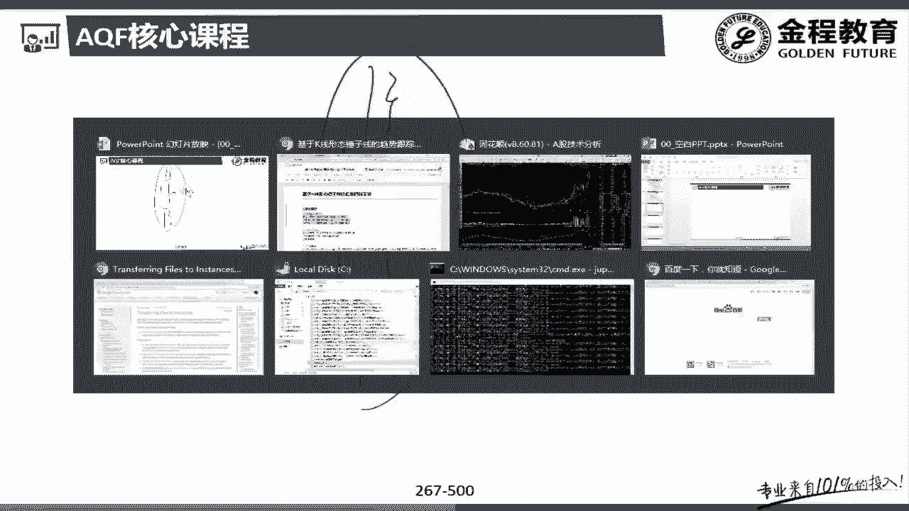

1.  **实体较小**：当日的开盘价与收盘价非常接近，形成一个小实体。
2.  **下影线很长**：当日价格曾大幅下探，但最终回升，留下长长的下影线。下影线的长度通常至少是实体长度的两倍。
3.  **上影线很短或没有**：当日价格冲高幅度有限，上影线很短。
4.  **处于下跌趋势中**：该形态出现之前，价格处于明显的下跌通道中。

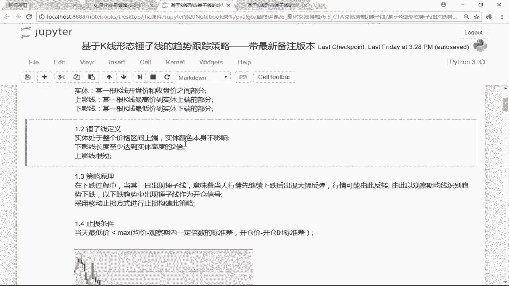

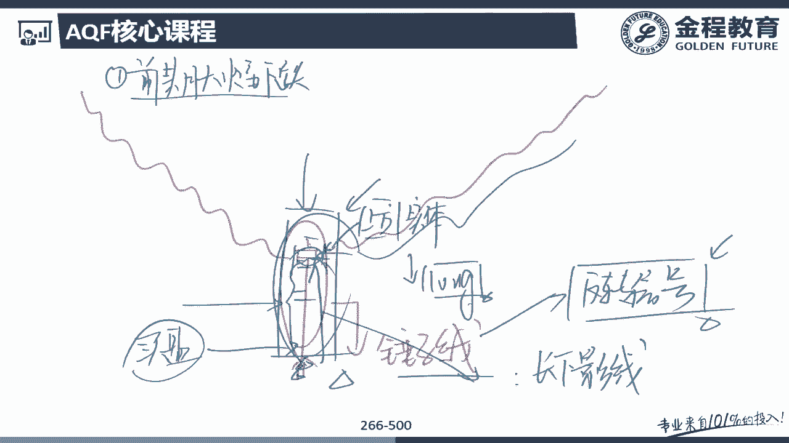

### 市场含义

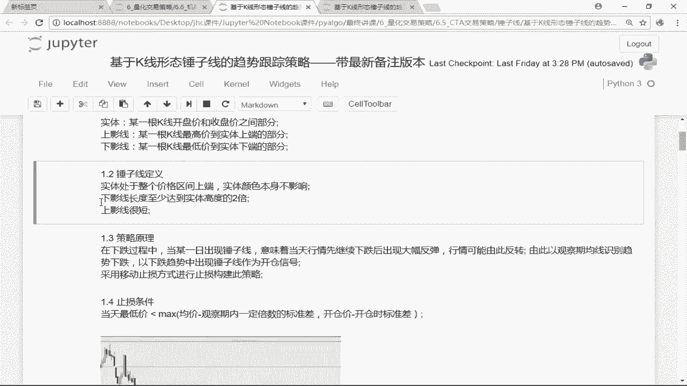

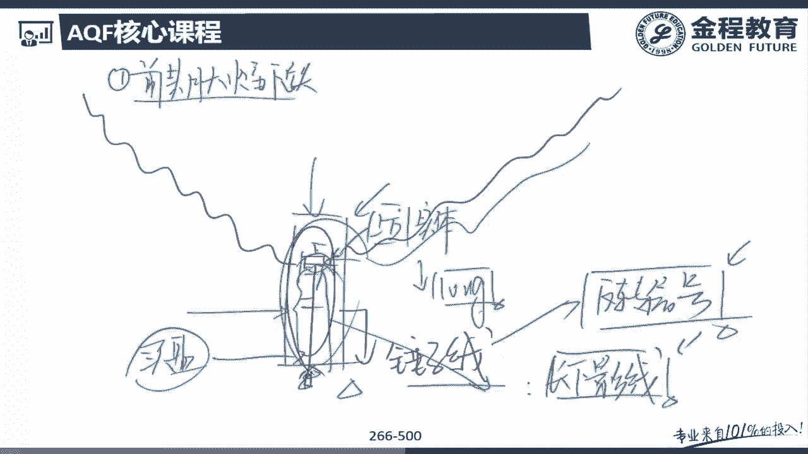

锤子线的形成过程传递了特定的市场信息：
*   在持续下跌后，当日开盘价格惯性下跌。
*   下跌至某一低位时，买盘大量涌入，将价格强势推高。
*   最终收盘价回到开盘价附近，表明多方在当日较量中占据优势。
*   长长的下影线显示了强大的下方支撑和买盘力量，暗示下跌可能告一段落，反弹或反转即将开始。

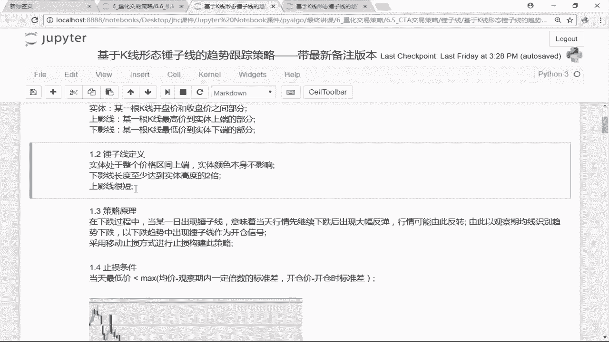

## 策略交易逻辑

基于锤子线的原理，我们可以构建以下交易策略：

1.  **开仓信号**：在识别出下跌趋势中出现锤子线形态的当日收盘时，执行买入操作（做多）。
2.  **止损机制**：采用一种结合了**移动止损**和**固定止损**的混合方法来保护利润和控制亏损。

### 止损条件详解

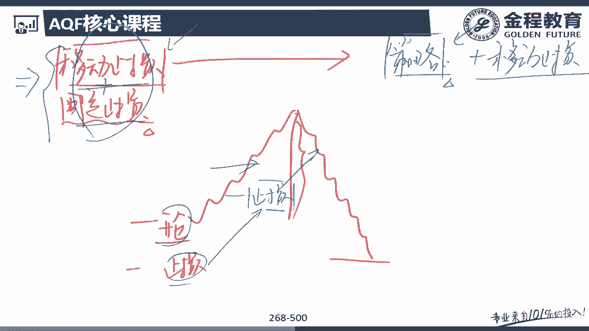

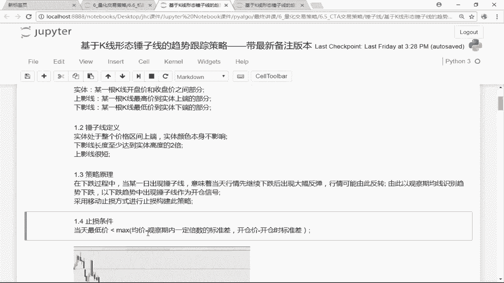

止损是本策略风险管理的核心。我们使用以下公式计算止损价位：

**移动止损价** = `mean(close, N)` - `k * std(close, N)`

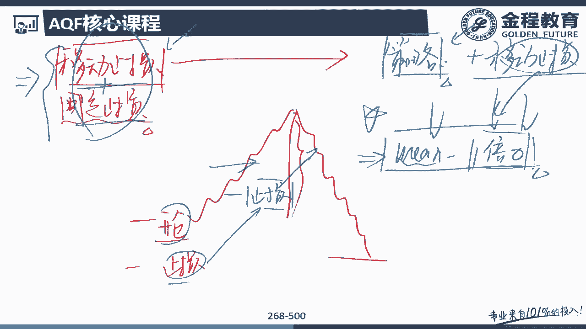

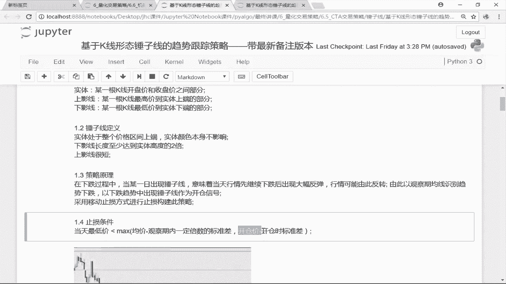

**固定止损价** = `entry_price` - `std(close_at_entry, M)`

其中：
*   `mean(close, N)`：计算最近N个交易日收盘价的移动平均值。
*   `std(close, N)`：计算最近N个交易日收盘价的标准差。
*   `entry_price`：开仓时的价格。
*   `std(close_at_entry, M)`：开仓时，基于最近M个交易日收盘价计算的标准差。
*   `k`：标准差倍数，例如1。

以下是两种止损方式的作用：

*   **移动止损**：随着股价上涨，移动平均线`mean(close, N)`也会上升。因此，移动止损价会“水涨船高”，不断上移，从而锁定不断增长的利润，防止获利大幅回吐。
*   **固定止损**：以开仓时的价格和波动率（标准差）为基础，设定一个固定的止损位。这确保了即使价格没有上涨反而下跌，我们也有一个明确的风险退出点，防止亏损扩大。

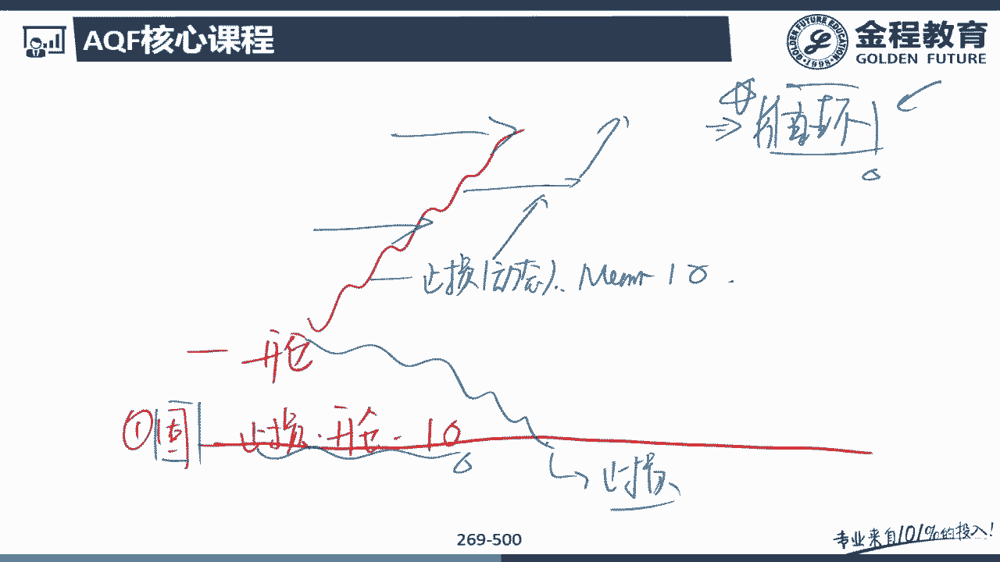

**实际止损触发**：策略会持续比较当前价格与上述两个止损价。只要当前价格跌破 **`移动止损价`** 或 **`固定止损价`** 中的任何一个，就会触发止损平仓。

## 策略优势与实现要点

这个策略将形态识别的择时优势与动态止损的风险管理优势相结合。

*   **形态识别**：通过量化方法自动捕捉图表中的特定模式，减少了主观判断的干扰。
*   **混合止损**：既通过移动止损跟随趋势、保护利润，又通过固定止损防范初始风险，比单一止损方式更灵活有效。

在实现层面，由于需要逐笔（或逐日）判断形态并动态计算止损价，本策略通常使用**循环方法**来编写代码，这与之前一些简单的向量化策略有所不同，但能更精细地处理复杂的交易逻辑。

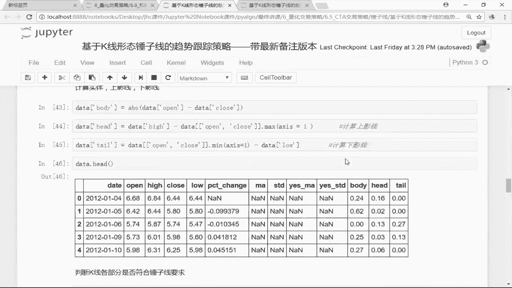

## 总结

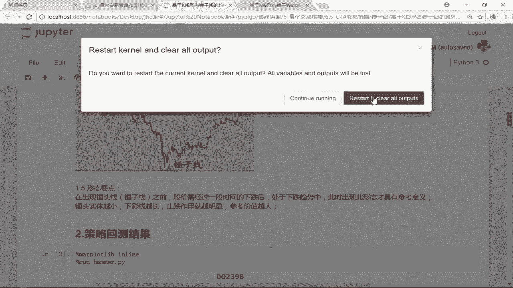

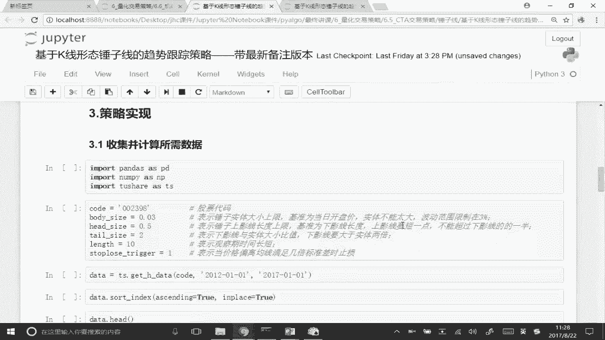

本节课中我们一起学习了“锤子线识别与移动止损策略”的原理。我们首先了解了锤子线作为反转信号的技术特征及其市场含义。接着，我们详细阐述了策略的交易逻辑：在下跌趋势中发现锤子线时开仓做多，并采用一套结合了动态移动止损和静态固定止损的混合方法来管理持仓风险。该策略体现了将传统技术分析模式进行量化，并辅以严谨风险管理的思想，是进阶量化策略的一个典型范例。在接下来的课程中，我们将着手用Python代码实现这一策略。