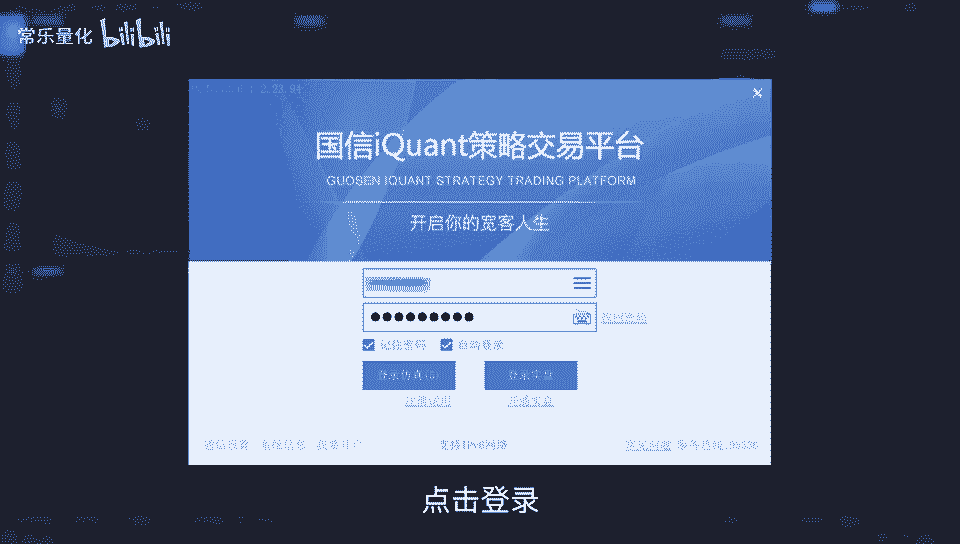
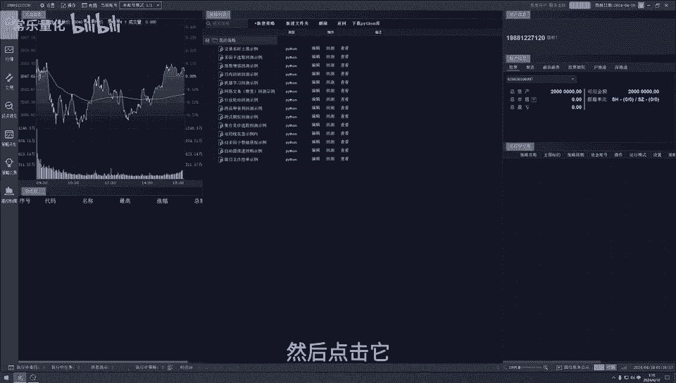
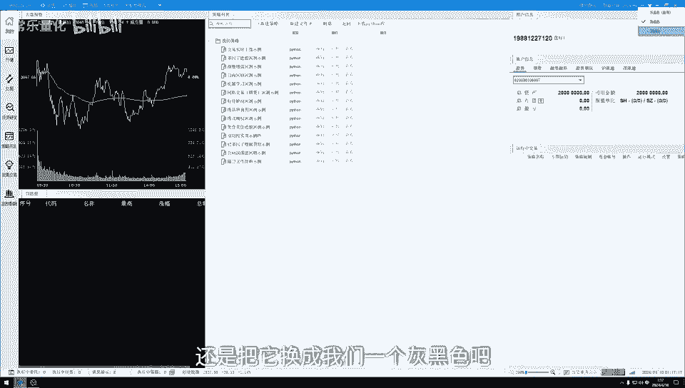
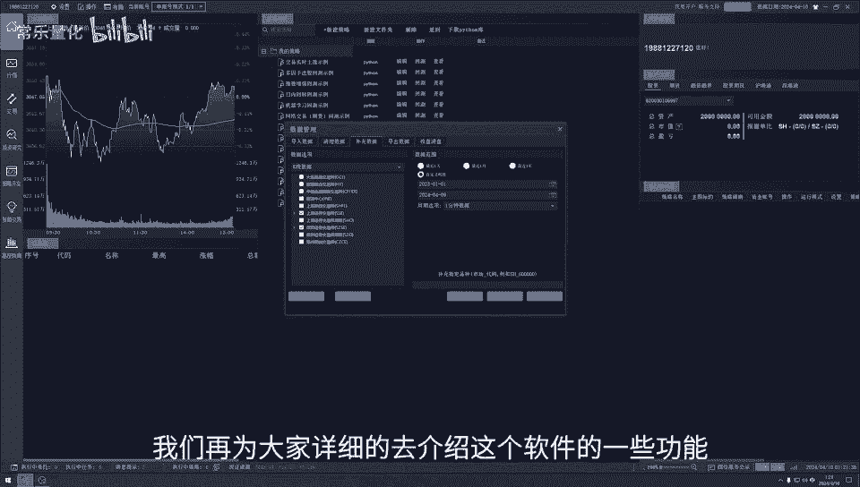

# 量化交易入门：1：QMT软件基础设置与数据准备 📊

在本节课中，我们将学习如何为国信证券的量化交易软件QMT进行基础设置，包括Python库的下载和历史数据的补充。这些准备工作是后续进行策略回测和自动化交易的基础。

## 量化交易简介

上一节我们介绍了量化交易的基本概念。量化交易是利用计算机强大的计算能力，结合多种策略和海量历史数据模型，对多只股票进行分析、筛选和优化，最终得出一个高概率盈利的交易策略。这种方法可以有效降低市场波动对投资者情绪的影响，避免在狂热或悲观的市场环境中做出非理性的投资决策。

## 软件登录与界面设置

了解了量化交易的意义后，我们来看看从哪里开始操作。国信证券提供的量化交易软件名为QMT。首先，我们需要打开并登录软件。

登录后，界面默认为黑色主题。如果投资者觉得黑色界面不清晰或不喜欢，可以自行更换。点击软件右上角的衣服图标，即可选择其他主题，例如海蓝色主题。更换后，界面会变得更加清晰。用户可以根据个人喜好进行设置。

## 核心设置一：下载Python库

在正式使用软件进行量化交易之前，有两个关键设置需要提前完成。首先，我们来设置Python库。

量化交易软件会大量运用Python进行策略编写、日志记录等操作。因此，我们需要先下载必要的Python库。

以下是设置步骤：
1.  点击软件上方的 **“设置”** 按钮。
2.  选择 **“交易设置”** -> **“模型设置”**。
3.  在弹出的窗口中，找到 **“Python库下载”** 部分。
4.  选择库文件的存放路径。用户可以根据个人电脑的使用习惯和存储空间自行选择。
5.  点击下载。如果已经下载过，此处会显示已下载。
6.  用户应定期检查此处的 **“Python库更新”**，如有需要，及时点击更新。
7.  设置完成后，点击 **“确定”** 保存。

## 核心设置二：补充历史数据

完成了Python库的设置，接下来我们进行第二个关键设置：补充历史数据。

量化策略的研发和测试离不开历史数据进行回测。因此，我们需要为软件补充完整的历史数据。

以下是数据补充的步骤：
1.  点击软件上方的 **“操作”** 按钮。
2.  选择 **“数据管理”**。
3.  在弹出的数据管理界面中，首先点击 **“K线数据”**。
4.  在数据范围中，勾选 **“上海证券交易所”** 和 **“深圳证券交易所”**。如果投资者交易期货或期权，也可根据需求勾选相应市场。
5.  继续在 **“K线数据”** 下方，根据需要勾选 **“财务数据”**、**“除权数据”** 等选项。
6.  在界面右侧设置 **“时间范围”**，可选最近一周、最近一月、全部或自定义时段。选择的时间范围越长，下载所需时间也越长。
7.  在 **“周期选项”** 中，通常选择 **“一分钟”** 数据，这是进行精细化回测的常用数据。
8.  所有选项设置完毕后，点击 **“补充”** 按钮开始下载数据。

## 课程总结

本节课中，我们一起学习了QMT量化交易软件的两项基础准备工作。首先，我们介绍了如何下载和更新Python库，这是运行量化策略的编程基础。接着，我们详细讲解了如何补充历史数据，这是进行策略回测和验证的数据基础。完成这两项设置后，软件就为后续的策略研发和交易打好了基础。在下一节课中，我们将详细介绍软件的其他功能，如行情查看、交易操作、投资研究以及策略研发与交易等模块。