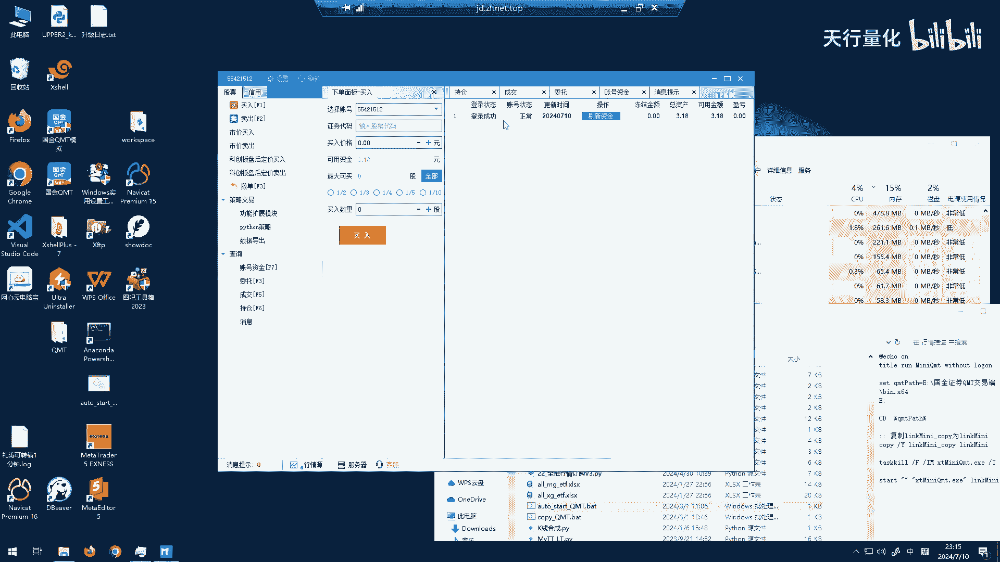
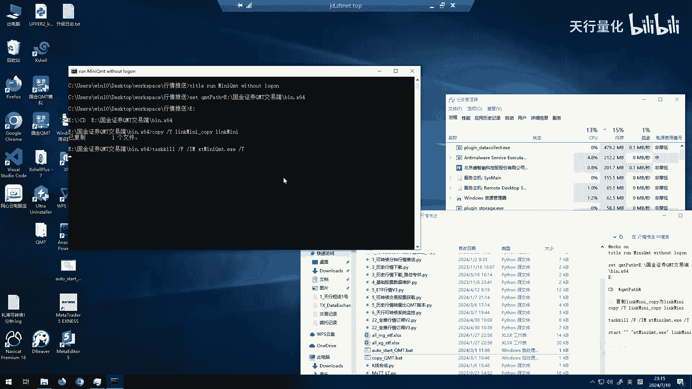
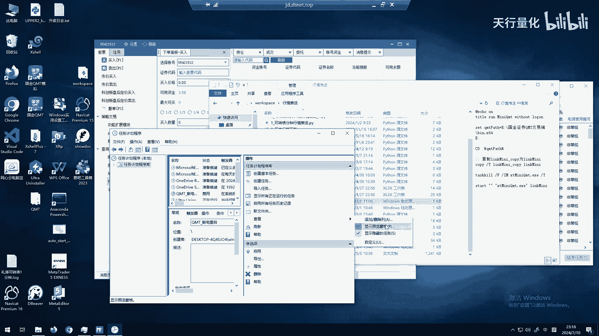
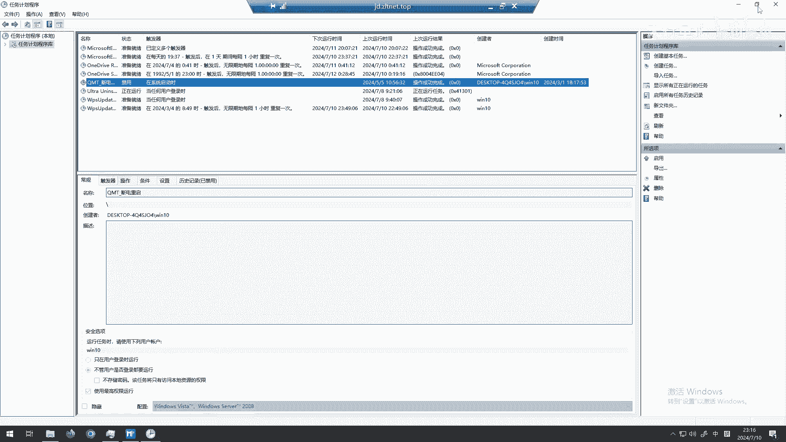
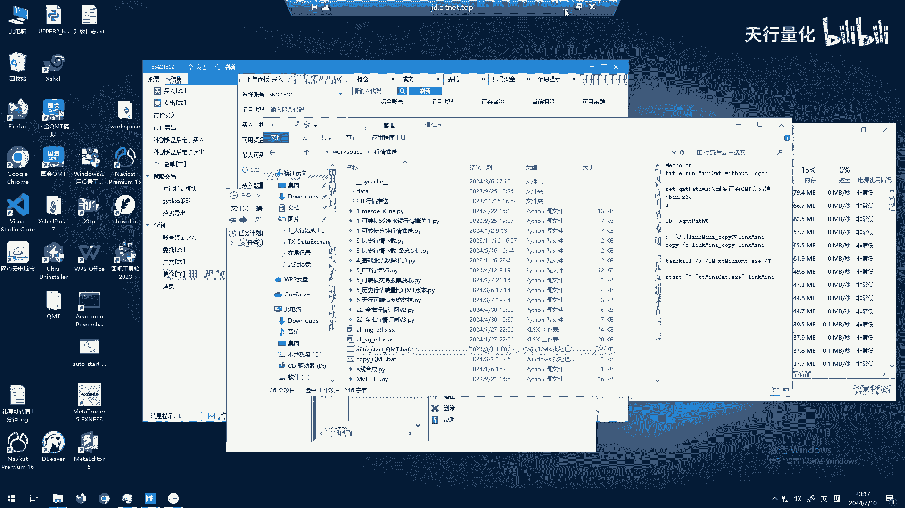

# QMT自动登录教程：P1：实现QMT自动启动与登录 🔧

在本节课中，我们将学习如何为“国金证券QMT”软件配置自动启动与登录功能。手动每日重启和输入密码较为繁琐，本教程将提供一个自动化脚本解决方案，并指导你如何将其设置为Windows计划任务，实现开机自动运行。

## 问题背景与手动流程

上一节我们介绍了课程目标，本节中我们来看看当前手动启动QMT面临的问题。

正常情况下，启动国金证券QMT软件（尤其是迷你QMT版本）后，即使勾选了“自动登录”选项，系统仍会弹出密码输入窗口，需要人工干预才能完成登录。这个过程在每日都需要重启软件时显得效率低下。

## 自动化解决方案介绍

为了解决上述问题，我们可以使用一个预先编写好的自动化脚本。该脚本能模拟用户操作，自动完成密码输入和登录过程。

以下是脚本的核心功能描述：
*   自动定位QMT登录窗口。
*   向密码输入框填入预设的密码。
*   模拟点击“登录”按钮，完成认证流程。

使用该脚本后，只需双击运行，QMT即可自动完成登录，无需人工值守。

## 配置与使用指南

我们已经了解了脚本的功能，接下来看看如何获取并配置它。

脚本文件名为 `AutoStartQMT.exe`。运行后，它会自动处理登录流程。你可以通过以下两种主要方式来管理它的运行：

**1. 直接手动运行**
直接双击 `AutoStartQMT.exe` 文件，脚本会立即启动并尝试登录QMT。

**2. 设置为Windows计划任务（推荐）**
为了实现每日开机自动登录，建议将脚本添加到Windows计划任务中。

以下是配置计划任务的简要步骤：
1.  打开Windows“任务计划程序”。
2.  创建基本任务，设置触发器为“当计算机启动时”。
3.  设置操作为“启动程序”，并选择 `AutoStartQMT.exe` 脚本路径。
4.  完成创建后，每次系统启动都会自动执行该脚本，实现QMT的自动登录。

## 其他工具分享

除了QMT自动登录脚本，作者还开发了其他辅助量化交易的工具，在此简要分享：

以下是两个相关工具的介绍：
*   **通信系统**：一个用于构建分布式量化体系时，实现各组件间通信的中间件。
*   **天行量化助手**：一个帮助用户从“问财”等平台获取股票数据、进行选股分析的辅助工具。

这些工具的下载链接可在视频评论区或作者主页找到。

## 课程总结

本节课中我们一起学习了如何为国金证券QMT实现自动化登录。我们首先分析了手动操作的痛点，然后介绍了一个能够自动输入密码并登录的脚本工具，最后详细说明了如何通过Windows计划任务让该脚本随系统启动而自动运行，从而彻底解决每日手动登录的麻烦。希望本教程能帮助你提升量化交易准备的效率。