# QMT量化交易：P1：MiniQMT入门指南与注意事项 🚀

在本节课中，我们将学习MiniQMT（原生Python QMT）的基本概念、开通方式、核心优势以及一个简单的入门实践。我们将重点理解MiniQMT与标准版QMT的区别，并掌握如何开始使用它进行更灵活的量化交易开发。

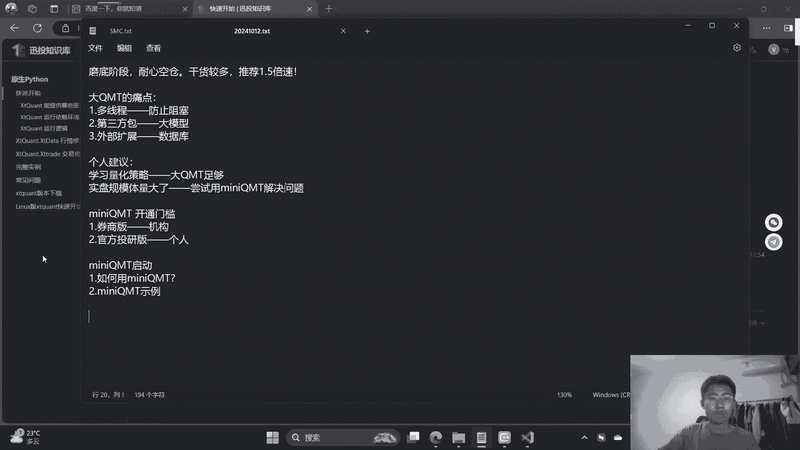

---

## 概述

MiniQMT是一套基于Python的量化交易框架，主要提供Python API接口，用于实现报单、撤单等核心交易功能。它并非标准版QMT的替代品，而是专注于为需要更高灵活性和并发处理能力的交易者提供解决方案。


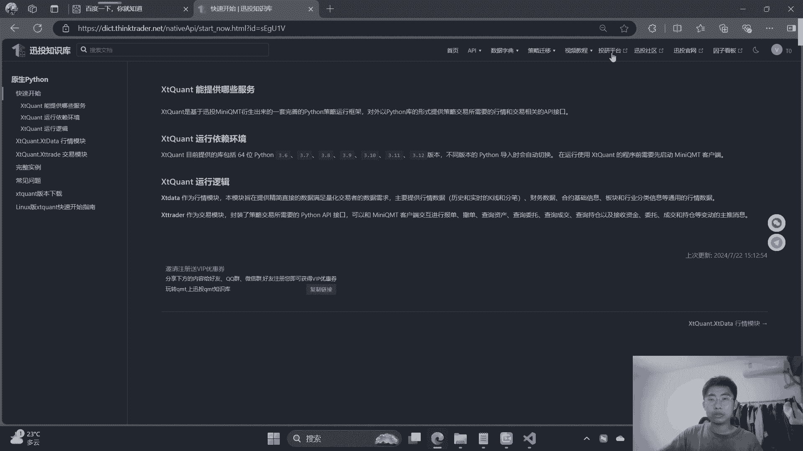

上一节我们介绍了课程的整体目标，本节中我们来看看MiniQMT的具体开通门槛。

## MiniQMT的开通门槛与方式

MiniQMT并不适合所有新手直接使用，因为其开通存在一定门槛。

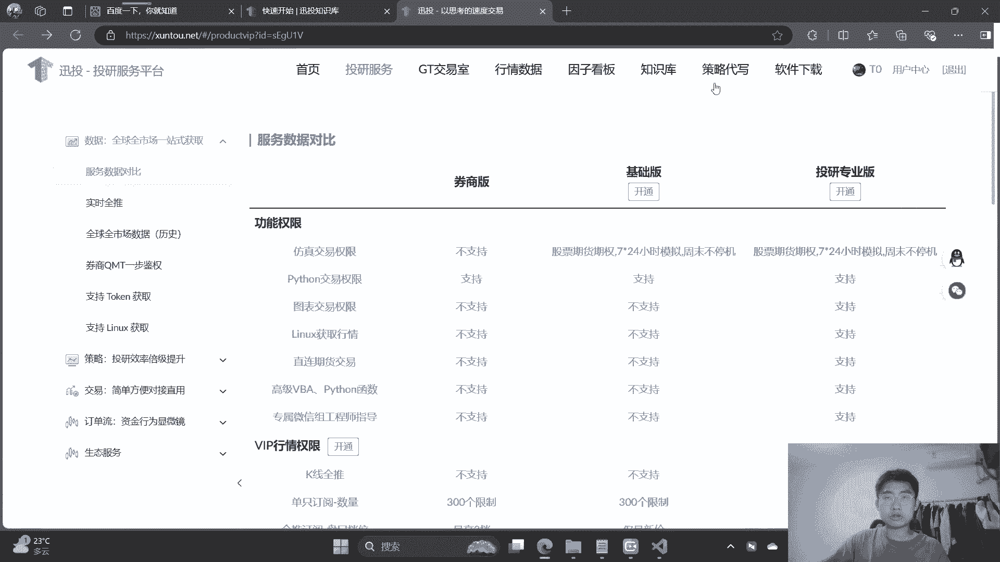


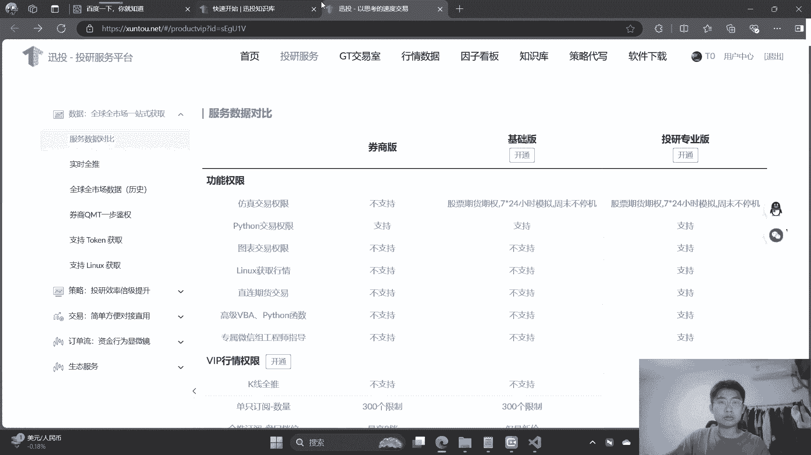

对于个人投资者，通过券商开通MiniQMT权限通常比较困难。大部分券商受监管要求，无法为个人账户开通此权限。尝试在券商交易软件中勾选“极简模式”并登录时，系统可能会提示“请联系券商开通对应的权限”。

对于机构投资者，拥有相应的牌照和权限，则可以通过券商申请开通机构版的MiniQMT。成功开通后，在交易软件中勾选“极简模式”即可正常登录并使用。

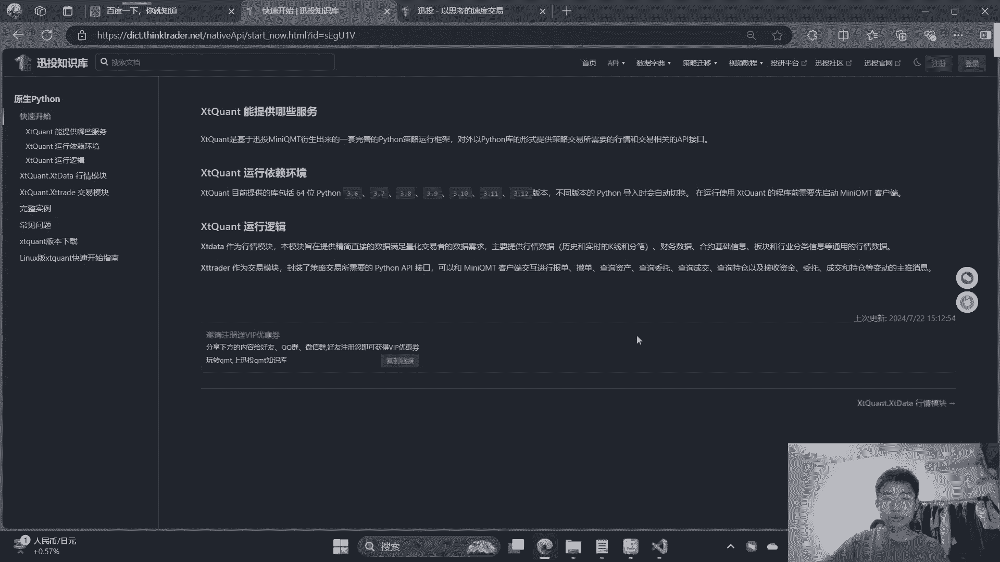

如果个人投资者希望尝试MiniQMT，建议通过QMT的官方网站进行。以下是具体步骤：

1.  访问QMT官网，在软件下载区域找到并下载原生Python QMT版本。
2.  安装后，在个人中心申请开通“基础版行情”权限。开通后，可以获得一个模拟账户，支持7x24小时的模拟撮合交易，用于学习和测试。

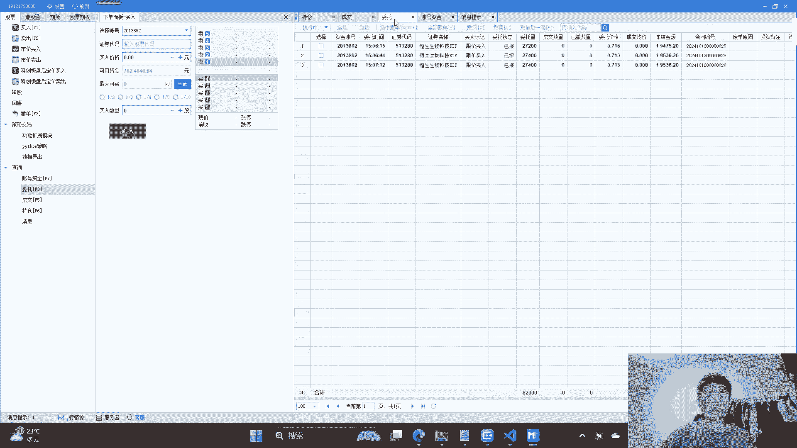

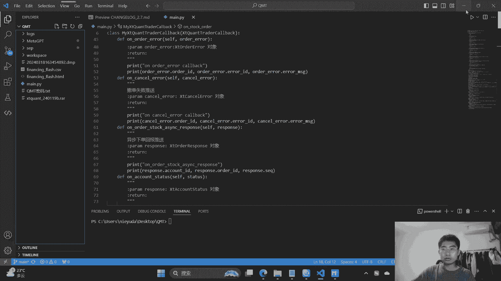

## 为什么选择MiniQMT？🆚

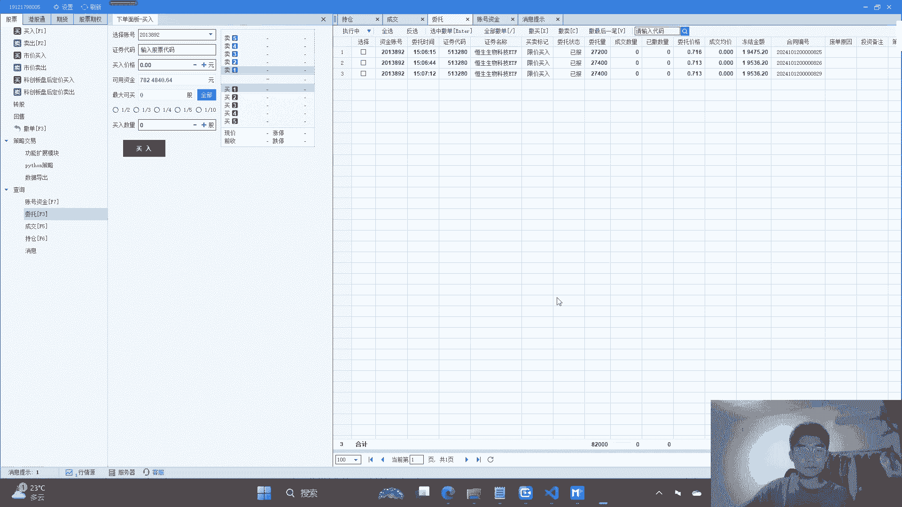

在了解了开通方式后，我们来看看为什么在某些场景下需要选择MiniQMT。它与标准版QMT是互补关系。

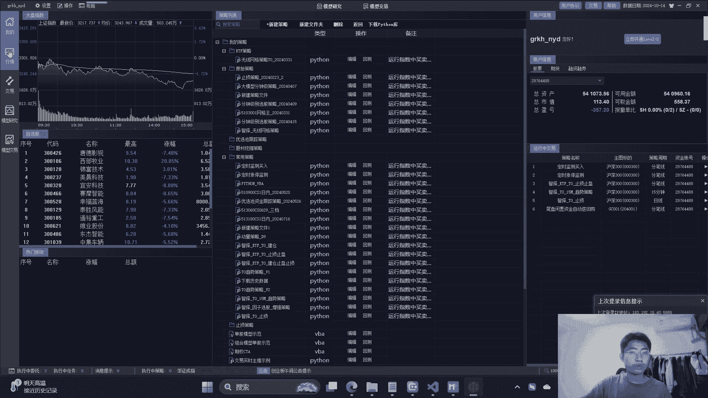

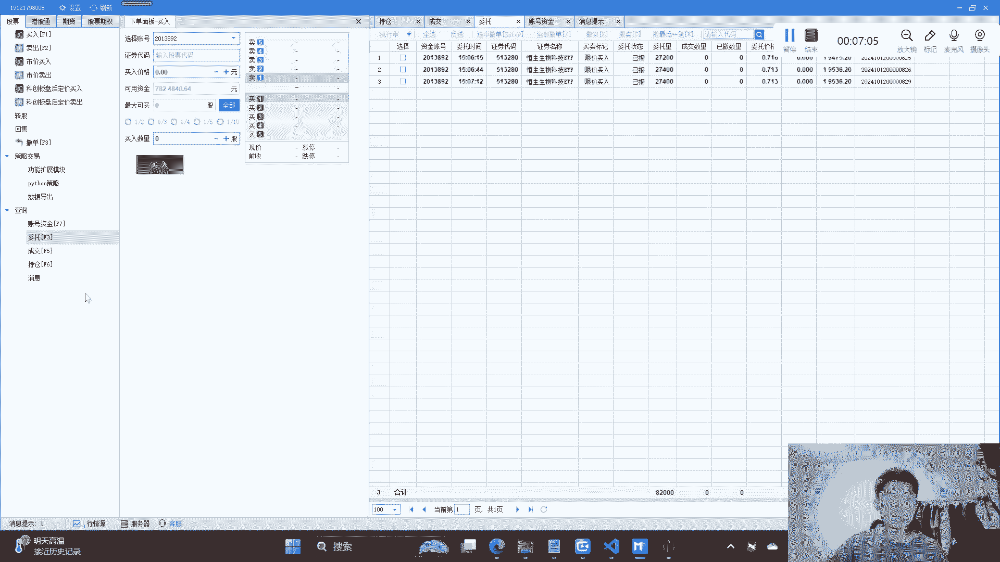

标准版QMT功能全面，适合策略研究和学习，但其内部策略运行在单一线程中。当同时运行多个策略（例如一个趋势策略和一个高频止损策略）时，这些策略可能会相互阻塞，影响执行效率。

MiniQMT的核心优势在于其灵活性和并发能力。由于它基于Python API，开发者可以启动多个独立的Python进程或线程，每个进程运行一个独立的策略。这样就能充分利用多核CPU资源，实现策略的并发执行，避免阻塞。

以下是MiniQMT相较于标准版QMT的主要优势：

*   **高并发策略执行**：支持多进程/多线程，策略间互不干扰。
*   **开发环境灵活**：可以在自己熟悉的IDE（如VS Code）中编写和调试代码，与外部Python生态（如机器学习库PyTorch）无缝集成。
*   **外部扩展性强**：易于连接外部数据库或其他系统，构建更复杂的交易系统。

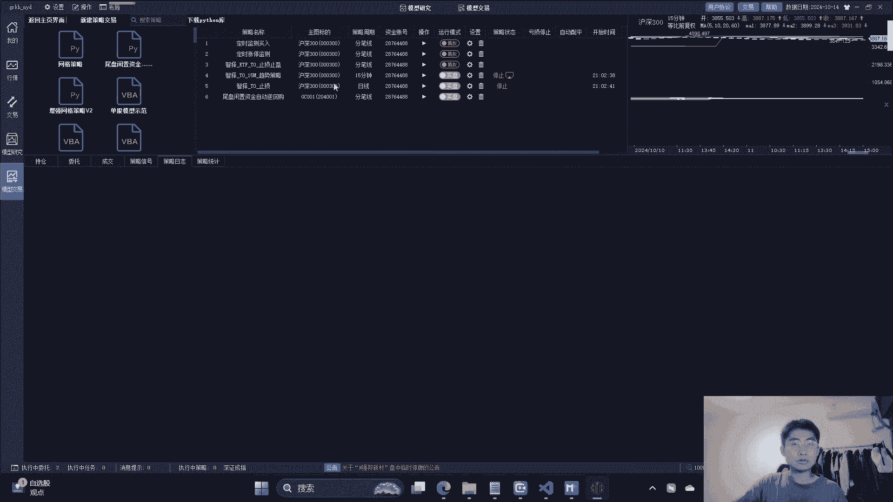

因此，一个最佳实践是：**在标准版QMT中完成策略的研究、回测和初步验证；在策略成熟并需要上实盘，尤其是需要处理多策略并发时，再使用MiniQMT进行实盘交易系统的构建和优化。**

## 首次使用MiniQMT：一个简单示例 💻

上一节我们探讨了选择MiniQMT的理由，本节中我们通过一个简单示例来实践如何启动并使用它进行交易。

首先，确保已从官网下载并安装好MiniQMT客户端。启动软件后，勾选“极速交易”或“独立交易”模式并登录。登录后，界面将主要显示交易相关的信息，如持仓、委托、成交等，比标准版QMT简洁。

接下来，我们从官网获取示例代码。在QMT官网的示例代码区域，找到“简单购买一次”的示例并复制全部代码。

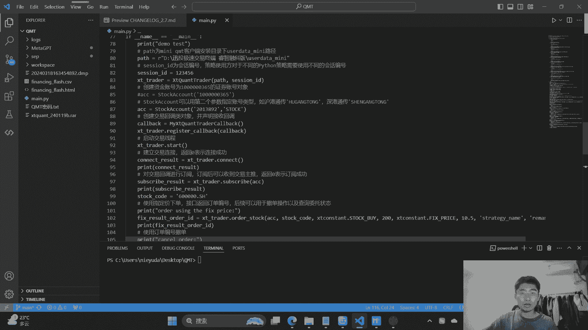

然后，在本地创建一个Python文件（例如 `miniqmt_demo.py`），将复制的代码粘贴进去。这段代码的核心是使用 `xtquant` 库建立连接并下单。我们需要修改两处配置：

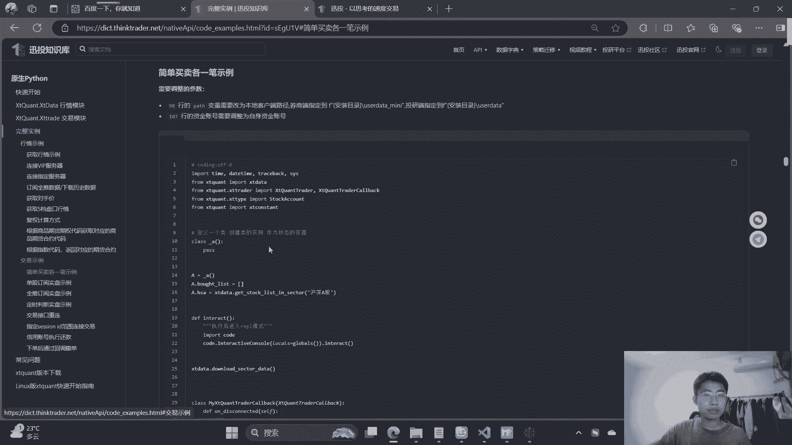

1.  **设置MiniQMT路径**：找到代码中指定 `mini_qmt_path` 的位置，将其替换为你本地MiniQMT安装目录下的 `userdata_mini` 文件夹的绝对路径。
    ```python
    # 示例：修改路径
    mini_qmt_path = r'C:\国金QMT交易端\userdata_mini'
    ```
2.  **设置账户信息**：将 `account` 变量替换为你自己的模拟资金账号。

修改完成后，在MiniQMT客户端已登录的情况下，在命令行或IDE中运行这个Python脚本：
```bash
python miniqmt_demo.py
```
运行后，观察脚本输出的日志，同时可以在MiniQMT客户端的“委托”和“成交”页面查看到程序自动报出的订单及其成交结果。这证明你已成功通过Python API实现了自动化交易。

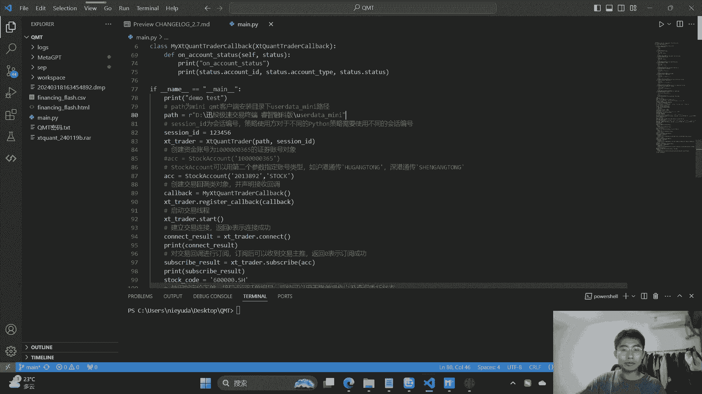

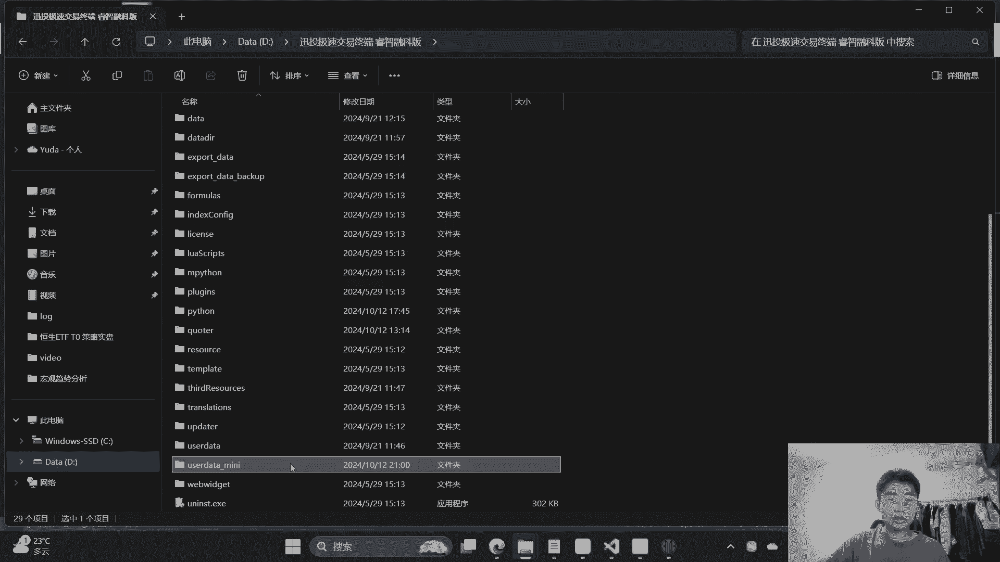

**请注意**：MiniQMT主要用于**实盘交易**，不具备回测功能。策略的回测与研发建议在标准版QMT中完成。


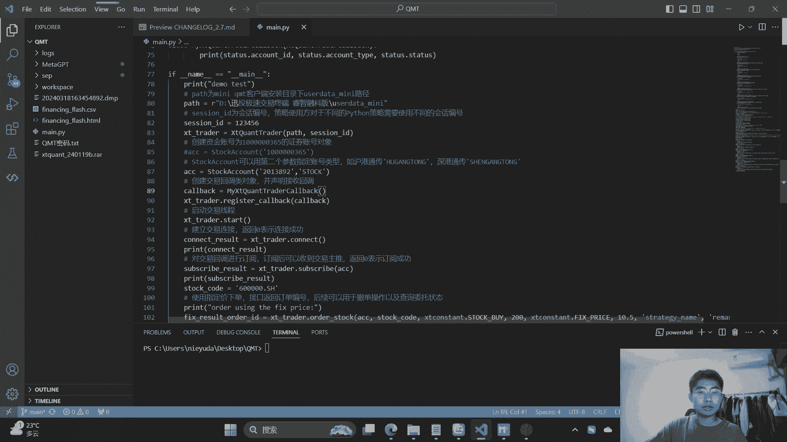

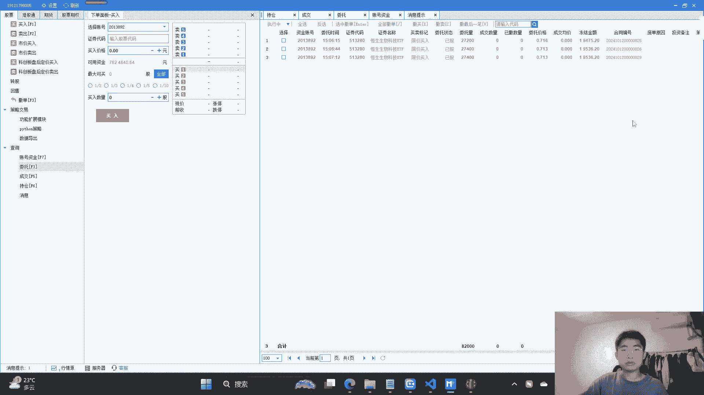

## MiniQMT的安装说明

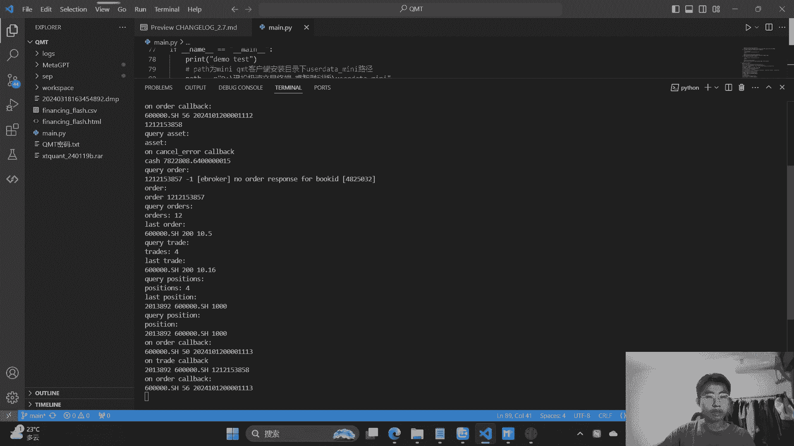

通常，从官网下载的MiniQMT安装包已内置了必要的 `xtquant` Python库。安装后，库文件通常位于安装目录的 `bin.x64\Lib\site-packages` 文件夹下。

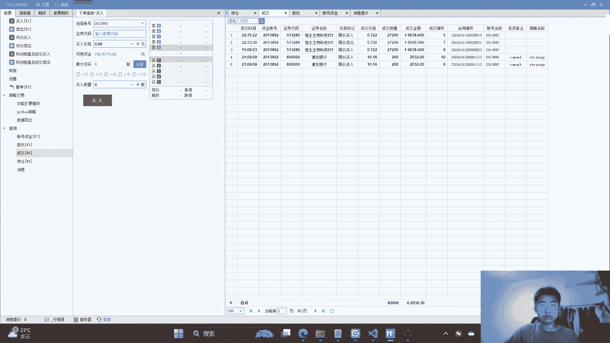

如果在你的Python环境中无法导入 `xtquant`，则需要手动安装。可以从官网下载 `xtquant` 的压缩包，解压后将其中的文件放置到上述 `site-packages` 目录中，或使用pip指向本地whl文件进行安装。

## 总结与建议 📝

本节课中我们一起学习了MiniQMT的入门知识。

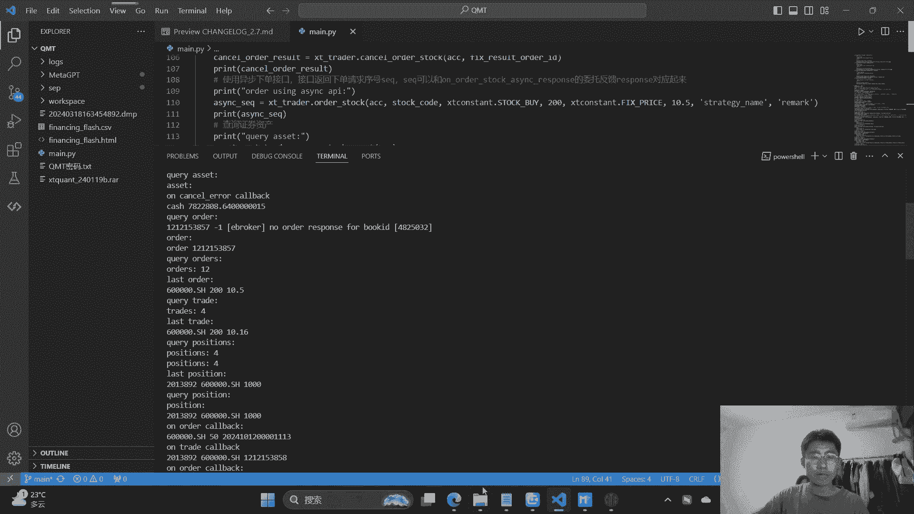

我们了解到MiniQMT的开通对个人投资者有一定门槛，更适合机构或通过官网模拟账户学习。它的核心价值在于提供了基于Python的高灵活性API，支持多策略并发执行，并能与丰富的Python生态结合，适合用于构建上规模的实盘交易系统。

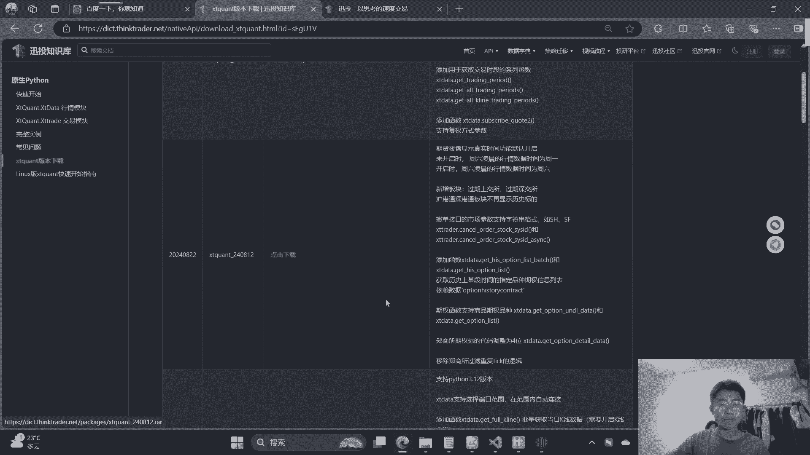

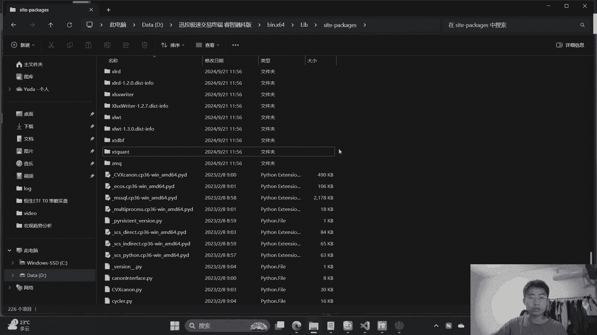

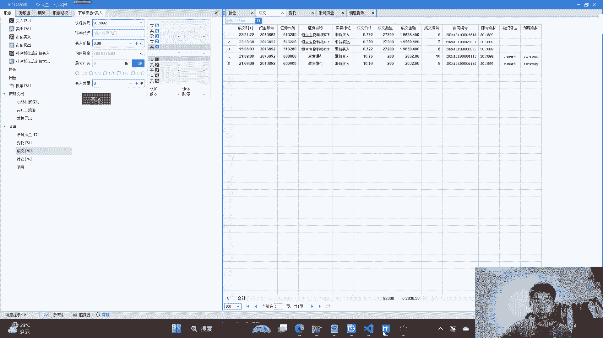

对于量化交易新手，核心建议是：**切勿本末倒置**。量化交易的核心是交易逻辑本身，量化工具只是辅助。建议先专注于在功能更全面、更适合学习的标准版QMT中扎实地学习策略编写、指标构建和订单管理。待交易逻辑成熟，需要处理复杂并发或系统集成时，再将MiniQMT作为“锦上添花”的工具引入你的实战体系。

扎实的策略研究基本功，才是量化交易成功的关键。

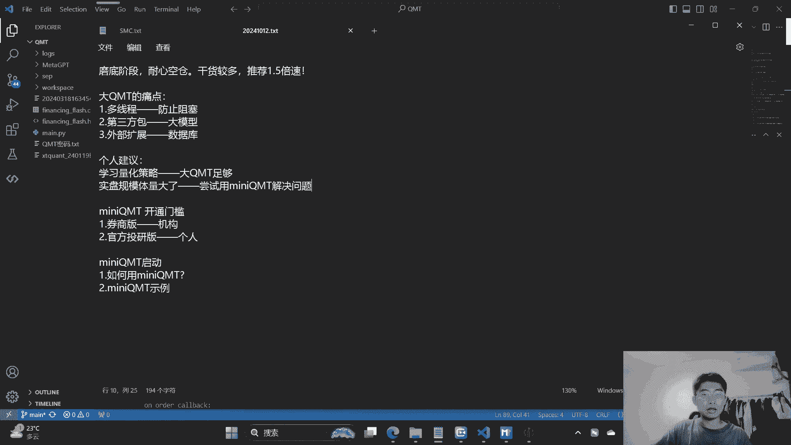

---