# QMT量化交易：P1：原生Python金融数据获取与大模型数据处理流程 📊

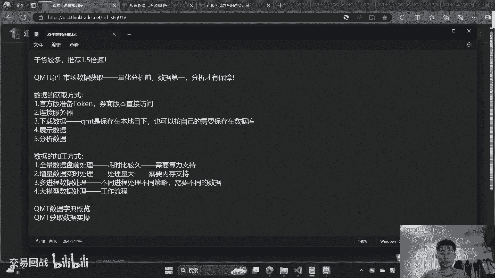

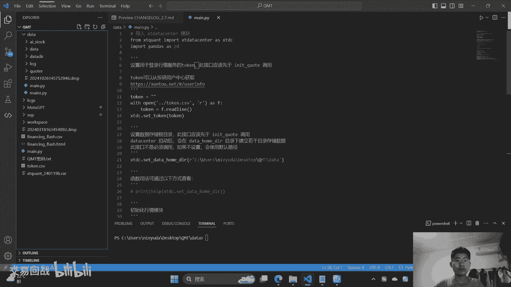

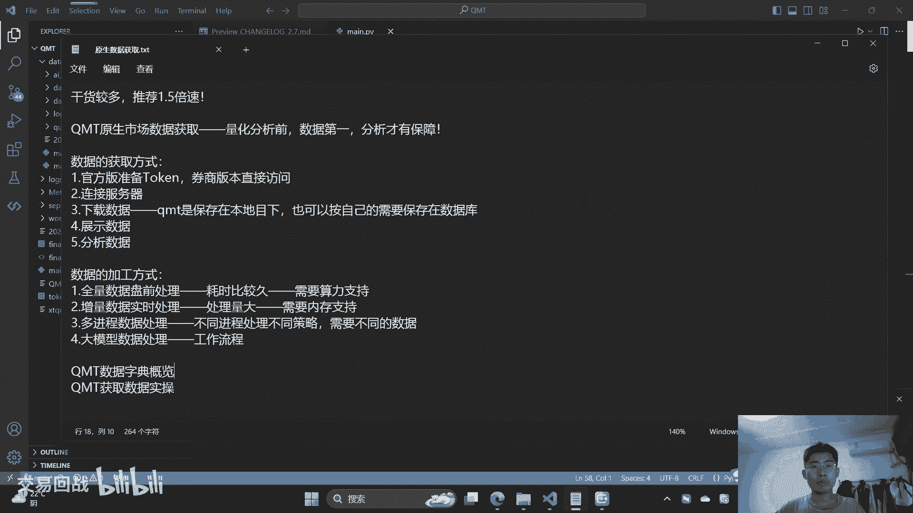

在本节课中，我们将学习如何使用QMT（迅投）的原生Python包来获取金融数据，并了解如何将这些数据应用于大模型处理流程。课程将分为数据获取基础与数据处理流程两部分。

## 数据获取基础 🛠️

上一节我们介绍了课程的整体目标，本节中我们来看看如何具体获取数据。首先，我们需要了解数据的基本结构和获取方式。

### 理解数据字典与数据表

在进行数据分析前，必须了解数据的组织形式。金融数据通常存储在数据表中，数据服务商以数据表为单位提供服务。数据字典则描述了这些表的结构和内容，是调用数据的关键。

### 获取访问凭证（Token）

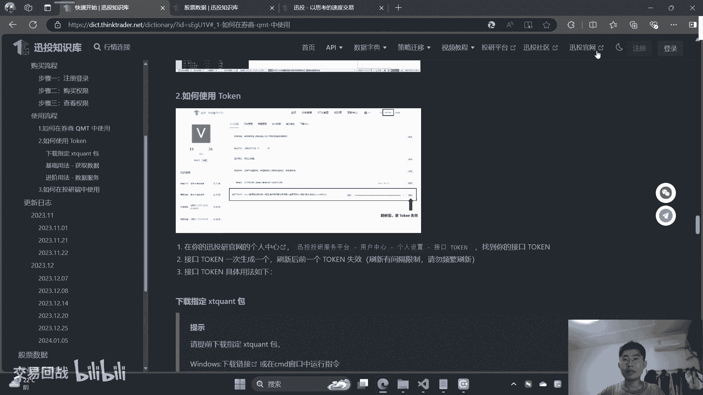

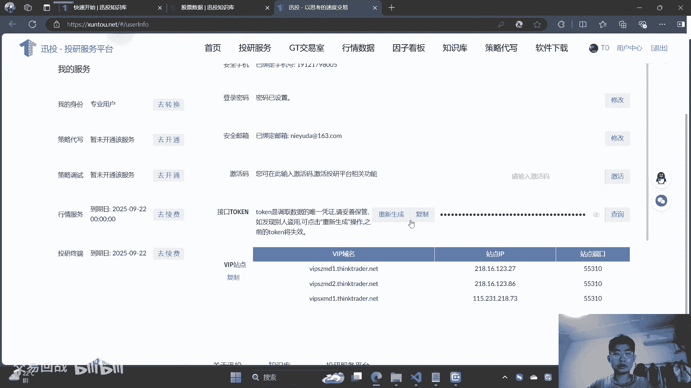

要使用迅投的官方数据服务，首先需要在官网注册账号并获取访问令牌（Token）。这个Token是后续所有数据请求的身份凭证。

**操作步骤：**
1.  访问迅投官网并登录。
2.  在用户中心或相关页面找到并复制您的Token。

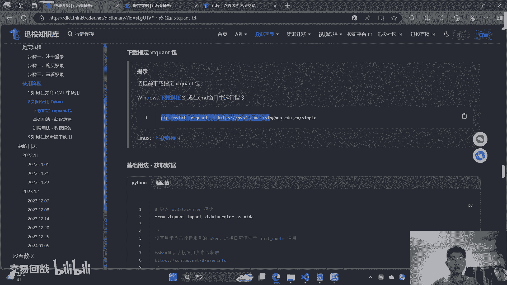

### 安装Python数据包

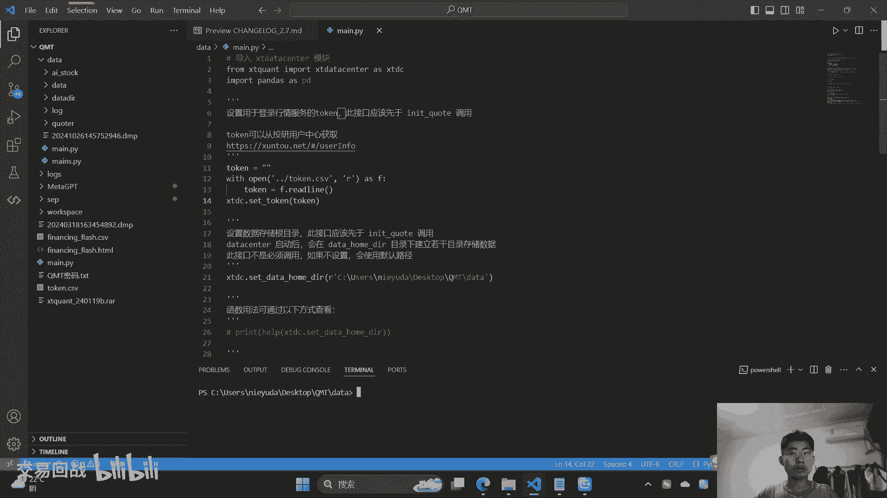

我们将在Windows系统的Python环境中使用`xtquant`包。通过包管理器可以轻松安装。

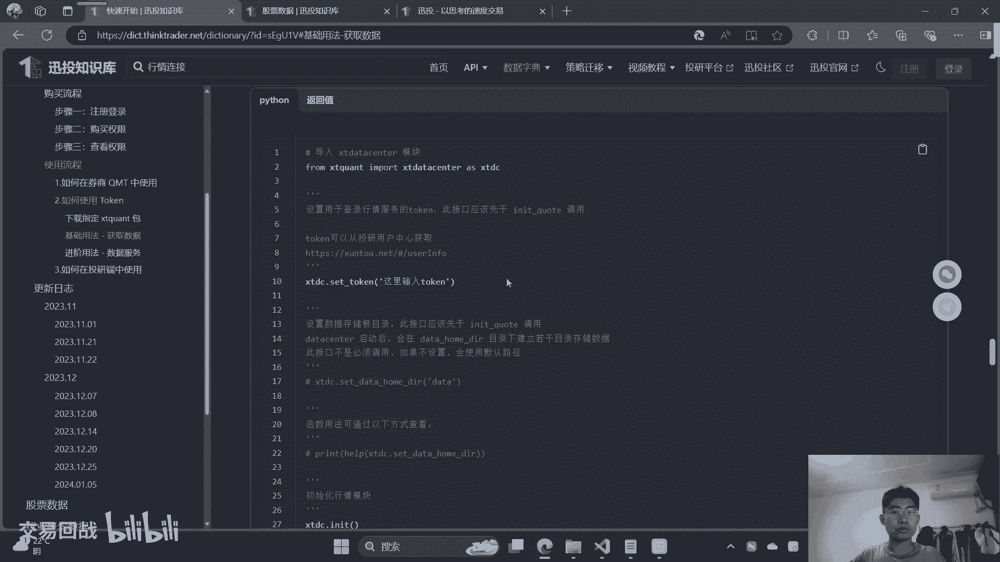

**安装命令示例：**
```bash
pip install xtquant -i https://pypi.tuna.tsinghua.edu.cn/simple
```
其中，`-i`参数指定使用清华大学的镜像源以加速下载。

### 配置与初始化数据服务

安装好包并获取Token后，需要在Python脚本中进行初始化和配置。

**核心代码流程：**
```python
# 1. 导入必要的包
import xtquant
from xtquant import xtdata

# 2. 设置Token（示例，实际应从安全位置加载）
token = ‘your_token_here‘

# 3. 设置本地数据存储路径
data_dir = ‘./data‘

# 4. 初始化行情连接
xtquant.init(token, data_dir)
```

### 下载与调用历史数据

初始化完成后，即可下载和查询各类历史金融数据。

以下是数据获取的几种常见操作：

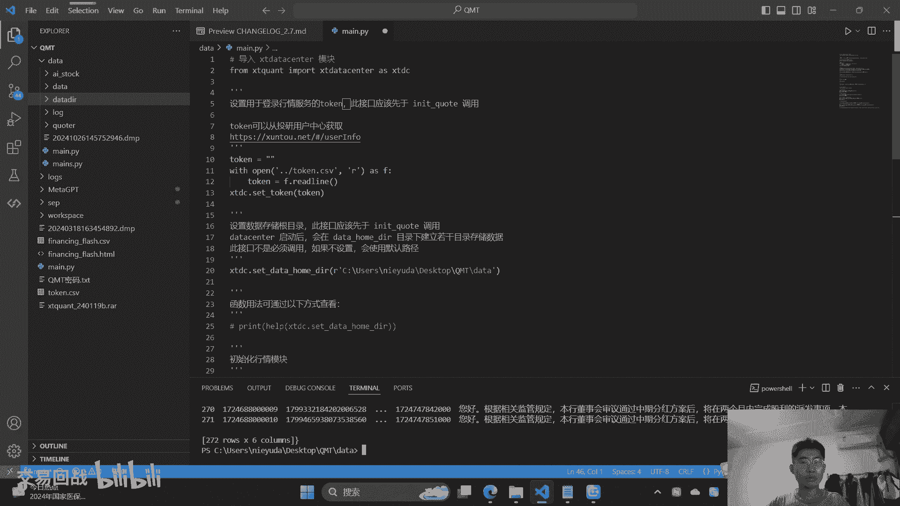

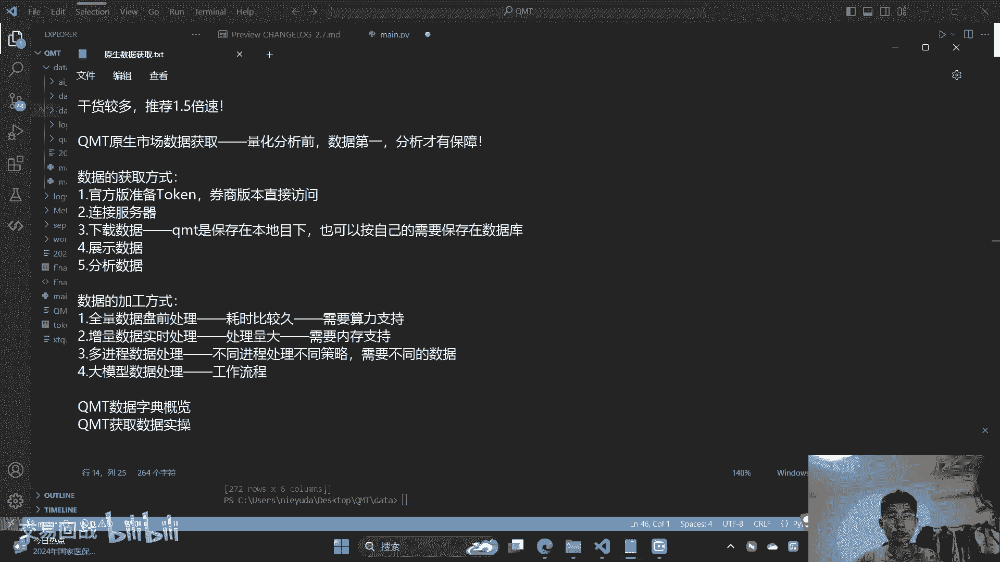

*   **获取交易日期**：查询上海证券交易所最近的交易日。
*   **获取股票列表**：查看沪深A股市场的所有股票代码。
*   **获取个股详情**：查询特定股票（如平安银行）的详细信息。
*   **获取另类数据**：下载如“投资者问答”等非标准数据，这类数据通常需要预先下载。

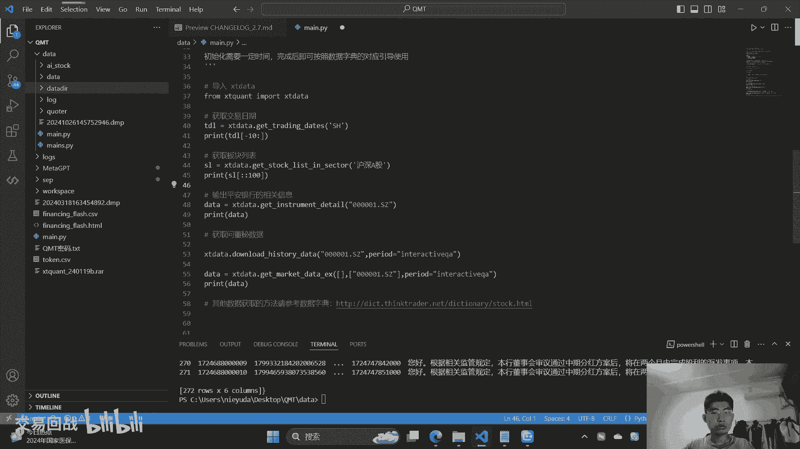

运行脚本后，数据会自动下载并存储到指定的本地目录（如`./data`）中，系统会在此目录下自动创建必要的文件夹结构来管理数据。

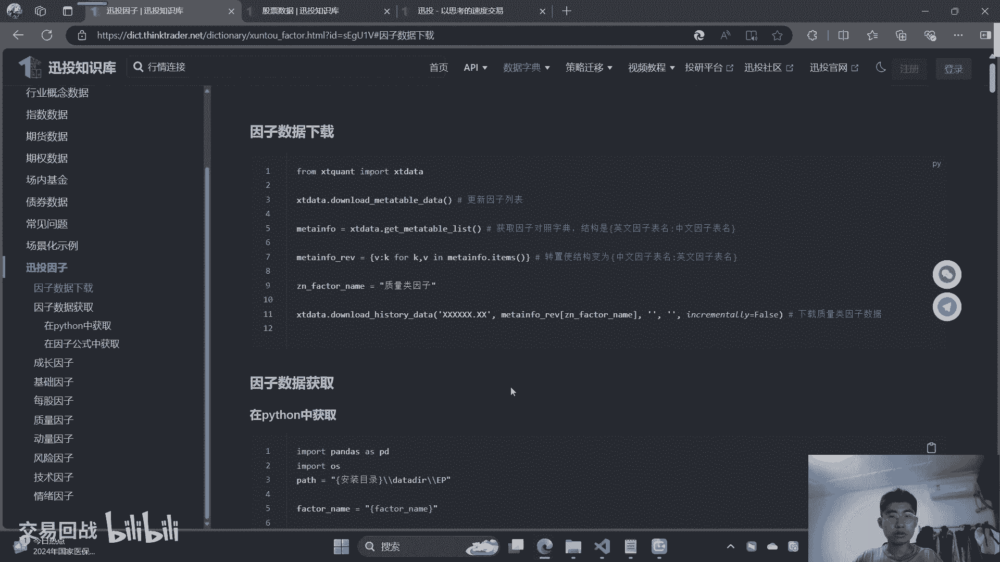

## 数据处理流程 🤖

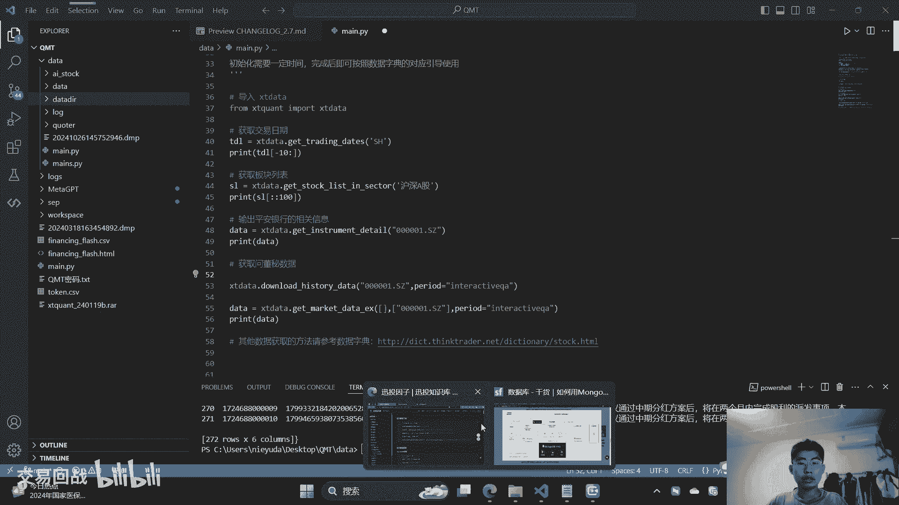

上一节我们介绍了如何获取原始数据，本节中我们来看看获取数据后如何处理，特别是结合大模型的新思路。

### 区分历史数据与实时数据

根据使用场景，数据处理可分为两类：

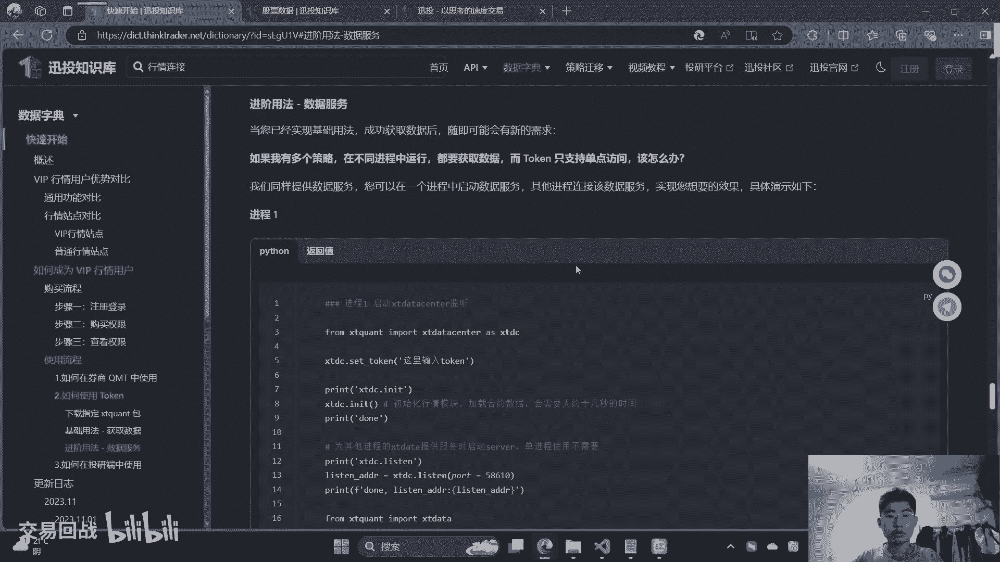

1.  **历史数据**：包括股票行情、基本面、特色因子等。这些数据量庞大，应在**盘前**完成下载和加工，为策略分析提供基础。
    *   **核心操作**：`xtdata.download_history_data()`
2.  **实时数据**：指盘中订阅的最新行情和资讯。用于**盘中**监控和触发交易信号，对计算速度和效率要求高。

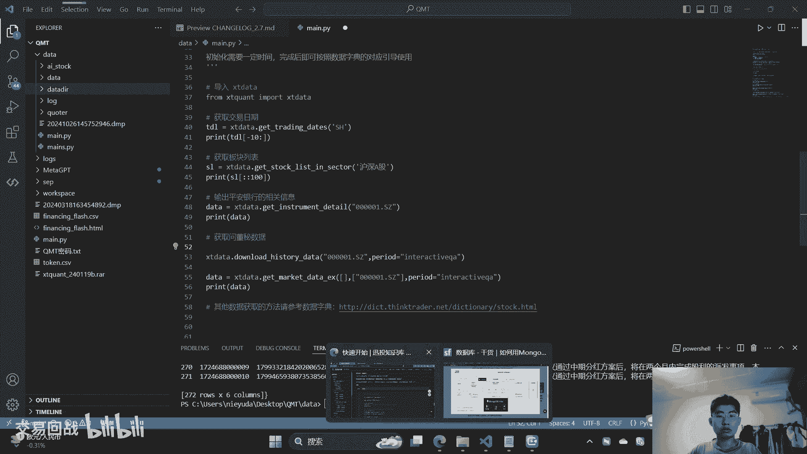

### 多进程数据处理

在实盘或处理大量历史数据时，单线程可能成为瓶颈。为了提高效率，需要使用多进程技术。

**实现思路**：可以启动一个独立进程作为“数据服务端”，负责统一从官方服务器获取和缓存数据。其他多个“策略进程”则连接这个本地服务端获取数据，避免重复请求和网络超时。官方包支持单个数据服务最多5个连接。

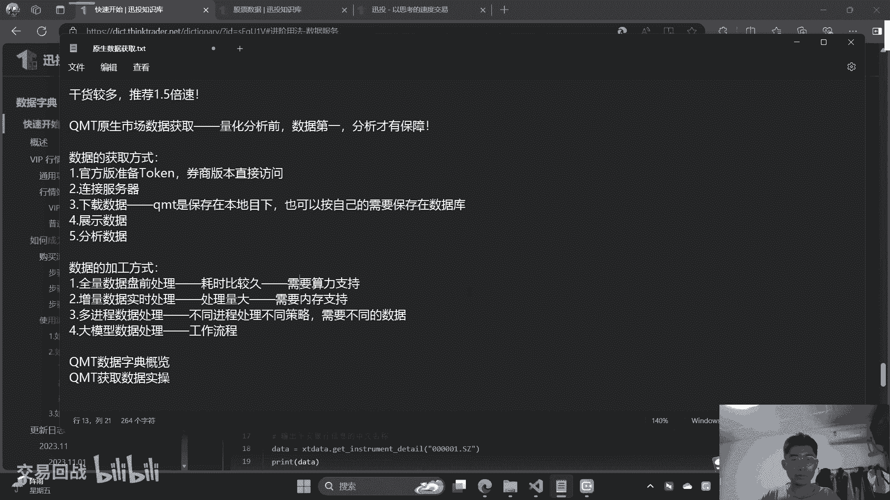

### 大模型在数据处理中的应用

最后，我们探讨一个前沿方向：利用大语言模型（如GPT）处理金融数据。其核心流程并非让大模型直接进行数值计算，而是发挥其在理解和生成自然语言方面的优势。

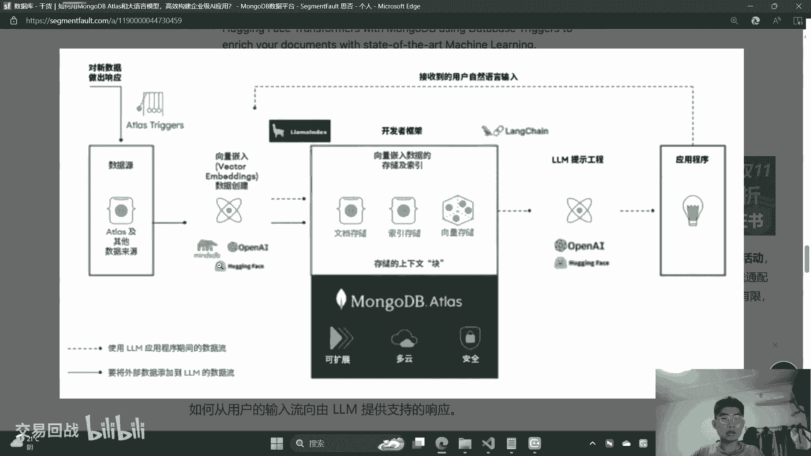

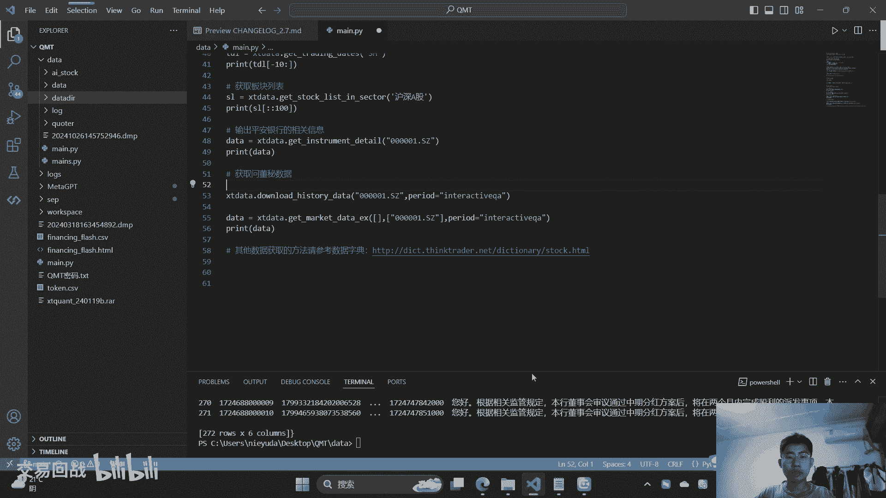

一个典型的架构包含以下环节：

*   **数据源**：我们的QMT历史数据库和实时数据流。
*   **向量知识库**：将非结构化的文本数据（如财报、新闻、公告、投资者问答）通过**Embedding**技术转换为向量，并存储到向量数据库（如ChromaDB, Pinecone）中。这构成了模型的“知识库”。
*   **大语言模型**：作为核心处理引擎。
*   **提示工程**：精心设计提示词模板，指导模型如何结合用户问题和知识库内容生成回答。
*   **应用界面**：用户在此提出问题。

**流程简述**：用户提出一个自然语言问题（例如，“总结一下宁德时代最近一份年报的亮点和风险”）。大模型根据预设的提示模板，将问题转化为查询指令，从向量知识库中检索相关的文本片段，最后组织语言生成一份结构化的分析报告。

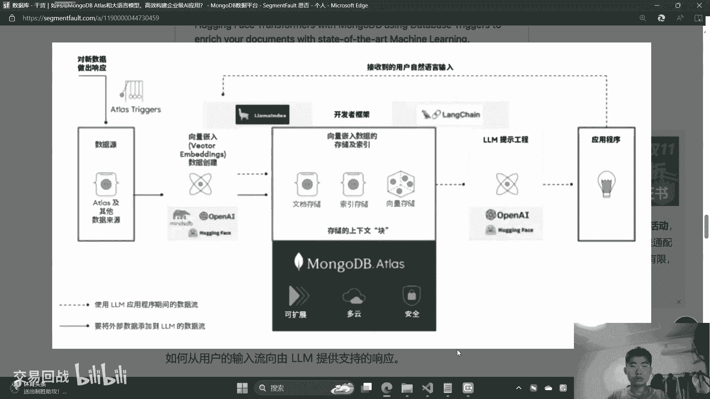

这种模式非常适合处理**研报分析、舆情监控、事件推理**等偏重自然语言理解的任务，为量化投资提供了新的分析视角。

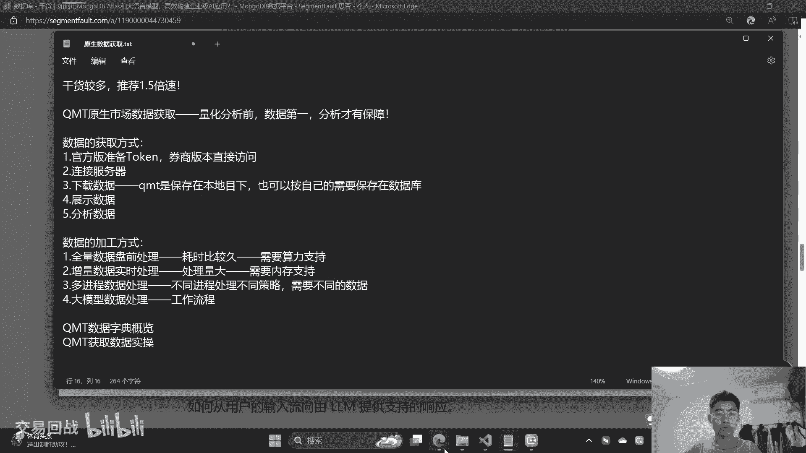

## 总结 📝

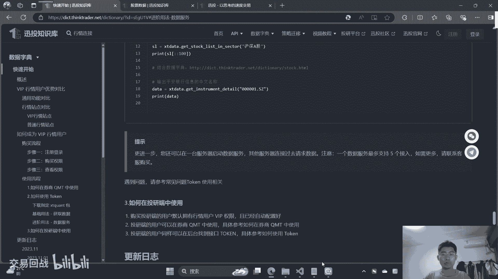

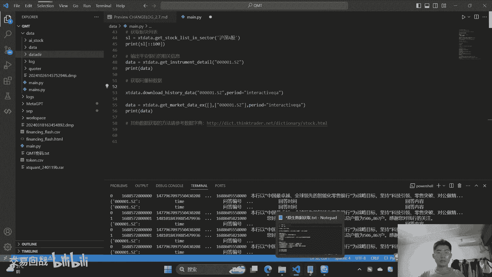

本节课中我们一起学习了QMT原生Python数据获取的全过程。我们从理解数据字典开始，逐步完成了Token获取、环境安装、服务初始化以及历史数据下载。接着，我们探讨了历史数据与实时数据的区别，以及使用多进程技术提升处理效率的方法。最后，我们展望了如何将大语言模型与金融数据结合，构建智能分析流程，处理复杂的文本类信息。

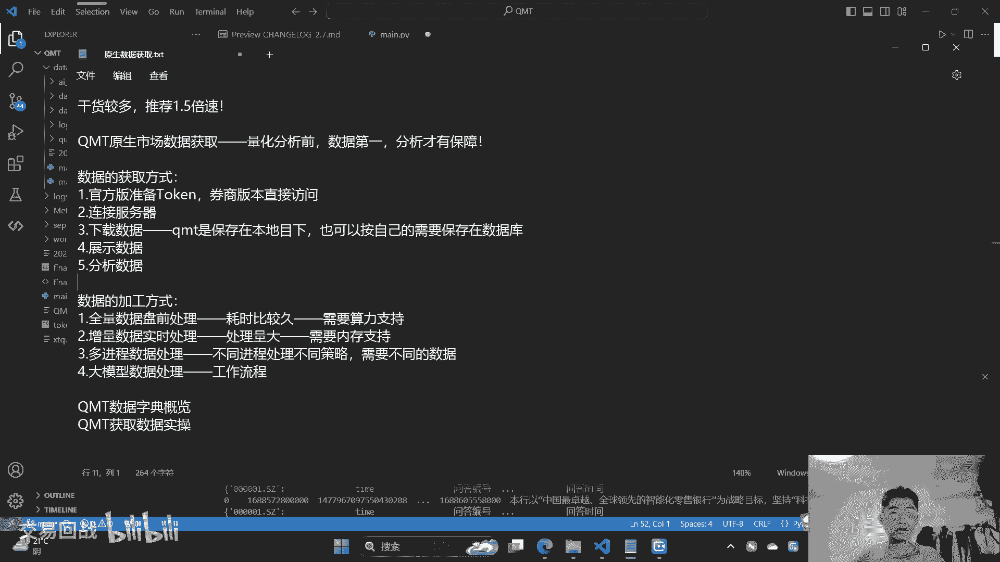

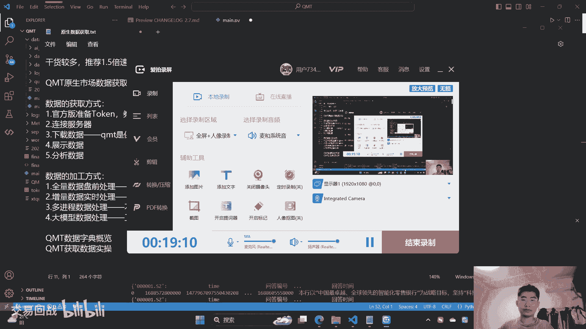

建议您按照教程步骤，从官网获取Token并运行示例代码，亲手体验数据获取的过程。对于大模型应用，可以从构建一个简单的财报摘要工具开始实践。