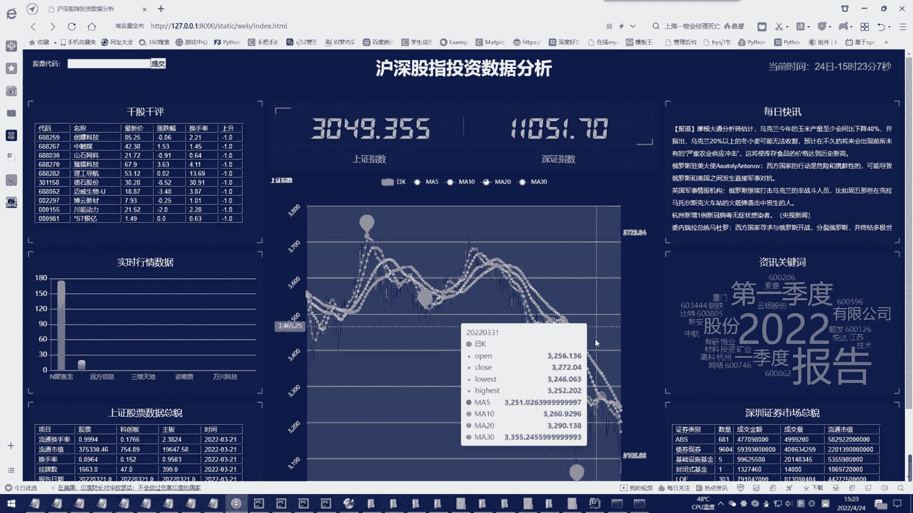
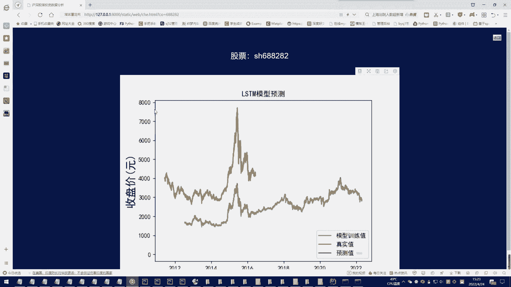
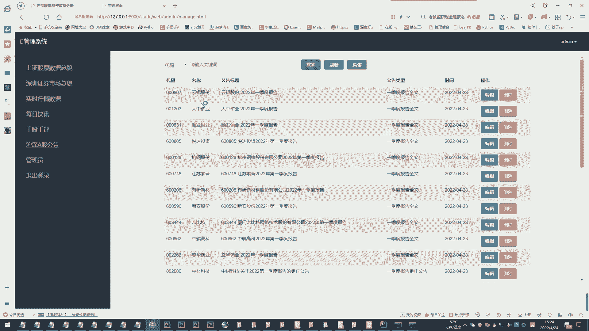

# 计算机毕业设计：股票预测与分析系统：P1：项目概述与核心技术介绍

在本课程中，我们将学习如何构建一个基于Python和LSTM的股票预测与分析系统。该系统将涵盖股票数据获取、分析、可视化、预测模型构建以及推荐策略等核心功能，是一个综合性的大数据与量化交易实践项目。

## 项目核心目标

本项目旨在通过实际编码，掌握金融数据分析与预测的全流程。我们将从零开始，构建一个能够处理股票历史数据、进行趋势预测并提供可视化分析的系统。

上一节我们明确了项目目标，本节中我们来看看实现这一目标需要哪些关键技术。

## 关键技术栈

以下是构建本系统所需的核心技术与工具：



*   **编程语言**：Python。因其丰富的数据科学库和简洁语法，成为本项目的首选。
*   **数据处理库**：Pandas 和 NumPy。用于高效地加载、清洗、转换和计算股票数据。
*   **机器学习/深度学习框架**：Scikit-learn 和 TensorFlow/Keras。Scikit-learn用于数据预处理和传统模型，TensorFlow/Keras用于构建核心的LSTM预测模型。
*   **数据可视化库**：Matplotlib 和 Seaborn。用于绘制股票价格走势图、技术指标图和预测结果对比图。
*   **网络数据获取**：Requests 库或专门的金融数据API（如AKShare、Tushare、yfinance）。用于获取实时的或历史的股票行情数据。

## 核心预测模型：LSTM

长短期记忆网络（LSTM）是一种特殊的循环神经网络（RNN），非常适合处理像股票价格这样的时间序列数据，因为它能够学习长期依赖关系。

其核心在于三个“门”结构：
*   **遗忘门**：决定从细胞状态中丢弃哪些信息。
    `公式：f_t = σ(W_f · [h_{t-1}, x_t] + b_f)`
*   **输入门**：决定哪些新信息被存入细胞状态。
    `公式：i_t = σ(W_i · [h_{t-1}, x_t] + b_i)`
*   **输出门**：基于细胞状态，决定输出什么。
    `公式：o_t = σ(W_o · [h_{t-1}, x_t] + b_o)`



最终，细胞状态 `C_t` 和隐藏状态 `h_t` 的更新公式体现了信息的流动与记忆。

在代码中，使用Keras可以轻松构建LSTM层：
```python
from tensorflow.keras.models import Sequential
from tensorflow.keras.layers import LSTM, Dense

model = Sequential()
model.add(LSTM(units=50, return_sequences=True, input_shape=(time_steps, n_features)))
model.add(LSTM(units=50))
model.add(Dense(1)) # 输出一个预测值（例如收盘价）
model.compile(optimizer='adam', loss='mean_squared_error')
```

## 系统功能模块



我们的系统将包含以下几个主要功能模块，以下是每个模块的简要说明：

1.  **数据获取与预处理模块**：负责从网络或本地获取股票数据，并进行清洗、归一化、特征工程（如计算移动平均线、RSI等指标）。
2.  **LSTM预测模型模块**：构建、训练并验证LSTM模型，用于预测未来股价走势。
3.  **数据可视化模块**：将历史数据、技术指标、预测结果以图表形式直观展示。
4.  **分析与推荐模块**：基于预测结果和技术指标，生成简单的交易信号或投资建议。

## 总结

本节课中，我们一起学习了“股票预测与分析系统”项目的整体蓝图。我们明确了项目的目标是构建一个综合性的分析工具，并介绍了实现该目标所需的**Python**、**Pandas**、**LSTM**等关键技术栈。我们重点了解了**LSTM模型**的原理及其在时间序列预测中的优势，并预览了系统将要实现的四大功能模块。从下一节课开始，我们将进入实战环节，首先学习如何获取和准备股票数据。