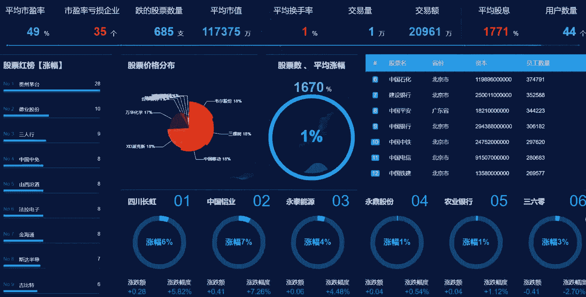
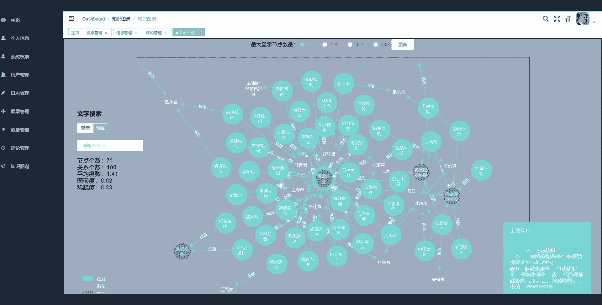
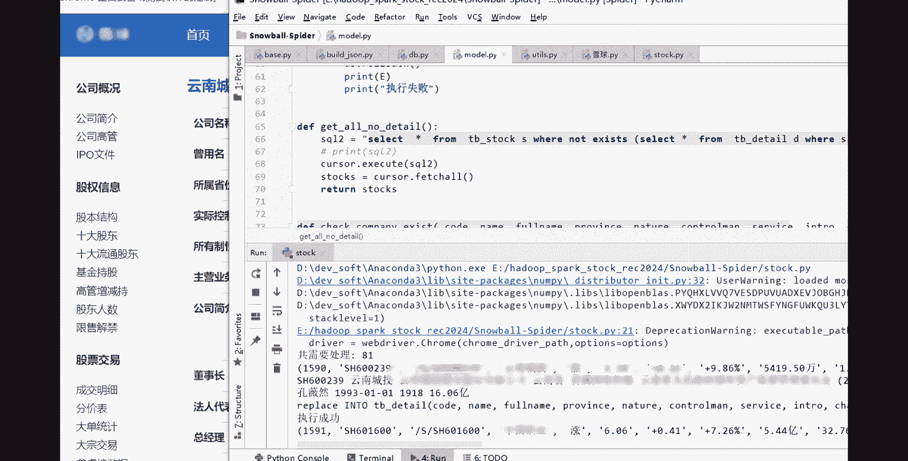
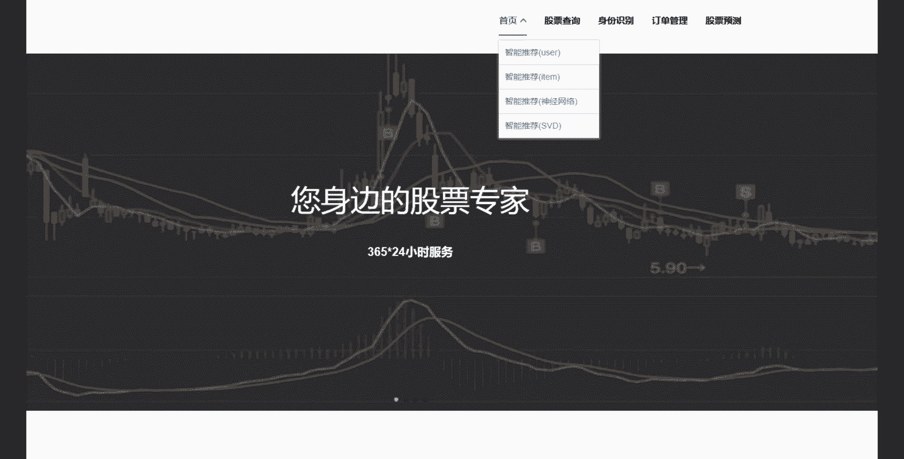
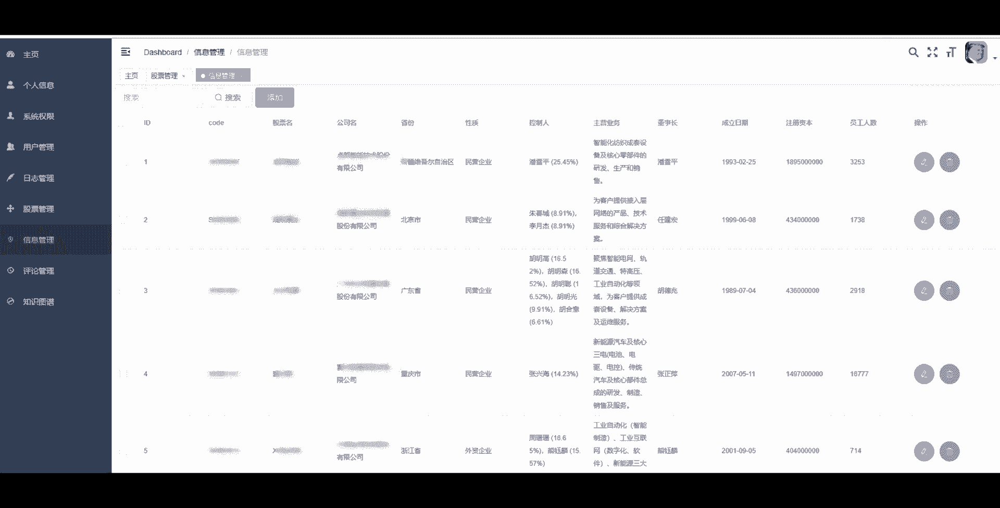

# 计算机毕业设计：P1：基于Spark与图神经网络的股票分析系统概述 📈

在本课程中，我们将学习如何构建一个综合性的股票分析系统。该系统将结合大数据处理框架Spark、前沿的图神经网络技术，以及传统的数据分析与可视化方法，实现从数据爬取、处理、分析到预测和推荐的全流程功能。

## 系统核心架构与目标 🎯

上一节我们介绍了本课程的整体目标，本节中我们来看看系统的核心架构与设计目标。本系统旨在为金融数据分析提供一个完整的解决方案，特别适用于计算机相关专业的毕业设计项目。



系统的核心目标包括：
*   **股票数据获取**：通过网络爬虫技术实时抓取股票市场数据。
*   **大数据处理**：利用Apache Spark框架高效处理海量金融时序数据。
*   **图神经网络分析**：将股票间的关联构建成图，使用GNN模型挖掘深层关系，用于推荐与预测。
*   **量化交易信号**：基于分析结果生成潜在的交易信号。
*   **数据可视化**：将复杂的分析结果通过K线图、趋势图等形式直观展示。

## 核心技术组件详解 ⚙️



了解了系统目标后，我们来深入探讨实现这些目标所需的核心技术组件。每个组件都承担着系统中不可或缺的角色。

以下是构建本系统需要掌握的关键技术：

1.  **Apache Spark**：用于分布式数据处理的引擎。其核心优势在于内存计算，能快速处理大规模的股票历史与实时数据。
    *   **核心概念**：弹性分布式数据集（RDD）和DataFrame。
    *   **示例代码**（数据加载）：
        ```scala
        val spark = SparkSession.builder().appName("StockAnalysis").getOrCreate()
        val stockDF = spark.read.option("header", "true").csv("hdfs://path/to/stock_data.csv")
        ```

2.  **图神经网络**：用于建模股票之间的复杂关系（如同板块、供应链、投资者重叠等）。我们将股票视为节点，关系视为边，构建一个金融关系图。
    *   **核心公式**：GNN的一层传播规则可简化为 `H^(l+1) = σ(A * H^(l) * W^(l))`，其中`A`是邻接矩阵，`H^(l)`是第`l`层的节点特征，`W^(l)`是可训练权重矩阵。

3.  **网络爬虫**：负责从财经网站获取股票代码、基本面数据、实时交易数据等。
    *   **常用工具**：Python的`Scrapy`或`BeautifulSoup`库。



4.  **数据可视化**：将分析结果以图表形式呈现，帮助用户理解市场趋势和模型输出。
    *   **常用库**：`Matplotlib`, `Plotly`, `ECharts`，用于绘制K线图、成交量图和技术指标图。

## 系统工作流程 🔄



在熟悉了技术组件后，我们来看看它们是如何协同工作的。系统的工作流程是一个从数据到洞察的完整管道。

以下是系统从数据到结果的主要步骤：

1.  **数据采集与存储**：爬虫程序抓取数据，清洗后存储到HDFS或数据库中。
2.  **数据预处理**：使用Spark进行数据清洗、归一化、特征工程，并构建股票关系图。
3.  **模型训练与预测**：将图数据输入GNN模型进行训练，学习股票价格的波动模式与关联性，进而进行未来走势预测或相似股票推荐。
4.  **生成交易信号**：结合预测结果与量化策略，产生买入、持有或卖出信号。
5.  **结果可视化**：将原始数据、预测曲线、推荐列表和交易信号通过Web界面进行交互式可视化展示。

## 总结与展望 📚



本节课中，我们一起学习了如何规划一个基于Spark和图神经网络的股票分析系统。我们从系统总目标出发，剖析了其核心的技术组件，包括Spark、GNN、爬虫和可视化工具，并梳理了各模块协同工作的完整流程。

这个项目不仅涵盖了大数据、人工智能、Web开发等多个计算机核心领域，还具有很强的实用性和研究价值，是一个理想的毕业设计课题。在后续的课程中，我们将对每个技术模块进行更深入的实战讲解。