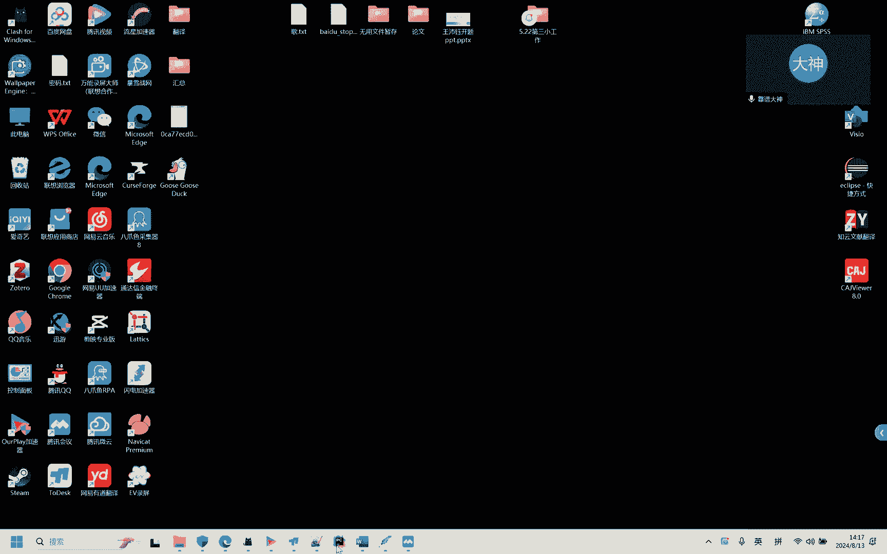
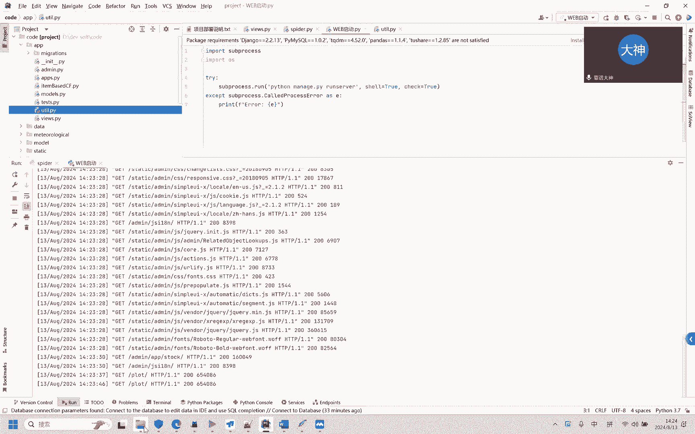

# 股票推荐与预测系统：P1：系统概述与启动演示 🚀

在本节课中，我们将学习一个基于Python和TensorFlow的股票分析系统。该系统集成了数据爬取、可视化、预测、推荐以及量化交易分析等功能，是一个综合性的毕业设计项目。我们将从系统架构概述开始，并详细演示其启动和基本操作流程。

## 系统架构与数据获取

整个系统的数据来源于网络爬虫。我们使用了一个免费的聚合数据接口来获取股票信息。

以下是数据爬取的核心步骤：

1.  **启动爬虫**：运行爬虫脚本，开始从接口获取数据。
2.  **控制频率**：在爬取每条数据后，程序会休眠8秒。这是为了防止请求频率过高导致接口被限制或失效。
3.  **数据入库**：爬取到的数据会被存储到数据库中。我们可以通过数据库工具查看最新入库的数据，例如2024年8月份的数据。

## 系统启动与登录

上一节我们介绍了数据如何获取，本节中我们来看看如何启动并访问系统的Web界面。

启动过程需要注意顺序，否则可能因数据库锁导致失败。

以下是正确的启动流程：

1.  **完成数据爬取**：首先确保爬虫程序已经运行完毕并停止。如果爬虫仍在运行，它会锁定数据库，导致Web服务无法正常访问。
2.  **启动Web服务**：运行Web应用程序的主启动文件。
3.  **访问系统**：在浏览器中打开Web服务地址，通常是 `http://127.0.0.1:8000` 或 `http://localhost:8000`。
4.  **用户登录**：系统内置了一个默认管理员账户用于登录。
    *   **用户名**: `admin`
    *   **密码**: `admin`
    这些凭证存储在数据库的 `app_user` 表中。

## 核心功能模块演示

成功登录后，我们将进入系统主界面。该系统提供了多个功能模块供用户使用。

以下是系统的主要功能区域：

*   **股票新闻**：展示从同花顺等平台爬取的最新股票相关新闻。
*   **股票信息查询**：可以按股票代码、日期等条件查询详细的股票数据，包括价格、代码等信息。
*   **股票推荐**：系统会基于算法推荐一些股票。推荐结果通常包含链接，可以直接跳转到该股票在同花顺等平台的详情页。
*   **单只股票可视化**：针对某一只股票，展示其历史价格走势图以及基于算法的未来价格预测图表。
*   **整体股票可视化**：以图表形式展示市场整体的数据概况，例如每日的最高价、最低价分布等。
*   **后台管理系统**：使用相同的管理员账号 (`admin`/`admin`) 登录后，可以对用户、股票数据等进行管理，同时后台也集成了可视化和分析功能。

## 算法与代码结构

系统的核心算法逻辑分布在几个关键的代码文件中。

以下是主要的算法文件及其作用：

*   **`item_base_cf.py`**：包含了基于项目的协同过滤推荐算法代码，用于实现股票推荐功能。
*   **`views.py`** 与相关控制器文件：这些文件包含了Web页面的视图逻辑、数据处理以及股票预测等算法。预测模型可能涉及TensorFlow构建的机器学习或深度学习模型。
*   其他工具文件：负责数据清洗（如处理缺失值）、辅助计算等任务。

## 总结

本节课中我们一起学习了这个股票分析系统的整体架构和启动流程。我们了解到系统通过爬虫获取数据，通过Web界面提供丰富的功能，包括数据查询、可视化、预测和推荐。关键点在于启动时要先完成数据爬取再启动Web服务，并使用默认账号登录。系统的核心算法，如推荐和预测，可以在指定的Python文件中进行深入研究。