# 计算机毕业设计：P1：基于Python与TensorFlow的股票系统开发概述 📈

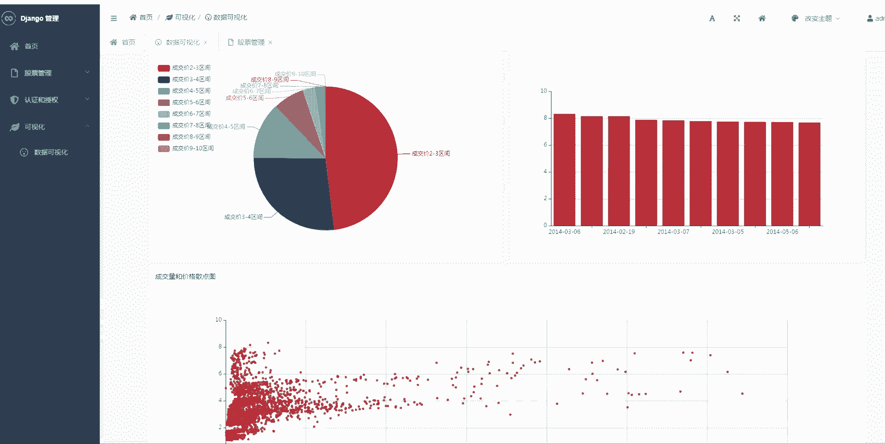

在本节课中，我们将要学习如何构建一个综合性的股票系统。该系统将涵盖从数据获取、分析、可视化到预测与推荐的完整流程，是结合了大数据、人工智能与量化交易概念的典型计算机毕业设计项目。

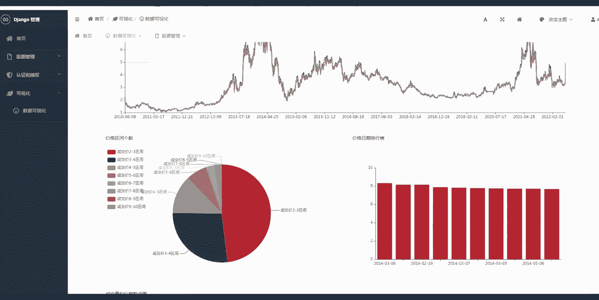

## 系统核心模块介绍

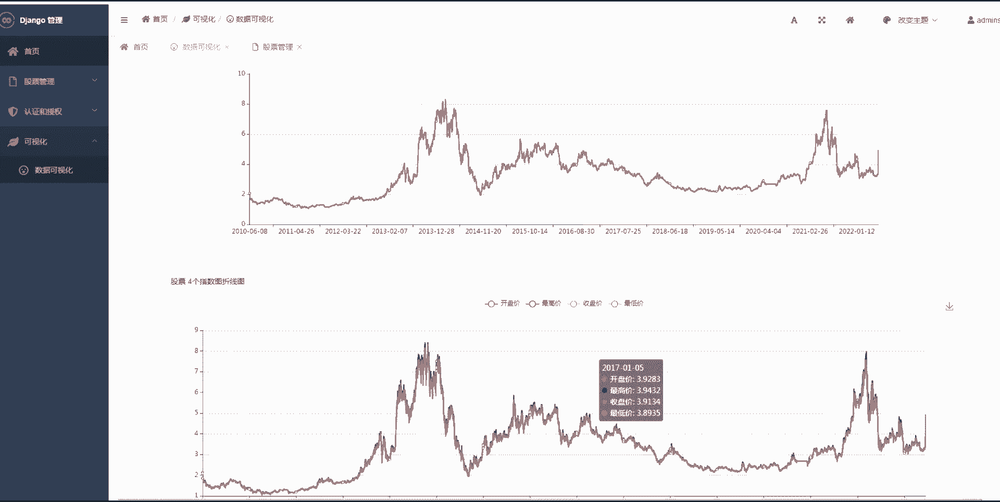

上一节我们介绍了项目的整体目标，本节中我们来看看构成该股票系统的几个核心功能模块。

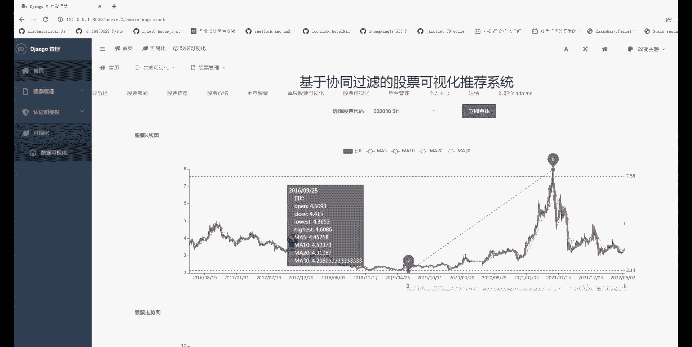

以下是系统包含的主要功能组件：

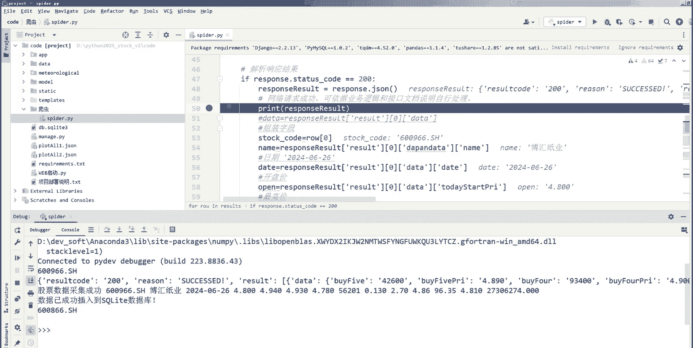

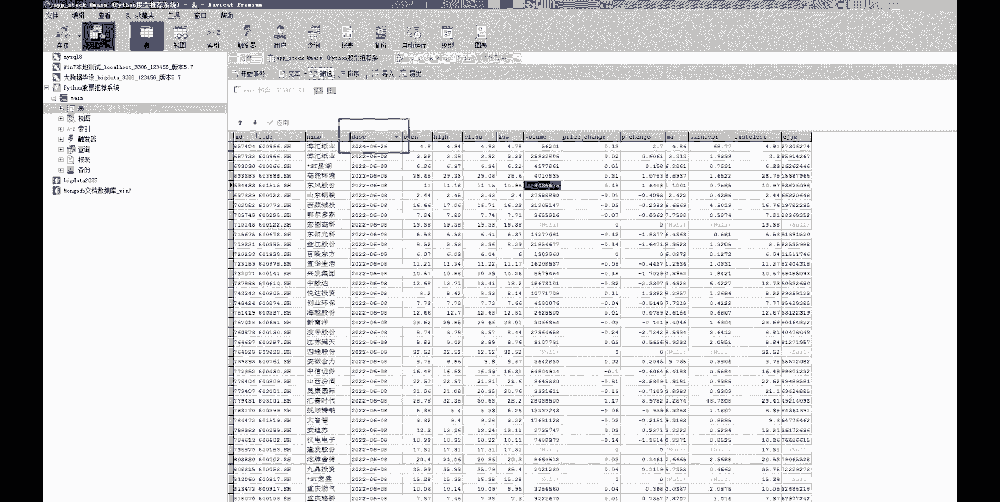

1.  **股票数据爬虫**：负责从网络自动获取股票历史与实时数据。
2.  **股票数据分析**：对获取的原始数据进行清洗、统计与初步分析。
3.  **股票数据可视化**：将分析结果以图表形式展示，最典型的是**K线图**。
4.  **股票价格预测系统**：利用机器学习模型（如TensorFlow构建的LSTM网络）预测未来股价走势。
5.  **股票推荐系统**：基于预测结果、基本面或技术指标，为用户提供投资建议。
6.  **量化交易系统**：根据设定的策略，模拟或执行自动化交易。

## 技术栈与核心概念

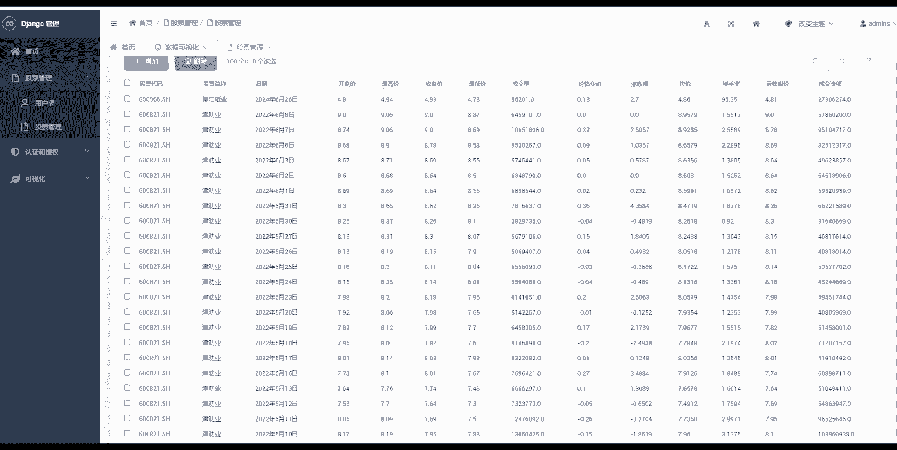

了解了系统模块后，我们来看看实现这些功能所需的关键技术与核心概念。

以下是项目涉及的主要技术和其简单解释：

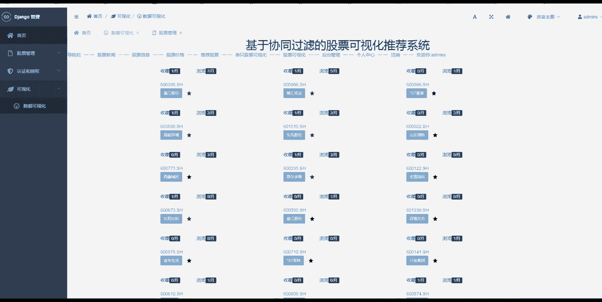

*   **Python**：项目的主要编程语言，因其丰富的数据科学库而被广泛使用。
*   **TensorFlow/Keras**：用于构建和训练股票预测的深度学习模型。核心模型可能是一个**循环神经网络（RNN）**或其变体**长短期记忆网络（LSTM）**，其基本单元结构可以用以下简化公式描述：
    ```
    f_t = σ(W_f · [h_{t-1}, x_t] + b_f)
    i_t = σ(W_i · [h_{t-1}, x_t] + b_i)
    C̃_t = tanh(W_C · [h_{t-1}, x_t] + b_C)
    C_t = f_t * C_{t-1} + i_t * C̃_t
    o_t = σ(W_o · [h_{t-1}, x_t] + b_o)
    h_t = o_t * tanh(C_t)
    ```
    其中，`σ`是sigmoid函数，`*`表示逐元素乘法。
*   **Pandas/Numpy**：用于数据处理和数值计算的基础库。
*   **Matplotlib/Plotly**：用于绘制股票K线图、趋势线等可视化图表。
*   **Scikit-learn**：可能用于数据预处理、特征工程或辅助的机器学习任务。
*   **数据库（如MySQL/MongoDB）**：用于存储爬取的历史数据和模型结果。

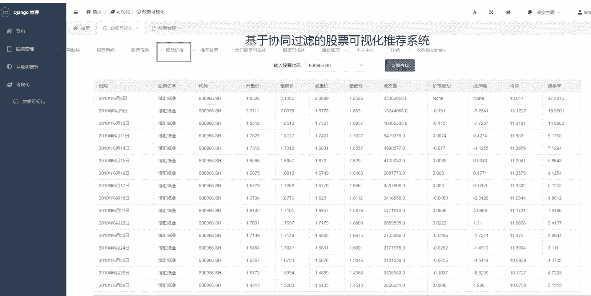

## 开发流程简述

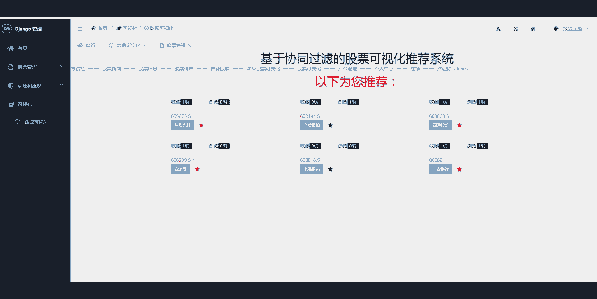

掌握了技术栈，我们接下来梳理大致的开发步骤，让初学者对项目全貌有清晰认识。

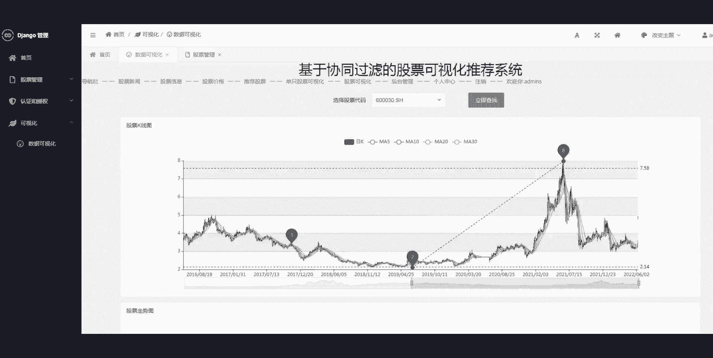

以下是构建该系统的一般性流程：

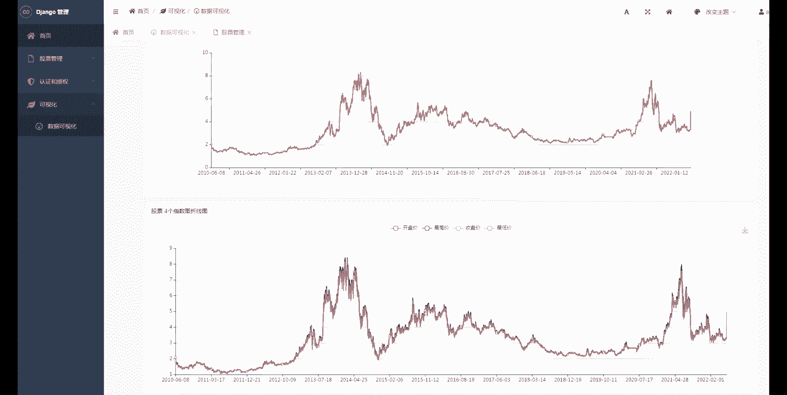

1.  **数据获取**：编写爬虫脚本，从财经网站（如新浪财经、雅虎财经）获取股票代码、历史交易数据（开盘价、收盘价、最高价、最低价、成交量）。
2.  **数据预处理**：使用Pandas清洗数据，处理缺失值，并计算常用的技术指标（如移动平均线MA、相对强弱指数RSI）作为模型特征。
3.  **模型构建与训练**：使用TensorFlow搭建预测模型（如LSTM）。将历史数据按时间序列划分训练集和测试集，用过去N天的数据预测未来M天的价格。
    ```python
    # 示例：使用Keras构建一个简单的LSTM模型结构
    from tensorflow.keras.models import Sequential
    from tensorflow.keras.layers import LSTM, Dense

    model = Sequential()
    model.add(LSTM(units=50, return_sequences=True, input_shape=(time_steps, feature_dim)))
    model.add(LSTM(units=50))
    model.add(Dense(units=1)) # 预测一个值，例如收盘价
    model.compile(optimizer='adam', loss='mean_squared_error')
    ```
4.  **可视化实现**：利用Matplotlib的`mplfinance`库或Plotly绘制专业的K线图，并叠加预测结果。
5.  **系统集成与推荐**：将预测结果与基本面分析结合，设计评分或排序算法，生成股票推荐列表。量化交易模块则根据策略信号（如金叉、死叉）模拟交易。
6.  **前端展示（可选）**：可使用Flask或Django框架开发Web界面，将数据可视化、预测结果和推荐列表展示给用户。

## 总结

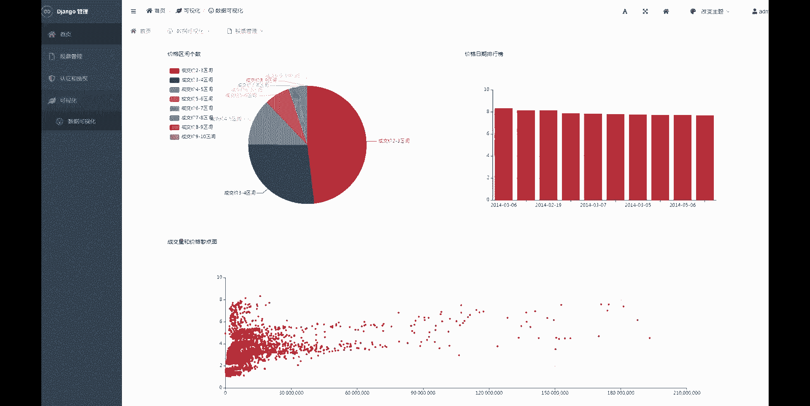

本节课中我们一起学习了如何规划一个基于Python和TensorFlow的综合性股票系统毕业设计。我们从系统总览开始，逐步拆解了其核心功能模块，包括数据爬取、分析、可视化、预测与推荐。接着，我们介绍了实现所需的关键技术栈，特别是用**LSTM模型**进行时间序列预测的核心概念。最后，我们概述了从数据到成品的完整开发流程。

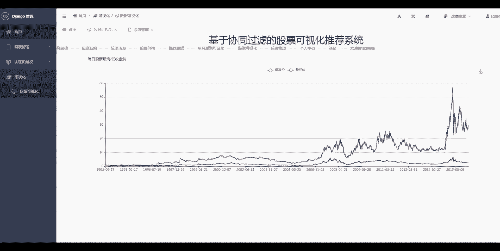

这个项目融合了数据处理、机器学习、软件工程和金融知识，是展示综合能力的优秀毕业设计选题。