# VNPY30天解锁Python期货量化开发：课时06：Github代码仓库 🗂️

在本节课中，我们将学习如何使用Github来管理我们的代码。Github是全球领先的代码托管平台，掌握它的基本用法是进行协作开发和版本控制的重要一步。

## 课程交流与资源获取

以下是关于课程交流群和资源获取的重要信息。

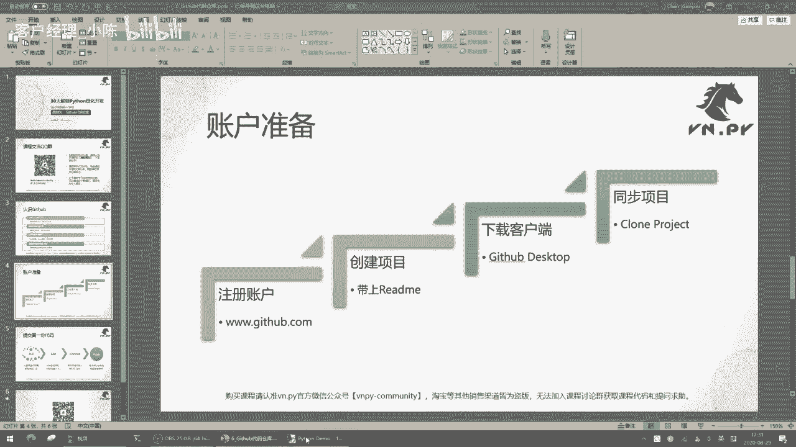

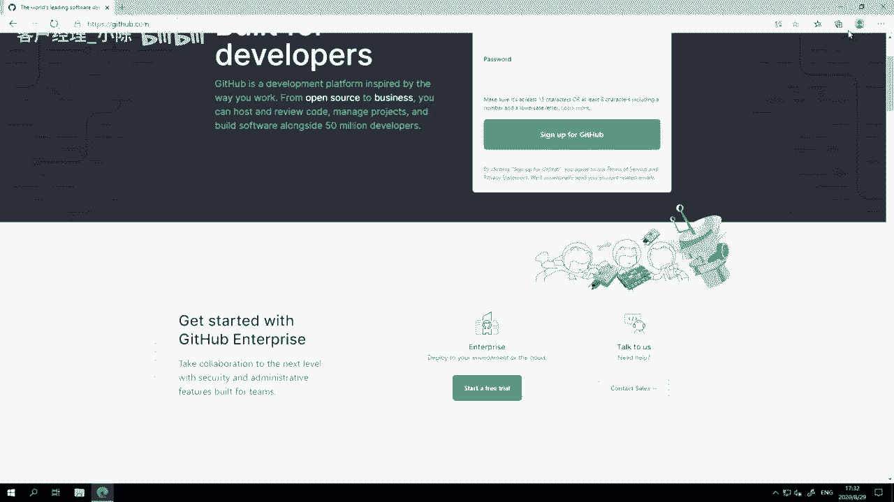

*   **课程交流QQ群**：您可以使用手机QQ扫描视频中的二维码，或在电脑QQ上搜索群号加入。**加群验证时，请务必输入您购买课程时使用的微信昵称**，否则无法通过验证。
*   **代码与资料**：课程中涉及的所有代码和资料，都会分享在QQ群的群文件中，并按课时分类存放，方便大家查找。
*   **学习答疑**：本课程面向编程入门者，学习过程中有任何关于Python的问题，都可以在群内提问，每天会有专人进行解答。
*   **正版课程声明**：本课程通过“**vn.py社区**”官方微信公众号发售。在其他渠道购买的均为盗版，无法加入课程群并获得后续服务与支持，建议您申请退款并购买正版。

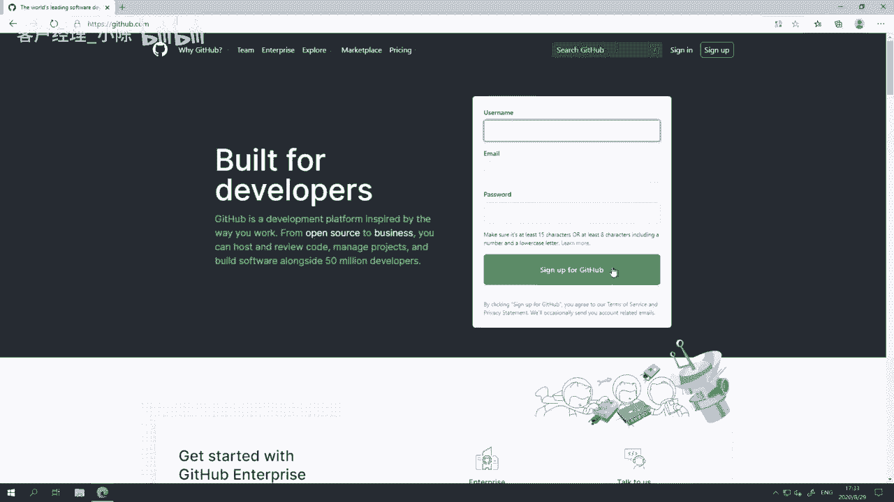

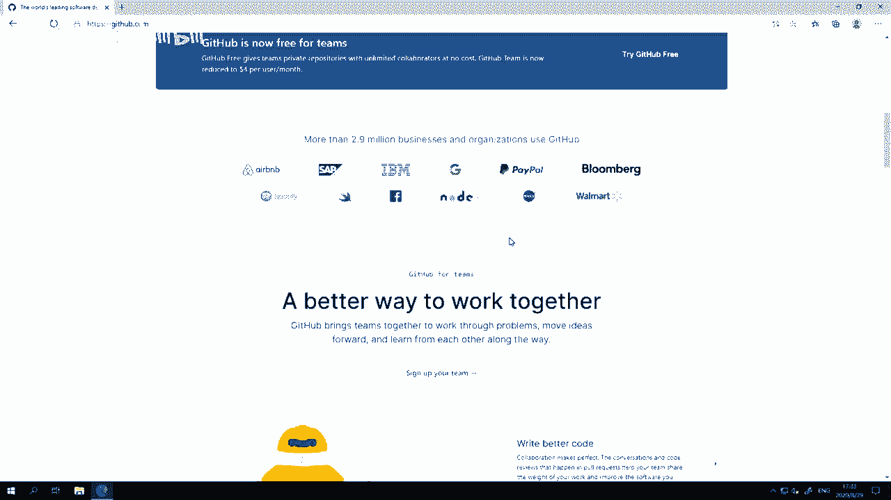

## 认识Github

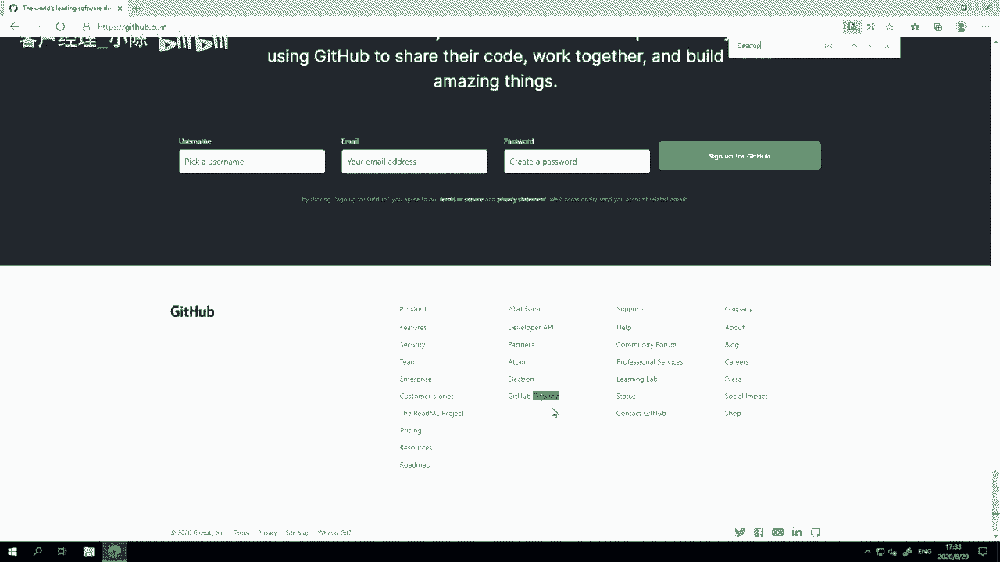

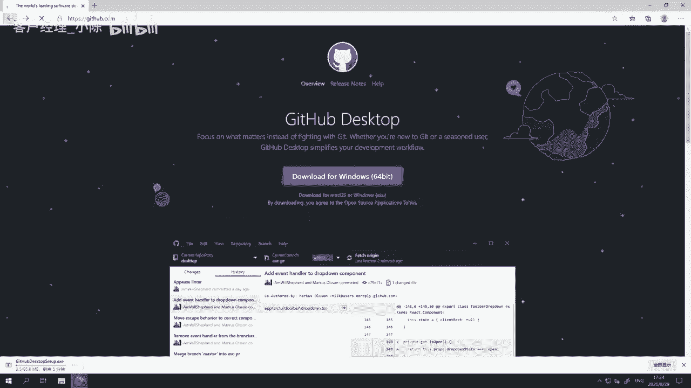

上一节我们介绍了Jupyter交互式环境，本节中我们来看看Github。

*   **Github是什么**：Github是一个网站，它是全球最大的代码托管平台。类似的平台还有GitLab、码云等。“代码托管”指的是将代码文件存储在网络服务器上，并进行版本管理，我们稍后会通过实操来具体理解。
*   **核心工具**：Github网站背后使用的代码版本管理工具叫做 **`Git`**。类似的工具还有SVN、Mercurial等。Git因其强大的功能和广泛的适用性，成为了目前最主流的版本管理工具。
*   **开源社区**：Github同时也是全球最大的开源项目聚集地。作为一个平台，它除了提供代码托管，还扩展了问题跟踪（Issue）、Bug报告、代码审查等协作功能。
*   **其他说明**：Github是一个美国网站，有时访问可能不稳定，但通常可以直接访问。网络上关于“Github是全球最大的同性交友网站”的说法是一种戏称，意在说明其用户以男性开发者居多，大家主要在此进行技术交流与协作。

## 实操：提交第一份代码 🖥️

接下来，我们通过一个完整的流程，将一份代码提交到Github仓库。

以下是完成此流程所需的四个步骤：
1.  **准备账户与项目**：在 `www.github.com` 注册账号，并创建一个附带 `README` 文件的新项目（Repository）。
2.  **下载客户端**：下载并安装 `Github Desktop` 桌面客户端。
3.  **克隆项目**：使用客户端将远程仓库克隆（Clone）到本地电脑。
4.  **修改与提交**：在本地修改代码，并将更改提交（Commit）并推送（Push）到远程仓库。

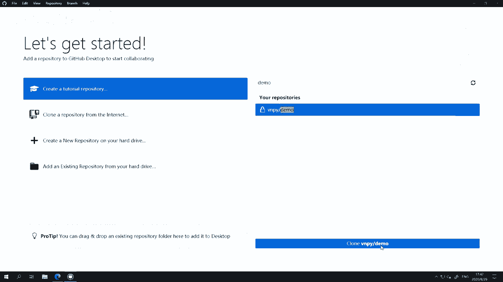

### 详细操作步骤

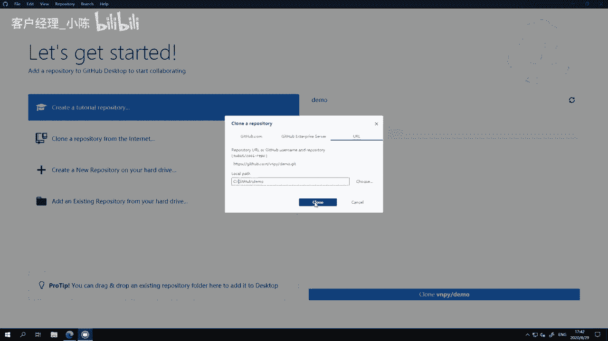

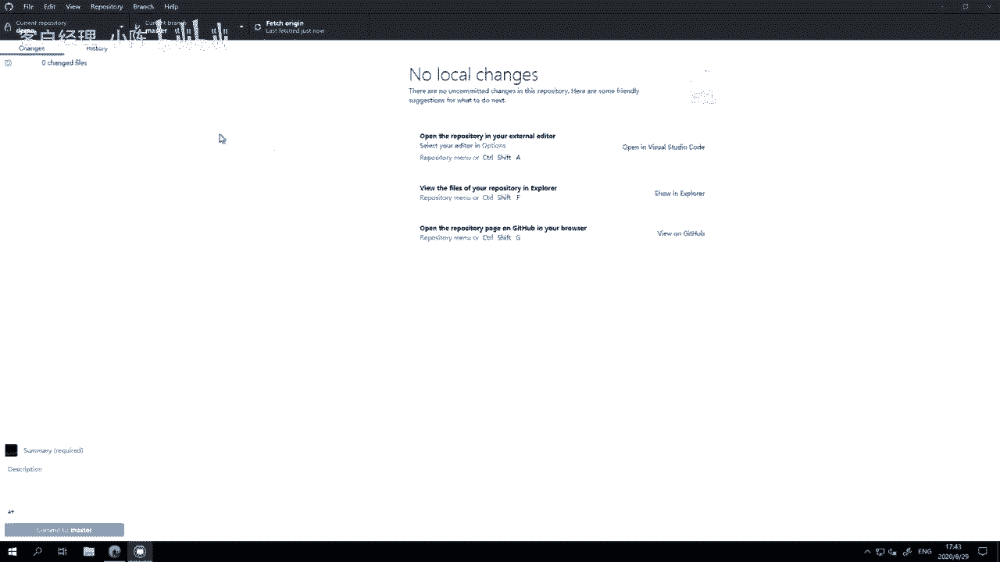

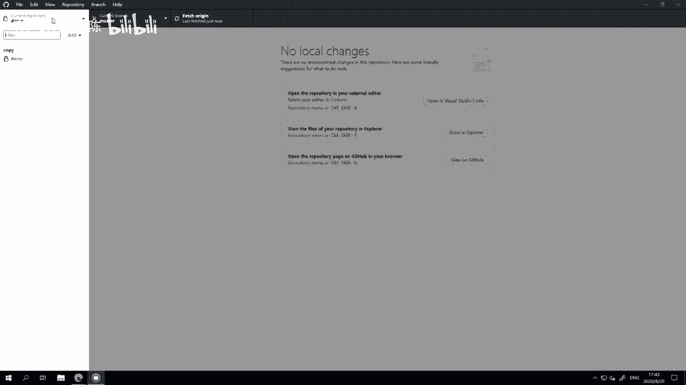

我们将在阿里云服务器（推荐配置：2核CPU、4G内存、Windows Server 2019系统）上演示整个流程。

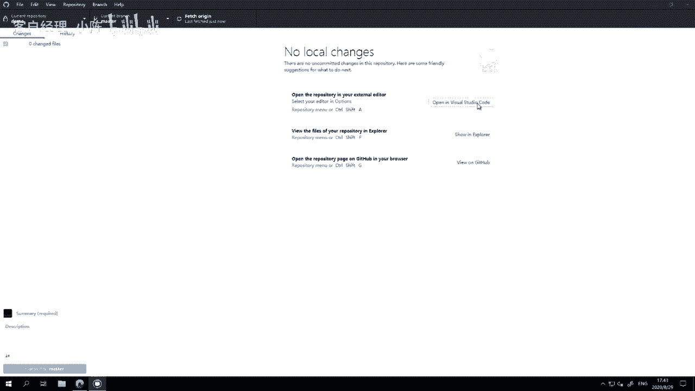

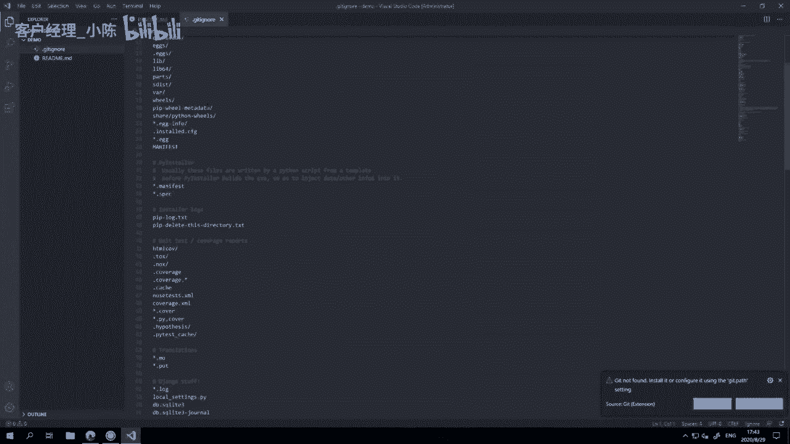

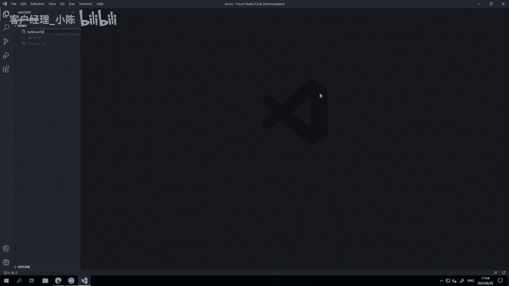

1.  **注册与创建仓库**：
    *   访问Github网站并注册账号。
    *   登录后，点击“New”创建一个新仓库。
    *   仓库名设为 `demo`，描述可选，类型建议先选择 **`Private`**（私有），并勾选“**Add a README file**”。
    *   其他选项如 `.gitignore` 模板（可选Python）和许可证（可选None）可根据需要设置，然后点击创建。

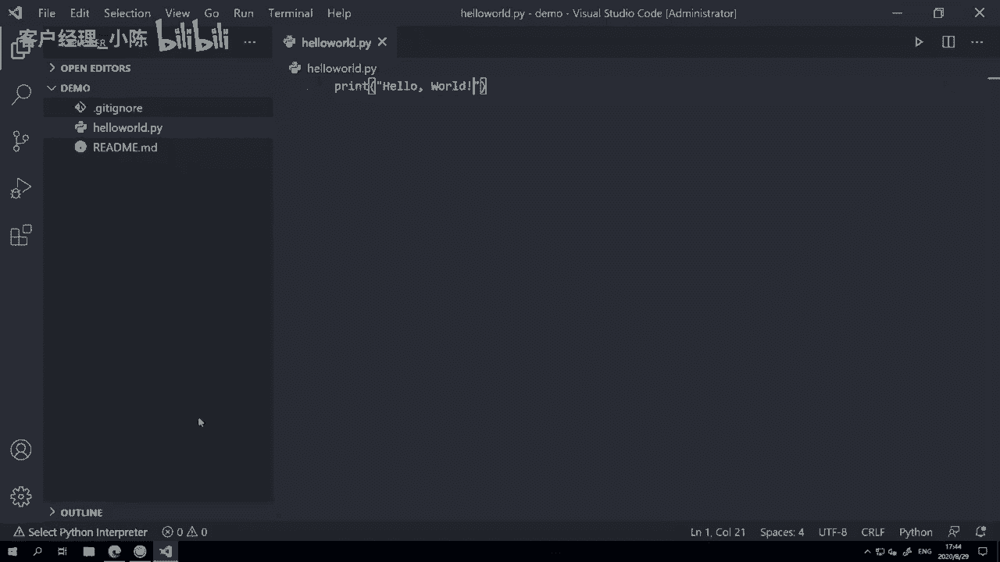

2.  **安装与配置客户端**：
    *   在Github网站底部找到并下载 `Github Desktop`。
    *   安装后打开，登录您的Github账号，并按照提示完成初始配置（如设置用户名和邮箱）。

3.  **克隆项目到本地**：
    *   在Github Desktop中，找到您刚创建的 `demo` 仓库。
    *   点击“Clone”，选择本地存放路径（例如 `C:\GitHub\`），将远程仓库完整复制到本地。

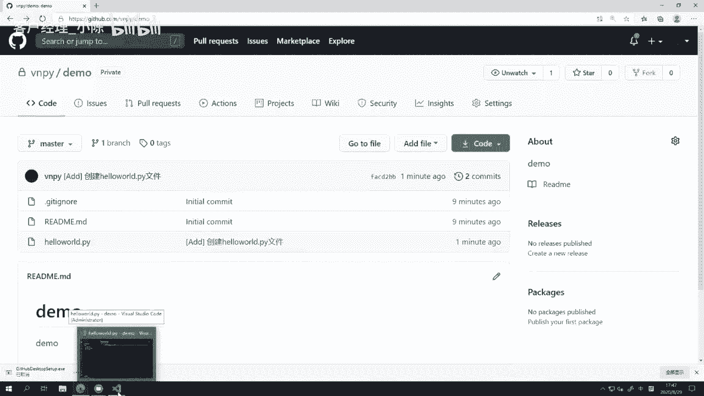

4.  **编写与提交代码**：
    *   在Github Desktop中点击“Open in Visual Studio Code”，在VS Code中打开项目目录。
    *   新建一个Python文件：`hello_world.py`。
    *   在文件中输入代码：`print(“hello world”)` 并保存。
    *   回到Github Desktop，您会看到更改记录。在摘要框中输入 `[ADD] 创建hello_world.py文件`，然后点击“**Commit to master**”提交到本地仓库。
    *   提交后，点击上方的“**Push origin**”按钮，将本次提交推送到Github远程服务器。
    *   刷新Github网站上的仓库页面，即可看到新增的文件和提交记录。

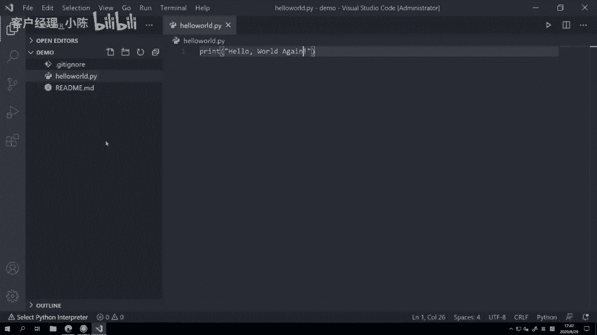

5.  **修改并再次提交**：
    *   在本地修改 `hello_world.py` 文件，例如将输出改为 `print(“hello world again”)`，保存文件。
    *   在Github Desktop中会显示新的更改（红色表示删除行，绿色表示新增行）。
    *   输入提交摘要如 `[MOD] 修改输出文字内容`，再次执行“Commit to master”和“Push origin”。
    *   在Github网站可以查看文件的最新内容，并通过“History”查看完整的修改历史。

## 核心流程总结 🔄

本节课我们一起学习了代码管理的核心四步操作，它们构成了使用Git进行版本控制的基本工作流。

1.  **Pull / Fetch (拉取)**：将远程服务器上的最新代码同步到本地。在Github Desktop中，这通过“Fetch origin”或“Pull origin”按钮完成。确保在开始工作前，本地代码是最新的。
2.  **Edit (编辑)**：在本地使用编辑器（如VS Code）创建、修改或删除代码文件。
3.  **Commit (提交)**：将本地的修改打包成一个记录，保存到本地的Git数据库中。每次提交都需要一个简短的描述，说明这次修改的目的。例如：
    ```bash
    [ADD] 创建新功能模块
    [MOD] 优化算法逻辑
    [FIX] 修复登录Bug
    ```
4.  **Push (推送)**：将本地提交的记录上传到远程服务器（如Github）进行永久备份。这样即使本地电脑损坏，代码也不会丢失。

这个流程就像一台“时光机”，完整记录了代码的每一次变化，方便回溯、协作和防止意外丢失。在后续课程中，随着代码越来越复杂，我们将更频繁地使用Github来管理我们的项目。

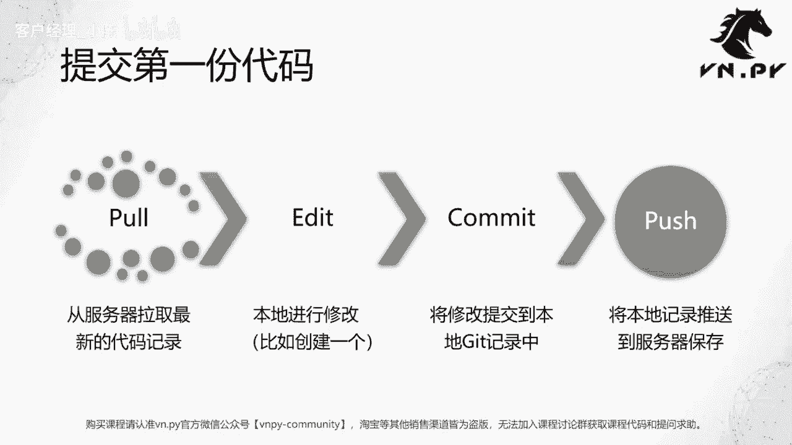

---
更多精华内容，请扫码关注“**vn.py社区**”官方微信公众号。