# VNPY30天解锁Python期货量化开发：课时03：Hello, World! 👋

在本节课中，我们将学习如何运行Python代码，并完成编程界的经典入门仪式——打印“Hello, World!”。我们将介绍三种运行Python代码的主要方式，并逐一进行实践。

---

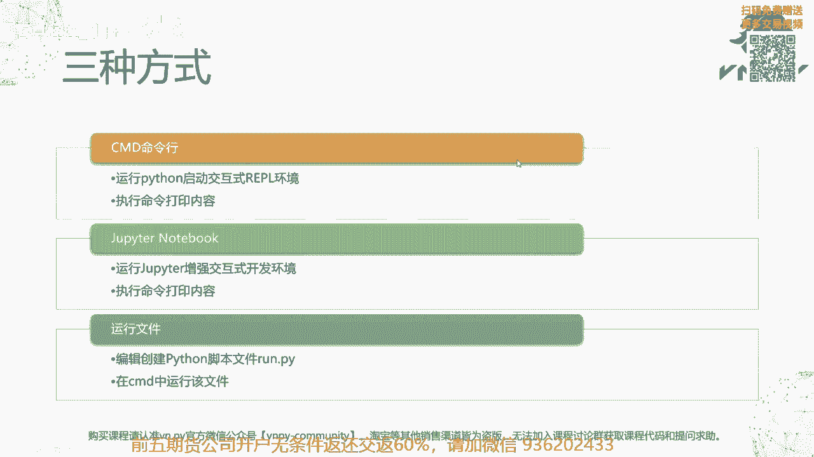

## 概述

上一节我们介绍了如何安装VN Studio Python运行环境。本节中，我们将像学习所有编程语言一样，从“Hello, World!”开始。我们将学习三种运行Python代码的方式，它们分别是：在命令行交互式环境中运行、在Jupyter Notebook中运行以及通过运行Python脚本文件来执行。

---

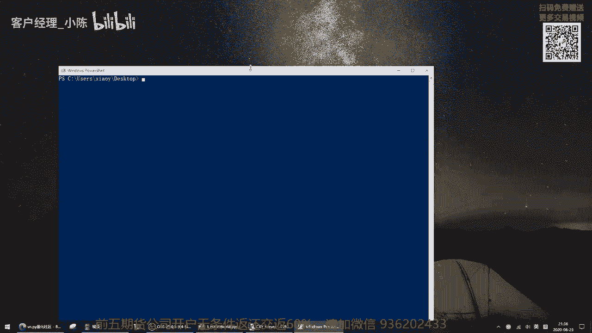

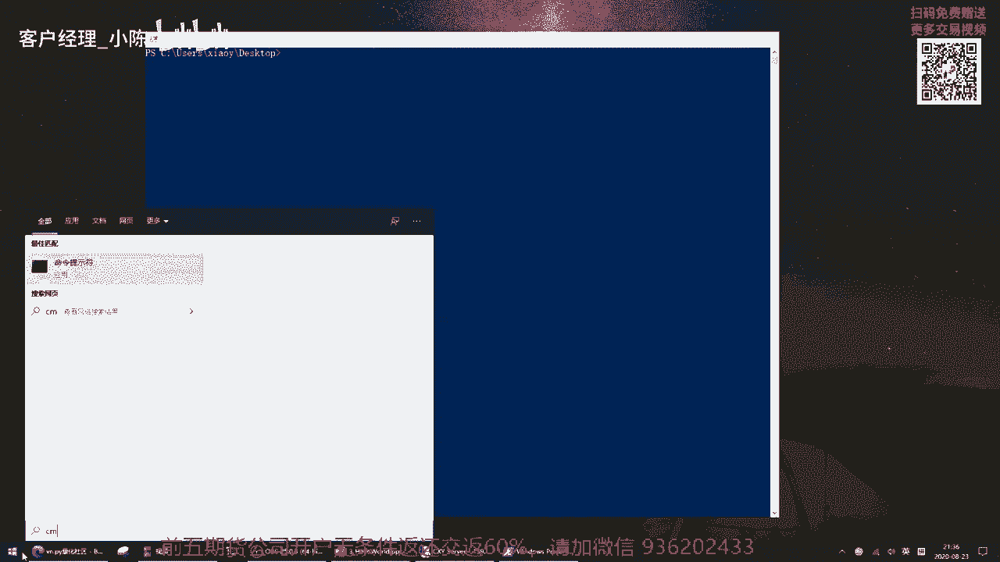

## 三种运行Python代码的方式

以下是三种运行Python代码的主要方法，每种方法都对应着不同的使用场景。

### 1. 命令行交互式环境 (REPL)

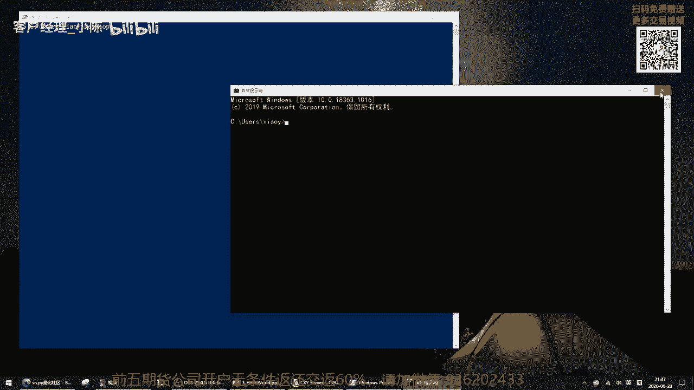

第一种方式是最基本、最简单的，即在命令行交互式环境中运行代码。这个环境被称为REPL（Read-Eval-Print Loop，读取-求值-打印循环）。

首先，我们需要打开命令行窗口。在Windows系统中，你可以按住键盘左下角的`Shift`键，然后在任意文件夹内点击鼠标右键，选择“在此处打开PowerShell窗口”。PowerShell和传统的CMD（命令提示符）功能类似，都是Windows的命令行运行环境，两者对于我们的基础操作几乎没有区别。

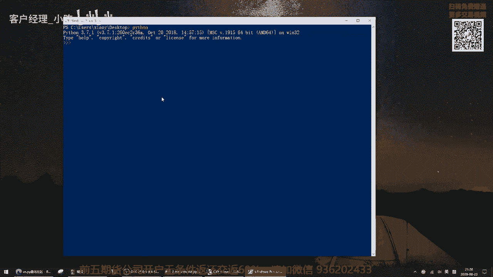

打开命令行窗口后，输入以下命令来启动Python交互式环境：

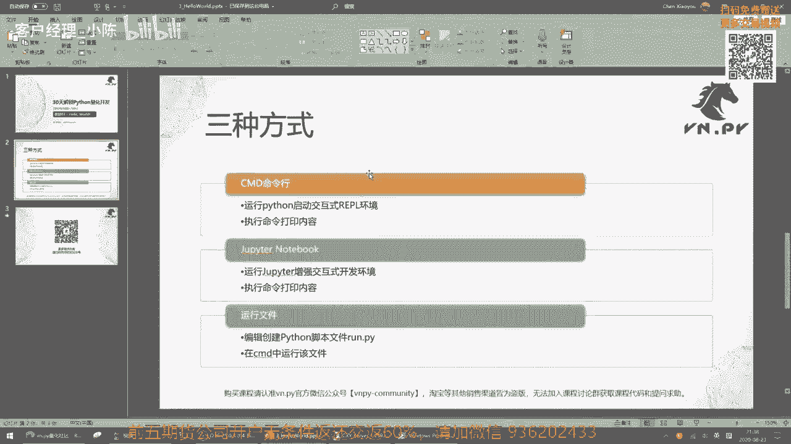

```bash
python
```

启动成功后，你会看到类似`>>>`的提示符，这表示你已经进入了Python的交互式环境。此时，我们可以输入代码并立即看到结果。

要打印“Hello, World!”，我们使用`print`函数。在提示符后输入以下代码：

```python
print("Hello World!")
```

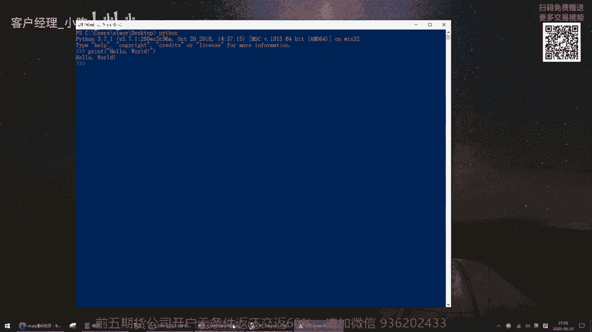

输入完成后，按回车键执行。命令行窗口会立即输出“Hello World!”这行文字。这种方式适合快速测试单行或少量代码。

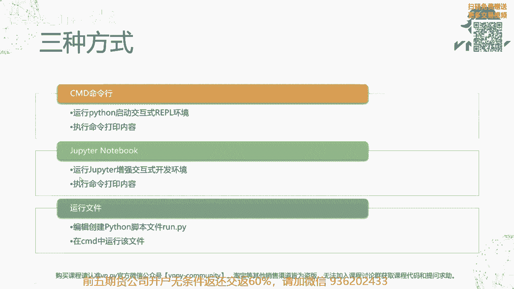

### 2. Jupyter Notebook 增强交互式环境

第二种方式是使用Jupyter Notebook，这是一个运行在网页浏览器中的增强型交互式开发环境。它提供了更好的代码可视化和编辑体验。

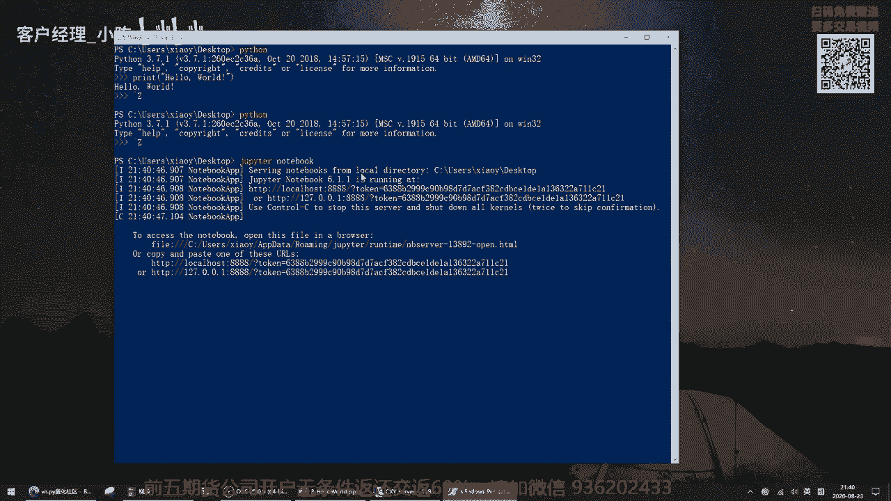

首先，我们需要退出当前的Python交互式环境。在`>>>`提示符下，同时按下键盘上的`Ctrl`和`Z`键，然后按回车，即可退出Python环境，回到命令行。

接着，在命令行中输入以下命令来启动Jupyter Notebook服务器：

```bash
jupyter notebook
```

命令执行后，系统可能会让你选择用哪个浏览器打开Jupyter。建议使用Chrome、Firefox或Microsoft Edge等现代浏览器，以获得最佳体验。

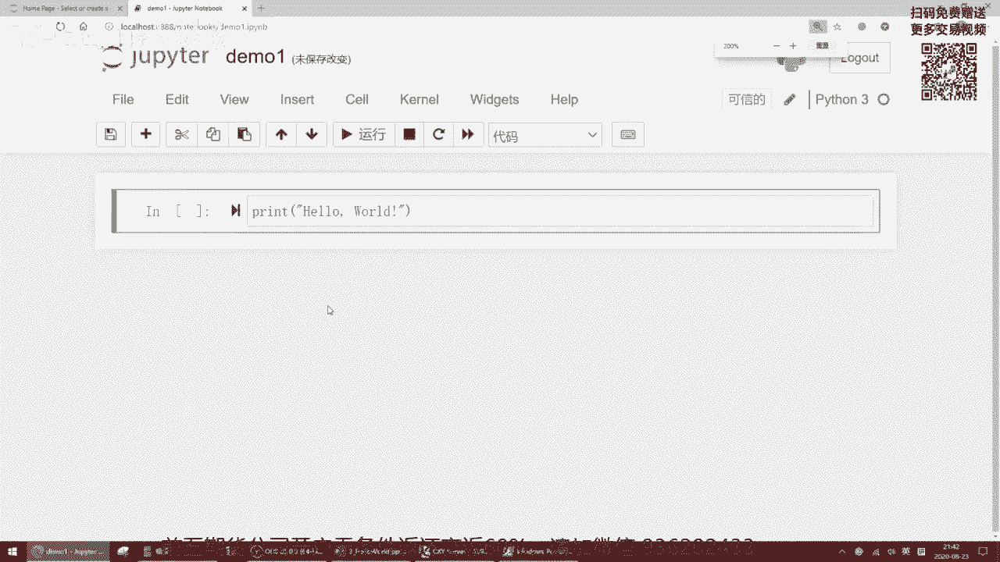

浏览器打开Jupyter页面后，点击页面右上角的“New”按钮，然后选择“Python 3”来创建一个新的笔记本。你可以为笔记本命名，例如“demo1”。

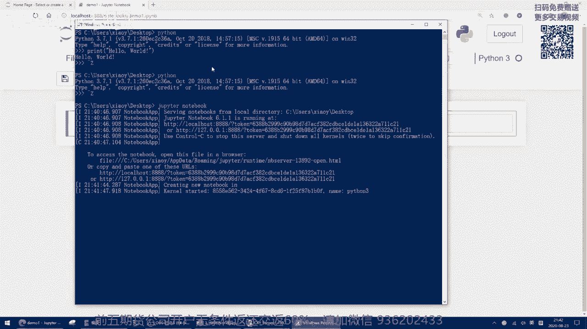

在新建的笔记本单元格中，输入同样的打印代码：

```python
print("Hello World!")
```

Jupyter Notebook提供了代码高亮功能，例如`print`会显示为绿色，字符串会显示为红色，这使得代码更易读。要运行这个单元格，可以点击工具栏上的“运行”按钮，或者同时按下`Shift`和`Enter`键。运行后，单元格下方会输出“Hello World!”。

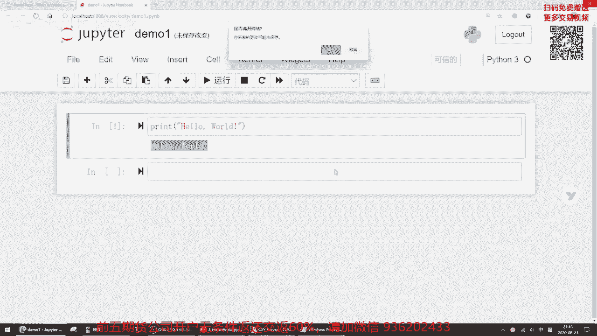

使用完毕后，可以关闭浏览器标签页。回到命令行窗口，同时按下`Ctrl`和`C`键来停止Jupyter Notebook服务器。

### 3. 运行Python脚本文件

第三种方式是将代码写入一个文件中，然后通过命令行批量执行该文件。这种方式适合编写和运行较长的程序。


首先，我们需要创建一个Python脚本文件。在桌面上新建一个文本文档，并将其重命名为`run.py`。**注意**：在重命名时，系统可能会提示“如果改变文件扩展名，可能会导致文件不可用”，点击“是”确认更改。如果你的系统默认不显示文件扩展名，需要先在文件夹的“查看”选项中勾选“文件扩展名”以显示`.py`后缀。

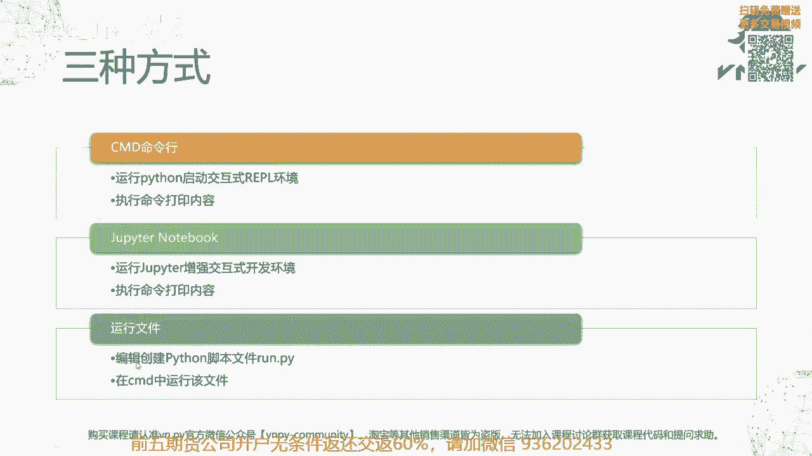


用文本编辑器（如记事本）打开`run.py`文件，输入我们的打印代码：

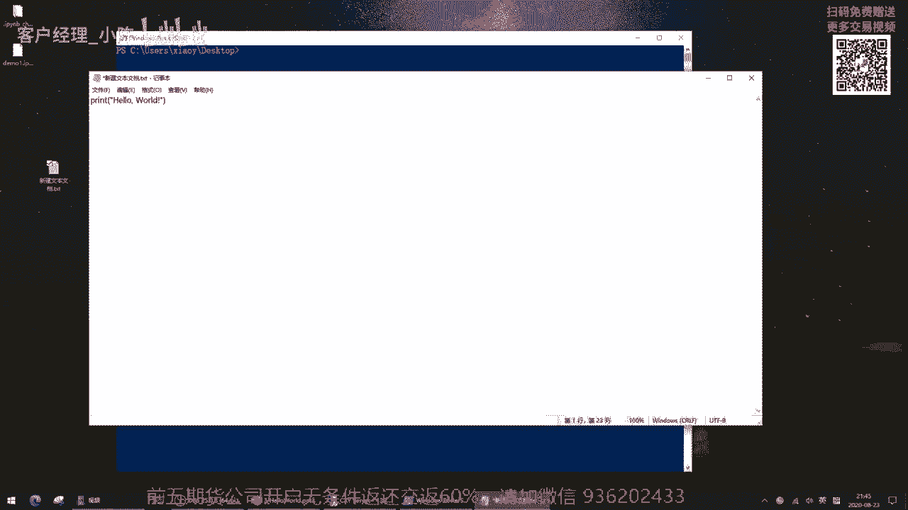

```python
print("Hello World!")
```

保存并关闭文件。

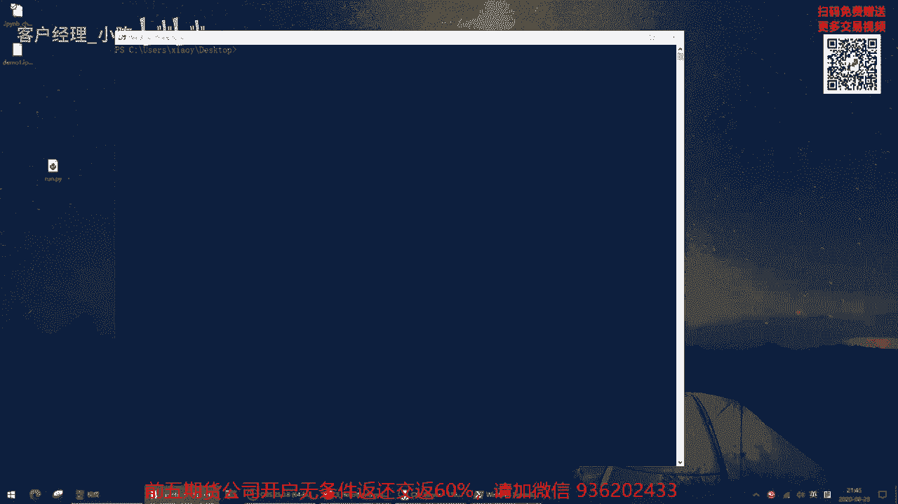

接下来，在命令行中（确保当前目录是`run.py`文件所在的目录，例如桌面），输入以下命令来运行这个脚本文件：

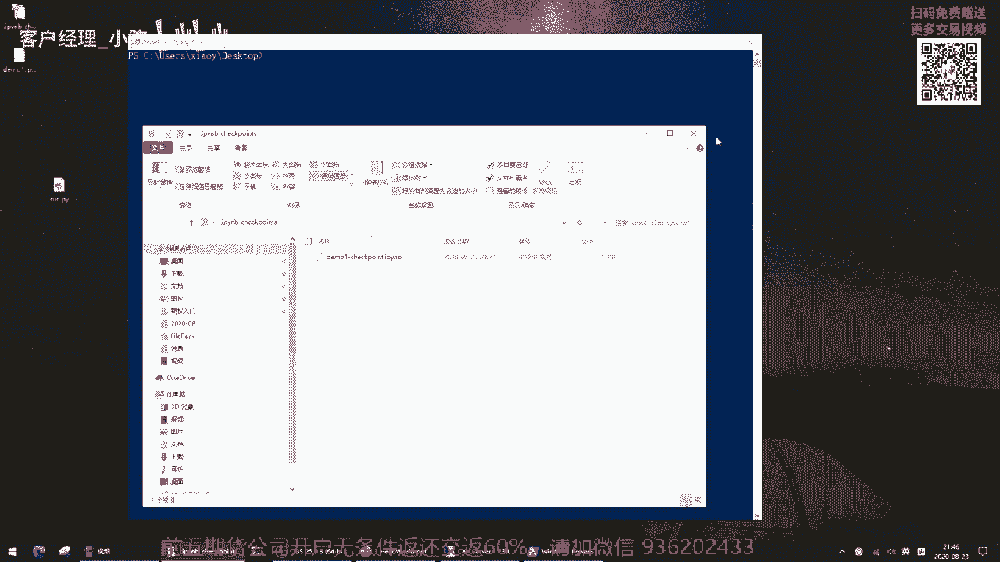

```bash
python run.py
```

执行后，命令行会输出“Hello World!”，然后程序结束。这种方式通过解释器一次性执行文件中的所有代码，是开发实际项目时最常用的方法。

---

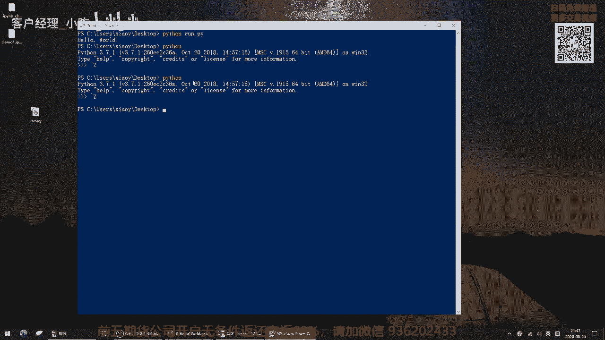

## 总结

本节课中，我们一起学习了运行Python程序的三种主要方式，并成功完成了“Hello World!”的输出。

*   **命令行交互式环境 (REPL)**：适合快速测试和验证单行代码。
*   **Jupyter Notebook**：提供了在浏览器中编写、运行和可视化代码的增强环境，适合数据分析和教学。
*   **运行脚本文件**：通过创建`.py`文件并批量执行，是开发正式项目时的标准做法。


掌握这三种方式，将为后续的Python学习和量化开发打下坚实的基础。