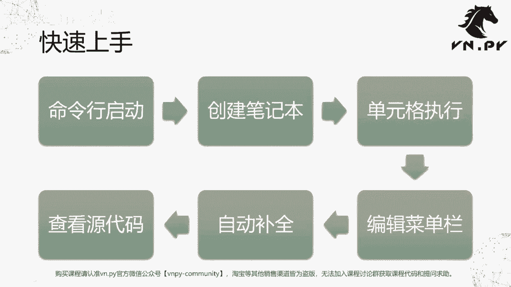
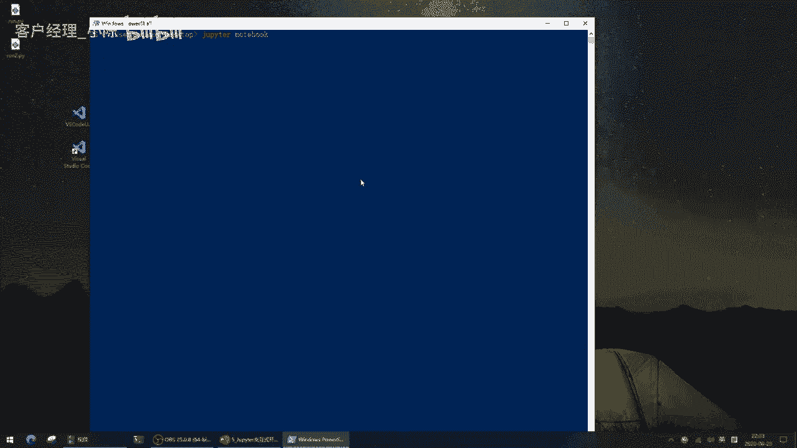
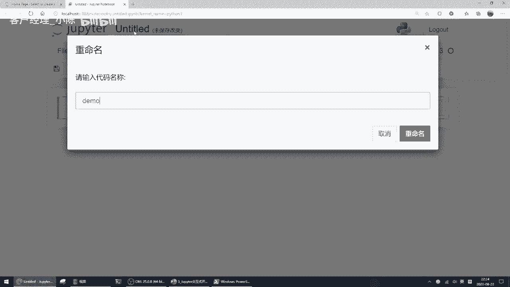
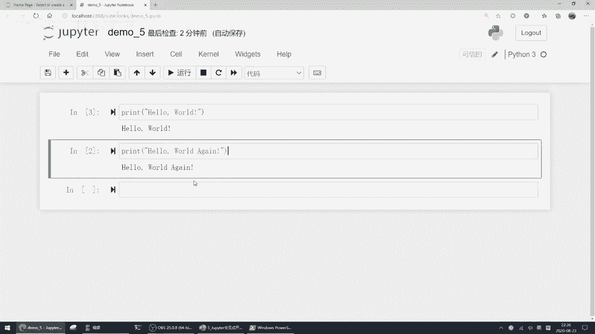
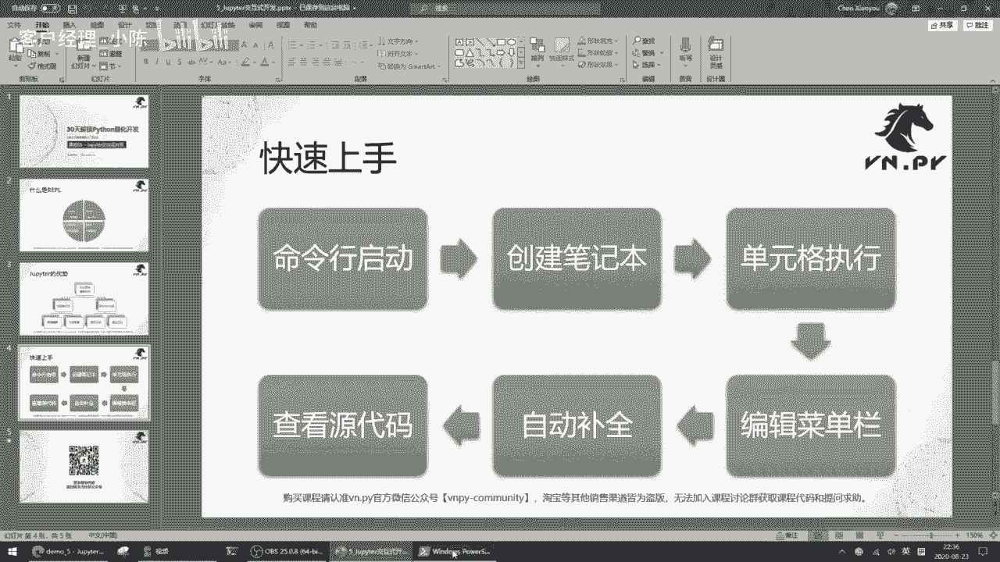

# VNPY30天解锁Python期货量化开发：课时05：Jupyter交互式开发入门 🚀

在本节课中，我们将学习Jupyter Notebook，一个强大的交互式开发环境。我们将了解它的核心概念、优势以及基本操作方法，帮助你快速上手，为后续的量化研究打下基础。

## 概述：什么是交互式开发？

在上一节课中，我们安装了VS Code代码编辑器。本节中，我们来看看Jupyter，一个用于交互式开发的环境。我们曾在“Hello World”课程中接触过Jupyter，当时提到了一个概念：**REPL**。

REPL代表一个四步循环：
1.  **R (Read)**：读取用户输入的命令或代码。
2.  **E (Eval)**：执行这行代码。
3.  **P (Print)**：打印执行结果。
4.  **L (Loop)**：循环回到第一步，等待新输入。

这个过程就像原生的Python解释器，输入一行代码，立即得到一个结果，然后可以继续输入下一行。这种模式被称为交互式开发环境。

它的好处在于可以方便地完成轻量级的研究任务，让你能够即时看到代码运行结果。

## Jupyter的核心优势

接下来，我们详细了解一下Jupyter对比原生Python命令行环境的优势。主要分为两大块：



### 1. 浏览器界面显示
Jupyter在浏览器中运行，界面友好。相较于命令行黑框，它提供了更好的配色和布局，支持快速编辑，并能方便地内嵌图表等可视化内容。



### 2. IPython内核
Jupyter内部运行的是**IPython内核**。它不仅记录每一步运行的Python代码，还提供了一些额外的“魔法方法”（magic methods），方便进行交互式研究。例如，可以轻松测量某段代码的运行时间，这是原生Python环境不具备的功能。




## 快速上手：六步掌握Jupyter

以下是快速上手Jupyter的六个步骤：
1.  命令行启动
2.  创建笔记本
3.  理解单元格
4.  执行代码
5.  使用菜单与快捷键编辑
6.  体验自动补全与查看文件

我们接下来就按这个步骤来操作一遍。

### 第一步：启动Jupyter Notebook

在桌面按住 `Shift` 键并右键，选择“在此处打开 PowerShell 窗口”。在打开的终端中输入以下命令并回车：

```bash
jupyter notebook
```

命令执行后，会自动在默认浏览器中打开Jupyter的主界面。



### 第二步：创建新笔记本



在浏览器打开的Jupyter主界面中，点击右上角的 `New` 按钮，然后选择 `Python 3`，即可创建一个新的笔记本。

创建后，可以点击顶部的“Untitled”字样，将其重命名为更有意义的名称，例如 `demo5`。

### 第三步：理解与使用单元格

Jupyter Notebook 的核心操作单元是**单元格**。代码在单元格中编写和执行。

例如，在第一个单元格中输入经典的 `print("Hello World")`，然后按 `Shift + Enter` 运行。

运行后，结果会直接显示在单元格下方，并且单元格左侧会出现一个序号 `[1]`。这个序号表示这是笔记本启动后执行的**第1个**代码单元。

在下方新建一个单元格，输入 `print("Hello World Again")` 并运行，其序号会变为 `[2]`。

单元格的执行顺序是灵活的。你可以再次点击第一个单元格并运行，它的序号会更新为 `[3]`，并且输出结果会刷新。这种设计让你可以方便地回溯和修改之前的代码，而不必担心执行顺序混乱。

### 第四步：编辑与菜单栏操作

Jupyter顶部的菜单栏提供了丰富的功能，如创建、打开、保存笔记本等，与常规桌面软件类似。

编辑单元格是常见操作。以下是几个关键操作：
*   **选择单元格**：单击单元格左侧区域（边框变蓝）表示选中该单元格进行整体操作。单击单元格内部（边框变绿）表示进入编辑模式，可以修改代码。
*   **剪切/复制/粘贴单元格**：选中单元格（蓝框状态），使用菜单栏的 `Edit` -> `Cut Cells` / `Copy Cells` / `Paste Cells` 选项，或使用快捷键（如 `X`, `C`, `V`）。
*   **删除单元格**：选中单元格（蓝框状态），按两次 `D` 键 (`DD`)。
*   **插入单元格**：选中单元格（蓝框状态），按 `A` 键在**上方**插入，按 `B` 键在**下方**插入。

此外，你可以将Jupyter当作高级计算器使用。例如，在一个单元格中直接输入 `1 + 2` 并运行，会立即得到结果 `3`。

一个单元格可以包含多行代码。但需要注意的是，如果没有使用 `print()` 函数，单元格默认只输出最后一行的结果。例如：
```python
pow(2, 10)  # 这一行的计算结果1024不会显示
print("Hello")
```
只会输出 `Hello`。如果想看到所有结果，需要显式打印：
```python
print(pow(2, 10))
print("Hello")
```
这样就会同时输出 `1024` 和 `Hello`。

### 第五步：数据可视化示例

Jupyter 能方便地嵌入图表。例如，我们可以绘制一个简单的图形：
1.  在一个新单元格中输入以下代码来导入绘图库并绘制一条直线：
    ```python
    import matplotlib.pyplot as plt
    plt.plot(range(10))
    plt.show()
    ```
2.  运行该单元格，图表将直接显示在浏览器中。

这使得数据分析和策略研究变得非常直观，整个研究过程（代码、结果、图表）都被完整地记录在笔记本文件中，便于日后回顾和分享。

### 第六步：实用技巧：保存、打开与智能提示

*   **保存与打开**：笔记本文件（后缀为 `.ipynb`）可以随时保存。关闭浏览器后，下次可以通过Jupyter主界面再次打开该文件，所有内容（包括代码和输出）都会保留。
*   **智能提示（自动补全）**：Jupyter 支持代码自动补全，能极大提升编码效率。例如，定义一个字符串变量 `a = "Hello World"`，然后在新单元格中输入 `a.`（注意有个点），接着按下键盘上的 `Tab` 键，就会弹出该字符串对象所有可用的方法列表。选择 `lower()` 方法，即可将字符串转为小写：`a.lower()`。

## 总结

本节课中，我们一起学习了Jupyter Notebook交互式开发环境。我们了解了REPL循环的概念，认识了Jupyter在浏览器界面和IPython内核方面的优势，并通过六个步骤实践了从启动、创建笔记本到执行代码、编辑单元格、绘制图表和使用智能提示的全过程。


无论是VS Code还是Jupyter，它们的功能都远比我们本节课介绍的更强大。在学习编程语言的过程中，掌握这些周边工具与学习语法同等重要，它们能帮助你更高效地编写、运行和调试代码。在后续的课程中，我们将在实践中深入掌握这些工具的更多细节。

OK，本节课的内容就到这里。更多精华内容，欢迎扫码关注我们的社区公众号。