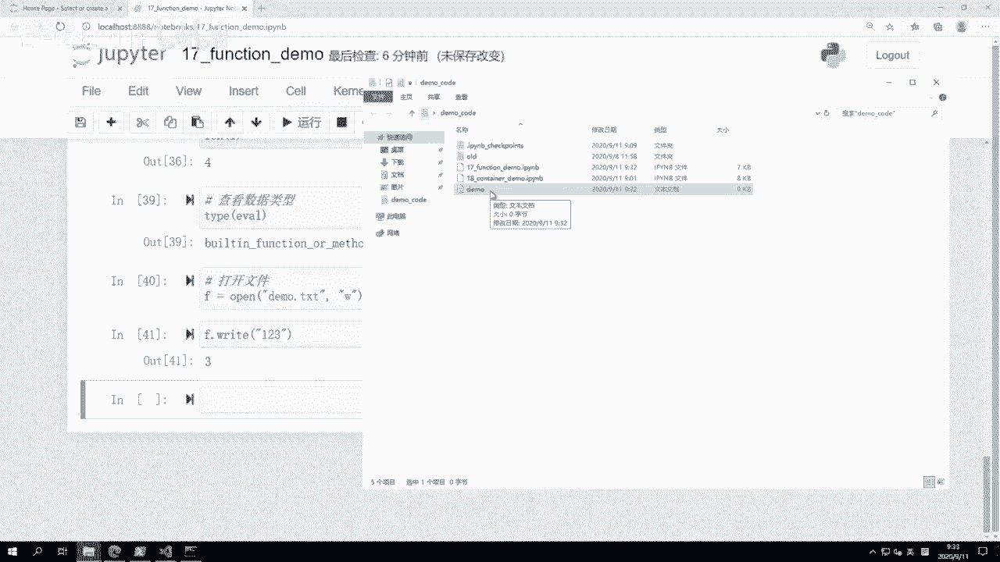
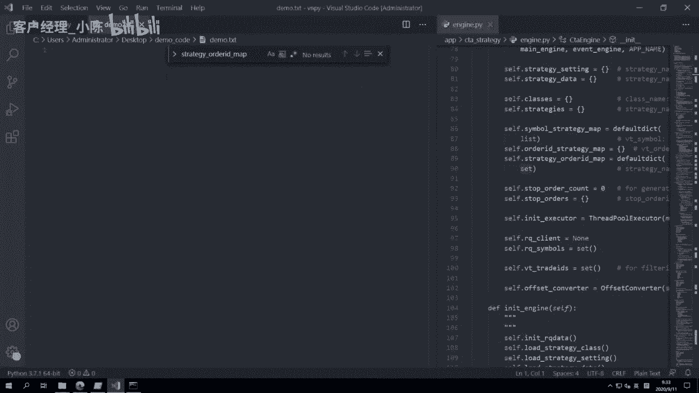
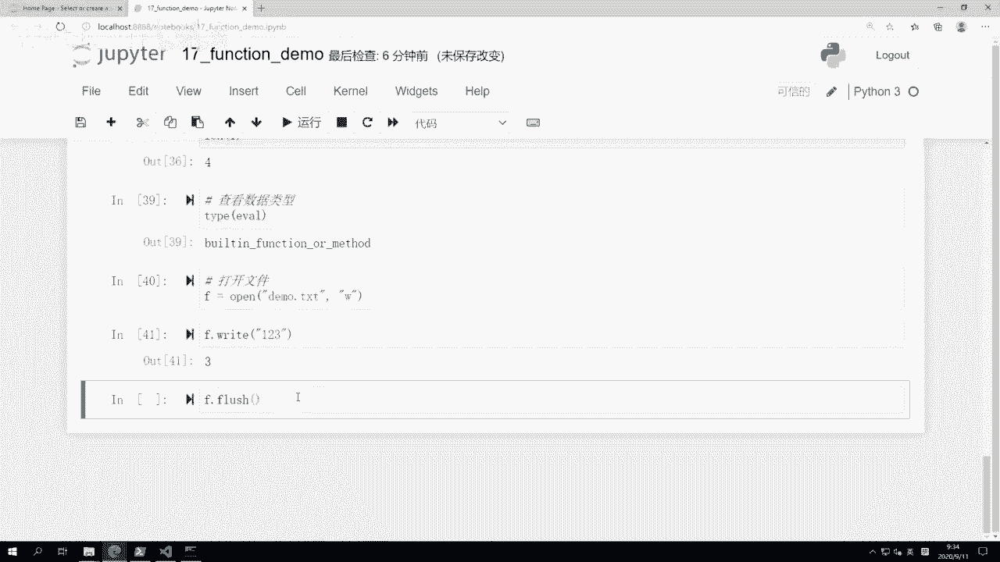
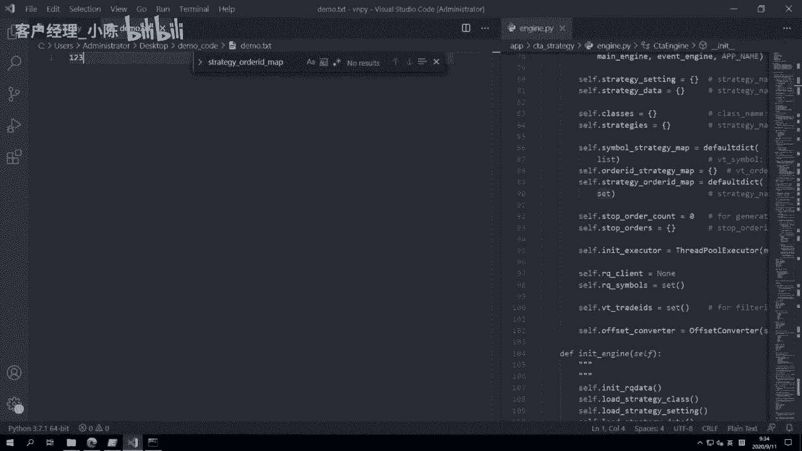
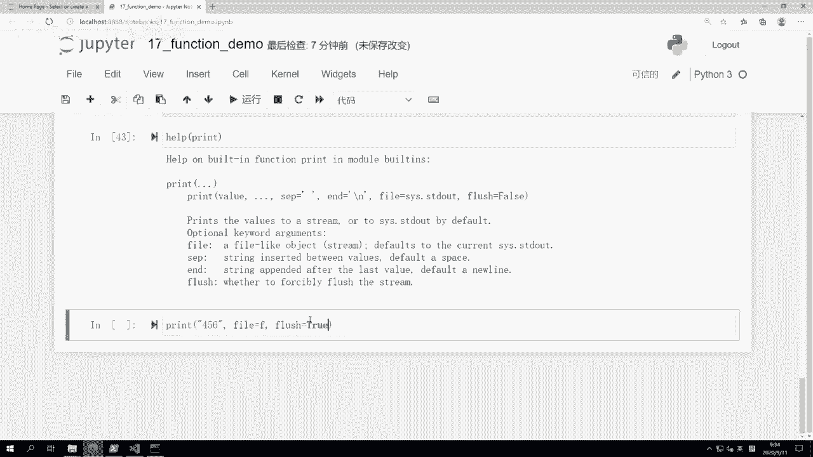
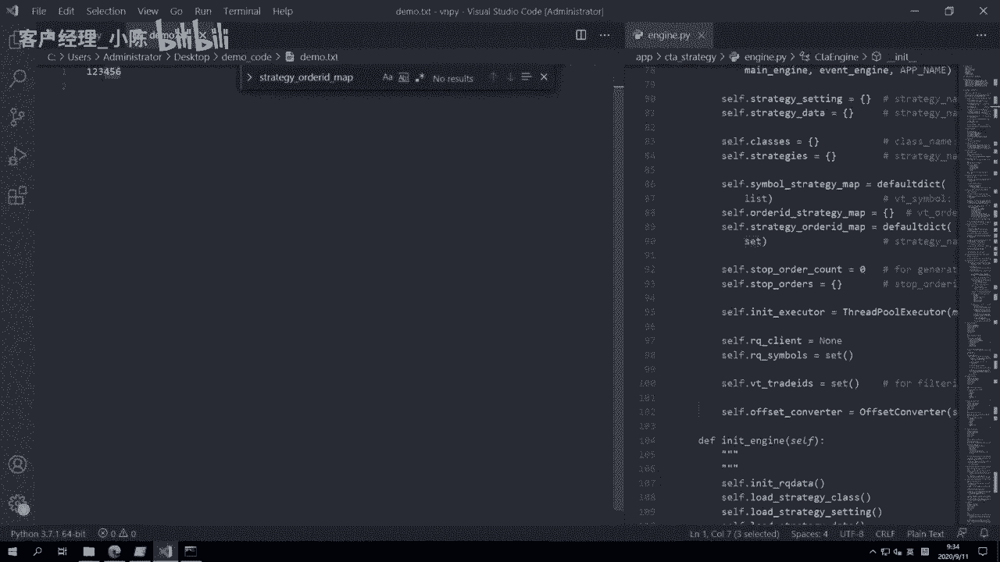
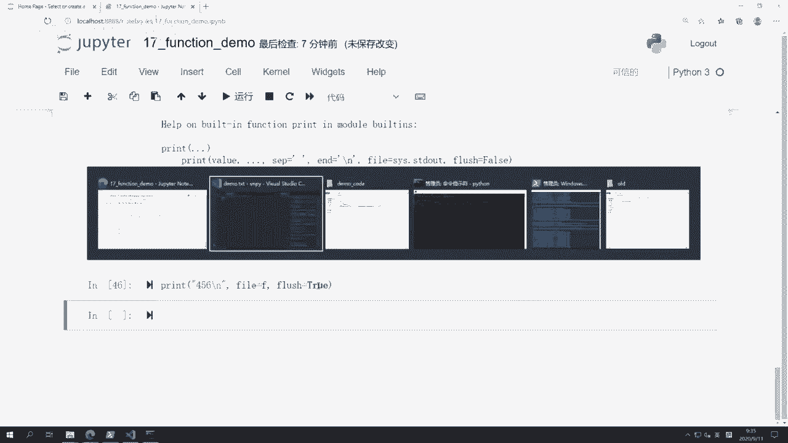
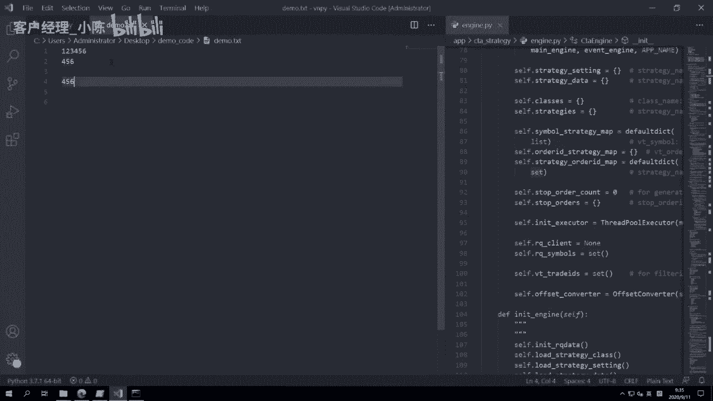
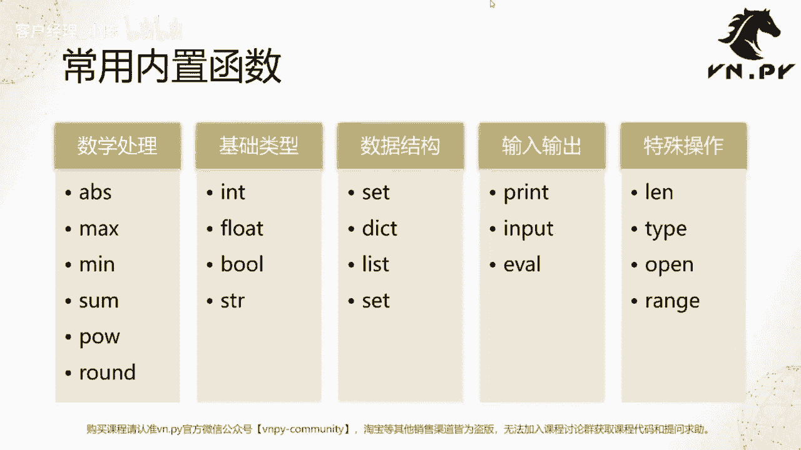

# VNPY30天解锁Python期货量化开发：课时17：什么是函数 - P1

在本节课中，我们将要学习Python编程中一个极其重要的概念——**函数**。我们将从函数的基本定义和作用开始，并通过大量实例来熟悉Python的内置函数，为后续编写自己的函数打下坚实基础。

上一节我们完成了对Python数据容器的阶段性讲解。本节中，我们来看看什么是函数。

在编程语言中，函数的核心作用是**抽象封装**。这主要带来两个好处：**代码复用**和**简化代码**。一段需要重复使用的计算逻辑，如果每次都完整重写，会导致代码量庞大、难以维护。通过函数将其封装，可以显著提升代码的可读性和可维护性，这在编写大型交易策略时尤为重要。

## 重新认识 `print` 函数

我们接触的第一个Python函数就是 `print`。它主要用于输出内容，功能比初识时更强大。

以下是 `print` 函数的一些核心用法：

*   **输出单个或多个值**：可以输出单个数据，也可以用逗号分隔输出多个数据。
    ```python
    print("Hello World")
    print(1, 2, 3)
    ```
*   **自定义分隔符**：通过 `sep` 参数可以改变多个输出值之间的分隔符，默认是空格。
    ```python
    print("今天", "上海", "天气", sep="&")  # 输出：今天&上海&天气
    ```
*   **自定义结束符**：通过 `end` 参数可以改变输出结束后的字符，默认是换行符 `\n`。
    ```python
    print(1, end="+")
    print(2, end="+")
    print(3)  # 输出：1+2+3
    ```
*   **输出到文件**：通过 `file` 参数可以将内容输出到文件对象，而不仅仅是屏幕。

当你不清楚一个函数有哪些参数时，可以使用Python内置的 `help()` 函数来查看其详细说明。

```python
help(print)
```

## Python常用内置函数一览

除了 `print`，Python还提供了许多内置函数来简化常见操作。我们可以将它们分为以下几类进行了解。

以下是常用的数学处理函数：

*   `abs(x)`：返回数字 `x` 的绝对值。
*   `max(iterable)` / `min(iterable)`：返回可迭代对象中的最大/最小值。
*   `sum(iterable)`：对可迭代对象中的所有元素求和。
*   `pow(x, y)`：返回 `x` 的 `y` 次幂，等同于 `x ** y`。
*   `round(number, ndigits)`：对浮点数 `number` 进行四舍五入，`ndigits` 指定保留的小数位数。

以下是用于基础数据类型转换的函数：

*   `str(object)`：将对象转换为字符串。
*   `int(object)`：将对象转换为整数。
*   `float(object)`：将对象转换为浮点数。
*   `bool(object)`：将对象转换为布尔值。





以下是用于输入输出的函数：







*   `print()`：输出内容，已详细介绍。
*   `input(prompt)`：显示提示信息 `prompt`，并等待用户输入，返回输入内容的字符串。
    ```python
    name = input("请输入你的名字：")
    ```
*   `eval(expression)`：执行一个字符串表达式，并返回结果。这是一个强大的动态执行功能。
    ```python
    result = eval("99 + 1")  # result 的值为 100
    ```







以下是用于数据结构和特殊操作的函数：

*   `len(s)`：返回对象（如列表、字符串）的长度或元素个数。
*   `type(object)`：返回对象的类型。
*   `open(file, mode)`：打开一个文件，并返回文件对象。常用模式 `‘r‘` 为读取，`‘w‘` 为写入。
    ```python
    # 写入文件
    f = open(‘demo.txt‘, ‘w‘)
    f.write(‘Hello‘)
    f.close()  # 操作完毕后务必关闭文件

    # 使用print写入文件
    with open(‘demo.txt‘, ‘w‘) as f:
        print(‘Hello‘, file=f)
    ```
*   `range(stop)` / `range(start, stop, step)`：生成一个不可变的数字序列，常用于循环。在Python 3中，它返回一个“range”迭代器对象，而非直接生成列表。如需列表，可用 `list()` 转换。
    ```python
    # 生成一个数字序列迭代器
    r = range(5)  # 代表 0, 1, 2, 3, 4
    # 转换为列表
    num_list = list(range(5))  # 结果为 [0, 1, 2, 3, 4]
    ```



本节课中我们一起学习了Python函数的基本概念及其核心价值——抽象与封装，并深入探索了 `print` 函数以及 `abs`、`max`、`input`、`len`、`open`、`range` 等常用内置函数的用法。理解并熟练运用这些内置工具，是编写简洁、高效代码的关键第一步。