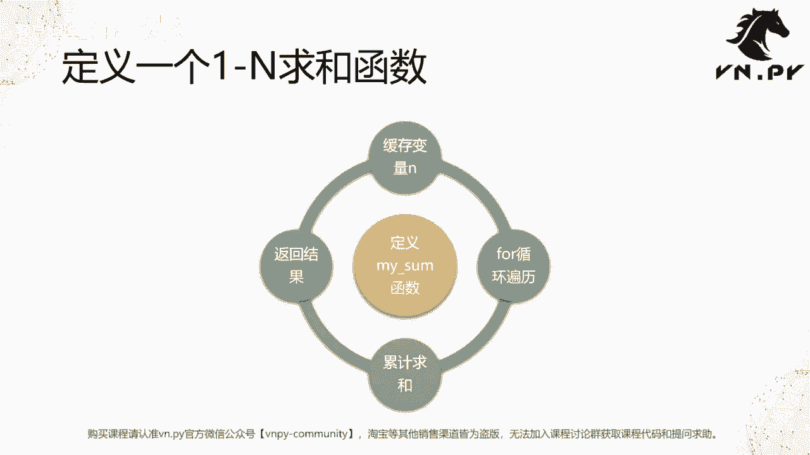
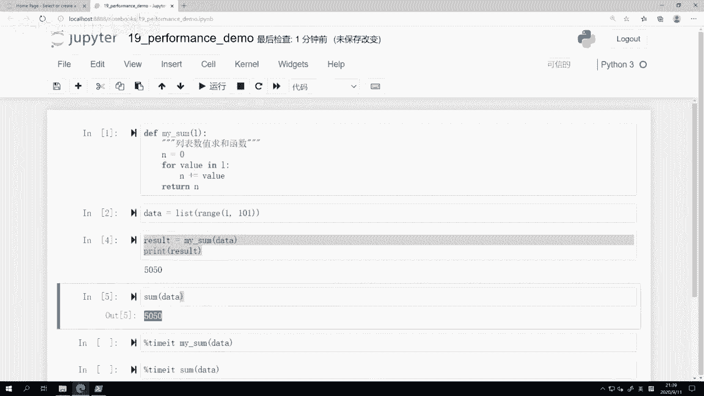
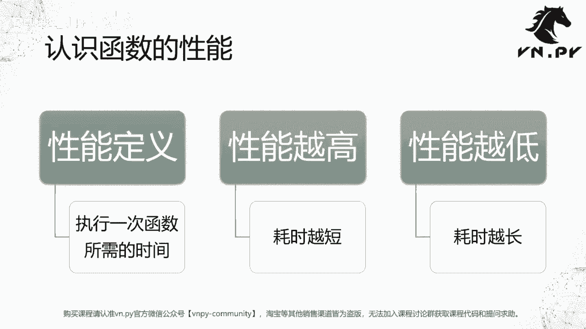
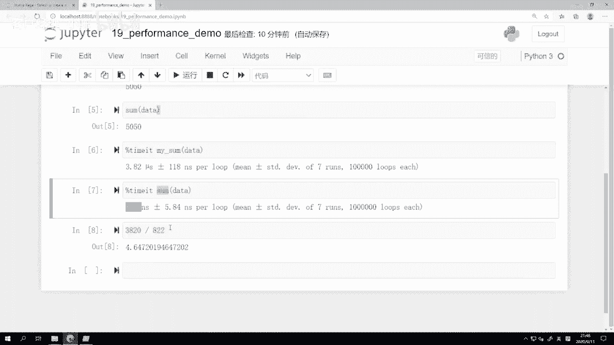
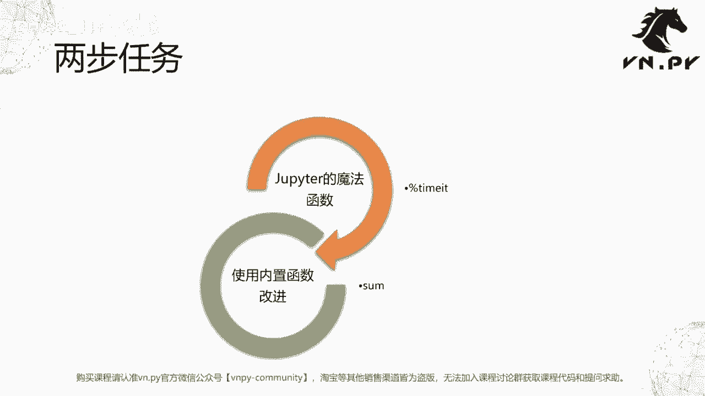

# VNPY30天解锁Python期货量化开发：课时19：函数性能测试

在本节课中，我们将学习如何测试函数的性能。理解性能对于编写高效的量化交易策略至关重要，它直接关系到策略回测和实盘运行的速度。

上一节我们介绍了如何定义函数、处理多参数和返回值。本节中，我们来看看如何评估一个函数的执行效率。



## 什么是函数性能

在编程中，函数的性能通常指执行该函数一次所需的时间。性能越高，耗时越短；性能越低，耗时越长。在量化交易中，高性能的代码能更快地完成计算和分析，节省宝贵的时间。

## 定义求和函数

首先，我们定义一个自定义的求和函数 `my_sum`，其功能与Python内置的 `sum()` 函数类似。

```python
def my_sum(l):
    """
    列表数值求和函数
    """
    n = 0  # 创建缓存变量
    for value in l:  # 遍历列表
        n += value   # 累加
    return n         # 返回结果
```

接下来，我们生成测试数据，一个包含1到100的整数列表。

```python
data = list(range(1, 101))
```



然后调用我们定义的函数和内置函数进行验证。

```python
result = my_sum(data)
print(result)  # 输出: 5050

result_builtin = sum(data)
print(result_builtin)  # 输出: 5050
```

两个函数都返回了正确的结果5050。



## 测量函数性能


为了比较性能，我们需要测量函数执行的时间。在Jupyter Notebook中，可以使用 `%timeit` 这个魔法命令。

以下是测量自定义函数 `my_sum` 性能的方法：

```
%timeit my_sum(data)
```

运行后，输出可能类似：`3.82 µs ± 118 ns per loop (mean ± std. dev. of 7 runs, 100,000 loops each)`。这表示函数平均执行时间约为3.82微秒。

接下来，我们测量Python内置 `sum` 函数的性能：

```
%timeit sum(data)
```

运行后，输出可能类似：`822 ns ± 5.84 ns per loop (mean ± std. dev. of 7 runs, 1,000,000 loops each)`。这表示函数平均执行时间约为822纳秒。

## 性能对比与分析

通过对比，我们发现内置 `sum` 函数的执行时间（约822纳秒）远低于我们自定义的 `my_sum` 函数（约3.82微秒）。计算性能提升倍数约为：

**性能提升倍数 ≈ 3.82 µs / 822 ns ≈ 4.65倍**

内置函数更快的主要原因在于，Python内置函数（如 `sum`）通常由更底层的C语言实现，而我们的自定义函数是由Python代码解释执行的。

这个对比告诉我们一个重要的编程原则：在实现功能时，应优先使用Python内置的函数或库，因为它们通常经过高度优化，性能更佳。

## 课后练习

为了巩固理解，建议你进行以下练习：
*   使用 `%timeit` 对比上节课自定义的 `my_abs` 函数与Python内置的 `abs` 函数的性能。
*   思考在量化策略开发中，哪些环节的性能优化最为关键。





本节课中我们一起学习了函数性能的概念、如何使用 `%timeit` 测量执行时间，并通过对比自定义函数与内置函数，理解了优先使用内置优化功能的重要性。性能测试是代码优化的第一步，能帮助我们找到需要改进的“热点”。