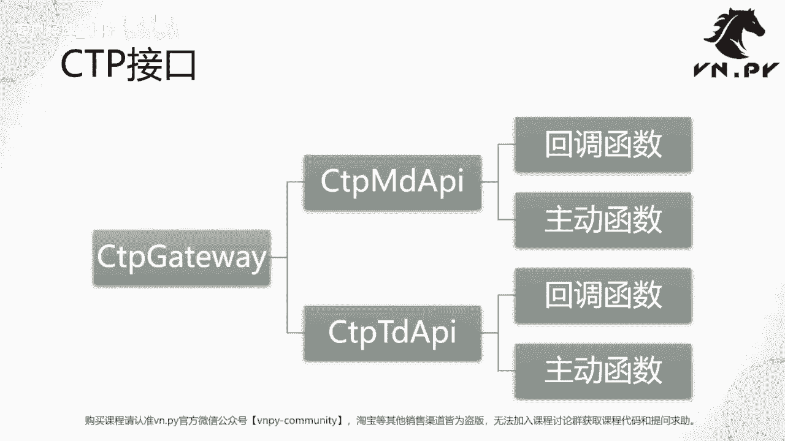
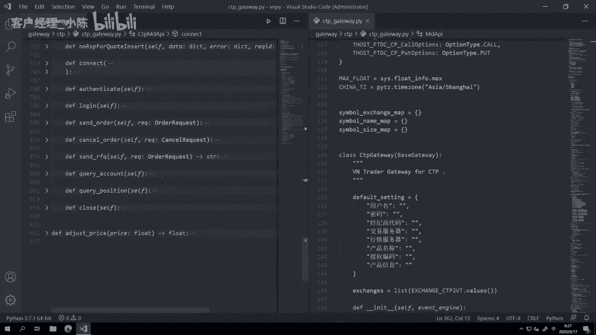
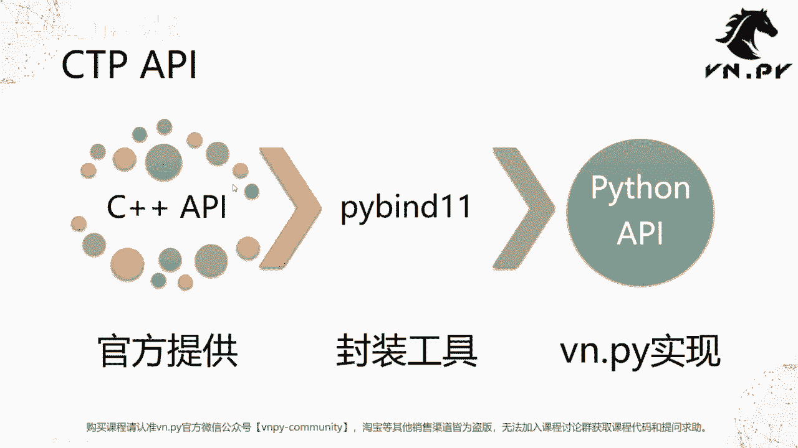
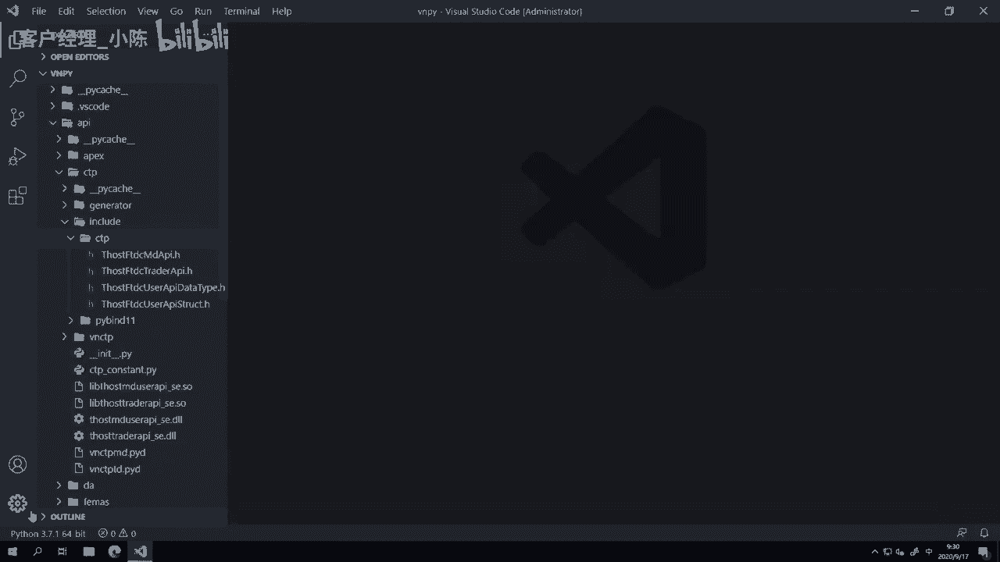
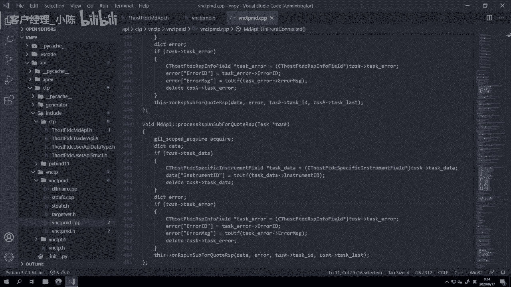

# VNPY30天解锁Python期货量化开发：课时25：初探交易接口 🚀

## 概述
在本节课中，我们将初步探索VNPY框架中的交易接口，特别是国内期货市场最常用的CTP接口。我们将结合之前学习的面向对象编程知识，理解交易接口中主动函数与回调函数的设计原理，并浏览核心代码结构，为后续深入学习打下基础。

---

## 回顾与过渡
上一节我们学习了如何在子类中重载父类的方法以实现自定义逻辑。至此，开发交易接口所需的主要Python概念已基本掌握。本节中，我们将把这些概念应用到实践中，首次近距离观察一个真实的交易接口——`CTP Gateway`。



## CTP接口简介
在VNPY中，CTP接口对应的类名为 `Ctpgateway`。其内部包含两个核心对象：
*   **`CtpMdApi`**：行情接口（`Md` 是 Market Data 的缩写）。
*   **`CtpTdApi`**：交易接口（`Td` 是 Trade 的缩写）。

这两个API类都遵循相同的设计模式：**同时包含主动函数与回调函数**。

### 核心概念：主动函数 vs. 回调函数
*   **主动函数**：由程序员在代码中主动调用，以执行特定操作。例如：登录、订阅行情、下单、撤单、查询合约。调用时机完全由程序逻辑控制。
    ```python
    # 示例：主动调用连接函数
    gateway.connect()
    ```
*   **回调函数**：当外部事件（如收到行情、订单状态变化）发生时，由系统自动调用的函数。程序员无法控制其调用时机，但可以定义被调用时的处理逻辑。在VNPY中，回调函数通常以 `on` 开头。
    ```python
    # 示例：当行情数据到达时，此回调函数被自动调用
    def onRtnDepthMarketData(self, data):
        # 在此处处理行情数据
        pass
    ```

这种设计实现了 **事件驱动编程**。程序无需轮询等待，而是在事件（如行情推送）发生时立即响应并处理，这对于要求高实时性的量化交易系统至关重要。

---

## 代码结构解析
接下来，我们打开VNPY项目，查看 `Ctpgateway` 的具体实现。

### 文件概览
文件位于 `vnpy/gateway/ctp/ctp_gateway.py`。该文件代码量较大（近千行），我们首先折叠代码，观察整体结构。

主要包含三个类：
1.  `CtpGateway`：提供给VNPY主引擎的标准接口类。
2.  `CtpMdApi`：行情API类。
3.  `CtpTdApi`：交易API类。

`CtpGateway` 类实现了连接、订阅、下单等标准化接口方法。我们重点分析 `CtpMdApi` 和 `CtpTdApi`。

### 深入 `CtpMdApi` 类
`CtpMdApi` 类继承自一个特殊的父类 `MdApi`。这个父类是由C++封装的Python类，它提供了CTP官方API的Python绑定。

以下是该类的主要组成部分：

#### 1. 回调函数（以 `on` 开头）
这些函数在父类 `MdApi` 中已有定义（通常为空实现）。我们在子类 `CtpMdApi` 中重载它们，以添加具体的业务逻辑。例如：
*   `onFrontConnected`：当前置机连接成功时触发。
*   `onFrontDisconnected`：当前置机连接断开时触发。
*   `onRspUserLogin`：用户登录响应到达时触发。
*   `onRtnDepthMarketData`：**最重要的回调之一**。订阅行情后，每当交易所推送新的行情切片（tick）数据时，此函数被调用。

我们查看 `onRtnDepthMarketData` 的部分实现逻辑：
1.  **数据过滤**：检查数据是否有效（如是否包含时间戳）。
2.  **信息校验**：检查合约代码是否存在于本地缓存中。
3.  **数据转换**：将CTP格式的数据结构转换为VNPY内部定义的 `TickData` 对象。这包括时间戳处理、时区转换等。
4.  **数据推送**：调用 `gateway.on_tick` 方法，将处理好的 `TickData` 对象推送至VNPY引擎，后续处理由引擎负责。

#### 2. 主动函数
这些函数是我们在 `CtpMdApi` 类中自行定义的，供上层调用。例如：
*   `connect`：连接服务器。
*   `login`：用户登录。
*   `subscribe`：订阅行情。
*   `close`：关闭连接。

这些函数的调用时机由VNPY图形界面或主程序控制。例如，用户在图形界面点击“连接”按钮，最终会触发 `connect()` 函数的执行。

**`CtpTdApi` 类的结构与 `CtpMdApi` 类似**，只是回调函数和主动函数更多，涉及登录、下单、查询资金持仓等交易相关功能。



---

## 接口封装原理
你可能会问：父类 `MdApi` 和 `TdApi` 从何而来？这涉及到底层封装。

### 封装流程
1.  **官方API**：上海期货交易所下属的上期技术提供了C++语言版本的CTP API。
2.  **语言封装**：为了在Python中使用，我们需要将其封装成Python可调用的接口。VNPY使用 `pybind11` 工具库完成此项工作。
3.  **生成Python API**：封装后，产生 `MdApi` 和 `TdApi` 这两个Python类。它们直接映射了C++ API的功能。
4.  **业务逻辑封装**：`CtpMdApi` 和 `CtpTdApi` 在生成的Python API基础上，进一步添加了数据转换、错误处理、与VNPY引擎对接等业务逻辑，形成了最终易用的 `Ctpgateway`。

简而言之：**C++ API -> (pybind11封装) -> Python API -> (业务逻辑封装) -> VNPY Gateway**。





所有其他交易接口（如数字货币REST API）也遵循类似的封装路径，最终在VNPY内部形成统一、标准化的多态接口。

---

## 总结
本节课我们一起初步探索了VNPY中的CTP交易接口。我们学习了：

1.  **接口构成**：`Ctpgateway` 包含行情(`CtpMdApi`)和交易(`CtpTdApi`)两部分。
2.  **核心设计模式**：区分了**主动函数**（由程序控制）和**回调函数**（由事件触发），这是事件驱动编程的基础。
3.  **代码实践**：查看了 `CtpMdApi` 中关键回调函数 `onRtnDepthMarketData` 的实现，了解了数据从接收到转换、推送的流程。
4.  **封装理念**：理解了VNPY如何将官方的C++ API通过多层封装，转化为Python中方便使用的标准化接口。

虽然初次接触实际项目代码可能感到复杂，但请记住，所有复杂的系统都是由我们已学的变量、函数、类、继承等基础概念构建而成。编程是一项可以通过持续学习和练习掌握的技能。随着课程的深入，再回看本节课，你会有更深刻的理解。



---

**更多精华内容，请扫码关注我们的社区公众号。**