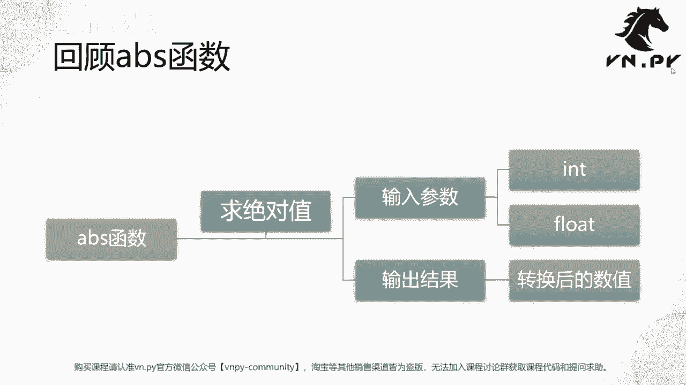
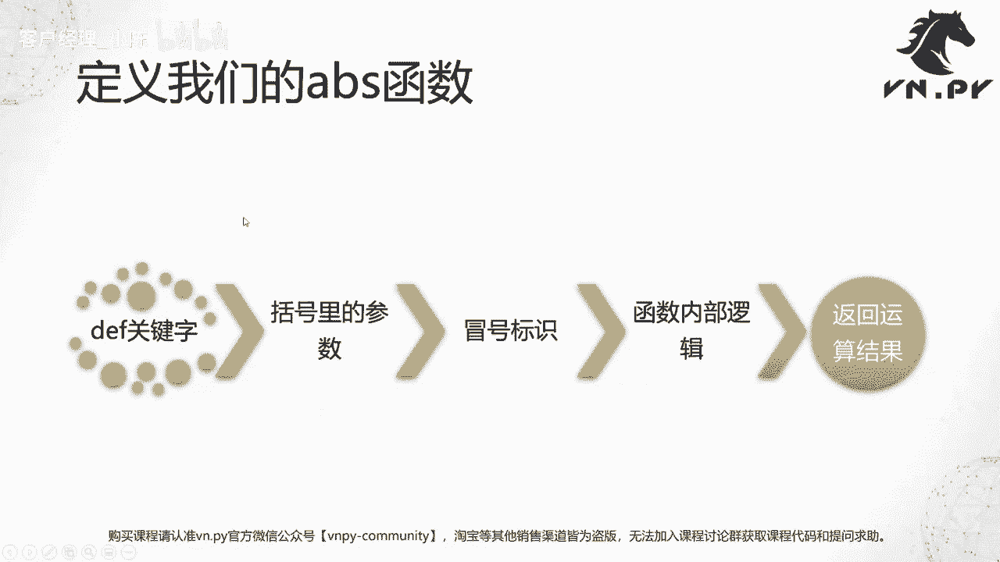
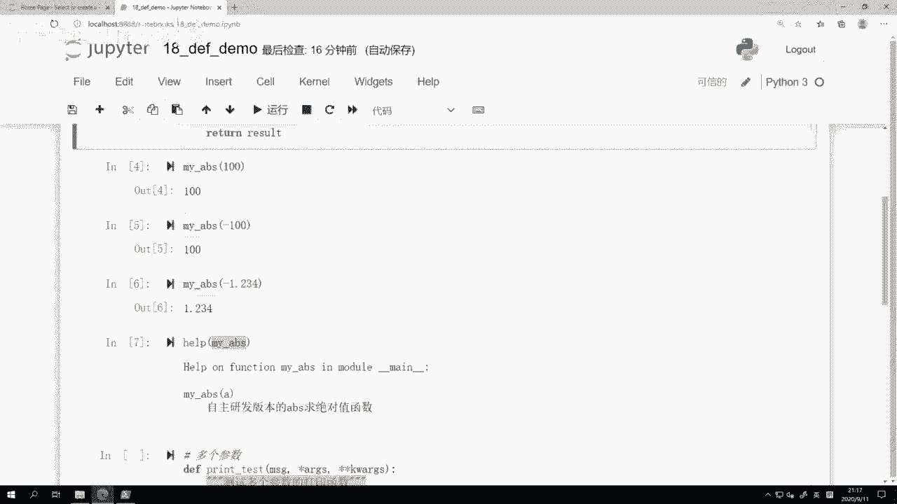
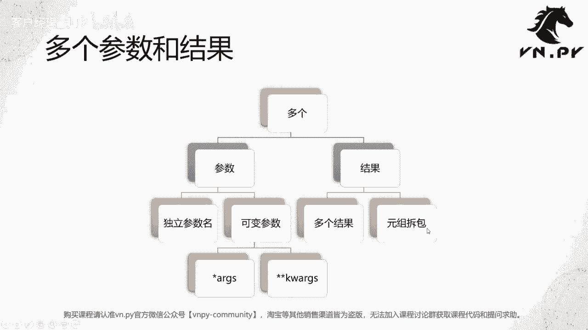
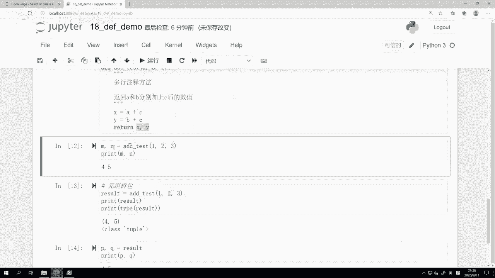
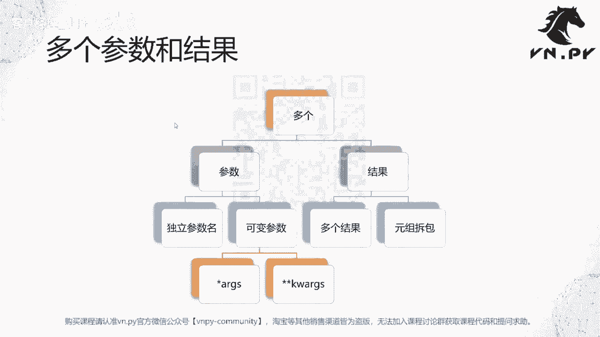

# VNPY30天解锁Python期货量化开发：课时18：参数和返回值

在本节课中，我们将学习如何定义自己的函数，并深入理解函数的核心概念：参数与返回值。我们将从回顾内置函数开始，逐步学习如何创建自定义函数，并探讨如何处理多个参数和多个返回值。

## 概述

在上一节课中，我们初步接触了函数的概念，并了解了Python内置函数的用法。本节中，我们将亲手开发自己的函数，重点学习如何定义函数的参数以及如何让函数返回计算结果。



## 回顾内置函数：`abs`

我们接触的第一个数学运算类函数是 `abs` 函数，它的功能是求一个数字的绝对值。



*   **参数**：一个数字（可以是整数或浮点数）。
*   **返回值**：该数字的绝对值。

Python作为动态语言，其函数使用非常方便，对整数和浮点数的处理逻辑高度一致。

## 定义自己的函数：`my_abs`

现在，我们将自己动手实现一个求绝对值的函数，命名为 `my_abs`。

在Python中，使用 `def` 关键字来定义函数。`def` 是英文 `define` 的缩写。定义一个函数通常遵循以下五步流程：
1.  使用 `def` 关键字。
2.  为函数命名。
3.  在括号内定义参数。
4.  在函数名后加上冒号 `:`。
5.  在缩进的代码块中编写函数内部逻辑，并使用 `return` 返回结果。

以下是 `my_abs` 函数的实现代码：

```python
def my_abs(a):
    """
    自主开发版本的abs求绝对值函数
    """
    # 判断输入的数字
    if a > 0:
        result = a
    else:
        result = -a
    # 返回计算结果
    return result
```

**代码说明**：
*   `def my_abs(a):` 定义了名为 `my_abs` 的函数，它接受一个参数 `a`。
*   三引号 `"""..."""` 内的字符串是函数的文档字符串，可以通过 `help(my_abs)` 查看。
*   函数内部使用 `if-else` 判断逻辑：如果 `a` 大于0，结果就是 `a` 本身；否则，结果就是 `-a`（对负数取反，对零取反仍为零）。
*   `return result` 语句将计算结果返回。

在Jupyter或VS Code中编写时，输入冒号 `:` 并回车后，编辑器会自动缩进4个空格，这是Python语法要求。运行上述单元格后，`my_abs` 函数就被成功定义了。

我们可以测试一下它的功能：

```python
print(my_abs(100))    # 输出: 100
print(my_abs(-100))   # 输出: 100
print(my_abs(-1.234)) # 输出: 1.234
```

使用 `help` 函数可以查看我们为函数编写的文档：

```python
help(my_abs)
```
输出会显示函数签名和我们在三引号中写的说明文字。这与用 `#` 开头的单行注释不同，文档字符串是函数的一部分，专为生成文档而设计。



## 进阶：多个参数与多个返回值

上一节我们实现了一个非常简单的函数：一个参数输入，一个结果输出。但在实际开发中，函数往往更复杂。本节中我们来看看如何处理多个参数和多个返回值。

### 多个参数：位置参数与关键字参数

Python函数支持接收任意数量的参数。我们可以为参数指定独立的名称，也可以使用可变参数来接收不确定数量的输入。



可变参数主要有两种形式：
*   `*args`: 接收任意数量的位置参数，在函数内部作为一个**元组**处理。
*   `**kwargs`: 接收任意数量的关键字参数（即 `参数名=值` 的形式），在函数内部作为一个**字典**处理。

下面是一个示例函数 `print_test`，它演示了如何使用这些参数：

```python
def print_test(message, *args, **kwargs):
    """
    演示多个参数接收的函数
    """
    print(message)
    print("args的类型是:", type(args))
    for arg in args:
        print("位置参数:", arg)

    print("kwargs的类型是:", type(kwargs))
    for key, value in kwargs.items():
        print(f"关键字参数 {key}: {value}")
```

定义好函数后，我们可以用多种方式调用它：

```python
# 1. 只传递必需参数
print_test("Hello World")
# 输出: Hello World
#       args的类型是: <class 'tuple'> (元组为空)
#       kwargs的类型是: <class 'dict'> (字典为空)

# 2. 传递多个位置参数和关键字参数
print_test("测试打印函数", 1, 2, 3, 4, 5, ma=30, rsi=20, cci=50)
# 输出:
# 测试打印函数
# args的类型是: <class 'tuple'>
# 位置参数: 1
# 位置参数: 2
# ...
# kwargs的类型是: <class 'dict'>
# 关键字参数 ma: 30
# 关键字参数 rsi: 20
# 关键字参数 cci: 50
```

**关键点**：`*` 和 `**` 仅在函数定义时用于声明可变参数。在函数内部使用 `args` 和 `kwargs` 时，不需要再加星号。

### 多个返回值：利用元组拆包

Python函数可以“返回”多个值，这背后其实是利用了**元组拆包**的特性。

我们定义一个简单的函数 `add_test`，它接受三个数字，返回前两个数字分别与第三个数字相加的结果：

```python
def add_test(a, b, c):
    x = a + c
    y = b + c
    return x, y  # 实际上返回的是一个元组 (x, y)
```

调用这个函数时，可以用多个变量直接接收结果：

```python
m, n = add_test(1, 2, 3)
print(m, n)  # 输出: 4 5
# 解释: m = 1 + 3 = 4, n = 2 + 3 = 5
```

为什么可以这样操作？让我们分解一下步骤：

```python
# 第一步：函数返回一个元组
result = add_test(1, 2, 3)
print(result)        # 输出: (4, 5)
print(type(result))  # 输出: <class 'tuple'>

# 第二步：对元组进行拆包
p, q = result
print(p, q)          # 输出: 4 5
```

函数 `return x, y` 语句实际上返回的是一个元组 `(x, y)`。当我们写 `m, n = add_test(...)` 时，Python自动帮我们完成了“调用函数获取元组”和“将元组拆包赋值给变量”这两个步骤。这使得在Python中处理多个返回值变得非常优雅和直观。而在C/C++等语言中，通常需要通过指针或引用等更复杂的方式来实现类似功能。

## 总结



本节课我们一起学习了Python函数的核心组成部分：参数与返回值。

1.  **定义函数**：我们使用 `def` 关键字定义函数，包括命名、定义参数、编写逻辑和返回结果。
2.  **参数传递**：我们学习了如何定义接收单个、多个乃至不定数量参数的函数，特别是使用 `*args` 接收可变位置参数，使用 `**kwargs` 接收可变关键字参数。
3.  **返回值**：我们明白了函数使用 `return` 语句返回结果。Python通过返回元组并支持元组拆包，巧妙地实现了“多个返回值”的效果。



这些是关于函数的基础知识。和之前学习的条件判断、循环、数据类型一样，理解这些概念是进行更复杂编程实践的基石。在后续课程中，我们将看到如何将这些知识应用到量化交易的实际案例中。