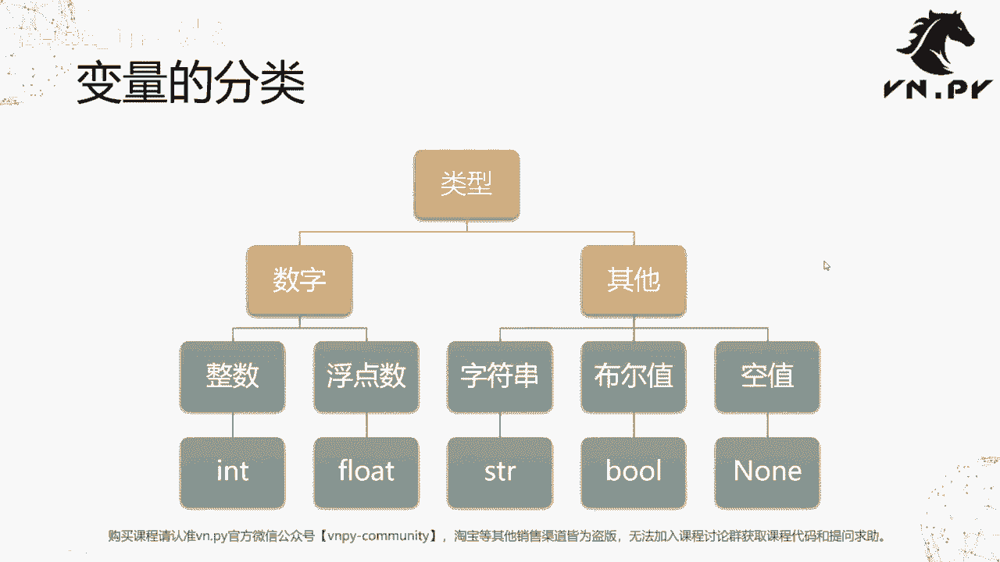
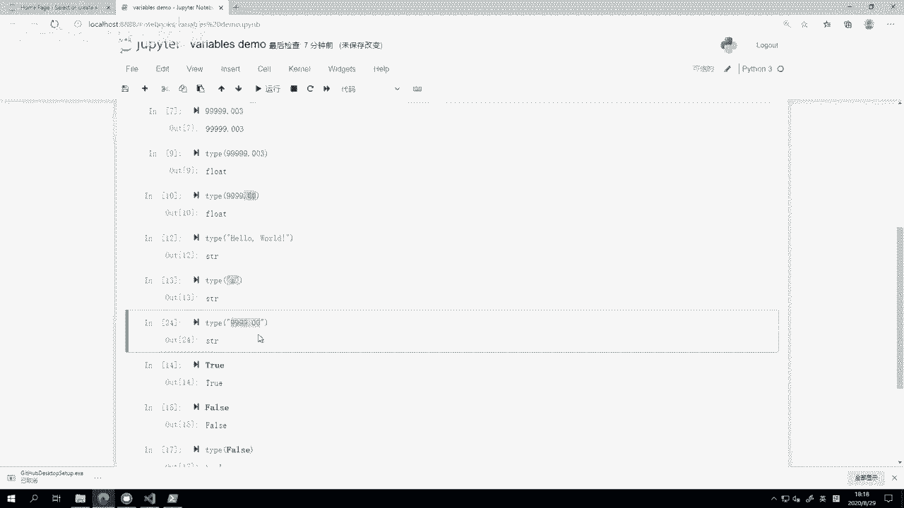
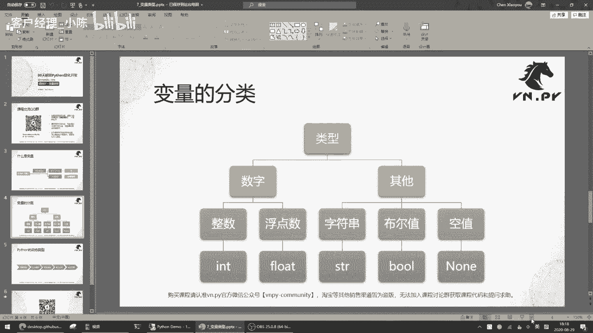
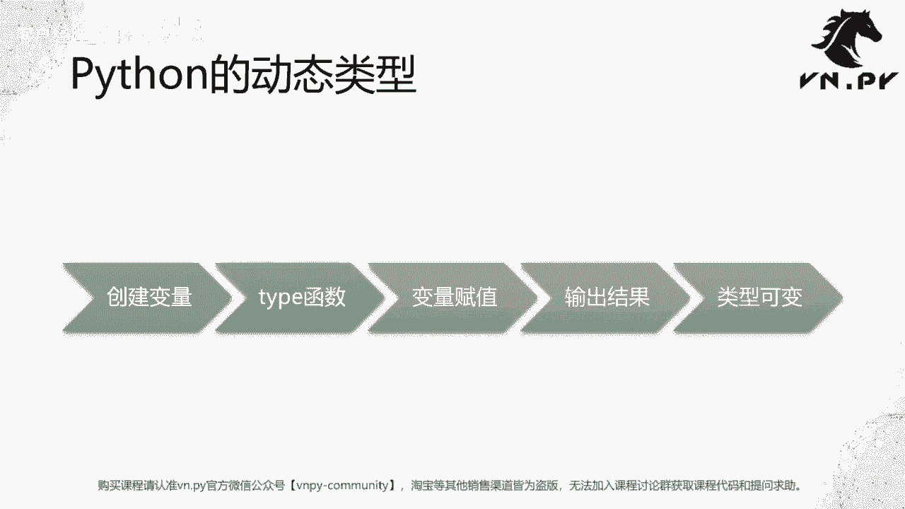

# VNPY30天解锁Python期货量化开发：课时07：变量类型 🧮

## 概述
在本节课中，我们将要学习Python编程中的核心基础概念之一：变量类型。我们将了解什么是变量，并详细探讨Python中五种主要的数据类型，包括数字（整数、浮点数）和非数字（字符串、布尔值、空值）类型。理解这些类型是编写任何Python程序，包括量化交易策略的基础。

## 什么是变量？
在上一节我们学会了使用GitHub管理代码历史，本节中我们来看看编程的基础构件——变量。

变量（Variable）在编程中，是一个用于存储数据的“名字”或“标签”。你可以把它想象成数学方程中的未知数（如 `x`），它代表背后实际的数据。这个数据可以是数字、文字或某种状态。

例如：
*   在公式 **`y = x + 3`** 中，`x` 和 `y` 都是变量。当 `x` 变化时，`y` 也随之变化。
*   在问候语 **`“xx，您好”`** 中，`xx` 也是一个变量，它可以被替换为具体的名字，如“小明”。

简而言之，变量是一个用来指代具体数据的符号。

## Python中的变量类型
Python中的变量主要分为两大类：数字类型和非数字类型。以下是具体的五种基础类型：

### 1. 数字类型
数字类型用于存储数值，主要分为两种。




#### 整数 (int)
整数是不带小数点的数字，可以是正数或负数。在Python中，整数类型被称为 `int`（取自英文integer）。


**代码示例：**
```python
type(1)        # 输出：<class 'int'>
type(-100)     # 输出：<class 'int'>
int()          # 创建一个空整数，结果为 0
```


#### 浮点数 (float)
浮点数是带有小数点的数字，同样可以是正数或负数。在Python中，浮点数类型被称为 `float`。

**核心概念：** 在编程中，判断一个数字是整数还是浮点数，**只看它是否包含小数点**，而不看小数点后的值是否为零。

**代码示例：**
```python
type(1.123)       # 输出：<class 'float'>
type(99999.00)    # 输出：<class 'float'>，即使小数点后是0，它依然是float类型
```

### 2. 非数字类型
非数字类型用于存储文本、逻辑值或空值。

#### 字符串 (string)
字符串是由文字（包括字母、数字、汉字等）组成的序列。在Python中，字符串类型被称为 `str`。字符串必须用单引号(`‘`)或双引号(`“`)括起来。

**代码示例：**
```python
type(“Hello World”)  # 输出：<class ‘str’>
type(‘a’)            # 输出：<class ‘str’>，单个字符也是字符串
type(“999.00”)       # 输出：<class ‘str’>，引号内的数字会被视为字符串
```

#### 布尔值 (bool)
布尔值是一种逻辑类型，只有两个值：**`True`**（真）和 **`False`**（假）。它代表了条件的成立与否，是计算机二进制运算（0和1）的基础体现。在Python中，布尔值类型被称为 `bool`。

**重要提示：** `True` 和 `False` 的首字母必须大写，且不加引号。

**代码示例：**
```python
type(True)   # 输出：<class ‘bool’>
type(False)  # 输出：<class ‘bool’>
```

#### 空值 (NoneType)
空值表示“什么都没有”，它是一个独立的数据类型，只有一个值：**`None`**。在Python中，空值类型被称为 `NoneType`。

**重要提示：** `None` 的首字母必须大写，且不加引号。





**代码示例：**
```python
type(None)  # 输出：<class ‘NoneType’>
# None 本身没有输出
```

## Python的动态类型特性
了解了基本类型后，我们来看看Python作为“动态语言”的一个关键特性：动态类型。

在Python中，变量的类型不是固定不变的。你可以将一个变量先绑定为一个整数，随后再重新绑定为一个字符串或其他任何类型。这种通过等号(`=`)为变量赋予新值的过程，称为“赋值”。

**代码示例：**
```python
a = 1          # 此时变量a是整数类型 (int)
print(type(a)) # 输出：<class ‘int’>

a = “哈哈”     # 将变量a重新赋值为一个字符串
print(type(a)) # 输出：<class ‘str’>，a的类型已变为字符串
```

这种动态类型的特性使得Python编程非常灵活和高效。你无需在定义变量时声明其类型，也可以根据需要在程序运行中随时改变它，这为快速开发和策略迭代带来了便利。



## 总结
本节课中我们一起学习了Python变量的核心概念。我们首先了解了变量是数据的指代符号。然后，我们详细探讨了五种基础变量类型：用于存储数字的**整数(int)**和**浮点数(float)**，以及用于存储其他信息的**字符串(str)**、**布尔值(bool)**和**空值(None)**。最后，我们认识了Python的**动态类型**特性，即变量的类型可以在程序运行中通过赋值来改变。掌握这些基础知识，是后续进行更复杂数据处理和量化策略编写的坚实第一步。